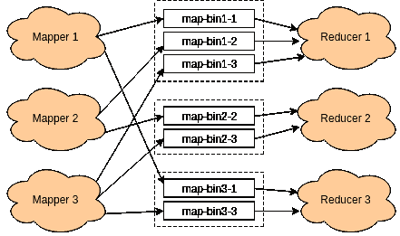
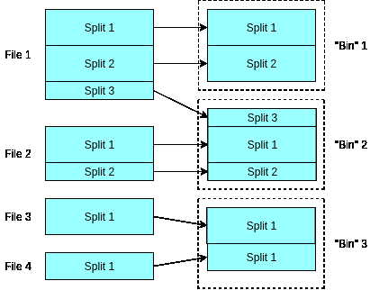
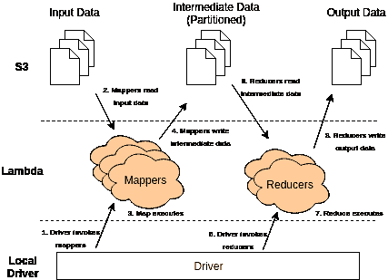
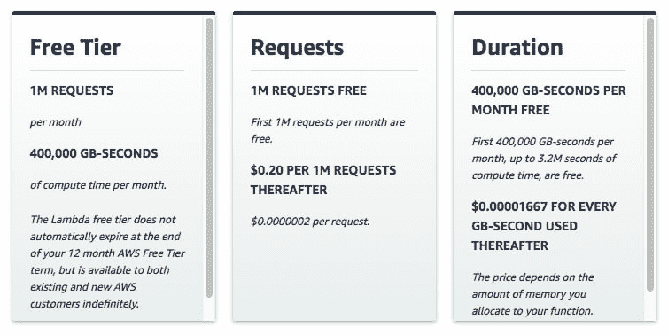

# Corral:一个无服务器的 MapReduce 框架

> 原文：<https://dev.to/benrcongdon/introducing-corral-a-serverless-mapreduce-framework-47bn>

我最近一直在为我帮忙教的一个班使用 Hadoop 和 Spark。PySpark 很棒，但是 Hadoop MapReduce 从来没有真正“点击”过我，直到我找到了 [mrjob](https://pythonhosted.org/mrjob/) 。MapReduce 的概念非常强大，但在我看来，用 Java 编写一个简单的 Hadoop 任务所需的样板文件数量相当令人讨厌。

Hadoop 和 Spark 也至少需要一些基础设施知识。像 [EMR](https://aws.amazon.com/emr/) 和 [Dataproc](https://cloud.google.com/dataproc/) 这样的服务使这变得更容易，但是成本很高。

过去有关于使用 Lambda 作为 MapReduce 平台的传言。AWS 发布了一个(有限的)[参考架构](https://github.com/awslabs/lambda-refarch-mapreduce/)，有一些企业解决方案似乎也在采用这种方法。然而，我找不到一个采用这种方法的完全开发的开源项目。

大约在同一时间， [AWS 宣布了对 Lambda 的原生 Go 支持](https://aws.amazon.com/blogs/compute/announcing-go-support-for-aws-lambda/)。Go 的启动时间短、易于部署(即单二进制包)和一般速度使它成为这个项目的一个很好的候选对象。

我的想法是这样的:使用 Lambda 作为执行环境，就像 Hadoop MapReduce 使用 YARN 一样。本地驱动程序协调函数调用，S3 用于数据存储。

[T2】](///img/2018-05-02-Introducing-Corral-A-Serverless-MapReduce-Framework/architecture.svg)

结果是 [corral](https://github.com/bcongdon/corral) ，一个用于编写任意 MapReduce 应用程序的框架，可以在 AWS Lambda 中执行。

## MapReduce 的一个 Golang 接口

众所周知，Go 没有泛型，所以我不得不绞尽脑汁为映射器和缩减器想出一个令人信服的接口。Hadoop MapReduce 在指定输入/输出格式、记录分割方式等方面具有很大的灵活性。

我考虑过对键和值使用`interface{}`值，但是[用 Rob Pike](https://www.youtube.com/watch?v=PAAkCSZUG1c&t=7m36s) 的话说，“`interface{}`什么都没说”。我决定采用极简界面:键和值都是字符串。输入文件由换行符分隔。这些简化的假设使得整个系统的实现更加简单和清晰。Hadoop MapReduce 在可定制性方面胜出，所以我决定选择易用性。

我对 Map 和 Reduce 的最终界面很满意(其中一些是受达米安·格里斯基的 [dmrgo](https://github.com/dgryski/dmrgo) 的启发):

```
type Mapper interface {
    Map(key, value string, emitter Emitter)
}

type Reducer interface {
    Reduce(key string, values ValueIterator, emitter Emitter)
}

type Emitter interface {
    Emit(key, value string) error
} 
```

Enter fullscreen mode Exit fullscreen mode

`ValueIterator`只有一个方法:`Iter()`，它迭代字符串的`range`。

`Emitter`和`ValueIterator`隐藏了大量的内部框架实现(洗牌、分区、文件系统交互等)。我也很高兴我决定对值使用迭代器，而不是普通的片(这可能更习惯)，因为迭代器在框架方面允许更大的灵活性(也就是说，延迟地流值，而不是把它们都放在内存中)。

## 无服务器 MapReduce

从框架的角度来看，我花了一段时间来确定一种将 MapReduce 实现为完全无状态系统的有效方法。

Hadoop MapReduce 的架构为其带来了以下优势…

*   持久、长期运行的工作节点
*   工作节点上的数据局部性
*   通过 YARN/Mesos/等抽象的容错主/工作容器。

最后两个方面很容易用 AWS 栈复制。S3 和 Lambda 之间的带宽往往相当不错(至少对我来说是这样)，Lambda 的构建使得开发人员“不必考虑服务器”。

在 Lambda 上复制最棘手的事情是持久化工作节点。Lambda 的最大超时时间为 5 分钟。因此，Hadoop 实现 MapReduce 的许多方法都不再有效。

例如，在映射器工作器和缩减器工作器之间直接传输数据是不可行的，因为映射器需要“尽可能快地”完成。否则，当缩减器仍在工作时，映射器可能会超时。

这种限制在洗牌/分区阶段表现得最为明显。理想情况下，映射器将“存活”足够长的时间，以便按需将数据传输到归约器(甚至在映射阶段期间*),归约器将“存活”足够长的时间，以便使用它们的磁盘作为大型合并排序的溢出来进行完整的二级排序。5 分钟的上限使得这些方法变得难以实施。*

最后，我决定使用 S3 作为无状态分区/洗牌的后端。

<figure>[](///img/2018-05-02-Introducing-Corral-A-Serverless-MapReduce-Framework/intermediate.svg) 

<figcaption>用于分区/洗牌的语义中间文件名</figcaption>

</figure>

通过对映射器输出使用“前缀友好”的名称，reducers 可以很容易地选择它们需要读取的文件。

处理输入数据要简单得多。像 Hadoop MapReduce 一样，输入文件被分割成块。Corral 将这些文件块分组到“输入箱”中，每个映射器读取/处理一个输入箱。输入拆分和仓的大小可以根据需要进行配置。

[T2】](///img/2018-05-02-Introducing-Corral-A-Serverless-MapReduce-Framework/input_splits.svg)

## 自部署应用程序

corral 最让我兴奋的一点是它能够自我部署到 AWS Lambda。我希望它能够快速地将 corral 作业部署到 Lambda——必须通过 web 界面手动将部署包重新上传到 Lambda 是一件麻烦的事情，而且像 Serverless 这样的框架依赖于非 Go 工具，包含这些工具会很麻烦。

我最初的想法是，构建的 corral 二进制文件会将*本身*作为部署包上传到 Lambda。这个想法实际上是可行的…直到你处理跨平台的构建目标。Lambda 需要用`GOOS=linux`编译的二进制文件，所以任何在 macOS 或 Windows 上编译的二进制文件都不能工作。

在这一点上，我几乎放弃了这个想法，但后来我偶然发现了 Kelsey Hightower 的[自部署 Kubernetes 应用程序](https://www.youtube.com/watch?v=XPC-hFL-4lU)，来自 GopherCon 2017。凯尔西描述了一个类似的方法，尽管他的代码运行在 Kubernetes 而不是 Lambda 上。然而，他描述了我所需要的“缺失的一环”:让特定于平台的二进制文件重新编译*本身*到目标`GOOS=linux`。

因此，总而言之，corral 用来部署到 Lambda 的过程如下:

1.  用户针对自己选择的平台编译 corral 应用程序。
2.  在执行时，corral 应用程序为`GOOS=linux`重新编译自己，并将生成的二进制文件压缩成 zip 文件。
3.  Corral 然后将这个 zip 文件上传到 Lambda，创建一个 Lambda 函数。
4.  Corral 调用这个 Lambda 函数作为 map/reduce 任务的执行器。

Corral 能够通过在运行时对环境进行一些巧妙的检查，将*完全相同的*源代码用作驱动程序和远程执行器。如果二进制程序检测到它处于 Lambda 环境中，它会监听调用请求；否则，它的行为正常。

液体错误:内部

顺便说一句，自我上传或自我重新编译应用程序的想法对我来说相当令人兴奋。我记得当我上计算理论课时,“自嵌入”程序的概念(经常在不可判定性证明的上下文中被引用)很有趣，但是我想不出有哪种情况下你会*实际上*想要一个具有那种内部反射水平的程序。

在某种程度上，自部署应用程序是这种想法的一个实用例子。这是一个重新编译*本身*，上传*本身*到云端，并远程调用*本身*的程序(尽管通过不同的代码路径)。很棒的东西！

部署后，corral 上传到 Lambda 的二进制文件根据调用它的输入有条件地表现为映射器或缩减器。在 Map/Reduce 阶段，本地执行的二进制文件保持运行并调用 Lambda 函数。

<figure>[](///img/2018-05-02-Introducing-Corral-A-Serverless-MapReduce-Framework/timeline.svg) 

<figcaption>畜栏作业时间表</figcaption>

</figure>

系统中的每个组件都在运行相同的源代码，但在 Lambda 中有许多并行副本在运行(由驱动程序协调)。这导致了使 MapReduce *更快*的并行性。

## 像对待文件系统一样对待 S3

像 mrjob 一样，Corral 试图对它运行的文件系统保持不可知。这允许它在本地和 Lambda 执行之间透明地切换(并允许扩展的空间，例如如果 GCP 在云函数中开始支持 Go)。

然而，S3 并不是真正的文件系统；这是一个物品商店。像使用文件系统一样使用 S3 需要一点小技巧。例如，当读取输入 splits 时，corral 需要找到文件的某个部分并开始读取。默认情况下，对 S3 的 GET 请求将整个对象返回给 T2。当您的对象可能有几十亿字节时，这并不好。

幸运的是，[你可以在 S3 GET 请求中设置一个范围头](https://docs.aws.amazon.com/AmazonS3/latest/API/RESTObjectGET.html#RESTObjectGET-requests-request-headers)来接收大块的对象。Corral 的[S3 文件系统](https://github.com/bcongdon/corral/blob/master/internal/pkg/corfs/s3.go#L104)利用了这一点，根据需要一次下载一个对象的大块。

给 S3 写信也需要一点思考。对于小型上传，标准的“放置对象”请求就可以了。对于更大的上传，[多部分上传](https://docs.aws.amazon.com/AmazonS3/latest/dev/mpuoverview.html)变得更有吸引力。多部分上传允许写入本地文件的等效功能；您将数据“流式传输”到一个文件中，而不是将其保留在内存中一次性写入。

令我惊讶的是，没有一个伟大的 S3 客户端提供`io.Reader`和`io.Writer`接口。T2 是我能找到的最近的东西；这很好，但是(根据我的经验)泄漏了太多的内存，以至于我无法在内存有限的 Lambda 环境中使用它。

## 内存管理中的 Lambda

虽然 AWS Lambda 在过去几年中发展势头越来越猛，但它似乎缺少分析 Lambda 函数的工具。默认情况下，Lambda 会记录到 Cloudwatch。如果您的函数死机，就会记录一个堆栈跟踪。因此，“崩溃”错误相对容易调试。

然而，如果你的函数耗尽了内存或时间，你将会看到类似这样的东西:

```
REPORT RequestId: 16e55aa5-4a87-11e8-9c63-3f70efb9da7e Duration: 1059.94 ms Billed Duration: 1100 ms Memory Size: 1500 MB Max Memory Used: 1500 MB 
```

Enter fullscreen mode Exit fullscreen mode

在本地，像 [pprof](https://golang.org/pkg/runtime/pprof/) 这样的工具对于了解内存泄漏的来源非常有用。在 Lambda，你就没有这种运气了。

在 corral 的早期版本中，我花了几个小时追踪一个最终由 [s3gof3r](https://github.com/rlmcpherson/s3gof3r) 引起的内存泄漏。由于 [Lambda 容器被重用](https://aws.amazon.com/blogs/compute/container-reuse-in-lambda/)，即使很小的内存泄漏也会导致最终的失败。换句话说，内存使用在调用之间是持久的——一个泄漏的抽象(没有双关的意思)。

如果能看到更好的 AWS Lambda 分析工具就太好了，尤其是因为 Golang 是一个非常容易分析的运行时。

## 当λ变贵

表面上，corral 的目标是为 Hadoop MapReduce 提供一个廉价、快速的替代方案。AWS Lambda 便宜，这应该是板上钉钉了吧？

是也不是。Lambda 的免费层每月为您提供 400，000 GB 秒。这听起来很多，但很快就会被长时间运行的应用程序用完。

<figure>[](///img/2018-05-02-Introducing-Corral-A-Serverless-MapReduce-Framework/lambda_pricing.png)

<figcaption>λ定价方案截至 2018 年 4 月 29 日</figcaption>

</figure>

最终，corral 仍然会非常便宜。但是，您会希望对应用程序进行调优，以尽可能少地使用内存。将 corral 中的最大内存设置得尽可能低，以降低成本。

在 AWS Lambda 中，时间是一种随用随取的资源——你使用多少毫秒就会被收费。内存是按使用或丢失计费的。如果你将最大内存设置为 3GB，但只使用了 500MB，你仍然要为 3GB 的内存付费。

## 表现

虽然不是主要的设计考虑，但 corral 的性能相当不错。这主要是因为 Lambda 提供了近乎无限的并行性。我使用了 [Amplab“大数据基准”](https://amplab.cs.berkeley.edu/benchmark/)来感受一下 corral 的性能。该基准测试基本的过滤器、聚合和连接。

正如我所料，corral 在过滤和聚合方面做得很好。然而，它在连接上是平的。没有[二级排序](https://www.safaribooksonline.com/library/view/data-algorithms/9781491906170/ch01.html)，连接变得昂贵。

Amplab 基准测试高达 125GB 的输入数据。我很想对大约 1TB 的数据进行更多的基准测试，看看性能是否会继续线性增长。

更多信息和基准统计数据可以在 [corral 示例文件夹](https://github.com/bcongdon/corral/tree/master/examples)中找到。

## 结论

就是这样:corral 让你编写一个简单的 MR 作业，无摩擦地部署到 Lambda，并在 S3 的数据集上运行作业。

<figure>[](///img/2018-05-02-Introducing-Corral-A-Serverless-MapReduce-Framework/word_count.gif) 

<figcaption>运行中字数统计作业</figcaption>

</figure>

同样值得注意的是，我并不执着于 AWS 生态系统。Corral 对 Lambda 和 S3 几乎一无所知，因此在未来，可以添加到 GCP 的云功能和数据存储的连接器(如果/当 GCP 为 CF 添加 Go 支持时)。

就个人而言，我发现这个项目非常值得去做。与使用 MapReduce 系统的 T2 相比，网上用于构建 MapReduce 系统的资源要少得多，所以我需要解决一些实现细节。

请随意在 [corral 存储库](https://github.com/bcongdon/corral)中提出问题。我很好奇这个项目是否有足够大的空间来证明继续开发的合理性。😁