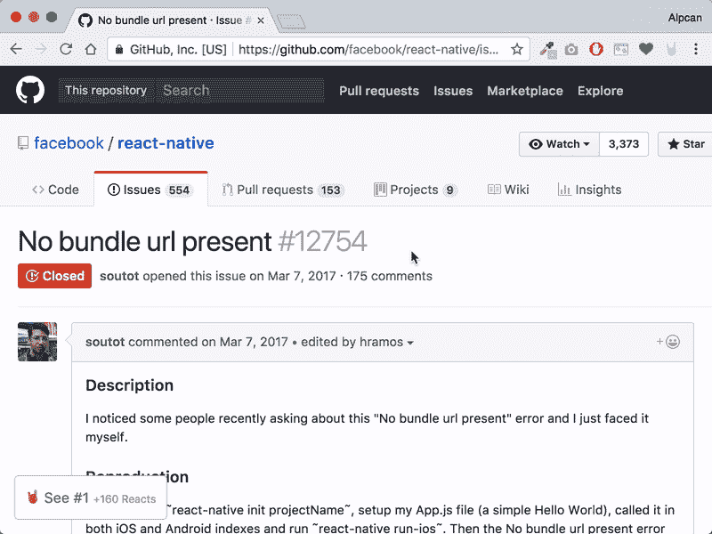

# 介绍表情符号🤘

> 原文：<https://dev.to/alpcanaydin/introducing-emojissue---1nd0>

大家好，

我们每天都花时间寻找发展问题的答案。我们通常会在 **Github 问题**或 **Stackoverflow** 上找到正确答案。在 StackOverflow 上，我们寻找绿色的勾号，感谢上帝它就在问题的下面。但是，关于 Github 的问题，尤其是那些评论很多的问题呢？让我告诉你我们在做什么；我们开始在页面中滚动，寻找有反应的评论。如果评论有一个或多个表情符号，如“👍", "🎉“而《❤️》我们认为*“嗯，我可以试试这个”*。如果一切正常，我们只需添加“👍”表情符号来评论并关闭页面。如果不是正确的答案，我们就寻找下一个，这个过程会一直进行下去，直到找到一个解决方案。向下滚动整个页面来寻找有反应的评论真的很无聊。这正是表情符号的用武之地。

表情符号是对 **Chrome** 和 **Firefox** 的浏览器扩展，可以让你轻松地在五个积极回应的 Github 问题评论之间导航。

[T2】](https://res.cloudinary.com/practicaldev/image/fetch/s---U7wP8y2--/c_limit%2Cf_auto%2Cfl_progressive%2Cq_66%2Cw_880/https://thepracticaldev.s3.amazonaws.com/i/1wnkatxigzxrlfma7mi1.gif)

你只需要点击左下角的按钮，它会带你浏览前五个。

反应的计算是非常基本的。它只是计算了具有“👍", "🎉”和“❤️".

## 安装

请[点击这里](https://chrome.google.com/webstore/detail/emojissue/hlmdfmfhdcegcldcgohndokilbnmkgfm)获取**谷歌 Chrome** 扩展[点击这里](https://addons.mozilla.org/addon/emojissue)获取 **Mozilla Firefox** 。

## 源代码

可以在 Github 上找到[源代码](https://github.com/alpcanaydin/emojissue)。

## 结论

我希望你喜欢它。你可以随意在 Github 上打开任何问题。

谢了。