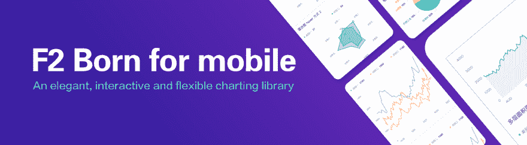
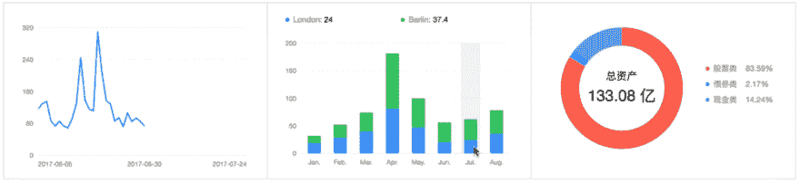
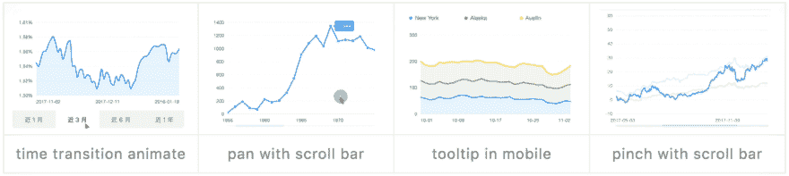
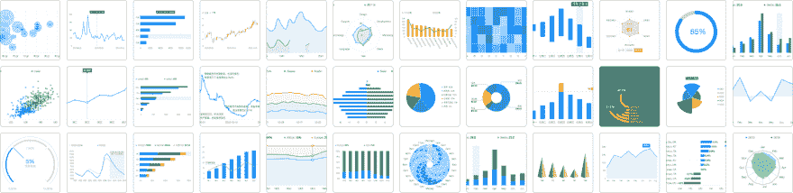
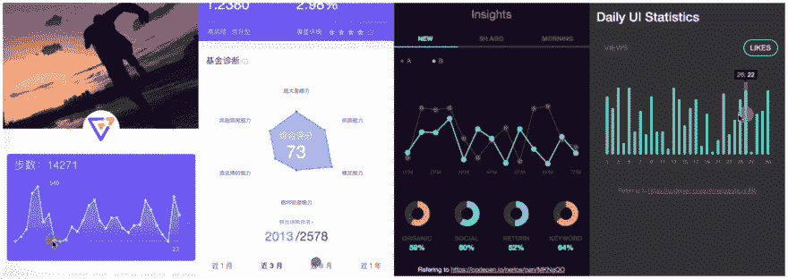
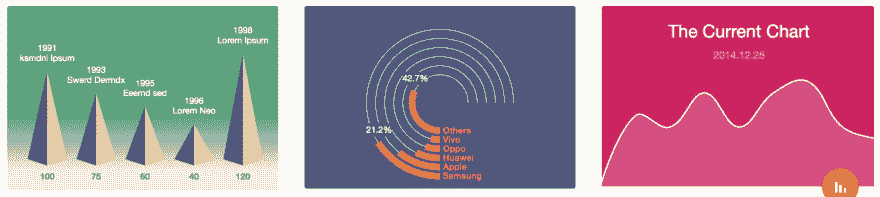
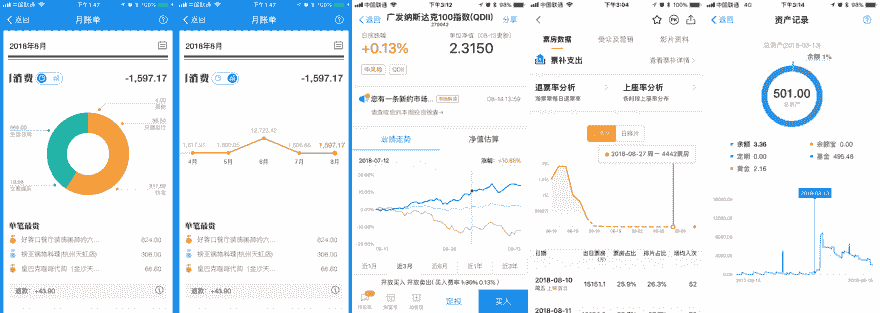

# 介绍 F2，一个优雅、交互式和灵活的移动图表库

> 原文：<https://dev.to/simaq/introducing-f2-an-elegant-interactive-and-flexible-charting-library-for-mobile-37nb>

[T2】](https://res.cloudinary.com/practicaldev/image/fetch/s--mr7DTByN--/c_limit%2Cf_auto%2Cfl_progressive%2Cq_auto%2Cw_880/https://thepracticaldev.s3.amazonaws.com/i/x7gxtkqkfnr79efpdl7d.png)

F2 是一个自由开源的现代图表库，在麻省理工学院的许可下发布。F2 的目标是帮助开发者更容易地为**移动设备**创建交互式可视化。F2 为移动设备而生，为开发人员和设计人员而开发。它基于 Html5 Canvas，也兼容 Node.js、Weex 和 React Native。基于[的图形语法](https://www.cs.uic.edu/~wilkinson/TheGrammarOfGraphics/GOG.html)，F2 提供了你需要的所有图表类型。我们的移动设计指南能够在移动可视化项目中提供更好的用户体验。

## 特性

### 为移动而生

基于“准确、有效、清晰、美观”的可视化原则，结合移动设备特性(设备不同、计算能力和触摸界面不足)和人们使用移动设备的习惯，F2 从设计、性能和平台兼容性的角度为用户提供移动可视化的最佳体验。

**设计**，让数据更鲜活，图表交互更自然。在设计中，易于理解、吸引人的表达方式让用户在碎片化的时间里更快、更有效地获取图表信息。关于交互，在移动设备上的交互过程中，内容和操作的结合是最需要的，这意味着交互行为及其反馈需要与人的自然行为相匹配。下面的 gif 显示了 F2 提供的用于数据浏览的单触摸-拖动和用于缩放的多触摸的交互。

[T6】](https://res.cloudinary.com/practicaldev/image/fetch/s--mE6zDc0B--/c_limit%2Cf_auto%2Cfl_progressive%2Cq_66%2Cw_880/https://thepracticaldev.s3.amazonaws.com/i/w7m03lg6toq0ncu9te2p.gif)

**性能**，虽然移动设备的硬件和计算能力不断提升，但大部分用户使用的并不是最新最强大的移动设备。所以 F2 在渲染上一直追求更好的性能，针对移动设备做了很多优化。具有广泛的图表类型选择，并且仍然保持较小的包大小(没有交互的版本是 gzip 之后的 44k)。它还提供了一个模块化的设计来支持动态加载，你可以得到一个更好的尺寸。

**兼容性**，除了 H5 env，F2 还可以运行在 [Node.js](https://antv.gitbook.io/f2/platform) 、 [Weex 渲染](https://github.com/weex-plugins/weex-chart)和 [React Native](https://github.com/chenshuai2144/f2-demo) ，还有[支付宝小程序](https://github.com/antvis/my-f2)和[微信小程序](https://github.com/antvis/wx-f2)。

[T2】](https://res.cloudinary.com/practicaldev/image/fetch/s--Rq6X_-m0--/c_limit%2Cf_auto%2Cfl_progressive%2Cq_auto%2Cw_880/https://thepracticaldev.s3.amazonaws.com/i/zs6z1as43qo7wdu4oyfs.png)

### 你想要的所有图表类型

借助图形的语法力量，F2 支持数据驱动的 [50+图表类型](https://antv.alipay.com/zh-cn/f2/3.x/demo/index.html)(数量可以更多，这取决于您)包括经典图表，如折线图、柱形图/条形图、饼图、散点图、仪表图等。此外，F2 还提供了功能丰富的图表组件，如工具提示、图例和指南。

[T2】](https://res.cloudinary.com/practicaldev/image/fetch/s--3RfHdDFk--/c_limit%2Cf_auto%2Cfl_progressive%2Cq_auto%2Cw_880/https://thepracticaldev.s3.amazonaws.com/i/a66q1fsqmzwt0e19q0bk.png)

### 灵活互动

我们还为开发人员提供灵活的扩展机制，包括形状、动画和交互式定制功能，以及灵活的样式，以满足各种个性化的图表需求。

[T6】](https://res.cloudinary.com/practicaldev/image/fetch/s--GaOBjFE3--/c_limit%2Cf_auto%2Cfl_progressive%2Cq_auto%2Cw_880/https://thepracticaldev.s3.amazonaws.com/i/90o2kn7h4yo5i0lx4f7d.png)

## 基于 F2 的其他库

*   [蚂蚁设计移动图](https://github.com/ant-design/ant-design-mobile-chart):蚂蚁设计基于 F2 的移动图。(反应过来)。
*   [BizGoblin](https://github.com/alibaba/BizGoblin) :基于 F2 和 React 的数据可视化库。
*   [VChart](https://doc.vux.li/zh-CN/components/v-chart.html) :基于 vux 和 F2 的移动海图组件。(Vue)。
*   [weex-chart](https://github.com/weex-plugins/weex-chart) :基于 weex 和 F2 的图表组件。

## 我们被信任

[T2】](https://res.cloudinary.com/practicaldev/image/fetch/s--AYvwIkH8--/c_limit%2Cf_auto%2Cfl_progressive%2Cq_auto%2Cw_880/https://thepracticaldev.s3.amazonaws.com/i/l7bwfbowmigt3wubpnvr.png)

这里有一些用 F2 绘制的应用图表的例子。

[T2】](https://res.cloudinary.com/practicaldev/image/fetch/s--NCycYMwf--/c_limit%2Cf_auto%2Cfl_progressive%2Cq_auto%2Cw_880/https://thepracticaldev.s3.amazonaws.com/i/s145tczoj2qywjukmzyb.png)

## 结论

感谢阅读。去安装它，启动它，并给它一个尝试！🎉

如果您在使用 F2 时遇到任何问题，请随时在 GitHub 上提交新的一期。

## 链接

*   [F2 文件](https://antv.gitbook.io/f2/)
*   [F2 Github 库](https://github.com/antvis/f2)
*   [F2 演示](https://antv.alipay.com/zh-cn/f2/3.x/demo/index.html)
*   [F2](https://antv.alipay.com/zh-cn/f2/3.x/index.html)