# 介绍消防演习-消防基地的电动工具

> 原文：<https://dev.to/scottlepp/introducing-firedrill---power-tools-for-firebase-g9f>

火山岩！我们开发人员可以比以往更快地创建应用程序，而不必担心设置和维护后端基础设施。

我发现 Firebase 的挑战是使用 Firebase 控制台查找数据。另外，在控制台中添加/修改数据有点麻烦。

为了克服这些挑战，我创造了[消防演习](https://firedrill-74829.web.app)

我们去看看吧！

首先，我们需要连接到我们的数据库。最简单的方法是打开你的 Firebase 项目，然后点击齿轮和“项目设置”:

[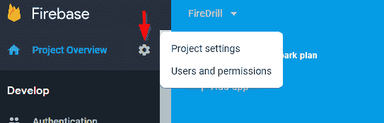T2】](https://res.cloudinary.com/practicaldev/image/fetch/s--CZZJ_WGU--/c_limit%2Cf_auto%2Cfl_progressive%2Cq_auto%2Cw_880/https://thepracticaldev.s3.amazonaws.com/i/2ahx0ifm55ys9y3pnweh.png)

现在向下滚动并选择“将 Firebase 添加到您的 Web 应用程序中”:

[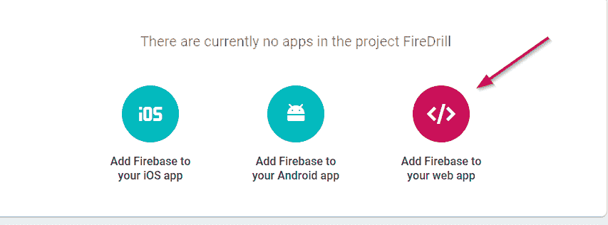T2】](https://res.cloudinary.com/practicaldev/image/fetch/s--AdhuzryA--/c_limit%2Cf_auto%2Cfl_progressive%2Cq_auto%2Cw_880/https://thepracticaldev.s3.amazonaws.com/i/79g45t81le051hgqm54y.png)

突出显示您在下面看到的部分和 Ctrl-C(不要使用复制按钮)

[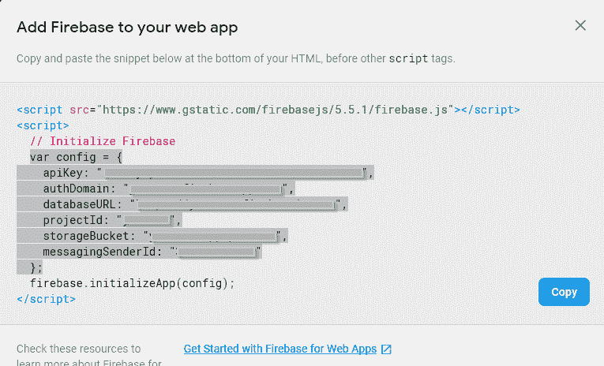T2】](https://res.cloudinary.com/practicaldev/image/fetch/s--d5cUDi3A--/c_limit%2Cf_auto%2Cfl_progressive%2Cq_auto%2Cw_880/https://thepracticaldev.s3.amazonaws.com/i/u2859buh9et6uidtg6zs.png)

您还需要添加 **firedrill-74829.web.app** 作为授权域。在左侧的开发下，单击身份验证。然后选择“登录方式”，然后向下滚动到“授权域”，点击“添加域”。输入“firedrill-74829.web.app”作为您的域。

现在打开[消防演习](https://firedrill-74829.web.app)。在 Connect 页面上，单击 JSON 选项卡并粘贴您的连接信息。默认的数据库类型是“Firestore ”,但是您可以根据您的数据库类型将其更改为“Realtime”。准备就绪后，单击连接按钮。

[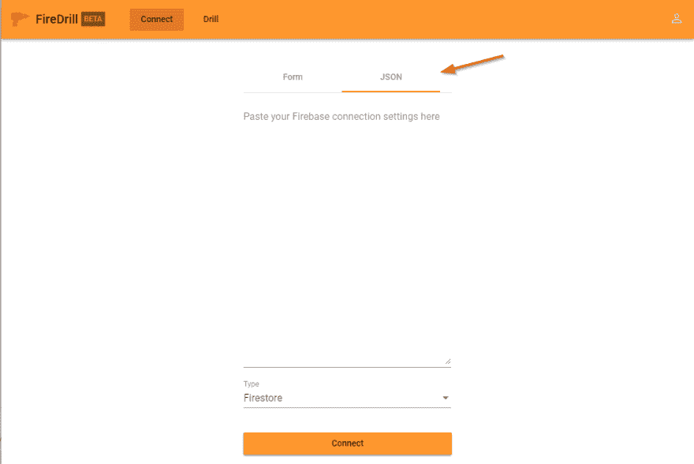T2】](https://res.cloudinary.com/practicaldev/image/fetch/s--iHmwyjFY--/c_limit%2Cf_auto%2Cfl_progressive%2Cq_auto%2Cw_880/https://thepracticaldev.s3.amazonaws.com/i/i9kmhy8j162l116xgag1.png)

你接通了！现在您需要登录。您可以使用您的电子邮件或登录 Google(如果您在 Firebase 中启用了 Google 身份验证)。如果您尚未保护数据，可以跳过这一步。

[T2】](https://res.cloudinary.com/practicaldev/image/fetch/s--ahSffw7Y--/c_limit%2Cf_auto%2Cfl_progressive%2Cq_auto%2Cw_880/https://thepracticaldev.s3.amazonaws.com/i/v4tkmi9neiqsq5vp2zle.png)

好吧！我们准备开始钻井了！

在 Drill 屏幕上，您会看到一个“路径”输入。您可以在此输入收藏名称。

[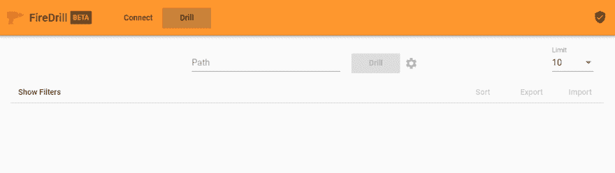T2】](https://res.cloudinary.com/practicaldev/image/fetch/s--J8YADukZ--/c_limit%2Cf_auto%2Cfl_progressive%2Cq_auto%2Cw_880/https://thepracticaldev.s3.amazonaws.com/i/8sutxwcivzsufhd8bwdc.png)

我有一个收藏叫“鞋”。我将键入“鞋子”并单击“钻取”。

[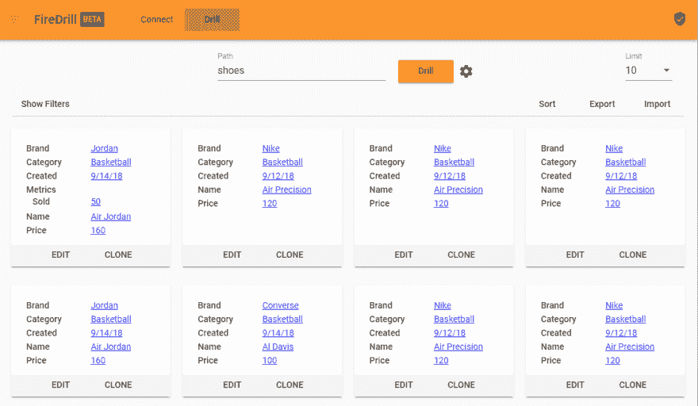T2】](https://res.cloudinary.com/practicaldev/image/fetch/s--EEFHSymu--/c_limit%2Cf_auto%2Cfl_progressive%2Cq_auto%2Cw_880/https://thepracticaldev.s3.amazonaws.com/i/ayg5o4du50x3t8ihp756.png)

太好了，我找到我的鞋子了。请注意，钻取按钮右侧的限制是 10。你可以根据自己的喜好调整限制。您可能还注意到所有的值都是链接。这允许快速过滤。我将在第一个结果上单击品牌“Jordan”。

[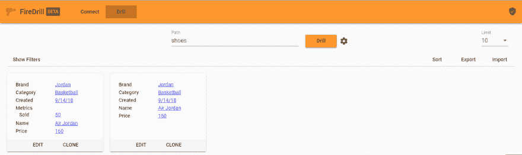T2】](https://res.cloudinary.com/practicaldev/image/fetch/s--Im97mrpG--/c_limit%2Cf_auto%2Cfl_progressive%2Cq_auto%2Cw_880/https://thepracticaldev.s3.amazonaws.com/i/dgspebvnqwj1gp4hfeqn.png)

所以我能很快过滤出只有“乔丹”鞋。这是很好的快速过滤，但我想要更高级的过滤，如日期范围或价格范围。没问题。

让我们打开过滤器抽屉。我将单击您在结果上方看到的“显示过滤器”链接。现在抽屉打开了，我可以选择一个字段进行过滤。

[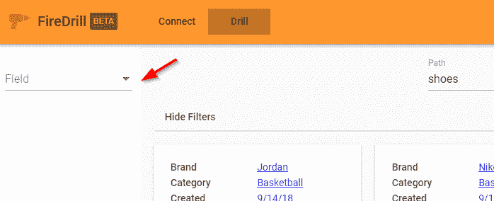T2】](https://res.cloudinary.com/practicaldev/image/fetch/s--yzP1koz2--/c_limit%2Cf_auto%2Cfl_progressive%2Cq_auto%2Cw_880/https://thepracticaldev.s3.amazonaws.com/i/v4dqui8o6yw9idyp41hj.png)

我将选择“价格”字段和“介于”类型，然后添加 100 作为起始价格，150 作为终止价格，并单击“应用”。现在我只看到那个价格范围内的商品。这也适用于日期字段。

[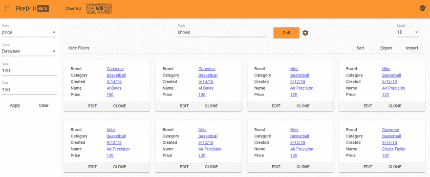T2】](https://res.cloudinary.com/practicaldev/image/fetch/s--NYWF8tA6--/c_limit%2Cf_auto%2Cfl_progressive%2Cq_auto%2Cw_880/https://thepracticaldev.s3.amazonaws.com/i/g6uj9h33r116csr8scm7.png)

我们也可以使用“大于”、“小于”或“等于”作为类型。

现在我想先看看最高的价格。没问题。在右边单击“排序”链接，然后单击“价格”字段。它首先按升序排序(注意字段旁边的图标)。只需再次点击“排序”并再次点击“价格”字段。现在将按降序排列。请注意，图标改变为指向下方。

[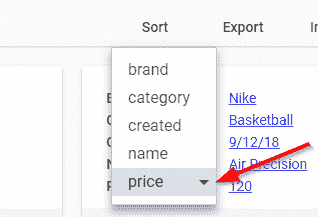T2】](https://res.cloudinary.com/practicaldev/image/fetch/s--tjqtgHlH--/c_limit%2Cf_auto%2Cfl_progressive%2Cq_auto%2Cw_880/https://thepracticaldev.s3.amazonaws.com/i/18jb9t5wf3pe679c3tx0.png)

我们可以看到，我们的结果现在按最高价格排序:

[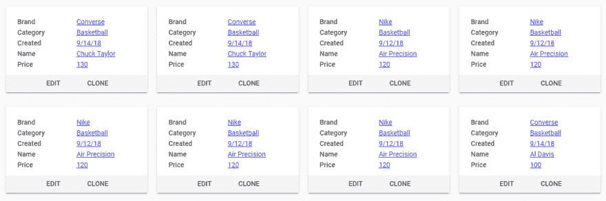T2】](https://res.cloudinary.com/practicaldev/image/fetch/s--cVietY1Y--/c_limit%2Cf_auto%2Cfl_progressive%2Cq_auto%2Cw_880/https://thepracticaldev.s3.amazonaws.com/i/ol4aoxhs8ahu7m01lsav.png)

所以我展示了如何使用 [FireDrill](https://firedrill-74829.web.app) 在 Firebase 中快速找到数据。我还展示了如何使用范围过滤器以及如何对数据进行排序。在下一篇文章中，我将向您展示如何快速编辑和管理 Firebase 数据。敬请期待！

与此同时，自己尝试一下[消防演习](https://firedrill-74829.web.app)。如果您遇到任何问题，请随时在这里报告:[消防演习问题](https://github.com/scottlepp/fire-drill/issues)。谢谢，钻井愉快！