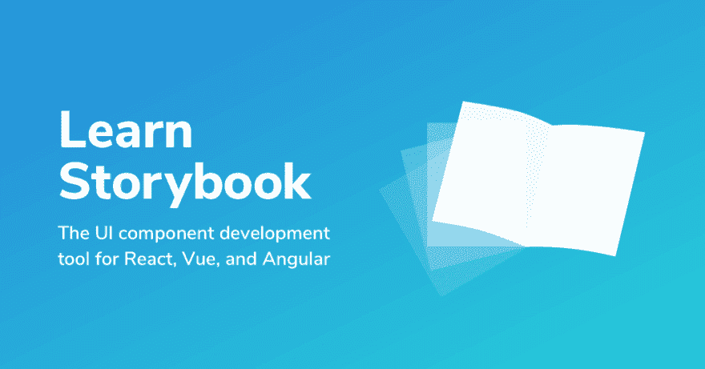
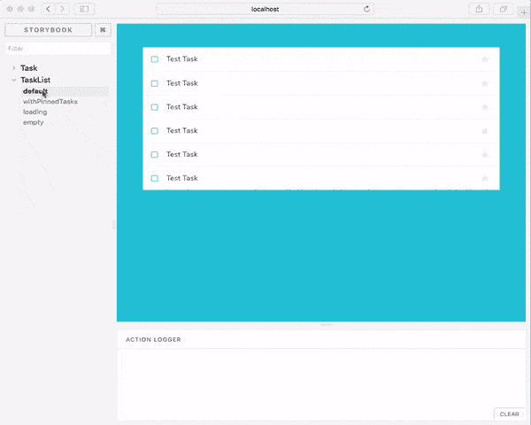
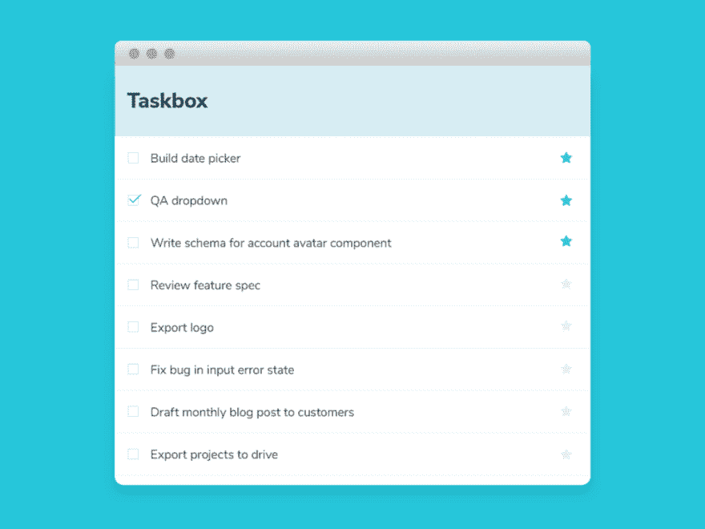

# 介绍 LearnStorybook.com

> 原文：<https://dev.to/chroma/introducing-learnstorybookcom-1k6d>

#### 一个通过构建一个工作界面来教你读故事书的教程

**TLDR:** 👋Dev.to 我们正在推出 [**学习故事书**](https://www.learnstorybook.com/)**——一个快速、平易近人、免费的故事书入门教程。无论你是一个新的还是有经验的前端开发人员，本教程都给你一个学习专业团队使用的 UI 组件工具的开端。包括与章节同步的真实代码提交，以便于保持同步。**

 **[T2】](https://www.learnstorybook.com/)

如果你像我一样在前端工作，你可能听说过 Storybook(最初叫做 React Storybook)。起初你可能会不以为然。另一天，另一个开发工具。

然而，越来越多的开发人员和精明的设计人员使用故事书来构建用户界面。Airbnb、Dropbox、IBM、Lonely Planet 和 Mozilla 的团队每天都依赖它。Storybook 已经超越 React，支持几乎所有主要视图层。到现在为止，你可能想知道炒作是怎么回事？

## 未来 UI 开发的工具

为了让故事书有意义，让我们简短地绕到前端景观。受 React、Vue 和 Angular 等新视图层的启发，UI 开发正在复兴。

人们不再考虑页面，而是考虑组件。组件仍然输出熟悉的 HTML、CSS 和 JavaScript 三足鼎立，但是生成输出的方式已经发生了变化。

<figure> 

<figcaption>将属性扔向一个组件，看它呈现不同的排列。</figcaption>

</figure>

有了 React，开发者有了像**道具**、**上下文**、**状态**这样的新工具来渲染 UI。这些“现代”视图层共享的核心创新是组件构造，它使得将复杂的 ui 分解成简单的模块变得容易。

面向组件的开发需要新的工具来帮助开发人员专注于构建 UI 组件。Storybook 是最受欢迎、功能最全的 UI 组件工具。它也是唯一支持大多数视图层的工具。

## 好吧，但是故事书是做什么的？

故事书帮助你更快地构建持久的用户界面。它在开发模式下与您的应用程序一起运行，并提供一个“沙箱”来构建 UI 组件，与您的应用程序的业务逻辑或上下文相隔离。这使您可以专注于清晰地定义组件 API——组件接受的一组输入。

开发人员通过向组件传递一组独特的输入来产生不同的变化(类似于单元测试中的规范)，从而创建“故事”。这些故事被编入索引并记录在 Storybook 中，因此您可以在开发过程中直观地检查它们，或者在测试过程中再次访问它们。

[T2】](https://res.cloudinary.com/practicaldev/image/fetch/s--RBZA_Lyj--/c_limit%2Cf_auto%2Cfl_progressive%2Cq_auto%2Cw_880/https://cdn-images-1.medium.com/max/1024/1%2Ae0qaK7VJ7HnAnMvEit1C0Q.jpeg)

## [学习故事书](https://www.learnstorybook.com/) —动手教程

越来越多的前端团队依赖故事书。但是关于如何从基本原则出发使用故事书的资源并不多。

汤姆·科尔曼和 T2·I 创建了 Learn Storybook，这是一个免费的 9 章教程，使用 Storybook 教授组件开发的可靠模式。

在 Storybook 中从头开始构建 UI 时，您将了解基本的 UI 组件技术(非常适合基于项目的学习者)。

<figure> 

<figcaption>建立 Taskbox，建立任务管理 UI</figcaption>

</figure>

### 你会学到什么

您将学习来自专业团队、核心维护人员和精彩故事书社区的最佳实践。此外，获得更广泛的背景来理解为什么那些最佳实践存在。每一章都介绍了使用 Storybook 的不同方面，并在一个工作演示应用中同步到一个**真实提交**。

*   🏗设置开发环境
*   🔨独立构建一个简单的组件
*   🛠将简单部件组装成复合部件
*   💡用容器连接数据
*   💻建造一个屏风
*   🚦测试 UI 组件库
*   🚀部署故事书

### 这对谁来说很棒

故事书应该让每个人都可以接触到，不管你是高年级学生、低年级学生、开发人员还是设计师。如果您继续学习，您将掌握独立 UI 组件开发的核心概念，并毫无问题地在 Storybook 中构建完整的 UI。它非常适合:

*   **👩‍💻有经验的开发人员**听说过 Storybook，并且想要一个强调关键特性和工作流程的高效教程
*   **👩‍🎓想要学习 Github、Artsy 和 Priceline 的专业团队使用的工具的新开发人员**。
*   **👩‍🎨产品设计师对 UI 组件和构建组件库的螺母&螺栓感兴趣。**

希望 [**学故事书**](https://www.learnstorybook.com/) 对你有帮助，嗯，学故事书！

[T2】](https://res.cloudinary.com/practicaldev/image/fetch/s--LN20Ka4f--/c_limit%2Cf_auto%2Cfl_progressive%2Cq_auto%2Cw_880/https://cdn-images-1.medium.com/max/64/1%2AGtyOd4Uan21s07cExngbrg.png)

## 欢迎投稿人

学故事书是[开源](https://github.com/hichroma/learnstorybook.com/)。我们的目标是向世界介绍故事书。我们正在寻找 [Vue 和角度贡献者](https://www.learnstorybook.com/contribute/)(示例代码目前是 React)并帮助[将教程](https://github.com/hichroma/learnstorybook.com/issues/3)翻译成其他语言。还举报 bug！

最初发布于[色度](https://blog.hichroma.com/introducing-learnstorybook-com-2a43cd33edf5)

* * ***