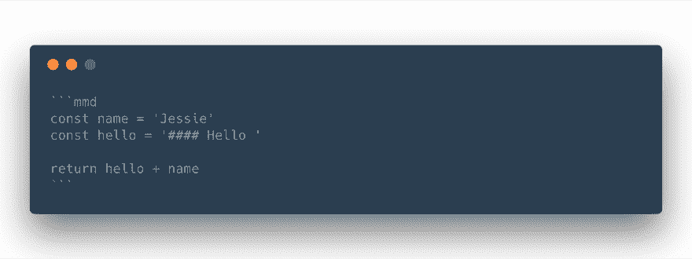

# 介绍 mmarkdown

> 原文：<https://dev.to/albinotonnina/introducing-mmarkdown-1dn6>

[T2】](https://res.cloudinary.com/practicaldev/image/fetch/s--yd83D-Ky--/c_limit%2Cf_auto%2Cfl_progressive%2Cq_auto%2Cw_880/https://thepracticaldev.s3.amazonaws.com/i/cj9imhfqpbj965ceysk0.png)

# 降低咖啡因的摄入量。

你曾经想要从你的减价文件中得到更多吗？

介绍[降价](https://github.com/albinotonnina/mmarkdown)。

Mmarkdown 获取一个普通的 markdown 文件并生成它的副本。

当您添加语言标识符设置为`mmd`的[防护代码块](https://help.github.com/articles/creating-and-highlighting-code-blocks/)时，它开始变得不那么无聊了。

例如:

[T2】](https://res.cloudinary.com/practicaldev/image/fetch/s--6HXCevYf--/c_limit%2Cf_auto%2Cfl_progressive%2Cq_auto%2Cw_880/https://thepracticaldev.s3.amazonaws.com/i/52pfcbjdc35e8zdhftsb.png)

将输出:

#### 你好杰西

## 工作原理

从代码块中返回的所有内容(作为字符串)都将被解释并替换到输出文件中的代码块中。

它是完全异步的，这很酷，*许多`awaits`在那里等着你*，但是很快你就会面临一个问题:在一个 markdown 文件中写太多代码！可怕的经历！

mmarkdown 中的解决方案在`scripts`选项中。
你可以将你的应用中的一个 javascript 模块的路径传递给 mmarkdown 命令。
脚本文件返回的模块将被传递到 fenced 块的上下文中，例如:

本区块:

```
//scripts is passed

const array = [1, 3, 5]

const something = await scripts.processMyArray(array)

const myFinalString = something.map(item => '#### ' + item.name)
  .join('\n\n')

return myFinalString 
```

Enter fullscreen mode Exit fullscreen mode

而这个脚本文件:

```
 module.exports = {
  processMyArray: async array =>
    new Promise(resolve => {
      setTimeout(() => {
        resolve(
          array.map(item => ({
            name: item + ' async'
          }))
        )
      }, 1000)
    })
} 
```

Enter fullscreen mode Exit fullscreen mode

将输出:

#### 1 个异步

#### 3 异步

#### 5 个异步

(setTimeout 仅用于演示目的)

### 备份

默认情况下，`backup`选项为 false，它将复制当前输出文件，用时间戳作为后缀，并将其移动到`backupPath`中。

### 你能想象这有什么用吗？

[T2】](https://i.giphy.com/media/6heBQSjt2IoA8/giphy.gif)

分享到评论里吧！

感谢阅读！

别忘了在 [Twitter](https://twitter.com/albinotonnina) 上加我好吗？:)