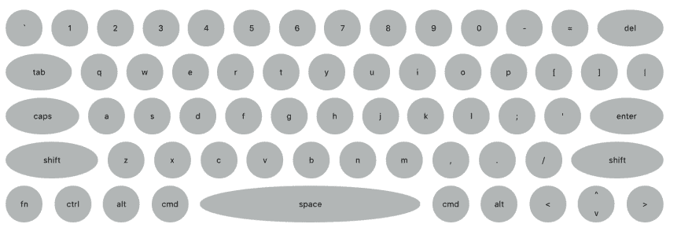

# 介绍 React 屏幕键盘

> 原文：<https://dev.to/rakannimer/introducing-react-onscreen-keyboard-36fc>

我需要一个可定制的屏幕键盘组件，用于我正在摆弄的一个音乐项目。

于是我建造了 [`react-onscreen-keyboard`](https://github.com/rakannimer/react-onscreen-keyboard)

[T2】](https://res.cloudinary.com/practicaldev/image/fetch/s--GlpChTBX--/c_limit%2Cf_auto%2Cfl_progressive%2Cq_auto%2Cw_880/https://raw.githubusercontent.com/rakannimer/react-onscreen-keyboard/master/example.png)

你可以通过渲染`Keyboard`得到一个基本的键盘布局，不需要任何道具

```
import OnscreenKeyboard from 'react-onscreen-keyboard'

const App = () => <OnscreenKeyboard /> 
```

但是您可以随意扩展这个组件！

## 支持的道具:

```
 export type KeyboardProps = {
  width?: number;
  height?: number;
  keyWidth?: number;
  rowHeightPercent?: number;
  rowWidthPercent?: number;
  verticalMargin?: number;
  horizontalMargin?: number;
  overrides?: Map<
    string,
    (
      props: {
        val: KeyboardKeyVal;
        rowHeight: number;
      }
    ) => any
  >;
  keyboardKeys?: KeyboardKeyVal[][];
  renderKey?: (p: KeyboardKeyProps) => any;
  rowStyle?: React.CSSProperties;
  keyStyle?: React.CSSProperties;
};

export type KeyboardKeyVal = {
  value: string | string[];
  id: string | string[];
  width: number;
  // https://developer.mozilla.org/en-US/docs/Web/API/KeyboardEvent/code
  code: KeyboardEvent["code"] | KeyboardEvent["code"][];
}; 
```

如果你需要一个屏幕键盘，一定要看看:

*   [代码](https://github.com/rakannimer/react-onscreen-keyboard)
*   [带按键的 CodeSandbox 演示](https://codesandbox.io/s/qx5yyrm87q)

干杯！