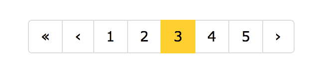
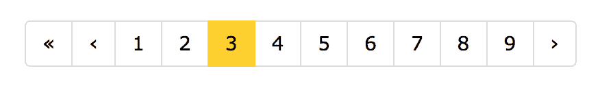

# 介绍 React 分页🎉🎉🎉

> 原文：<https://dev.to/dzungnguyen179/introducing-react-paginating---1126>

[反应分页](https://github.com/ChoTotOSS/react-paginating)组件。

[T2】](https://res.cloudinary.com/practicaldev/image/fetch/s--H8lobXcY--/c_limit%2Cf_auto%2Cfl_progressive%2Cq_66%2Cw_880/https://cdn-images-1.medium.com/max/1600/1%2A_O4M_FFMdoj3VkqZ6EMMAQ.gif)

有一些流行的组件可以帮助我们解决分页问题，比如 [react-paginate](https://github.com/AdeleD/react-paginate) 、[react-pager](https://github.com/AZaviruha/pager)……现在又有了一个。这叫做[反应——用不同的方法分页](https://github.com/ChoTotOSS/react-paginating)。

# “反应-分页”有何不同

**【react-paginating】**使用 [Render Props](https://reactjs.org/docs/render-props.html) 模式，该模式允许组件向外部发布任何变量、状态或函数，作为函数的输入参数，该函数将用于处理逻辑和呈现 UI。

以下是一些不同之处:

*   输入道具。
*   受控道具。
*   子回调函数。
*   灵活的用户界面。

## 输入道具

我们尽量减少您传递给“反应-分页”的属性的数量，有几个原因:

*   让代码更具可读性。
*   容易记住的道具。
*   不要花太多时间阅读文件。
*   使用方便

以下是输入属性列表:

**总计**

您的数据的总记录。您的 API 应该包含它

即:

```
{  "total":  50,  "data":  [  {  "id":  1,  "name":  "foo"  },  {  "id":  2,  "name":  "bar"  }  ]  } 
```

Enter fullscreen mode Exit fullscreen mode

**极限值**

根据限制，您希望拥有多少页面。计算总页数的公式:

```
const totalPages = Math.ceil(total / limit); 
```

Enter fullscreen mode Exit fullscreen mode

**页数**

您想要显示多少页。

即:

页数= 5

[T2】](https://res.cloudinary.com/practicaldev/image/fetch/s--pqqntBjb--/c_limit%2Cf_auto%2Cfl_progressive%2Cq_auto%2Cw_880/https://cdn-images-1.medium.com/max/1600/1%2A_peOMEb0O-zkS1AZ9VoU3w.png)

页数= 9

[T2】](https://res.cloudinary.com/practicaldev/image/fetch/s--idCm8dHh--/c_limit%2Cf_auto%2Cfl_progressive%2Cq_auto%2Cw_880/https://cdn-images-1.medium.com/max/1600/1%2AJtcj5soI7RwOGH9RK6d2Yg.png)

**当前页面**

您当前正在访问的页面。你可以从你的**“查询字符串”**或者**“状态”**中传递。你可以在这里看到例子[。](https://github.com/ChoTotOSS/react-paginating/tree/master/examples)

## 受控道具

收到输入道具后。该组件计算并发布允许控制 UI 的属性。以下是公共道具列表:

*   页
*   当前页面
*   前一页
*   nextPage 公司
*   总页数
*   hasNextPage
*   hasPreviousPage

下面是它在代码
中的样子

```
<Pagination total={total} limit={limit} pageCount={pageCount} currentPage={currentPage}>
  {({
    pages,
    currentPage,
    hasNextPage,
    hasPreviousPage,
    previousPage,
    nextPage,
    totalPages,
    getPageItemProps
  }) => (
    <div>
      <a href="/?page=1">first</a>
      {hasPreviousPage && <a href={`/?page=${previousPage}`}>{'<'}</a>}
      {pages.map(page => {
        return (
          <a
            key={page}
            style={currentPage === page ? { backgroundColor: '#fdce09' } : null}
            href={`/?page=${page}`}
          >
            {page}
          </a>
        );
      })}
      {hasNextPage && <a href={`/?page=${nextPage}`}>{'>'}</a>}
      <a href={`/?page=${totalPages}`}>last</a>
    </div>
  )}
</Pagination> 
```

Enter fullscreen mode Exit fullscreen mode

## 子回调函数

如果对 state 使用分页，并且没有对查询字符串进行更新。你可以使用这个回调函数传递给你的控件。

```
{pages.map(page => {
  return (
    <button
      key={page}
      style={currentPage === page ? { backgroundColor: '#fdce09' } : null}
      {...getPageItemProps({
        pageValue: page,
        onPageChange: this.handlePageChange
      })}
    >
      {page}
    </button>
  );
})} 
```

Enter fullscreen mode Exit fullscreen mode

## 灵活的 UI

通过使用函数作为子组件模式。我们可以完全控制 UI 组件。看一看:

```
{pages.map(page => {
  return (
    <a
      key={page}
      style={currentPage === page ? { backgroundColor: '#fdce09' } : null}
      href={`/?page=${page}`}
    >
      {page}
    </a>
  );
})} 
```

Enter fullscreen mode Exit fullscreen mode

```
import CustomAnchor from './component/CustomAnchor';

{pages.map(page => {
  return (
    <CustomAnchor
      key={page}
      style={currentPage === page ? { backgroundColor: '#fdce09' } : null}
      href={`/?page=${page}`}
    >
      {page}
    </CustomAnchor>
  );
})} 
```

Enter fullscreen mode Exit fullscreen mode

在上面的例子中显示我们可以创建组件然后替换。在那之后，你可以把你的放在你的"[故事书](https://github.com/storybooks/storybook)或者组件管理器的某个地方。

# 演示

可以查看一个基本演示:[https://codesandbox.io/s/z2rr7z23ol](https://codesandbox.io/s/z2rr7z23ol)

# 结论

如果你看到它对你有用。请给 react-paging[一颗星🌟](https://github.com/ChoTotOSS/react-paginating/stargazers)、[一块手表👀](https://github.com/ChoTotOSS/react-paginating/watchers)和[一试😎](https://codesandbox.io/s/z2rr7z23ol)。

或者您是否看到任何问题或改进。[欢迎公关](https://github.com/ChoTotOSS/react-paginating/pulls)。

原文章[此处](https://medium.com/@nndung179/introducing-react-paginating-9128f30f1f6b)。

谢谢！