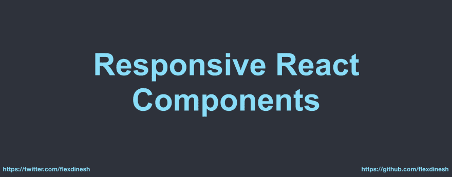

# 引入响应式 React 组件🔥

> 原文：<https://dev.to/flexdinesh/introducing-responsive-react-components--1a6a>

[T2】](https://res.cloudinary.com/practicaldev/image/fetch/s--bFlNNeXQ--/c_limit%2Cf_auto%2Cfl_progressive%2Cq_auto%2Cw_880/https://image.ibb.co/hXCL70/responsive-react-banner.png)

**TL；博士** - *你可以在 React 中用一行程序渲染视口特定的组件*

React 很牛逼，全世界一致同意。当我们把一切都看作组件时，开发会快得多，也容易得多。因为一切都是 JavaScript 驱动的， **React 只根据应用程序的状态**呈现必要的代码。即使你有超过一千个组件和数万行代码也没关系。**如果你[延迟加载](https://medium.freecodecamp.org/how-to-use-react-lazy-and-suspense-for-components-lazy-loading-8d420ecac58)你的组件，你只加载用户需要的，我认为这是使用 React** 的最大好处。

也就是说，您有没有想过在 React 代码库中编写媒体查询时会发生什么？

你渲染不应该出现在特定视窗中的元素，并使用 css 将其隐藏。

在本例中

```
import React from 'react';
import './Example.style.scss';

const Example = () => {
  return (
    <div className="example">
      <div className="mobile-only">I'm a fancy mobile div</div>
      <div className="desktop-only">I'm a heavy desktop div</div>
    </div>
  );
}; 
```

Enter fullscreen mode Exit fullscreen mode

`Example.style.scss`文件

```
.example {
  .mobile-only {
    @media (min-width: 768px){
      display: none;
    }
  }
  .desktop-only {
    @media (max-width: 767px){
      display: none;
    }
  }
} 
```

Enter fullscreen mode Exit fullscreen mode

当`Example`组件渲染时，**`.mobile-only`和`.desktop-only`元素**都将在 DOM 中渲染**，而`.mobile-only` div 将在较大的视口中隐藏，`.desktop-only` div 将在较小的视口中用 css `display: none`隐藏。**

 **如果这是小的，这是没问题的。但是在我工作的一个项目中，我们有一个沉重的桌面菜单和一个沉重的移动菜单，两者都呈现在所有的视口中。**只有`Menu`大小应该在`20Kb`左右**，我们很容易为每个用户在浏览器中加载一个不需要的`20Kb`。如果您有更多的视口特定元素，这个大小将继续增加。

# 介绍 React 袜子

[React Socks](https://github.com/flexdinesh/react-socks) 是一个**最小 React 库**用于**基于视口**渲染组件。

向媒体提问说再见。下面是你如何用一个超级酷的语法来渲染特定于视口的组件。

```
const Example = () => {
  return(
    <Breakpoint small down>
      <MyAwesomeMobileMenu>
        This component will render only in mobile devices
      </MyAwesomeMobileMenu>
    </Breakpoint>
  );
}; 
```

Enter fullscreen mode Exit fullscreen mode

```
const Example = () => {
  return(
    <div>
      <Breakpoint small down>
        <div>I will render only in mobile devices</div>
      </Breakpoint>

      <Breakpoint medium only>
        <div>I will render only in tablets (iPad, etc...)</div>
      </Breakpoint>

      <Breakpoint large up>
        <div>I will render in laptops, desktops and everything bigger</div>
      </Breakpoint>
    </div>
  );
}; 
```

Enter fullscreen mode Exit fullscreen mode

不仅如此。**你可以指定自己的断点**(想要多少有多少**哇！**)并根据您的项目需求使用它们**。此外，在你的项目中，你只需要`setDefaultBreakpoints`一次😎** 

```
import { setDefaultBreakpoints } from 'react-socks';

setDefaultBreakpoints([
  { xs: 0 },
  { s: 376 },
  { m: 426 },
  { l: 769 },
  { xl: 1025 }
]); 
```

Enter fullscreen mode Exit fullscreen mode

这些是我最喜欢的断点

```
setDefaultBreakpoints([
  { cats: 0 },
  { dinosaurs: 900 }
]);

<Breakpoint cats only>
    Only cats can render me 🐈
</Breakpoint> 
```

Enter fullscreen mode Exit fullscreen mode

#### 你应该使用[反应袜的理由](https://github.com/flexdinesh/react-socks)

*   **轻松渲染视口特定的**组件
*   你可以定义自己的断点并使用它们
*   如果你延迟加载你的视口特定组件，你可以提高你的应用性能
*   更简单、更甜蜜的**语法**便于使用

该库已经发布到 [npm](https://www.npmjs.com/package/react-socks) 并且是 alpha 版本。我很乐意在发布第一个稳定版本之前得到您的反馈并改进它。

*编辑:第一个稳定版本已于 2018 年 12 月 9 日发布，具有性能改进和 SSR 支持。*🎉

如果你想知道**为什么反应袜这个名字**🤷‍♂️

**[React Socks](https://github.com/flexdinesh/react-socks)** 舒适地包裹你的组件以防止在各种视口中不必要的渲染，就像你如何用袜子包裹你的脚以防止临阵退缩一样🎉

让我们穿上一些花哨的反应袜并包好所有的部件🔥

你太棒了！祝您愉快！⚡️****