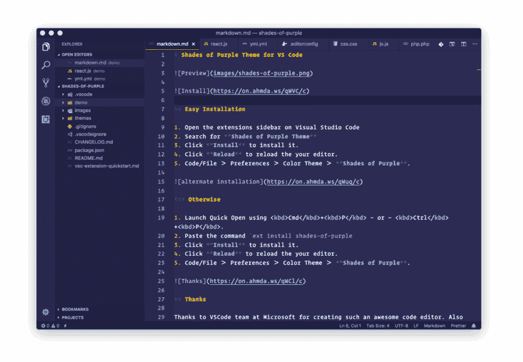

# 大胆的新 VSCode 主题—紫色阴影💜🦄⚛

> 原文：<https://dev.to/vscode/introducing-vscode-theme-shades-of-purple--33me>

[T2】](https://res.cloudinary.com/practicaldev/image/fetch/s--V2cLUfXp--/c_limit%2Cf_auto%2Cfl_progressive%2Cq_66%2Cw_880/https://thepracticaldev.s3.amazonaws.com/i/0tuv1vf7ql1r9asxqxj8.gif)

## [深浅不一的紫色主题为 VS 代号](http://Ahmda.ws/VSCSOP)

💜我非常兴奋地发布我的新紫色视觉工作室代码主题，名为→ [紫色阴影](http://Ahmda.ws/VSCSOP)(SOP)——它包括手工挑选的&大胆的紫色阴影🦄因为紫色可以是天才。

{#twitter 983398087711485953 %}

### 一周统计数据:

👉下载[紫色](http://Ahmda.ws/VSCSOP)T2】🎩由大约 500 多名开发人员使用(2 天前发布)
🌟18+五星评级
💥VSCode 提示:[http://VSCode.pro/tip/1](http://VSCode.pro/tip/1)
✅也可用于 slack/# ITER m2/# hyper/konsole/Alfred app

| **`Shades of Purple (SOP)`**
专业主题搭配精挑细选&大胆色调的紫色💜来配合你的 VS 代码。带有风格的自定义 VS 代码主题。我还将推出一门关于 VSCode 的课程，帮助你成为一名 [Visual Studio 高级代码用户→](https://VSCode.pro/) |
| Ahmad Awais 开发的一个自由开源软件项目。 |
| <sup>关注 Ahmad 在 GitHub 上的#FOSS 作品[@ Ahmad awais](https://github.com/ahmadawais)——说👋在推特上[@ MrAhmadAwais](https://twitter.com/mrahmadawais/)T5】</sup> |

| [T2】](https://marketplace.visualstudio.com/items?itemName=ahmadawais.shades-of-purple) | [T2】](https://marketplace.visualstudio.com/items?itemName=ahmadawais.shades-of-purple) | [T2】](https://marketplace.visualstudio.com/items?itemName=ahmadawais.shades-of-purple#review-details) |
| --- | --- | --- |
| [T2】](https://github.com/ahmadawais/shades-of-purple-vscode/stargazers) | [T2】](https://github.com/ahmadawais?tab=followers) | [T2】](https://twitter.com/mrahmadawais/) |

[T2】](https://res.cloudinary.com/practicaldev/image/fetch/s--ciWRKqUw--/c_limit%2Cf_auto%2Cfl_progressive%2Cq_auto%2Cw_880/https://on.ahmda.ws/qWVC/c)

## 安装方便

1.  打开 Visual Studio 代码上的扩展侧栏
2.  搜索**紫色主题**
3.  点击**安装**进行安装。
4.  点击**重新加载**来重新加载你的编辑器。
5.  代码/文件>首选项>颜色主题>**紫色阴影**。

[T2】](https://res.cloudinary.com/practicaldev/image/fetch/s--ivQEYlGI--/c_limit%2Cf_auto%2Cfl_progressive%2Cq_auto%2Cw_880/https://on.ahmda.ws/qWuq/c)

## 交替安装

1.  使用`Cmd` + `P` —或— `Ctrl` + `P`启动快开。
2.  粘贴命令`ext install shades-of-purple`
3.  点击**安装**进行安装。
4.  点击**重新加载**来重新加载你的编辑器。
5.  代码/文件>首选项>颜色主题>**紫色阴影**。

[T2】](https://res.cloudinary.com/practicaldev/image/fetch/s--z6kRfOPT--/c_limit%2Cf_auto%2Cfl_progressive%2Cq_auto%2Cw_880/https://on.ahmda.ws/qVjy/c)

## 最佳自定义设置！

此主题在下列设置下效果最佳。尤其是如果你有运营商单声道字体。将其添加到您的用户设置 JSON 对象中。

你也可以使用一个定制的 [VSCode 紫色图标](https://raw.githubusercontent.com/ahmadawais/shades-of-purple-vscode/mastimg/logo.png)，这是我根据令人惊叹的设计师达尼斯的作品制作的，名为 [VSCode 图标](https://github.com/dhanishgajjar/vscode-icons#how-to-install)。

```
 // Theme Setup.
  "workbench.colorTheme": "Shades of Purple",
  "workbench.iconTheme": "vscode-icons",
  "editor.fontFamily": "Operator Mono, Menlo, Monaco, 'Courier New', monospace",
  "terminal.integrated.fontFamily": "'Operator Mono', 'Inconsolata for Powerline', monospace",
  "editor.fontSize": 17,
  "editor.lineHeight": 24.65,
  "editor.letterSpacing": 0.5,
  "editor.fontWeight": "400",
  "editor.fontLigatures": true,
  "editor.cursorStyle": "line",
  "editor.cursorWidth": 5,
  "editor.cursorBlinking": "solid",
  "editor.renderWhitespace": "all",
  "editor.snippetSuggestions": "top",
  "workbench.startupEditor": "newUntitledFile",
  "editor.glyphMargin": true,
  "workbench.editor.enablePreview": false,
  "explorer.confirmDragAndDrop": false,
  "files.trimTrailingWhitespace": true,
  "files.trimFinalNewlines": true,
  // Formatting Optional.
  "editor.formatOnSave": true,
  "prettier.eslintIntegration": true,
  "eslint.run": "onType",
  "eslint.autoFixOnSave": true,
  // MacOS Only Settings.
  "workbench.fontAliasing": "auto",
  "terminal.integrated.macOptionIsMeta": true,
  "workbench.statusBar.feedback.visible": false, 
```

💜我将在 [VSCode.pro](https://VSCode.pro/) 上讲授更多关于配置这个主题和你的 Visual Studio 代码编辑器的内容。感兴趣吗？！报名成为 [VSCode 超级用户](https://VSCode.pro/) →

[T2】](https://res.cloudinary.com/practicaldev/image/fetch/s--TvefSesq--/c_limit%2Cf_auto%2Cfl_progressive%2Cq_auto%2Cw_880/https://on.ahmda.ws/qYAe/c)

## 把`Shades of Purple`放到其他地方！

我已经为不同的软件建立了其他的`Shades of Purple`主题。这里有一个列表。

*   💜 [VSCode 主题](https://github.com/ahmadawais/shades-of-purple-vscode) —紫色阴影
*   💜 [iTerm2 主题](https://github.com/ahmadawais/shades-of-purple-iterm2) —紫色的阴影
*   💜 [Hyper 主题](https://github.com/ahmadawais/shades-of-purple-hyper) —紫色阴影
*   💜 [Konsole 主题](https://github.com/ahmadawais/shades-of-purple-konsole) —紫色色调
*   💜[松弛主题](https://github.com/ahmadawais/shades-of-purple-slack) —紫色的阴影
*   💜阿尔弗雷德主题 —紫色的阴影

[T2】](https://res.cloudinary.com/practicaldev/image/fetch/s--eEzZyH42--/c_limit%2Cf_auto%2Cfl_progressive%2Cq_auto%2Cw_880/https://on.ahmda.ws/os6O/c)

#### **你好，我们是 [WordPress 夫妇](https://WPCouple.com)** ！

我( [Ahmad Awais](https://twitter.com/mrahmadawais/) )是一名完整的网络开发人员，也是 WordPress 的定期核心贡献者。我的另一半([梅达哈·巴图尔](https://twitter.com/MaedahBatool/))是一名技术项目经理，她也是 WordPress 的核心贡献者。我们和我们的[团队](https://WPCouple.com/team)一起运营[WPCouple.com](https://WPCouple.com/)。

如果你想深入了解我们对开源软件、专业全栈开发、WordPress 社区、JavaScript 的发展或成家、创业的热爱，那么就订阅我们名为↣ [The WordPress Takeaway](https://WPTakeaway.club) 的优质简讯吧！

#### [**支持我们的开源项目！**](https://pay.paddle.com/checkout/515568) 🎩

如果你希望我们继续生产专业的自由和开源软件(FOSS)。考虑为我一小时的开发时间付费。我们将花两个小时在每个贡献的开源上。是的，没错，你付了一个小时的钱，然后让我们俩花一个小时作为感谢。

[T2】](https://res.cloudinary.com/practicaldev/image/fetch/s--IlF-Ye0t--/c_limit%2Cf_auto%2Cfl_progressive%2Cq_auto%2Cw_880/https://on.ahmda.ws/orkW/c)

## 执照&归属

被授权为麻省理工学院的ⓒ [艾哈迈德·阿瓦斯](https://AhmadAwais.com/)。

感谢微软的 VSCode 团队创造了这么棒的代码编辑器。也是对其他高对比度主题的创造者的一种鼓舞。这个主题从许多 VSCode 主题中获得灵感，包括但不限于 Roberto Achar 的钴主题、Ayu、Palenight 主题、Dracula 主题等。谢谢，Dhanish 为可怕的 VSCode 图标。和 Icons8 了解本自述文件中的图标。

*说👋在推特上→[@ MrAhmadAwais](https://twitter.com/mrahmadawais/)T3】*