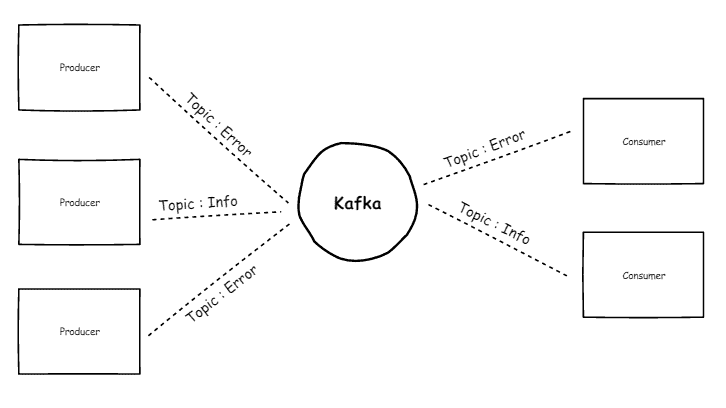
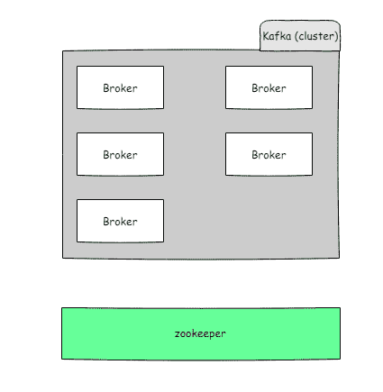

# apache kafka 简介

> 原文：<https://dev.to/anthonydasse/introduction-a-apache-kafka-7m8>

这篇文章(和他未来的小弟弟)旨在介绍卡夫卡的用法。

在前几部分，我将尽量简化 apache kafka 的概念(这可能会让人震惊……)。

#### **Apache Kaka**

apache kafka 是一个分布式消息系统。后者是 opensource，并获得 Apache 许可。Linkedin 将其置于 opensource 的旗帜下，而 LinkedIn 继续为其发展做出贡献。

与其他信息系统相比，kafka 提供的信息往往更多。

它无疑是管理企业信息的最合适、最受欢迎的工具之一。

使用这样一种工具(其竞争对手也是如此)，从 SI 公司(或您的应用程序)中删除最重的东西之一:**成员** 。

信息必须发送到组件`C`和应用`A`这一事实，给应用程序的轻松发展带来了真正的问题。

分布式报文的概念很简单，我是`X`组件，我做我的工作，通过报文通知我的环境。对我的消息感兴趣的组件或应用程序将检索该消息并使用。就我们而言，`X`组件不知道向谁发送消息。

#### **快速概念**

因此，kafka 允许处理消息。

这些消息由消息生成者(消息生成者)发送。

给定的信息是关于一个主题的，卡夫卡把它称为一个主题。

消费者(消息使用者)对一个或多个主题感兴趣，因此订阅主题。因此，他将收到有关这些著名主题的所有消息。

[T2】](https://res.cloudinary.com/practicaldev/image/fetch/s--qAI-Wznn--/c_limit%2Cf_auto%2Cfl_progressive%2Cq_auto%2Cw_880/https://cdn-images-1.medium.com/max/726/1%2A3xMMAnMHfY5R4e4gxYTAKQ.png)

卡夫卡是一个由经纪人组成的群集。

*经纪人是什么？*

它只是卡夫卡服务器的一个实例。

因此，通过实例化 Kaka 服务，很容易形成 Kaka 集群。

[T2】](https://res.cloudinary.com/practicaldev/image/fetch/s--88r_vafy--/c_limit%2Cf_auto%2Cfl_progressive%2Cq_auto%2Cw_880/https://cdn-images-1.medium.com/max/425/1%2A3osCkvu1FNU2djmv8ov2_A.png)

这种群集管理有助于改进数据分区和复制。

*有什么用处？*

当数据量增加时，分区很重要。

通过在主题上使用双重分区，可以通过添加消费者来提高消息读取的“吞吐量”。因此，消费者将处理一个主题的分区。

数据复制在群集系统中非常普遍。

请记住，如果运行 crash 服务的服务器丢失数据，kafka 实例将保留消息。使用复制可确保数据在一台或多台其他服务器上可用。

如果消息数量增加或要加快处理速度，这也使 kafka 变得容易。

这就是悲剧所在。卡夫卡怎样管理这个小世界？

它基于 Apache Zookeeper(在分布式系统中广泛使用)。简单来说，动物园管理员让我们知道哪里有服务卡夫卡只问:“嘿，我的经纪人 1 在哪里”。(我真的简化了概念。)。

#### 报文的存储

好消息是 kafka 在存储消息。

此存储基于一个名为:**log **的数据结构

…与可用于 log4j 的应用程序或技术日志无关。

这是一个有序消息的数组。

从消息到达之日起执行调度。

每条信息都有索引，卡夫卡称之为偏移。

> 消息保留可以在 kafka 群集配置(大小限制或时间限制)中进行管理。