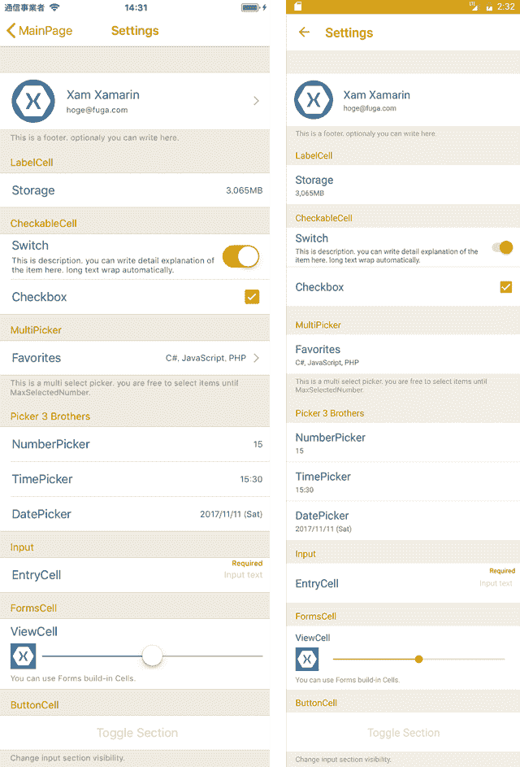

# Xamarin 的设置视图介绍。形式

> 原文：<https://dev.to/muak_x/introduction-of-settingsview-for-xamarinforms-4mf4>

虽然 Xamarin。Forms TableView 很有用，内置单元格不够。所以我总是使用 ViewCell，但这让应用程序的性能更差。

为了解决这个问题，我制作了一些自定义的原生单元格和一个自定义的 TableView 来有效地处理这些单元格。

这个库名为 AiForms。NuGet 上有 SettingsView。

## 来源

[https://github.com/muak/AiForms.Renderers](https://github.com/muak/AiForms.Renderers)

## Nuget

[https://www.nuget.org/packages/AiForms.SettingsView/](https://www.nuget.org/packages/AiForms.SettingsView/)

## settings view 能做什么。

### 通用

*   设置分隔符颜色。
*   设置选定单元格的颜色。
*   滚动到屏幕顶部和底部。

### 章节

*   将 IsVisible 设置为每个部分。
*   设置节的页脚。
*   设置页眉和页脚的各种选项。
*   在节中使用 DataTemplate 和 DataTemplateSelector。
*   通过在节中拖放来重新排序项目。

### 细胞

*   将所有单元格的选项设置为设置一次查看选项。
*   设置单个单元格选项。(单个单元格选项优于设置视图选项。)
*   设置单元格提示文本。
*   在所有单元格中使用缓存在内存中的图标。
*   改变图标的圆角半径。
*   使用各种定义的单元格。
*   使用 Xamarin。Forms.ViewCell 和其他。

有关设置视图的更多信息，请参见 [ReadMe.md](https://github.com/muak/AiForms.Renderers/blob/master/README.md) 。

[T2】](https://res.cloudinary.com/practicaldev/image/fetch/s--7Tf4xs-4--/c_limit%2Cf_auto%2Cfl_progressive%2Cq_auto%2Cw_880/https://thepracticaldev.s3.amazonaws.com/i/1xildlb0rxjqpn28467t.png)

[https://www.youtube.com/embed/FTMOqNILxBE](https://www.youtube.com/embed/FTMOqNILxBE)

## 内置单元格

*   LabelCell -显示只读文本的单元格。
*   CommandCell -标签单元格调用了一个操作。
*   button cell——一个简单的单元格调用一个类似按钮的动作。
*   开关电池-一种装有开关的标签电池
*   CheckboxCell -一个带有复选框的标签。
*   一个标签单元调用一个数字选择器。
*   调用时间选择器的标签单元格。
*   调用日期选择器的标签单元。
*   调用文本选择器的标签单元。
*   PickerCell -调用多选选择器的标签单元。
*   输入一些文本的单元格。

有关内置单元格的更多信息，请参见 [ReadMe.md](https://github.com/muak/AiForms.Renderers/blob/master/README.md#cells-1) 。

## 安装

```
Install-Package AiForms.SettingsView 
```

您需要将这个 nuget 包安装到 PCL/。NETStandard 项目和每个平台项目。

### 为 iOS 项目

要供 iOS 使用，需要在 AppDelegate.cs 中编写一些代码。

```
public override bool FinishedLaunching(UIApplication app, NSDictionary options) {
    global::Xamarin.Forms.Forms.Init();

    AiForms.Renderers.iOS.SettingsViewInit.Init(); //need to write here

    LoadApplication(new App(new iOSInitializer()));

    return base.FinishedLaunching(app, options);
} 
```

## 如何用 xaml 写

```
<ContentPage 
    xmlns="http://xamarin.com/schemas/2014/forms" 
    xmlns:x="http://schemas.microsoft.com/winfx/2009/xaml" 
    xmlns:sv="clr-namespace:AiForms.Renderers;assembly=SettingsView"
    x:Class="Sample.Views.SettingsViewPage">

<sv:SettingsView HasUnevenRows="true">

    <sv:Section Title="Header1" FooterText="Footer1">
        <sv:CommandCell IconSource="icon.png" IconSize="60,60" IconRadius="30"
            Title="Xam Xamarin" Description="hoge@fuga.com"
            Command="{Binding ToProfileCommand}" CommandParameter="{Binding Parameter}"
            KeepSelectedUntilBack="true"            
        />
        <sv:ButtonCell Title="Toggle Section" TitleColor="{StaticResource TitleTextColor}"
             TitleAlignment="Center" Command="{Binding SectionToggleCommand}" />
        <sv:LabelCell Title="Label" ValueText="value" />
        <sv:SwitchCell Title="Switch" On="true" 
            Description="This is description." />
        <sv:CheckboxCell Title="Checkbox" Checked="true" />
    </sv:Section>

    <sv:Section Title="Header2" FooterText="Footer2" IsVisible="{Binding SctionIsVisible}">
        <sv:PickerCell Title="Favorites" ItemsSource="{Binding ItemsSource}" DisplayMember="Name" MaxSelectedNumber="3" 
        SelectedItems="{Binding SelectedItems}" KeepSelectedUntilBack="true" PageTitle="select 3 items" />
        <sv:NumberPickerCell Title="NumberPicker" Min="0" Max="99" Number="15" PickerTitle="Select number" />
        <sv:TimePickerCell Title="TimePicker" Format="HH:mm" Time="15:30" PickerTitle="Select time" />
        <sv:DatePickerCell Title="DatePicker" Format="yyyy/MM/dd (ddd)" Date="2017/11/11" MinimumDate="2015/1/1" MaximumDate="2018/12/15" TodayText="Today's date"/>
        <sv:EntryCell Title="EntryCell" ValueText="{Binding InputText.Value}" Placeholder="Input text" Keyboard="Email" TextAlignment="End" HintText="{Binding InputError.Value}" />
    </sv:Section>

</sv:SettingsView>
</ContentPage> 
```

设置视图属性设置也可以写入 App.xaml.
例如...

```
<Application xmlns="http://xamarin.com/schemas/2014/forms"
             xmlns:x="http://schemas.microsoft.com/winfx/2009/xaml"
             xmlns:sv="clr-namespace:AiForms.Renderers;assembly=SettingsView"
             x:Class="Sample.App">
    <Application.Resources>
        <ResourceDictionary>
            <Color x:Key="AccentColor">#FFBF00</Color>
            <Color x:Key="DisabledColor">#E6DAB9</Color>
            <Color x:Key="TitleTextColor">#CC9900</Color>
            <Color x:Key="PaleBackColorPrimary">#F2EFE6</Color>
            <Color x:Key="PaleBackColorSecondary">#F2EDDA</Color>
            <Color x:Key="DeepTextColor">#555555</Color>
            <Color x:Key="NormalTextColor">#666666</Color>
            <Color x:Key="PaleTextColor">#999999</Color>
            <x:Double x:Key="BaseFontSize">12</x:Double>
            <x:Double x:Key="BaseFontSize+">14</x:Double>
            <x:Double x:Key="BaseFontSize++">17</x:Double>
            <x:Double x:Key="BaseFontSize-">11</x:Double>

            <Style TargetType="sv:SettingsView">
                <Setter Property="SeparatorColor" Value="{StaticResource DisabledColor}" />
                <Setter Property="BackgroundColor" Value="{StaticResource PaleBackColorPrimary}" />
                <Setter Property="HeaderBackgroundColor" Value="{StaticResource PaleBackColorPrimary}" />
                <Setter Property="CellBackgroundColor" Value="{StaticResource AppBackground}" />
                <Setter Property="CellTitleColor" Value="{StaticResource DeepTextColor}" />
                <Setter Property="CellValueTextColor" Value="{StaticResource NormalTextColor}" />
                <Setter Property="CellTitleFontSize" Value="{StaticResource BaseFontSize++}" />
                <Setter Property="CellValueTextFontSize" Value="{StaticResource BaseFontSize}" />
                <Setter Property="CellDescriptionColor" Value="{StaticResource NormalTextColor}" />
                <Setter Property="CellDescriptionFontSize" Value="{StaticResource BaseFontSize-}" />
                <Setter Property="CellAccentColor" Value="{StaticResource AccentColor}" />
                <Setter Property="SelectedColor" Value="#50FFBF00" />
                <Setter Property="HeaderTextColor" Value="{StaticResource TitleTextColor}" />
                <Setter Property="FooterFontSize" Value="{StaticResource BaseFontSize-}" />
                <Setter Property="FooterTextColor" Value="{StaticResource PaleTextColor}" />
            </Style>
        </ResourceDictionary>
    </Application.Resources>
</Application> 
```

因此应用程序中的任何设置视图都将成为相同的属性设置。

## 总结性的

如果你能使用这个图书馆，我将不胜感激。

如果有什么问题、请求、bug 报告，请向 GitHub issues 或 twitter ( [@muak_x](https://dev.to/muak_x) )反映。

谢谢你。