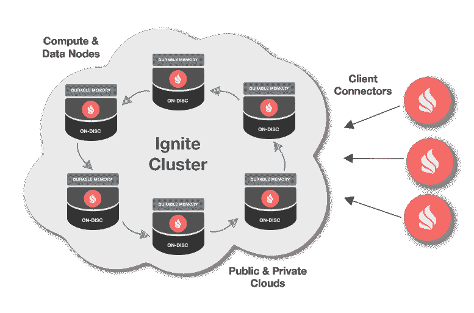

# Apache Ignite 简介

> 原文：<https://dev.to/bszeliga/introduction-to-apache-ignite-1ilk>

[T2】](https://res.cloudinary.com/practicaldev/image/fetch/s--XiroBuGt--/c_limit%2Cf_auto%2Cfl_progressive%2Cq_auto%2Cw_880/https://ignite.apache.oimg/Ignite_tm_Logo_blk_RGB.svg)

Apache Ignite 是一个分布式缓存平台，支持事务处理。它能够扩展到 1000 个节点，同时提供高速内存访问。

利用 ignite 的最简单方式是作为键值对。这使得用户可以快速启动并运行。

### 入门

Ignite 可以作为独立的应用程序执行，也可以在使用它的应用程序中执行。作为一个独立的应用程序，它必须在服务器模式下执行。这意味着它将负责存储和提供数据。然而，当在另一个应用程序中执行时，它可以在服务器或客户端模式下启动。在客户端模式下，应用程序不负责存储或提供数据。

### 配置

Ignite 在使用前有两个配置步骤。第一个是定义集群发现机制，第二个是定义缓存。

[T2】](https://res.cloudinary.com/practicaldev/image/fetch/s--yU1HEs5W--/c_limit%2Cf_auto%2Cfl_progressive%2Cq_auto%2Cw_880/https://files.readme.io/9287d3c-ignite-deploy.png)

在 Ignite 中，集群是共享包含在一个或多个缓存中的数据的一组节点。ignite 提供的用于定义集群的示例包括:

*   仅本地:群集仅是这一个节点
*   多点传送
*   服务:
*   动物园管理员

设置 Ignite 实例的最简单方法是执行以下操作:

```
 Ignite ignite = Ignition.start() 
```

这将使用系统默认值启动您的实例。

现在，一旦有了主集群实例，就可以定义缓存了。同样，许多配置值可以根据您的使用情况进行调整。一些例子包括:

*   备份号码
*   管理类型
*   驱逐类型和许多其他类型。然而，定义缓存最简单的方法是给它一个名字。

```
IgniteCache<Long, DTO> cache = ignite.createCache("SAMPLE_CACHE") 
```

### 把所有的东西放在一起

从这一点来看，使用缓存的想法取决于它必须放置的环境。作为一个例子，我组装了一个利用 Ignite [的小型 Spring Boot 应用程序。与上面的代码片段相比，没有太多额外的 Ignite 设置。](https://github.com/bszeliga/ignite-intro/tree/master/example-1/server)

### 没讨论过，但还是牛逼

Ignite 提供了许多额外的内置功能，值得一提，但上面没有讨论。其中一些引起了我的注意:

*   分布式计算
*   分布式锁
*   机器学习模块
*   分布式原子引用类型
*   服务网格
*   还有很多。

如您所见，Apache Ignite 是一个刷新缓存系统，提供了许多功能。在评估其他解决方案时，我会强烈推荐它。

#### 参考文献:

##  [ bszeliga ](https://github.com/bszeliga) / [点火-介绍](https://github.com/bszeliga/ignite-intro)

### 阿帕奇点燃了一个小操场

<article class="markdown-body entry-content container-lg" itemprop="text">

# 点火介绍

我自己做的一个简单的游乐场，用来玩 Apache Ignite。

## 描述

目的是添加小的示例应用程序，以便使用和试验 Ignite 中的功能。

### 示例 1

一个简单的 Spring Boot rest 应用程序，它访问 Ignite 并获取/设置缓存中的值。

</article>

[View on GitHub](https://github.com/bszeliga/ignite-intro)