# 乳齿象机器人简介

> 原文：<https://dev.to/botwiki/introduction-to-mastodon-bots-hfn>

**2022 年更新:**小故障[不再允许一种用于保持机器人运行其免费计划的方法](https://botwiki.org/blog/glitch-banning-use-of-pinging-services/)。当我在做本教程的更新版本时，这里有一些有用的资源可供参考:

*   我制作创意机器人的一般指南，其中也有一些乳齿象特有的技巧
*   我的[创意机器人启动项目](https://stefanbohacek.com/project/creative-bots/)让你为乳齿象、Twitter 和 Tumblr 制作机器人
*   编码列车的[乳齿象机器人视频教程系列](https://www.youtube.com/watch?list=PLRqwX-V7Uu6byiVX7_Z1rclitVhMBmNFQ&v=sKSxBd56H70)
*   [bot wiki 上的开源机器人](https://botwiki.org/bot/?networks=fediverse&opensource=true)

作为奖励，[这是我 2018 年对 botsin.space](https://botwiki.org/blog/catching-up-with-the-creator-of-botsin-space/) 创造者的采访，这是一个致力于机器人的乳齿象实例。请务必关注与 Botwiki 相关的乳齿象账户:

*   [@ bot wiki @ mastosdon . social](https://mastodon.social/@botwiki)
*   [@ newonbotwiki @ botsin . space](https://botsin.space/@newonbotwiki)
*   [@ botwikirandom @ botsin . space](https://botsin.space/@botwikirandom)

你可以在[@ Stefan @ stefanbohacek . online](https://stefanbohacek.online/@stefan)找到我。

* * *

几周前，有创意的机器人制作人从 Twitter 大规模撤离，主要是由于该平台最近的变化(嗯，[还有其他原因](https://techcrunch.com/2018/09/04/twitters-ugly-incentive/))。他们中的一些人完全放弃了制作艺术机器人，但许多人试图为他们的机器人找到一个新家。其中一些最后出现在乳齿象上。

如果你以前没有听说过乳齿象，这是一个社交网络软件，让任何人都可以拥有自己的社交网站。(也有类似的项目，比如 GNU social)。所有这些网站都可以通过所谓的 Fe diversity 连接起来。(你可以前往[维基百科](https://en.wikipedia.org/wiki/Mastodon_(software))获取更详细的描述。)

Mastodon 有一个非常容易使用的 API，所以如果你想尝试艺术创作、自然语言处理，或者制作一个有用的工具来发布天气更新或政府通过的法案，它是 Twitter 的一个很好的替代品。作为奖励，你可以很容易地获得你的机器人的帖子的 RSS 提要。

## 制作你的第一个乳齿象机器人

为你的机器人设置一个新帐户是轻而易举的事。首先，您需要选择希望您的机器人安装在哪个乳齿象实例上。我推荐 [botsin.space](https://botsin.space) ，它是专门为了运行友好的机器人而创建的。

[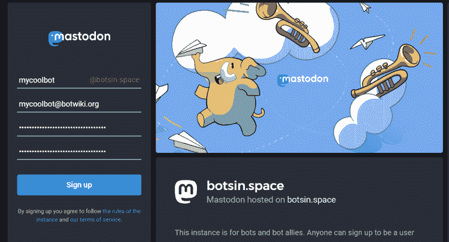T2】](https://res.cloudinary.com/practicaldev/image/fetch/s--Uug54R97--/c_limit%2Cf_auto%2Cfl_progressive%2Cq_auto%2Cw_880/https://botwiki.org/wp-content/uploads/2018/08/botsinspace-step-1.png)

确认您的电子邮件后，单击您用户名下的“编辑个人资料”链接，并勾选“这是一个机器人帐户”。

[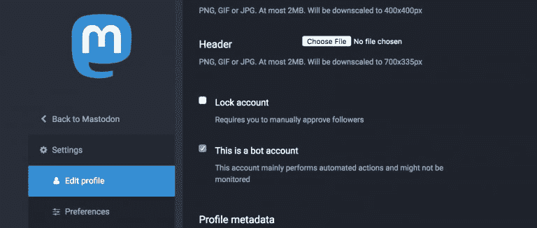T2】](https://res.cloudinary.com/practicaldev/image/fetch/s--lF0CJoXy--/c_limit%2Cf_auto%2Cfl_progressive%2Cq_auto%2Cw_880/https://botwiki.org/wp-content/uploads/2018/08/mastodon-this-is-a-bot-account-768x327.png)

之后，转到首选项页面(“cog”图标)，然后单击开发。

[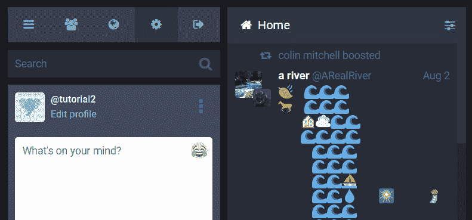T2】](https://res.cloudinary.com/practicaldev/image/fetch/s--8trl7_vJ--/c_limit%2Cf_auto%2Cfl_progressive%2Cq_auto%2Cw_880/https://botwiki.org/wp-content/uploads/2018/08/botsinspace-step-2.png)

[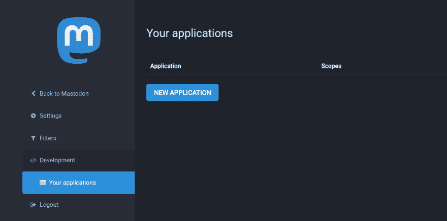T2】](https://res.cloudinary.com/practicaldev/image/fetch/s--bn_hghTs--/c_limit%2Cf_auto%2Cfl_progressive%2Cq_auto%2Cw_880/https://botwiki.org/wp-content/uploads/2018/08/botsinspace-step-3.png)

现在，单击“新建应用程序”按钮。命名您的应用程序，保持设置不变，然后单击页面底部的提交按钮。

现在，您可以单击应用程序的名称来显示 bot 的访问令牌。如果您只看到您的 API 密钥，请使用此工具来生成您的令牌。

[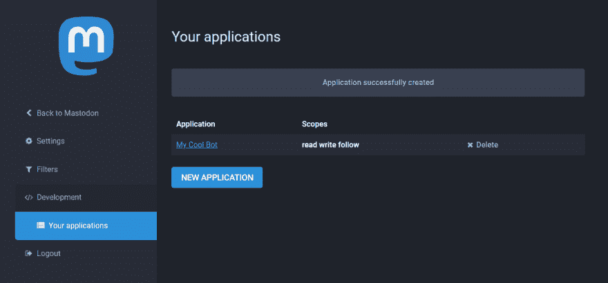T2】](https://res.cloudinary.com/practicaldev/image/fetch/s--TdJQBkxO--/c_limit%2Cf_auto%2Cfl_progressive%2Cq_auto%2Cw_880/https://botwiki.org/wp-content/uploads/2018/08/botsinspace-step-4.png)

[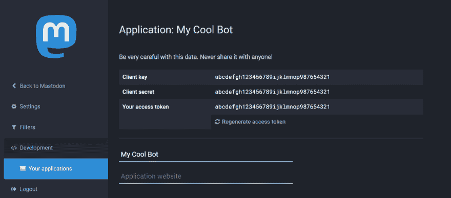T2】](https://res.cloudinary.com/practicaldev/image/fetch/s--zCDTwq9i--/c_limit%2Cf_auto%2Cfl_progressive%2Cq_auto%2Cw_880/https://botwiki.org/wp-content/uploads/2018/08/botsinspace-step-5.png)

你就完了。现在是有趣的部分。在本教程中，我将在 Glitch 上使用我的[生成艺术机器人](https://glitch.com/edit/#!/generative-art-bot)启动项目。你现在不需要注册账户，Glitch 可以让你创建临时项目来测试。

首先，点击混音按钮。

[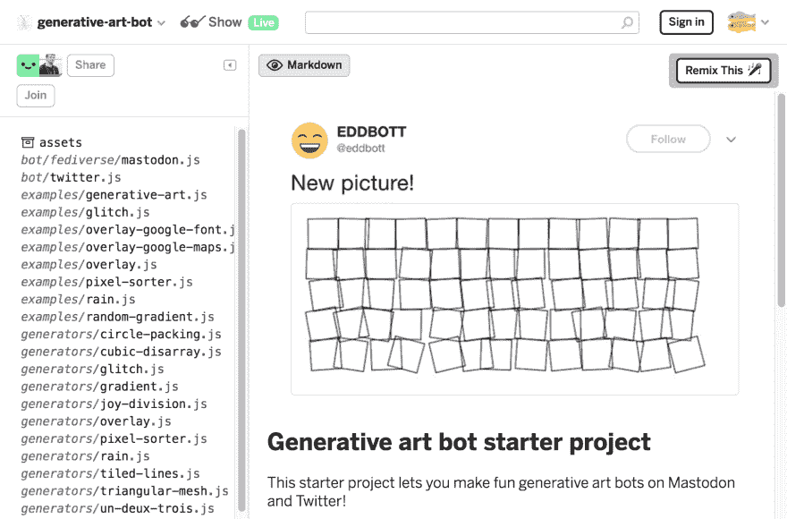T2】](https://res.cloudinary.com/practicaldev/image/fetch/s---LxyOhMD--/c_limit%2Cf_auto%2Cfl_progressive%2Cq_auto%2Cw_880/http://botwiki.org/wp-content/uploads/2018/09/generative-art-bot-glitch.png)

接下来，用您的访问令牌更新您的`.env`文件。对于`MASTODON_API`，你可以使用`https://botsin.space/api/v1/`。还要更新`BOT_ENDPOINT`的值。这可以是任何东西，例如`12345`。然后你将能够使用你的项目的 URL 和类似于[cron-job.org](https://cron-job.org/)的端点来唤醒你的机器人并做一些事情。(这部分我会在本教程后面解释。)

Glitch 项目的结构是这样的，你的机器人的代码放在`bot.js`里面。在这里，我们加载一个生成器(见`generators`文件夹)来生成我们的图像，然后我们可以在 Mastodon 或 Twitter 上分享它，或者两者都分享。

对于本教程，让我们尝试三角网格生成器。

删除您的`bot.js`文件的内容，以便我们有一个新的开始，并添加这个:

```
const helpers = require(__dirname + '/helpers.js'),
      generators = {
        triangular_mesh: require(__dirname + '/generators/triangular-mesh.js'),
      },
      mastodon = require(__dirname + '/bot/fediverse/mastodon.js'); 
```

Enter fullscreen mode Exit fullscreen mode

`helpers`是一个有一些帮助函数的模块，例如`random_from_array`，它可以让我们在每次发布时修改机器人状态消息的文本。而`color-scheme`是一个让你生成调色板的库，我们可以用它来制作我们的艺术品。

这就是连接`bot.js`文件和驱动我们的机器人的主应用程序的东西:

```
module.exports = () => {

} 
```

Enter fullscreen mode Exit fullscreen mode

当您访问 bot 的端点 URL 时，这个导出函数中的代码就会运行。

首先，让我们设置消息，让我们的机器人在发布消息时从中挑选:

```
const helpers = require(__dirname + '/helpers.js'),
      generators = {
        triangular_mesh: require(__dirname + '/generators/triangular-mesh.js'),
      },
      mastodon = require(__dirname + '/bot/fediverse/mastodon.js');

module.exports = () => {
  const status_text = helpers.random_from_array([
    'Check this out!',
    'New picture!',
    'Just look at that!'
  ]);
} 
```

Enter fullscreen mode Exit fullscreen mode

接下来，我们需要一些颜色。我打算用 colourlovers.com[的](http://www.colourlovers.com/)[花瓣](http://www.colourlovers.com/palette/4594645/petals)配色。我将让机器人发布大小为 1200x500px 的图像。

```
const helpers = require(__dirname + '/helpers.js'),
    generators = {
      triangular_mesh: require(__dirname + '/generators/triangular-mesh.js'),
    },
    mastodon = require(__dirname + '/bot/fediverse/mastodon.js');

module.exports = () => {

  const status_text = helpers.random_from_array([
      'Check this out!',
      'New picture!',
      'Just look at that!'
    ]);
  }

  const options = {
    width: 1200,
    height: 500,
    colors: ['571014', 'D4292F', 'FC5978', 'FE7B35', 'FBAC00']
  }; 
```

Enter fullscreen mode Exit fullscreen mode

现在，让我们使用我们的设置生成一个随机的三角形网格。

```
const helpers = require(__dirname + '/helpers.js'),
      generators = {
        triangular_mesh: require(__dirname + '/generators/triangular-mesh.js'),
      },
      mastodon = require(__dirname + '/bot/fediverse/mastodon.js');

module.exports = () => {

  const status_text = helpers.random_from_array([
    'Check this out!',
    'New picture!',
    'Just look at that!'
  ]);

  const options = {
    width: 1200,
    height: 500,
    colors: ['571014', 'D4292F', 'FC5978', 'FE7B35', 'FBAC00']
  };

  generators.triangular_mesh(options, (err, image) => {

  });

} 
```

Enter fullscreen mode Exit fullscreen mode

现在我们准备好分享我们的作品了

```
const helpers = require(__dirname + '/helpers.js'),
      generators = {
        triangular_mesh: require(__dirname + '/generators/triangular-mesh.js'),
      },
      mastodon = require(__dirname + '/bot/fediverse/mastodon.js');

module.exports = () => {

  const status_text = helpers.random_from_array([
    'Check this out!',
    'New picture!',
    'Just look at that!'
  ]);

  const options = {
    width: 1200,
    height: 500,
    colors: ['571014', 'D4292F', 'FC5978', 'FE7B35', 'FBAC00']
  };

  generators.triangular_mesh(options, (err, image) => {
    mastodon.post_image(status_text, image.path, (err, data) => {

    });
  });

} 
```

Enter fullscreen mode Exit fullscreen mode

作为最后一步，让我们记录 bot 是否确实发布了图像，如果没有，则记录一条错误消息，以便我们可以调试问题。

这就是你的`bot.js`文件应该看起来的样子:

```
const helpers = require(__dirname + '/helpers.js'),
      generators = {
        triangular_mesh: require(__dirname + '/generators/triangular-mesh.js'),
      },
      mastodon = require(__dirname + '/bot/fediverse/mastodon.js');

module.exports = () => {

  const status_text = helpers.random_from_array([
    'Check this out!',
    'New picture!',
    'Just look at that!'
  ]);

  const options = {
    width: 1200,
    height: 500,
    colors: ['571014', 'D4292F', 'FC5978', 'FE7B35', 'FBAC00']
  };

  generators.triangular_mesh(options, (err, image) => {
    mastodon.post_image(status_text, image.path, (err, data) => {
      if (err){
        console.log('oh no...', err)
      } else {
        console.log('image was posted!');
        console.log(data.url);
      }
    });
  });

} 
```

Enter fullscreen mode Exit fullscreen mode

完美。

在我们生成第一个作品之前，让我们打开日志，这样我们就可以看到机器人在做什么。您可以使用项目图标下的日志按钮打开活动日志。

[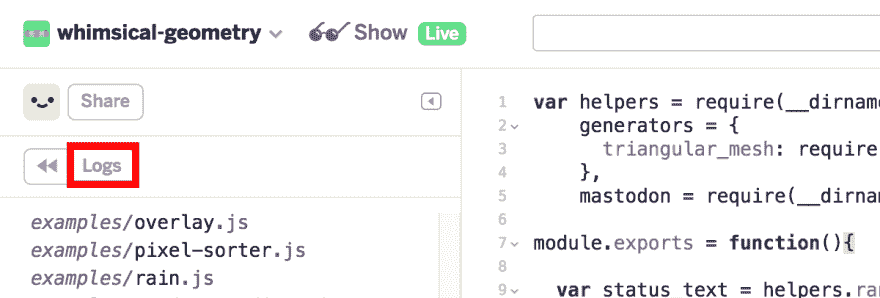T2】](https://res.cloudinary.com/practicaldev/image/fetch/s--OSr946L9--/c_limit%2Cf_auto%2Cfl_progressive%2Cq_auto%2Cw_880/http://botwiki.org/wp-content/uploads/2018/09/glitch-ui-log.png)

现在你可以转到你的 bot 的端点 URL(你可以点击页面顶部的“Show”按钮来查看你的项目的 URL，然后在末尾添加`/BOT_ENDPOINT`，就像我之前使用的例子一样:

```
https://generative-art-bot.glitch.me/12345 
```

Enter fullscreen mode Exit fullscreen mode

[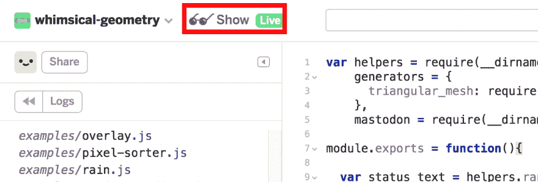T2】](https://res.cloudinary.com/practicaldev/image/fetch/s--iTcwkLCG--/c_limit%2Cf_auto%2Cfl_progressive%2Cq_auto%2Cw_880/http://botwiki.org/wp-content/uploads/2018/09/glitch-ui-show.png)

在新的浏览器标签或窗口中打开此 URL，您将在 Glitch 编辑器的活动日志中看到此内容:

[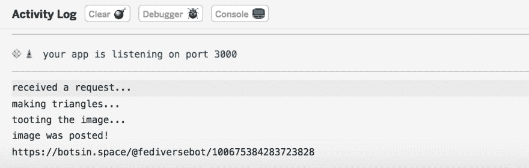T2】](https://res.cloudinary.com/practicaldev/image/fetch/s--QzKiABPU--/c_limit%2Cf_auto%2Cfl_progressive%2Cq_auto%2Cw_880/http://botwiki.org/wp-content/uploads/2018/09/generative-art-bot-glitch-log.png)

您可以从日志中复制 URL 来查看您的 bot 帖子:

[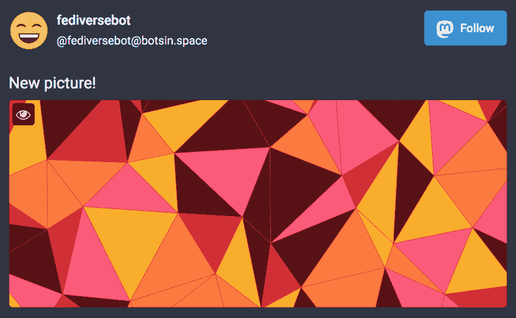T2】](https://res.cloudinary.com/practicaldev/image/fetch/s--MozrE4Bs--/c_limit%2Cf_auto%2Cfl_progressive%2Cq_auto%2Cw_880/http://botwiki.org/wp-content/uploads/2018/09/generative-art-bot-glitch-example-01.png)

每次您访问端点 URL 时，都会生成一个新图像。(我将在本教程的后面解释如何自动做到这一点。)

现在，是时候做一点实验了。

让我们看看`generators/triangular-mesh.js`里面到底有什么，也许可以四处看看，看看我们是否可以让机器人的输出更有趣。

当你打开文件时，你会看到[一个链接，链接到启发了这个生成器的教程](https://generativeartistry.com/tutorials/triangular-mesh/)。我们看到选项是如何设置的。(我稍后会谈到`animate`选项。)

生成器使用一个叫做 [`canvas`](https://developer.mozilla.org/en-US/docs/Web/API/Canvas_API) 的东西来制作你的图像，这是一个专门为此设计的 HTML 元素。我们可以看到一个名为`drawTriangle`的函数，我们可以正确地假设它绘制了三角形。它看起来很简单，让我们稍微改变一下。在三角形里面加一个更小的三角形怎么样？

```
 const drawTriangle = (pointA, pointB, pointC) => {
    ctx.beginPath();
    ctx.moveTo(pointA.x, pointA.y);
    ctx.lineTo(pointB.x, pointB.y);
    ctx.lineTo(pointC.x, pointC.y);
    ctx.lineTo(pointA.x, pointA.y);
    ctx.closePath();
    ctx.fillStyle = '#' + helpers.random_from_array(options.colors); 
    ctx.fill();
    ctx.stroke();

    /* Adding new code for a smaller triangle.*/

    ctx.beginPath();
    ctx.moveTo(pointA.x + 10, pointA.y - 10);
    ctx.lineTo(pointB.x - 10, pointB.y - 10);
    ctx.lineTo(pointC.x - 10, pointC.y + 10);
    ctx.lineTo(pointA.x + 10, pointA.y - 10);
    ctx.closePath();
    ctx.fillStyle = '#' + helpers.random_from_array(options.colors); 
    ctx.fill();
    ctx.stroke();

  } 
```

Enter fullscreen mode Exit fullscreen mode

就像所有好的艺术一样，这里涉及到一点数学，但是我所做的只是将这些点移向中心。让我们回到我们的机器人的端点 URL，看看这是什么。

[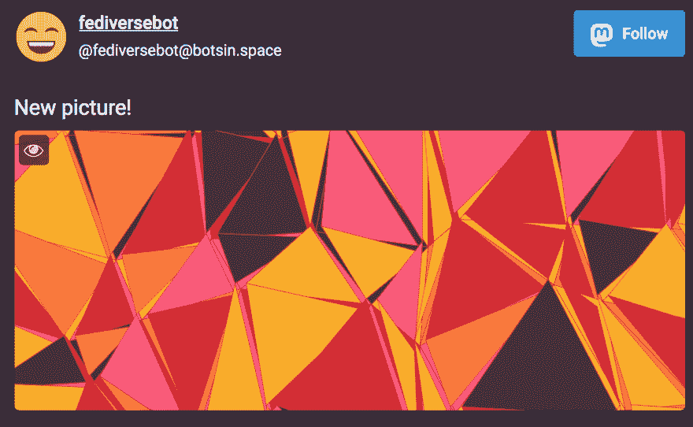T2】](https://res.cloudinary.com/practicaldev/image/fetch/s---Q4g66X---/c_limit%2Cf_auto%2Cfl_progressive%2Cq_auto%2Cw_880/http://botwiki.org/wp-content/uploads/2018/09/generative-art-bot-glitch-example-02.png)

好吧，这并不完全是我想的那样，我算错了内部三角形的点。但是实际上很好看！这对于生成艺术来说是很酷的，有时“错误”可以[产生更有趣的输出](https://inconvergent.net/2018/a-myriad-of-mistakes/)。

你可以随意使用这个发生器，或者看看其他的例子，甚至创建自己的发生器。那是什么？哦，你还在考虑`animate`选项吗？

好的，让我们回到`bot.js`并将它添加到我们的`options`对象:

```
 const options = {
    width: 100,
    height: 100,
    colors: ['571014', 'D4292F', 'FC5978', 'FE7B35', 'FBAC00'],
    animate: true
  }; 
```

Enter fullscreen mode Exit fullscreen mode

(确保在`colors`后加一个逗号。)

为了加快速度，我还改变了图像的大小。

回到我们机器人的终点-

[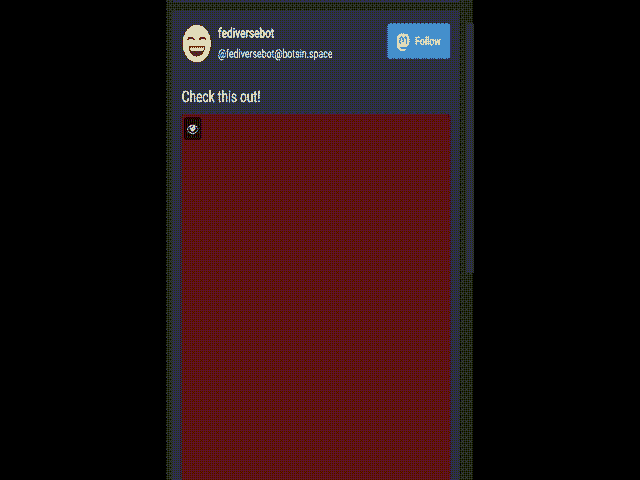T2】](https://res.cloudinary.com/practicaldev/image/fetch/s--ie3ziNCn--/c_limit%2Cf_auto%2Cfl_progressive%2Cq_66%2Cw_880/http://botwiki.org/wp-content/uploads/2018/09/generative-art-bot-glitch-example-03.gif)

这个特殊的生成器生成的 gif 对于 Mastodon 的 8MB 文件大小限制来说太大了，所以质量有点太低，但是你可以尝试一下`encoder`设置，也许可以找到一种改进的方法。

## 自动化你的机器人

本教程的最后一步将是自动化我们的机器人。Glitch 会在 5 分钟后让不活跃的应用程序(即没有任何外部流量的应用程序)进入睡眠状态，所以你必须全天定期刷新你的机器人的端点 URL，或者，一个更方便的解决方案是，使用像 cron-job.org[或 uptimerobot.com](https://cron-job.org/)[这样的网站来为你做这件事。](https://uptimerobot.com/)

我将使用 cron-job.org 向您展示如何设置它。

一旦你注册了一个账户，进入“Cronjobs”部分，添加一个新的 cron jobs。

[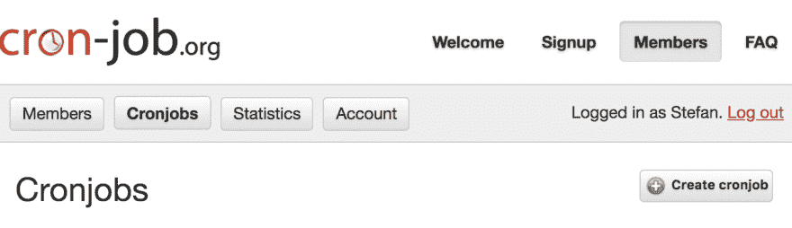](https://res.cloudinary.com/practicaldev/image/fetch/s--BjT8J681--/c_limit%2Cf_auto%2Cfl_progressive%2Cq_auto%2Cw_880/http://botwiki.org/wp-content/uploads/2018/09/cron-job-create-cronjob-01.png)
[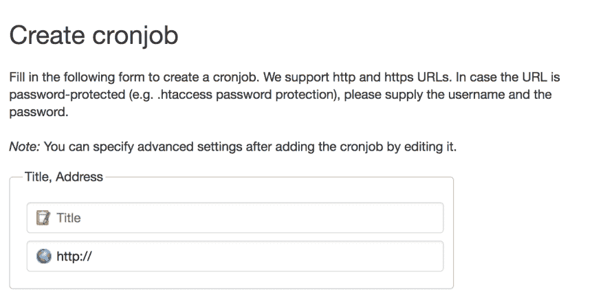T6】](https://res.cloudinary.com/practicaldev/image/fetch/s--TAC-vOFd--/c_limit%2Cf_auto%2Cfl_progressive%2Cq_auto%2Cw_880/http://botwiki.org/wp-content/uploads/2018/09/cron-job-create-cronjob-02.png)

单击“时间表”下的“用户定义”。在这里，选择月中日期、周中日期、月中日期下的所有选项。在分钟下，选择 0。在“小时”下，选择您的机器人将在哪个小时发布。

例如，如果您希望每 6 小时发布一次，请选择选项 0、6、12 和 18。

[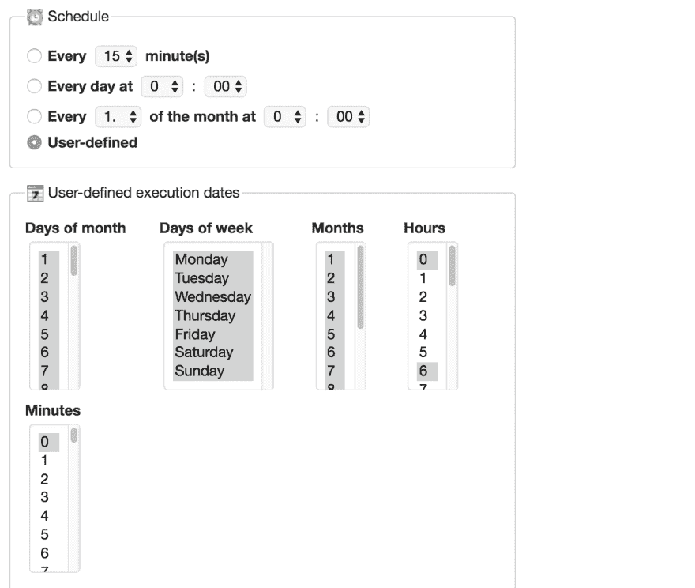T2】](https://res.cloudinary.com/practicaldev/image/fetch/s--B1rRfVnR--/c_limit%2Cf_auto%2Cfl_progressive%2Cq_auto%2Cw_880/http://botwiki.org/wp-content/uploads/2018/09/cron-job-user-defined.png)

点击页面底部的“创建 cronjob”按钮，一切都准备好了！

如果你想让你的机器人永久运行，你需要注册一个故障账户，我强烈建议你注册其他项目，而不仅仅是机器人。

如果你在本教程的任何一点上遇到困难，请随时[加入僵尸工具小组](https://botmakers.org)，有人会很乐意帮助你。

感谢跟随，并享受制作生殖艺术机器人的乐趣！