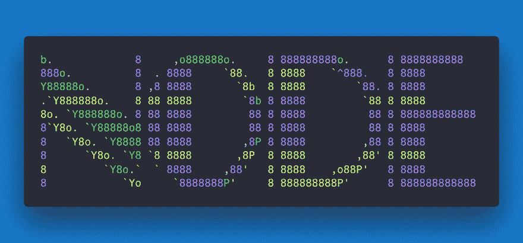

# Node.js 简介

> 原文：<https://dev.to/flaviocopes/introduction-to-nodejs-3can>

[T2】](https://res.cloudinary.com/practicaldev/image/fetch/s--fOIA8SOO--/c_limit%2Cf_auto%2Cfl_progressive%2Cq_auto%2Cw_880/https://flaviocopes.com/nodejs/banner.png)

*   概观
*   一点历史
*   Node.js 的卖点
    *   快的
    *   简单的
    *   Java Script 语言
    *   V8
    *   异步平台
*   装置
    *   大量的图书馆
*   Node.js 应用程序示例
*   Node.js 框架和工具

    ## 概述

Node.js 是运行在**服务器**上的[JavaScript](https://flaviocopes.com/javascript/)T3 的**运行时环境。**

Node.js 是开源的、跨平台的，自 2009 年推出以来，它非常受欢迎，现在在 web 开发领域发挥着重要作用。如果 GitHub 明星是一个受欢迎的指示因素，拥有 46000+颗明星意味着非常受欢迎。

Node.js 建立在 Google Chrome V8 JavaScript 引擎之上，主要用于创建 web 服务器——但并不局限于此。

## 一点点历史

JavaScript 是一种编程语言，由网景公司开发，作为一种脚本工具，在他们的浏览器 [Netscape Navigator](https://en.wikipedia.org/wiki/Netscape_Navigator) 中操作网页。

网景的部分商业模式是销售网络服务器，其中包括一个名为*网景 LiveWire* 的环境，它可以使用服务器端 JavaScript 创建动态页面。所以服务器端 JavaScript 的想法并不是由 Node.js 引入的，而是像 JavaScript 一样古老——但当时并不成功。

导致 Node.js 崛起的一个关键因素是时机。几年来，JavaScript 开始被认为是一种严肃的语言，这要感谢“Web 2.0”应用程序向世界展示了现代网络体验(想想谷歌地图或 GMail)。

得益于浏览器之争，JavaScript 引擎的性能指标大幅提高，这场竞争仍在继续。各大浏览器背后的开发团队每天都在努力工作，为我们提供更好的性能，这是 JavaScript 作为一个平台的巨大胜利。Node.js 使用的 V8 引擎就是其中之一，尤其是 Chrome JS 引擎。

但是当然 Node.js 的流行并不仅仅是因为纯粹的运气或者时机。它引入了许多关于如何在服务器上用 JavaScript 编程的创新思想。

## node . js 的卖点

### 快

[T2】](https://res.cloudinary.com/practicaldev/image/fetch/s--Vh6eDsRP--/c_limit%2Cf_auto%2Cfl_progressive%2Cq_auto%2Cw_880/https://flaviocopes.com/nodejs/fast.png)

Node.js 的主要卖点之一就是**速度**。Node.js 上运行的 JavaScript 代码(取决于基准测试)比 C 或 Java 等编译语言快两倍，比 Python 或 Ruby 等解释语言快几个数量级，因为它采用了非阻塞范式。

### 简单

Node.js 很简单。实际上非常简单。

### JavaScript

Node.js 运行 JavaScript 代码。这意味着数百万已经在浏览器中使用 JavaScript 的前端开发人员能够使用相同的编程语言运行服务器端代码和前端代码，而无需学习完全不同的工具。

范例都是相同的，在 Node.js 中，可以首先使用新的 [ECMAScript](https://flaviocopes.com/ecmascript/) 标准，因为您不必等待所有用户更新他们的浏览器——您可以通过更改 Node.js 版本来决定使用哪个 ECMAScript 版本。

### V8

Node.js 运行在开源的 Google V8 JavaScript 引擎上，能够利用成千上万名工程师的工作，这些工程师已经(并将继续)快速开发 Chrome JavaScript 运行时。

### 异步平台

[T2】](https://res.cloudinary.com/practicaldev/image/fetch/s--duSdRJPP--/c_limit%2Cf_auto%2Cfl_progressive%2Cq_auto%2Cw_880/https://flaviocopes.com/nodejs/async.png)

在传统编程语言(C、Java、Python、PHP)中，默认情况下所有指令都是阻塞的，除非你明确地“选择”执行异步操作。如果您执行一个网络请求来读取一些 JSON，那么这个特定线程的执行将被阻塞，直到响应就绪。

通过使用**单线程**、**回调函数**和**事件驱动编程**，JavaScript 允许以非常简单的方式创建异步和非阻塞代码。每当一个昂贵的操作发生时，我们传递一个回调函数，一旦我们可以继续处理，这个函数就会被调用。我们不会等到这个项目结束后再继续进行剩下的项目。

这种机制源自浏览器。我们不能等到从 AJAX 请求中加载了一些东西之后，才能够拦截页面上的点击事件。**这一切都必须实时发生**以便为用户提供良好的体验。

> 如果您已经为 web 页面创建了 onclick 处理程序，那么您就已经对事件侦听器使用了异步编程技术。

这使得 Node.js 可以处理单个服务器的数千个并发连接，而不会带来管理线程并发性的负担，这将是错误的主要来源。

Node 提供了非阻塞 I/O 原语，通常 Node.js 中的库是使用非阻塞范例编写的，这使得阻塞行为成为一种异常而不是正常现象。

当 Node.js 需要执行 I/O 操作时，比如从网络上读取，访问数据库或文件系统，而不是阻塞线程 Node.js 将在响应返回时简单地恢复操作，而不是浪费 CPU 周期等待。

## 安装

Node.js 可以根据您的操作系统以不同的方式安装。

所有主要平台的官方软件包都可以在[https://nodejs.org/en/download/](https://nodejs.org/en/download/)获得。

安装 Node.js 的一个非常方便的方法是通过包管理器。

在 macOS 上，[家酿](https://brew.sh/)是事实上的标准，并且允许非常容易地安装 Node.js】。

其他平台选项在[https://nodejs.org/en/download/package-manager/](https://nodejs.org/en/download/package-manager/)中描述

一个非常流行的选项是使用节点版本管理器`nvm`，它允许你同时安装不同版本的 Node.js，并决定运行哪个版本。有关此选项的更多信息，请参见[https://github.com/creationix/nvm](https://github.com/creationix/nvm)。

### 数量庞大的图书馆

[`npm`](https://flaviocopes.com/npm/) 凭借其简单的结构帮助 node.js 的生态系统激增，现在 npm 注册表托管了近 500，000 个开源包，您可以免费使用。

最近 [Yarn](https://flaviocopes.com/yarn/) 也进入了软件包领域，作为`npm`的替代方案，使用相同的软件包库，并且由于一些特性，如缓存软件包和加速安装过程的能力，它立即变得非常受欢迎。

## 一个 Node.js 应用的例子

Node.js 最常见的例子 Hello World 是一个 web 服务器:

```
const http = require('http')

const hostname = '127.0.0.1'
const port = 3000

const server = http.createServer((req, res) => {
  res.statusCode = 200
  res.setHeader('Content-Type', 'text/plain')
  res.end('Hello World\n')
})

server.listen(port, hostname, () => {
  console.log(`Server running at http://${hostname}:${port}/`)
}) 
```

Enter fullscreen mode Exit fullscreen mode

要运行这个代码片段，将其保存为一个`server.js`文件，并在您的终端中运行`node server.js`。

这段代码首先包含 Node.js [`http`模块](https://nodejs.org/api/http.html)。

Node.js 有一个惊人的[标准库](https://nodejs.org/api/)，包括对网络的一流支持。

`http`的`createServer()`方法创建一个新的 HTTP 服务器并返回它。

服务器被设置为监听指定的端口和主机名。当服务器准备好了，回调函数被调用，在这种情况下通知我们服务器正在运行。

每当接收到一个新的请求，就调用 [`request`事件](https://nodejs.org/api/http.html#http_event_request)，提供两个对象:一个请求(一个 [`http.IncomingMessage`](https://nodejs.org/api/http.html#http_class_http_incomingmessage) 对象)和一个响应(一个 [`http.ServerResponse`](https://nodejs.org/api/http.html#http_class_http_serverresponse) 对象)。

这两个对象对于处理 HTTP 调用是必不可少的。

第一个提供了请求细节。在这个简单的例子中没有使用，但是您可以访问请求头和请求数据。

第二个用于向调用者返回数据。

在这种情况下用

```
res.statusCode = 200 
```

Enter fullscreen mode Exit fullscreen mode

我们将 statusCode 属性设置为 200，表示响应成功。

我们设置内容类型头:

```
res.setHeader('Content-Type', 'text/plain') 
```

Enter fullscreen mode Exit fullscreen mode

我们结束关闭响应，将内容作为参数添加到`end()` :

```
res.end('Hello World\n') 
```

Enter fullscreen mode Exit fullscreen mode

## Node.js 框架和工具

Node.js 是一个低级平台，为了让事情变得更简单，让开发人员更感兴趣，在 Node.js 上构建了数千个库。

其中许多随着时间的推移成为流行的选择。以下是我认为非常相关且值得学习的一个不全面的列表:

*   [**Express**](https://expressjs.com/) ，创建 web 服务器的最简单而强大的方法之一。其专注于服务器核心功能的极简主义方法是其成功的关键。
*   [**Meteor**](https://flaviocopes.com/meteor/) ，一个非常强大的全栈框架，为您提供一种同构的方法来使用 JavaScript 构建应用程序，在客户端和服务器上共享代码。曾经提供一切的现成工具，现在集成了前端库 React、Vue 和 Angular。也可以用来创建移动应用程序。
*   由 Express 背后的同一个团队建造的[**【KOA】**](http://koajs.com/)，旨在更简单、更小，建立在多年知识的基础上。新项目产生于在不破坏现有社区的情况下创建不兼容的变更的需要。
*   [**Next.js**](https://flaviocopes.com/nextjs/) ，一个渲染服务器端渲染的框架 [React](https://flaviocopes.com/react/) 应用。
*   [**微**](https://github.com/zeit/micro) ，一款非常轻量级的服务器，打造异步 HTTP 微服务。
*   [**Socket.io**](https://socket.io/) ，构建网络应用的实时通信引擎。