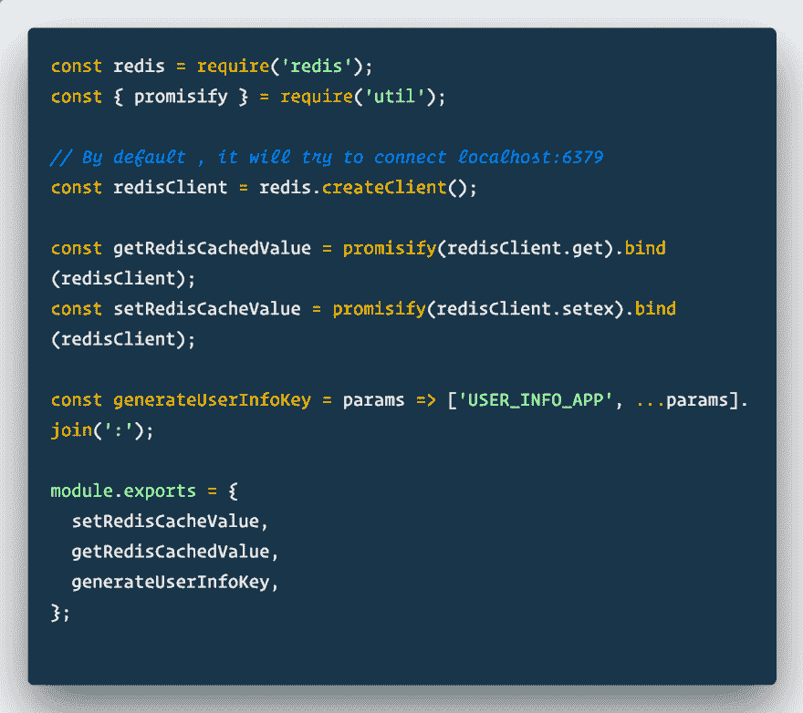
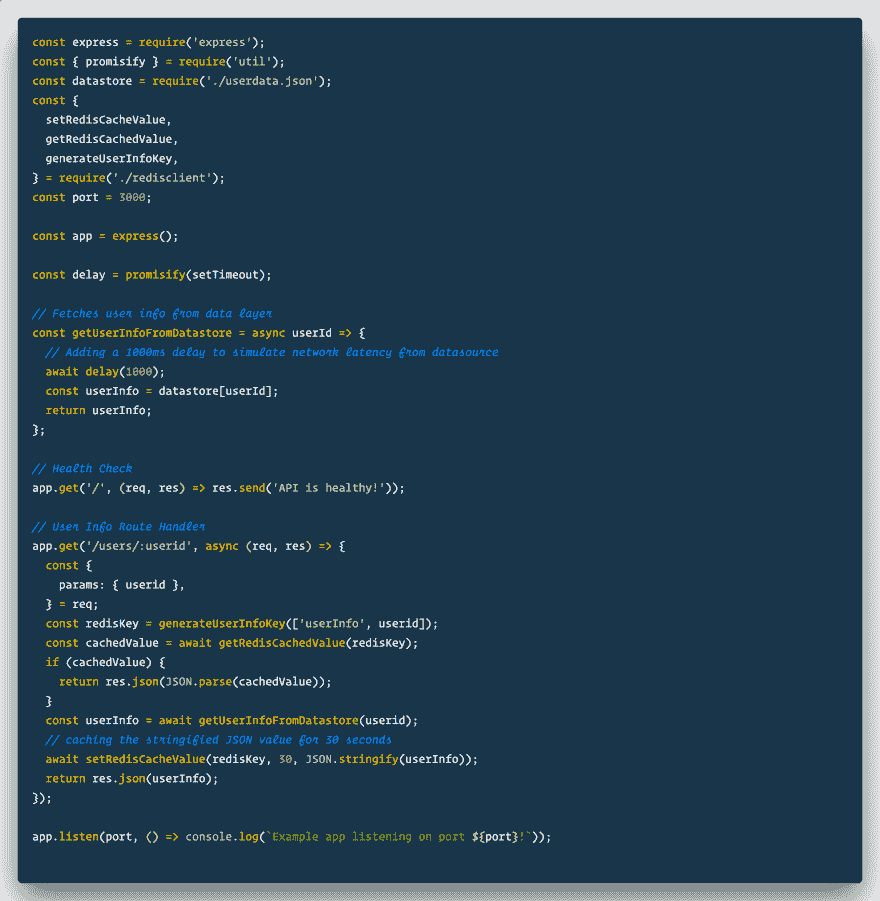

# 导言要背道而驰

> 原文：<https://dev.to/divyanshutomar/introduction-to-redis-3m2a>

对于一个高流量的 web 服务来说，利用某种缓存机制是必要的。缓存是一种将计算数据存储在内存中的方式，以便可以立即满足未来的请求。如果采用正确的策略实施，它还有助于避免往返于数据层和应用程序端的计算。Redis 和 Memcached 是两个最流行的基于内存的商店。在本帖中，我们将探索 Redis 的一些关键概念，并浏览一些基本命令。除了缓存，Redis 还可以用于其他需要快速和频繁访问数据的应用程序。

### 再说一遍

[T2】](https://res.cloudinary.com/practicaldev/image/fetch/s--gWwIv4vV--/c_limit%2Cf_auto%2Cfl_progressive%2Cq_auto%2Cw_880/https://thepracticaldev.s3.amazonaws.com/i/787xlgwc2hhq3ctzxcvs.png)

Redis 是一个内存中的数据结构存储，支持许多数据类型，如字符串、散列、集合、有序集合等。本质上，它是一个键值存储。

Redis 中的每种类型的值都是根据二进制安全的键存储的，可以是从空字符串到长散列字符串的任何值。每个应用程序都应该遵循预先确定的模式来命名 Redis 键，以避免任何命名冲突。

#### 设置缰绳

像每个数据库一样，Redis 包含一个用于在内存中存储数据的服务器和对服务器执行命令的客户机。为了在你的本地机器上设置服务器，我推荐使用 Docker，因为它很容易上手。如果您的机器上运行了 Docker 守护进程，请运行以下命令:

```
docker run --rm -it --name local-redis -p 6379:6379 redis 
```

Enter fullscreen mode Exit fullscreen mode

这将在端口为 6379 的本地主机上运行一个名为 local-redis 的 Docker 容器。它使用官方的 Redis docker 映像来运行容器。

对于客户端，我们可以使用 redis-cli 从 redis 服务器上的控制台执行命令。打开一个新选项卡，执行以下命令，启动连接到本地 docker Redis 服务器实例的 redis-cli 会话:

```
docker run -it --link local-redis:redis --rm redis redis-cli -h redis -p 6379 
```

Enter fullscreen mode Exit fullscreen mode

现在我们可以开始执行一些基本的 Redis 命令。

### 命令

*   *设定* a 值:

    语法:`SET <key> <value>`
    例句:`SET firstname Albert`

*   *检索*一个值:

    语法:`GET <key>`
    例句:`GET firstname`

*   检查密钥*是否存在*:

    语法:`EXISTS <key>`

*   *删除*一键:

    可以使用
    `DEL <key>`
    删除一个键及其相关的内存。这是一个同步阻塞操作。

    移除键的更好的方法是取消它们的链接，稍后垃圾收集器可以收集它们的相关内存。
    `UNLINK <key>`

*   为密钥设置一个*时间到期*:

    `EXPIRE <key> <seconds>`
    T1】

*   *设置*一键检查*存在*和*到期*一气呵成:

    语法:`SET <key> <value> <EX seconds>|<PX milliseconds> NX|XX`

    NX -仅在键不存在时设置。
    XX -仅当密钥已经存在时设置。
    EX -以秒为单位设置密钥的过期时间。
    PX -以毫秒为单位设置密钥的过期时间。

    示例:

    `SET firstname Albert EX 10 NX`

    这将使用字符串值“Albert”设置密钥 firstname，只有在密钥不存在的情况下，其到期时间才为 10 秒。

*   *递增*或*递减*一个整数值:

    Redis 提供了一种方便的方法来增加或减少可用作计数器的整数值。

    语法:
    `INCR <key>`
    `DECR <key>`
    `INCRBY <key> <increment value>`
    `DECRBY <key> <decrement value>`

    例如:
    `SET counter 4`
    `INCRBY counter 6`

    计数器 key 最初将保存值 4，在第二个命令之后，它将增加到 10。

上面提到的所有命令只是处理字符串或整数值的存储和操作。还有其他数据结构值，如哈希、集合、位数组等。可以用来解决复杂的问题。

#### 真实世界的例子

在现实世界的应用程序中，您可以使用各种编程语言特定的 [redis 客户端](https://redis.io/clients)从应用程序代码与您的 redis 服务器进行交互。

我们将编写一个简单的基于节点的应用程序，它公开了一个端点，用于根据 userid 获取用户信息。一个 JSON 文件将作为我们的数据存储，以尽可能保持简单。

*   首先，通过运行`npm init`初始化 NPM 库，并安装 *express* 和 *redis* 作为依赖项。
*   现在，创建一个 redis helper 文件，它构成了连接到 redis 服务器的 redis 客户机的一个实例。我们还为我们的路由处理程序编写了一些缓存助手方法。

    [T2】](https://res.cloudinary.com/practicaldev/image/fetch/s--GO_zcWKV--/c_limit%2Cf_auto%2Cfl_progressive%2Cq_auto%2Cw_880/https://thepracticaldev.s3.amazonaws.com/i/yvnh0ig59puaqj8xduyn.png)

*   在主应用程序文件中，编写一个路由处理程序，它接受一个 userid，根据该 userid 检索用户信息。接下来，使用 userid 形成一个惟一的 redis 密钥。对于给定的 userid，这个键对于每个请求总是相同的。检查 Redis 缓存中是否存在这个键，如果找到就返回响应。

    [T2】](https://res.cloudinary.com/practicaldev/image/fetch/s--bZrfxUvf--/c_limit%2Cf_auto%2Cfl_progressive%2Cq_auto%2Cw_880/https://thepracticaldev.s3.amazonaws.com/i/29fg2n4l4900x41gmhgz.png)

*   否则，我们将从数据源中查询数据，并将响应数据设置到 Redis 缓存，然后将其作为响应发送回去。

要查看完整的代码并对其进行修改，您可以克隆以下存储库:

## [【divyan hutomar】](https://github.com/divyanshutomar)/[【hello-redis】](https://github.com/divyanshutomar/hello-redis)

### 使用 Redis 缓存数据的 Express 应用程序

<article class="markdown-body entry-content container-lg" itemprop="text">

# 你好里兹示例

这是一个 express 应用程序，演示了如何利用 redis 来缓存数据，以便可以立即满足重复出现的请求。

### 要求

*   节点> = 8.x
*   雷迪斯

### 设置和运行

*   克隆此回购。
*   使用`npm install`安装所有的节点依赖项。
*   确保在`localhost:6379`上运行本地 redis 服务器实例。否则，如果您的机器上运行了 docker 守护进程，您可以通过运行以下命令轻松启动一个。

```
docker run --rm -it --name local-redis -p 6379:6379 redis 
```

*   通过运行`node index.js`启动节点服务。

</article>

[View on GitHub](https://github.com/divyanshutomar/hello-redis)

恭喜你！您现在已经学习了 Redis 的基础知识。如果你想深入了解，请看看官方的 [redis 文档](https://redis.io/documentation)。

谢谢你的关注，我希望这篇文章对你有用。
请在 [Twitter](https://twitter.com/divyanshutomar) 上关注我，了解这些话题的最新进展。