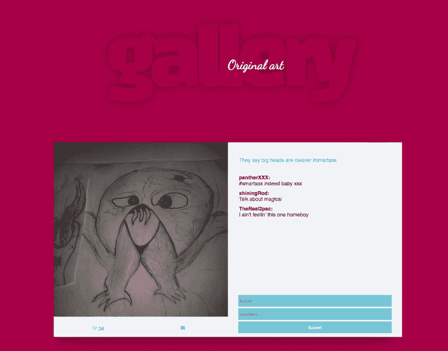

# Next.js 简介——从 API 获取数据

> 原文：<https://dev.to/aurelkurtula/introduction-to-the-basics-of-nextjs---part-two-pad>

从上一个教程开始

[](/aurelkurtula) [## Next.js 基础介绍

### aurel Kurt ula Aug 22 ' 187min read

#nextjs #node #react #tutorial](/aurelkurtula/introduction-to-the-basics-of-nextjs-1loa)

今天我们将讲述

1.  从 API 获取数据。
2.  在提取 API 上执行 CRUD 操作。

在未来的教程中，我可能会介绍我们如何在 next.js 中整合 express 并创建我们自己的 API，但现在我将使用一个名为 [json-server](https://github.com/typicode/json-server) 的 NPM 包。这是一个快速运行本地 REST API 的绝妙工具。正如它在文档中所说的“一个完整的假 REST API，在不到 30 秒的时间内零编码”。由于这不是针对`json-server`的教程，我就不多说了，只是说我已经添加了一个 JSON 文件，其中包含了我们在`./data/db.json`的所有数据，然后运行`json-server data/db.json --port 4000`，在端口 4000 为我们提供了一个 REST API(如果你想了解更多关于 [json-server](https://github.com/typicode/json-server) 的信息，请阅读文档)。让它在一个单独的终端窗口中运行，让我们继续。

我假设你已经阅读了[上一篇教程](https://dev.to/aurelkurtula/introduction-to-the-basics-of-nextjs-1loa)，并且如果你继续阅读的话，你已经克隆了我们目前拥有的文件( [github -第一部分](https://github.com/aurelkurtula/basics-of-nextJS/tree/part1))。

## 从 API 获取数据

在上一个教程中，我们使用了无状态的功能组件。这一次我们需要将其中一些组件转换成基于类的，从`./pages/index.js`开始。

```
const Index = (props) => ( <Layout> ... </Layout>) Index.getInitialProps = async ({ }) => { ...}
export default Index 
```

Enter fullscreen mode Exit fullscreen mode

这就是我们从[之前的教程](https://dev.to/aurelkurtula/introduction-to-the-basics-of-nextjs-1loa)中得到的。让我们把它转换成一个类组件，并从 API
中获取数据

```
import React, { Component } from 'react'
import fetch from 'isomorphic-unfetch'
import Layout from '../components/Layout';
import Photo from '../components/Photo';

export default class extends Component {
  static async getInitialProps() {
    const res = await fetch('http://localhost:4000/photos')
    const images = await res.json()
    return { images }
  }
  componentWillMount() {
    this.setState({
      images: this.props.images
    })
  }
  render() {
    return (
      <Layout>
         {
          this.state.images.map((image, key) => <Photo id={key} id={key} data={image} />)
         }
      </Layout>
    )
  }
} 
```

Enter fullscreen mode Exit fullscreen mode

如您所见，核心代码是相同的。我们只是将我们所拥有的包装到一个 react 类组件中。

当使用 next.js 时，我们无法访问浏览器的 fetch API，因此我们需要安装`isomorphic-unfetch`库(`npm i -S isomorphic-unfetch`)，它实现了与浏览器 fetch 相同的功能。

和前面一样，`getInitialProps`将获取的数据推入 props。然后我们通过`componentWillMount`将数据注入到组件状态中。基本的 react 东西——我们需要通过状态而不是 props 访问数据，这样我们就能够通过应用程序传播数据更改。

## 像照片一样的功能

回想一下[之前的教程](https://dev.to/aurelkurtula/introduction-to-the-basics-of-nextjs-1loa)，我们有一个显示赞数的赞按钮。我们当然希望能够增加按钮点击时的喜欢

[T2】](https://res.cloudinary.com/practicaldev/image/fetch/s--QtX25e37--/c_limit%2Cf_auto%2Cfl_progressive%2Cq_auto%2Cw_880/https://thepracticaldev.s3.amazonaws.com/i/wcniyujp3p1l0l8ulgv2.png)

像往常一样，在 react 开发中，我们将在索引页面组件(`./pages/index.js`)中创建功能，并将其作为道具传递下去(这就是为什么 [learning redux](https://dev.to/aurelkurtula/a-beginners-introduction-to-working-with-redux-in-react-13k) 在这些情况下非常棒)

```
...
LikesEntry(id){
    let images = this.state.images
    let image = images.find( i => i.id === id )
    image.likes = parseInt(image.likes) + 1
    this.setState({
        images
    })
    fetch(`http://localhost:4000/photos/${id}`, {
        method: 'PUT',
        headers: {
          'Accept': 'application/json',
          'Content-Type': 'application/json'
        },
        body: JSON.stringify(image)
      })

}
render(){
    return (
        <Layout>
            {
                this.state.images.map((image, key) => 
                    <Photo 
                        LikesEntry={this.LikesEntry.bind(this)} 
                        id={image.id} 
                        key={key} data={image} /> )
            }
        </Layout>
    )
}
... 
```

Enter fullscreen mode Exit fullscreen mode

当点击“喜欢”按钮时，就会触发`LikesEntry` get。在那里，我们增加了被按下的图像的喜欢数。更改被推回到状态，然后我们执行一个 put 请求，服务器也获得更改。

被按下的按钮实际上是两个组件的深度。上面我们将`LikesEntry`传递给`./components/Photo.js`组件(通过 props)。`Photo`组件将把`LikesEntry`同样传递给`CommentsFunctionality`组件

在`./components/Photo.js`中

```
<CommentsFunctionality 
    LikesEntry={() => 
        props.LikesEntry(props.data.id)}
        commentsNum={props.data.comments.length}
        likes={props.data.likes} /> 
```

Enter fullscreen mode Exit fullscreen mode

最后，`./components/InteractiveButtons.js`得到点击使用它:

```
export default ({likes, LikesEntry, commentsNum}) => (
    <div className="meta">
        <button className="heart" onClick={LikesEntry} ><MdFavoriteBorder />{likes}</button>
        <p><MdModeComment />{ commentsNum }</p> 
```

Enter fullscreen mode Exit fullscreen mode

就是有喜欢按钮的那个。单击时，组件状态会随服务器一起更新。

(正如你所看到的，我也在那里添加了评论号，只是为了让 UI 感觉完整)

## 拍摄个人照片

几乎同样的过程也涉及到了`./pages/photo.js`组件，将它转换成一个类组件，并向状态添加属性

与之前相同的过程，现在需要获取一个单独的图像。所以`./pages/photo.js`组件需要转换成类组件。

```
import react, { Component } from 'react'
import fetch from 'isomorphic-unfetch'
import Layout from '../components/Layout';
import Photo from '../components/Photo';
import CommentsFunctionality from '../components/InteractiveButtons'

export default class extends Component {
    static async getInitialProps({query}) {
        const {id} = {...query}
        const res = await fetch(`http://localhost:4000/photos/${id}`)
        const image = await res.json() 
        return { image } 
    }
    componentWillMount(){
        this.setState({
            image: this.props.image
        })
    }
    render(){
        return(
            <Layout>
                ...
                    
                    <CommentsFunctionality />
                </div>
                <div className="comments">
                    <p className="tagline">{this.state.image.tagline}</p>
                    {
                        this.state.image.comments.map((comment, key) => <p key={key}><strong>{comment.user}:</strong>{comment.body}</p>)
                    }
                    <form className="comment-form">
                        <input type="text" ref="author" placeholder="Author" />
                        <input type="text" ref="comment"  placeholder="comment..." />
                        <input type="submit" />
                    </form>
                ... 
```

Enter fullscreen mode Exit fullscreen mode

正如我们在`Index`组件中所做的，数据在组件状态中被获取和注入。返回的 JSX (react 的 HTML 版本)和我们从`this.state`返回的完全一样。另外,`ref`被添加到表单输入中。(“引用提供了一种方法来访问在 render 方法中创建的 DOM 节点或 React 元素”( [react docs](https://reactjs.org/docs/refs-and-the-dom.html) ))

## 给图像添加注释

最后，我们需要处理表单。

[T2】](https://res.cloudinary.com/practicaldev/image/fetch/s--S5TgUbGc--/c_limit%2Cf_auto%2Cfl_progressive%2Cq_auto%2Cw_880/https://res.cloudinary.com/practicaldev/image/fetch/s--9bHf5DQ5--/c_limit%252Cf_auto%252Cfl_progressive%252Cq_auto%252Cw_880/https://thepracticaldev.s3.amazonaws.com/i/irlbts6oerwyguyksoo3.png)

让我们添加向状态和服务器添加注释的功能。首先创建`onSubmit`功能并将其链接到表单。

```
submitComments(e){
    e.preventDefault();
    const user = this.refs.author.value;
    const body = this.refs.comment.value;
    const comments = this.state.image.comments;
    comments.push({user, body})
    this.setState({comments})
    fetch(`http://localhost:4000/photos/${this.state.image.id}`, {
        method: 'PUT',
        headers: {
          'Accept': 'application/json',
          'Content-Type': 'application/json'
        },
        body: JSON.stringify(this.state.image)
      })
}
...
<form className="comment-form" onSubmit={(e)=> this.submitComments(e)} >
    <input type="text" ref="author" placeholder="Author" />
    <input type="text" ref="comment"  placeholder="comment..." />
    <input type="submit" />
</form> 
```

Enter fullscreen mode Exit fullscreen mode

差不多就是这样！

代码可以在同一个存储库中找到，但是在 [part2 分支](https://github.com/aurelkurtula/basics-of-nextJS/tree/part2)中。

下一次我们将探索如何将 express 添加到这个 next.js 项目中，并重新创建这个项目所需的基本 API