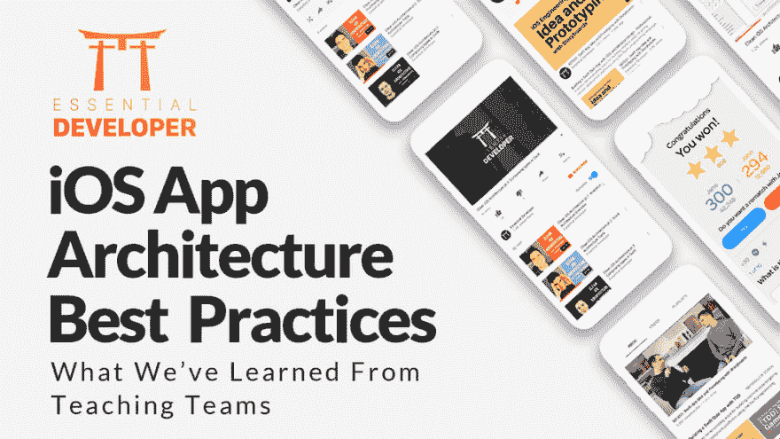

# iOS 应用架构最佳实践——我们从教学团队中学到的

> 原文：<https://dev.to/essentialdeveloper/ios-app-architecture-best-practices--what-weve-learned-from-teaching-teams-dbi>

[T2】](https://res.cloudinary.com/practicaldev/image/fetch/s--M-8x26kz--/c_limit%2Cf_auto%2Cfl_progressive%2Cq_auto%2Cw_880/https://static1.squarespace.com/static/5891c5b8d1758ec68ef5dbc2/t/5b45f22188251bfe9f408dc0/1531310645411/thumbnail.png%3Fformat%3D1000w)

在 Essential Developer，我们帮助个人和团队实现他们的最佳潜力，而 **iOS 应用架构最佳实践**始终是我们工作中的一个常见话题。作为我们工作的一部分，当团队未能交付业务期望时，我们通常会伸出援手。随着时间的推移，我们在功能失调的团队中发现了共同的模式，其中我们发现的最常见的问题之一是对[软件架构及其目标](https://www.essentialdeveloper.com/articles/clean-ios-architecture-part-2-good-architecture-traits)的误解。

作为专业教练，我们关注团队所说的话，我们重视他们的投入和经验，而不是任何良好实践的理论应用。根据我们的经验，团队比良好实践 X 或 y 的作者对他们的领域有更多的见解。尽管如此，我们仍然相信良好实践是通过学习他人的经验来帮助我们避免常见错误和陷阱的伟大工具。

## 平衡团队体验和 iOS 应用架构最佳实践

试图平衡团队经验和最佳实践的使用可能具有挑战性，但是通过仔细倾听团队要说的话，我们通常会发现他们知识中的误解和差距，这些可以被纠正。我们的方法绝不是削弱或取代团队，而是发现问题并与团队合作，共同解决业务挑战。在我们的愿景中，成功的合作意味着团队现在能够自己优化运作。

我们目前面临的一个大问题是，许多开发者对 iOS 应用架构最佳实践有不同的看法。例如，什么是 MVVM 或毒蛇？答案通常取决于你问谁。

我们花了很多时间想出如何有效地向我们的学生教授软件架构，让他们能够清楚地理解并有效地利用 **iOS 应用架构最佳实践**。我们发现对我们的班级非常有益的一件事是在*架构模式*和*软件架构*完全不同的地方建立一个清晰的界限，尽管两者的名字中都有“*架构**【e】*”。

在这种心态下，MVVM 就像 MVC 一样，只是一个 UI *架构模式*而不是一个*软件架构*。作为教练，我们将 MV*模式视为构建 UI 层的工具，我们教导应用可以由许多其他层组成，而不仅仅是 UI。

## 集中精力解决问题

在教学时，我们不再认为 MVVM 是一个软件架构。我们发现这对我们的学生没有帮助，因为很多时候开发人员过于依赖名称和缩略语的语义，而忘记了他们试图解决的问题。这并不意味着我们放弃 MVVM、MVP 和 MVC。这只是意味着我们把它们看作是除了 T2 软件架构之外的其他东西。

例如，我们首先询问学生，他们是否认为在 UI 中进行网络和数据库调用是正确的。我们通常得到的回答是“不”。然后我们询问在 ViewModel 中这样做是否可以，答案通常是“可以”不知何故，许多学生并没有像我们一样看到视图模型，它是 UI 层的一个组件。

他们正确地认识到不在 UI 中进行网络调用是一个好习惯，但是他们不认为 ViewModel 与 UI 相关，即使名称中有 View。许多学生对 MVVM 缩略词的语义如此着迷，以至于他们最终试图将任何东西放入视图、视图模型或模型中。好像应用程序中的所有东西都可以归为这三种类型。

## 建立对软件架构的共同理解

在我们与学生就软件架构的含义达成共识之前，就此展开讨论可能会适得其反。对我们来说，一个应用程序可以分成几层，我们希望能够根据需要自由扩展和收缩我们架构中的抽象层数量。对于许多学生来说，事物通常必须符合预先定义的和有限的思维方式，例如，VIPER 的教条式应用，其中每个功能都必须有一个视图、一个交互器、一个呈现器、一个实体和一个路由器。同样，他们不知道在 VIPER 体系结构中将数据库和网络放在哪里。

有趣的是，这种模式的创建者通常不会教条式地对待软件，他们从来没有打算让人们将这种模式视为一种僵化的结构。

## 不要低估学生

虽然在教授一门学科时，可能会很容易过于简化和限制范围，但通过解释软件架构的深度概念作为抽象层及其边界，而不使用首字母缩写词，我们发现学生的学习效果要好得多。一旦他们可以将问题分成组或层，以及这些层如何交流，他们就可以很容易地自己找到答案。例如，MVC 或 MVVM 更适合哪里——在 GUI 或表示层。他们还可以找到将网络和数据库代码移动到哪里，以更好地解决他们的领域问题，而不必试图以有限的思维方式来适应它。

当给予学生正确的思考框架时，我们常常惊讶于他们的创造力。在最好的合作中，我们看到学生带着比我们更好的解决方案回来，因为他们比我们更了解这个领域。这就是教育对个人和公司的强大之处，也是我们在教学中寻求的变革。

## 结论

每当我们看到团队因为对软件架构和 iOS 应用架构最佳实践缺乏了解而产生的误解和困惑而浪费了他们的巨大潜力时，我们都会感到心碎。缺乏软件架构教育的不利之处有很多，其中最常见的是不可避免的“我们必须重写应用程序”与老板的谈话。

发现需要良好的软件架构技能的开发人员正在投资于他们的职业转型，并在市场上建立他们的竞争优势。

我们最近进行了一项市场调查，以帮助开发人员找到一条良好的道路来指导他们的职业生涯并发展竞争优势。如果你感兴趣，我们已经在免费的 [iOS 职业课程](https://www.essentialdeveloper.com/courses/career-and-market-strategy-for-professional-ios-developers)中编译了它。

* * *

最初发表于[www.essentialdeveloper.com](https://www.essentialdeveloper.com/articles/ios-app-architecture-best-practices-what-we-learned-from-teaching-teams)。

## 我们来连线

如果你喜欢这篇文章，请访问我们在[https://essentialdeveloper.com](https://essentialdeveloper.com)的网站，获得更多像这样的深度定制内容。

关注我们:[YouTube](https://youtube.com/essentialdeveloper)[Twitter](https://twitter.com/essentialdevcom)[脸书](https://facebook.com/essentialdeveloper)[GitHub](https://github.com/essentialdevelopercom)