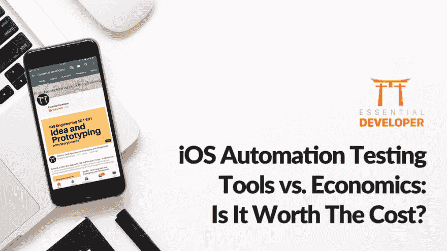

# iOS 自动化测试工具与经济学:值得花费吗？

> 原文：<https://dev.to/essentialdeveloper/ios-automation-testing-tools-vs-economics-is-it-worth-the-cost-2gbk>

[T2】](https://res.cloudinary.com/practicaldev/image/fetch/s--bi_aL-Zo--/c_limit%2Cf_auto%2Cfl_progressive%2Cq_auto%2Cw_880/https://static1.squarespace.com/static/5891c5b8d1758ec68ef5dbc2/t/5b572e660e2e72bb933174b3/1532440198002/%3Fformat%3D1000w)

iOS 测试自动化工具在开发人员中可能是一个两极分化的话题，但今天我们将从一个不同的角度来看这个话题——业务方面。

在商界，有一样东西赢得了最多的辩论:经济学。用诸如“最佳实践”、“道德”或“这是应该做的事情”这样的技术论点来反对商业经济论点是徒劳的。

成功的商业人士明白任何事情都有成本，他们广泛地分析行动以评估投资回报(ROI)。简单来说，行动可以产生正回报，也可以产生负回报。如果我们，开发人员，想要用我们的技术经验来影响决策，那就要靠我们把技术术语翻译成经济论据。

## iOS 自动化测试工具能有正的 ROI 吗？

绝对的。iOS 自动化测试工具可以产生奇妙的 ROI 然而，正回报并不是必然的。编写自动化测试是有成本的，其中最明显的是我们编写和维护它们所花费的时间。为了获得积极的投资回报，团队中的每个人都需要生产出高质量和有纪律的工作。团队必须仔细计划、产生和维护一个快速、可靠、精确和可重复的测试套件。让我们再细分一下:

*   快速:测试在几秒或几分钟内完成，而不是几小时或几天。
*   **可靠**:当它们通过时，我们确信一切正常，“我们发货了”
*   精确:当他们失败时，我们知道问题出在哪里。
*   可重复:我们可以一遍又一遍地运行测试，并获得相同的结果:通过或失败。不允许出现片状剥落。

具有上述积极特征的自动化测试套件是支持项目长期可持续性的支柱之一，提高了质量和速度，同时降低了短期和长期的成本和风险。这样的测试套件促进了技术团队和业务之间的信心和信任，这使得它成为一种有价值的资产。

## iOS 自动化测试工具会有负 ROI 吗？

不幸的是，是的。当自动化测试不快速、不可靠、不精确且不可重复时，iOS 自动化测试工具可能会产生负面的投资回报。

*   **慢**:需要几个小时或几天才能运行的测试，所以我们不经常运行。随着时间的推移，我们倾向于忽略错误，甚至删除没有构建或通过的测试。
*   不可靠:通过了测试，但我们不信任它们。我们仍然最终手动测试一切。
*   不准确:当测试失败时，我们不知道问题出在哪里。我们需要广泛地调试和手动测试应用程序，以找到问题。
*   **不可再现**:有时通过，有时失败的测试。在这种情况下，结果是不可预测的。我们经常忽略它们，因为我们认为这是假阴性。

具有上述负面特征的自动化测试套件的构建和维护是昂贵的。这种测试套件对企业来说是一种负担和负担，因为它产生的价值很小甚至没有，而且成本很高。

## “但我不是测试员！”

无论是手动的还是自动的，每个开发人员最终都会将测试软件作为开发周期的一部分。手动测试通常缓慢而乏味，开发人员可能会花费大量时间来调试和反复手动运行应用程序，以及等待时间(构建、设置状态、导航等。)随着系统复杂性的增加而迅速增加。自动化可以极大地提高生产率。此外，它可以减少繁琐和容易出错的手动任务，帮助开发人员在整个开发周期中保持恒定的速度。

当我们发展我们的技能来证明(和重复地)产生快速、可靠、精确和可重复的测试时，我们可以产生积极的 ROI，并且我们可以在就业市场中积极地脱颖而出。

## 结论

繁荣和增长是积极的事情，可以帮助公司更好地补偿他们的员工。因此，开发人员可以有一个更可持续的步伐，和一个愉快的工作场所。iOS 测试自动化是可以帮助我们实现可持续增长的过程之一，也是一项值得掌握的技能。

在 Essential Developer，我们帮助个人和公司找到健康的工作/生活平衡，让人们不断发展。最重要的是，他们对自己短期和长期的工作成果感到自豪。

你想成为一名开发人员吗？我们相信我们免费的 iOS 职业课程可以帮助你找到一条成功之路。[立即注册，了解如何跻身前 1%](https://www.essentialdeveloper.com/courses/career-and-market-strategy-for-professional-ios-developers) 。

* * *

最初发表于[www.essentialdeveloper.com](https://www.essentialdeveloper.com/articles/culture-of-integrity-within-successful-software-teams)。

## 我们来连线

如果你喜欢这篇文章，请访问我们在[https://essentialdeveloper.com](https://essentialdeveloper.com)的网站，获得更多像这样的深度定制内容。

关注我们:[YouTube](https://youtube.com/essentialdeveloper)[Twitter](https://twitter.com/essentialdevcom)[脸书](https://facebook.com/essentialdeveloper)[GitHub](https://github.com/essentialdevelopercom)