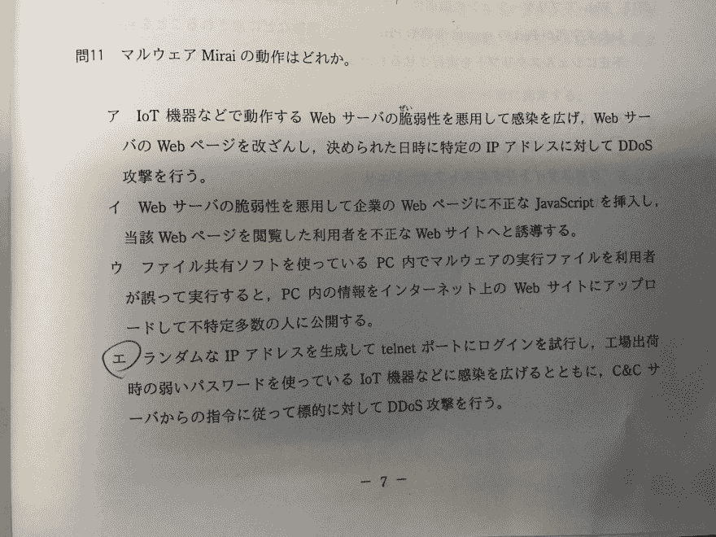

# 物联网僵尸网络构建工具“Mirai 未来组合”在日本最著名的信息技术考试中被问到

> 原文：<https://dev.to/yuyabu/iot-botnet-construction-tool-mirai-was-asked-in-most-famous-japanese-information-technology-examinations-4173>

2018 年 10 月 21 日收到一份 IPA 管理的[信息处理工程师考试](https://en.wikipedia.org/wiki/Information-Technology_Engineers_Examination)。

可能是日本最著名的软件工程师资格考试。

我选择了信息安全专家考试(SC)

我发现 Mirai 未来组合在那次考试中被问到。

这是一个问题

[T2】](https://res.cloudinary.com/practicaldev/image/fetch/s--7dMGC7jc--/c_limit%2Cf_auto%2Cfl_progressive%2Cq_auto%2Cw_880/https://thepracticaldev.s3.amazonaws.com/i/vmqt5qz1e262tuy971mh.jpeg)

这里是翻译

> 以下哪一项是恶意软件 Mirai 未来组合的行为？
> 
> A.它利用运行在物联网设备等上的 Web 服务器的漏洞。传播感染、更改 Web 服务器的网页，并在修改的日期和时间对特定 IP 地址执行 DDos 攻击。
> 
> B.它利用 Web 服务器的漏洞将非法的 JavaScript 插入到公司的网页中，并将浏览该网页的用户导向未经授权的网站
> 
> C.当用户使用文件共享软件在 PC 中错误地执行恶意软件执行文件时，它将 PC 中的信息上传到互联网上的网站，并使其对不特定数量的人公开。
> 
> D.尝试通过生成随机 IP 地址登录 telnet 端口，在出厂时使用弱密码向物联网设备传播感染等。按照 C & C 服务器发出的指令，DDoS 对它进行了攻击。

答案是 D