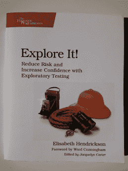

# 需要手工测试吗？

> 原文：<https://dev.to/henrikwarne/is-manual-testing-needed-1hbe>

在过去的几年里，我听到许多人提倡只使用自动测试。例如，如果所有的自动测试都通过了，那么代码就应该被自动部署到生产中。在对我的代码感到自信之前，我总是进行一些手工测试。因此，在过去的一年里，我格外关注手动测试自己代码时发现的错误。我的结论是:仍然需要手工测试。[T2】](https://henrikwarne1.files.wordpress.com/2018/05/dscf5112.jpg)

### 我是如何测试的

在工作中，我们有生产系统和测试系统。每个开发者也可以在他们自己的机器上运行这个系统。当我开发一个新特性时，我会编写单元测试和自动集成测试。通常，我的单元测试将集中在确保算法是正确的。例如，要计算追加保证金的金额，有许多内参数，如敞口金额、担保金额和阈值。单元测试确保为输入范围的所有不同组合计算正确的保证金追缴金额。集成测试使用更多的基础设施，比如 web 服务器和数据库。这些测试确保在调用 API 时返回正确的数量。他们测试一个更大的使用链，以查看所有的部分是否匹配。关于计算的所有细节都包含在单元测试中，集成测试只是确保计算在其预期的上下文中工作。

当我完成一个新特性的实现时，我必须通过单元测试和自动集成测试。然而，在我发布这个特性之前，我也喜欢做一些手工测试。我在我的机器上启动了完整的系统，包括 GUI 在内的所有部分。然后，我在这种情况下尝试新功能。我通常会测试该特性的主要部分，并检查一切是否如预期的那样工作。我会留意任何不寻常或令人惊讶的事情。我也检查日志，看看一切是否如我所料。如果我看到任何奇怪或不寻常的事，我会深入调查。一旦完成了这一步，我就认为我在这个特性上的工作已经完成了。

直到几年前，我还称之为手工测试。但是后来我读了[探索它！伊丽莎白·亨德里克森，我现在认为探索性测试很好地描述了我所做的事情。这本书一开始就区分了检查和探索。检查就是当你知道程序在给定的环境下应该如何运行，并且你验证它确实如此。这最好用自动化测试来完成。另一方面，探索要流畅得多。你尝试一些事情，让你观察到的指导你下一步做什么，同时睁大眼睛寻找潜在的错误。](https://www.amazon.com/Explore-Increase-Confidence-Exploratory-Testing/dp/1937785025/)

### 为什么需要手工测试

那么，探索性测试有必要吗？过去的一年里，我一直在断断续续地思考这个问题。我认为它是有用和必要的，主要有两个原因。一种说法比较哲学，另一种是基于我的经验。

### 1。哲学的

我认为检查和探索之间的区别非常重要。如果你认为自动测试已经足够了，那么你实际上是在说检查已经足够了，我们不需要探索。在我看来，这就等于说我们可以提前想出所有我们需要的测试用例。我认为那是不可能的。

这类似于一般的软件开发。在开始之前想出整个设计实际上是不可能的。相反，你需要采取一种迭代的方法，一路学习，并在下一步开发程序时结合新的知识。这与不运行完整的程序就想出所有需要的测试是一样的。几乎不可能想出所有的情况。

探索性测试和自动集成测试之间的关系类似于集成测试和单元测试之间的关系。需要集成测试来查看单元测试中测试的逻辑是否适合更大的画面。探索性测试是在最高层次上完成的——整个系统。这些是需要的，以确保所有已经被自动测试过的东西都适合并有意义，不仅仅是它们本身，而是作为整体的一部分。

所以如果你认为自动化测试已经足够了，你也是在说没有必要进行探索性测试。我认为这是错误的——我认为我们需要检查和探索，而不仅仅是检查。

### 2。经验

在过去的一年里，我格外关注在手动测试中发现的错误。我一直试图用自动化测试覆盖一切，但在探索整个系统时，我仍然发现了 bug。类似于我如何[跟踪有趣的 bug](https://henrikwarne.com/2016/04/28/learning-from-your-bugs/)，我已经跟踪了这些通过检查发现的 bug 的实例，但是在探索时被发现。总的来说，大约一个月发生一次。这里有两个例子:

**1。字符串对浮点。**我添加了一个功能，可以根据不一致的金额停止某些保证金通知。在一个案例中，这意味着检查认购金额是否大于抵押品金额。为不同的场景编写自动测试非常简单。然而，当通过 GUI 尝试一个案例时，我得到了一个令人惊讶的结果。这看起来像测试“如果 8 > 9”是真的！在调查时，我发现 python 代码将字符串‘8’与浮点数‘9’进行了比较。在 python 2.7 中，这不是错误，而是返回 true！由于历史原因，当时的 GUI 将所有值作为字符串发送。但是在后端，数字是以浮点数的形式存储的。这就是为什么在比较中出现了类型不匹配，导致了错误的结果。在我所有的自动测试中，我假设来自 GUI 的 API 调用是浮点型的，但是这被证明是不正确的。

**2。不应该发生什么。**以前，协议币种和协议类型在岗位上设置一次，之后不能更改。我们希望在没有追加保证金的情况下也能改变这些值。同样，代码很容易编写和测试。然而，当在整个系统上测试时，我注意到当我只改变协议货币时，协议类型被清除为*无*。这是错误的。在我的测试中，我断言每个变化都有预期的效果。然而，我没有断言其他值*没有*改变。但是当在 GUI 中尝试时，很明显不止一个值被改变了。

这里的要点并不是不可能提出捕捉这些错误的自动测试。关键是，在这些情况下，不是我想出来的。你同样可以争辩说，你的代码中不应该有任何错误，因为你可以事先考虑到这些情况，并处理它们。理论上这是可能的，但实际上还是会出现错误。提出测试也是如此。探索性测试是捕捉自动化测试难以捕捉的 bug 的相对廉价的方法(因为你没有考虑到案例)。以我的经验来看，测试用例很难考虑的 bug 往往在整体使用系统的时候变得很明显。

我认为这些错误的一个原因是自动测试关注于代码，而探索性测试关注于系统的行为。我在手动测试阶段发现的许多错误都是由我所做的不真实的假设引起的。我还注意到，手工测试经常让我想到要运行额外的测试。

伊丽莎白·亨德里克森也有同样的经历。早在探索它！她引用(并同意)一位同事的评论:“*不管我们写了多少测试，不管我们执行了多少案例，我们总是在偏离脚本的时候发现最严重的错误*”。这也是我的经历。

[T2】](https://henrikwarne1.files.wordpress.com/2018/05/dsc_6493.jpg)

### 备注

进行手动测试并没有说明是否要使用一个临时的或者本地的系统。在生产中进行人工测试是可能的。如果您使用功能标志，您可以将新功能部署到生产环境中，但是限制对它们的访问，直到它们已经过手动测试。

您还可以手动测试，并自动将合并到主数据库的所有内容部署到生产环境中。在这种情况下，您需要在分支中进行手动测试，并且只有在新的特性被检查和探索的时候，才合并到 master。

还要注意，手动测试并不一定意味着有 GUI。即使只能通过 API 访问系统，您也可以进行手工测试。在这种情况下，测试包括在用户使用系统时将系统作为一个整体来使用。您使用系统来完成一项任务，这通常不仅仅是简单地发出一个 API 调用并获得一个响应。

最后，做一些手工测试并不意味着大规模、批量、不频繁的发布。手动测试在连续交付的情况下运行良好。然而，总会有错误溜走。与自动测试相比，手动测试是一种不同的测试，它有助于消除一些错误。对于仍然漏网的 bug，我们必须快速排查并修复。

### 结论

我目前对测试的看法是，手动测试是自动测试的一个有价值的补充。我的经验是，我经常用这种方法发现严重的错误，而且做这种测试的成本很低。我有兴趣听听其他的观点和经历。你如何做测试？你同意还是不同意我的结论？请在评论中告诉我。