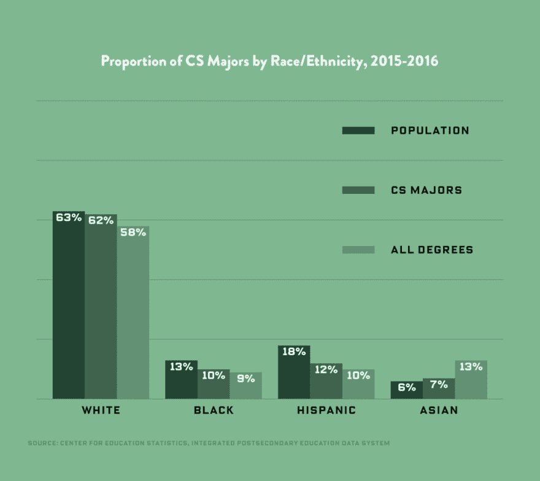
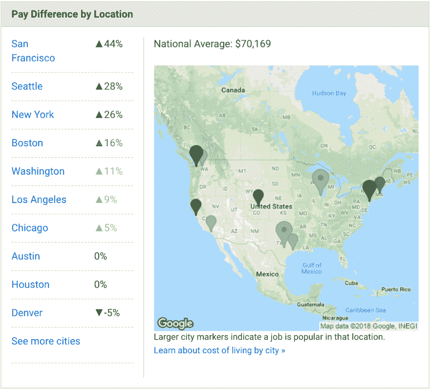

# 今天是做开发者的最好时机吗？不...但是我们正在好转。

> 原文：<https://dev.to/remotesynth/is-today-the-best-time-to-be-a-developer-nobut-were-getting-better-5ik>

我已经做了 20 多年的开发人员。在这 20 多年的时间里，我经常听到这样的说法:“现在是成为开发人员的最佳时机”或者“现在是成为[技术名称]开发人员的最佳时机。”但是，说实话，这并不总是准确的。或者，也许就像 2009 年那篇吹捧“成为黑莓开发者的最佳时机”的文章一样，它是准确的，因为所有错误的原因(就像，事情在那之后相对迅速地恶化)。

[T2】](https://res.cloudinary.com/practicaldev/image/fetch/s--oCdFEGoj--/c_limit%2Cf_auto%2Cfl_progressive%2Cq_auto%2Cw_880/https://thepracticaldev.s3.amazonaws.com/i/mo19ywi1m0hyqat4ghfy.png)

在一篇文章的副标题中，你能容纳多少讽刺？

所以，如果我们诚实地问自己，今天是做开发者的最好时机吗？我个人的答案是否定的，但有一点要提醒的是，我们在很多事情上都做得很好，也有很多事情做得不好，我们正在积极努力改进。让我解释一下。

注意:我意识到，在很大程度上，本文部分呈现的数据和信息是以美国为中心的。这是我自己的经验所在，也是我觉得我有资格诚实地讨论开发者经验和工作场所的地方。

## 坏了

好的。让我们先把坏消息说完...不幸的是，今天的开发者面临着相当多的问题。

### 行业的形象

在过去的几年里，业内一些最大的(以前也是最受尊敬的)公司名誉扫地。无论是优步的性别歧视和厌女症，脸书的假新闻和暴露个人信息，Twitter 未能阻止其服务的猖獗滥用和误用，还是谷歌的性别歧视(和性别歧视备忘录)。例如，[这是去年以来的重大丑闻的时间表](https://instamotor.com/blog/biggest-tech-scandals-2017)。甚至在今天，当我写这篇文章的时候，[谷歌的员工正在为公司如何处理性骚扰而罢工。](https://www.nytimes.com/2018/11/01/technology/google-walkout-sexual-harassment.html)

我会继续下去，但这是令人沮丧的。简单地说，这个行业曾经辉煌的名声现在已经被严重玷污了。整个行业的问题很大程度上是一个道德问题，而不是技术问题。这显然会影响商业和行业，但也会直接涉及到开发者。当今科技行业的开发人员经常成为一道重要的防线——他们被迫忽略“我们能建造它吗？”并回答“即使我们可以，我们也应该建造它吗？”像大数据、人工智能和机器学习这样的新技术只会使这个难题进一步复杂化，并将开发人员置于有可能在未来引发丑闻的项目的核心。

尽管有这些丑闻，这个行业仍在持续增长。

### 多样性

谈到多样性，科技行业有一个好名声，也有坏名声。虽然科技领域的多样性问题不仅仅局限于开发人员，但它绝对适用。

从积极的一面来看，Wired 的这篇文章中引用的数据显示，寻求计算机科学学位的非白人占总人口的比例显著增加。

[T2】](https://res.cloudinary.com/practicaldev/image/fetch/s--h9kQsFcA--/c_limit%2Cf_auto%2Cfl_progressive%2Cq_auto%2Cw_880/https://thepracticaldev.s3.amazonaws.com/i/2uhsjnqejcwyntz028f5.jpg)

*图片来源:[https://www . wired . com/story/computer-science-graduates-diversity/](https://www.wired.com/story/computer-science-graduates-diversity/)T3】*

相对于他们在美国人口中所占的比例而言，黑人和西班牙裔仍然代表不足，但情况已经有所改善。然而，数据还显示，大多数增加的代表是男性:

> 具有讽刺意味的是，如今，获得大学学位的女性比男性多，尽管学习计算机科学的女性人数正在下降。
> 
> 布兰卡·迈尔斯(Blanca Myers)，[科技行业的女性和少数族裔，按数字统计](https://www.wired.com/story/computer-science-graduates-diversity/)

这一点得到了其他研究的证实，这些研究显示“从 2004 年到 2014 年，女性获得学士学位的比例在所有七个[科学和工程]学科中都有所下降。”学位通常是开发人员职业生涯的第一步(尽管还有其他非学位途径)。因此[最近一项由编程女孩和埃森哲](https://www.accenture.com/t20161018T094638__w__/us-en/_acnmedia/Accenture/next-gen-3/girls-who-code/Accenture-Cracking-The-Gender-Code-Report.pdf)进行的研究也描述了女性开发人员在劳动力中所占份额的下降:

> 埃森哲(Accenture)和编程女孩(Girls Who Code)的研究显示，女性在美国计算劳动力中的比例正在下降。按照目前的趋势，到 2025 年，美国只有五分之一的计算机工作由女性担任。
> 
> [破解性别密码](https://www.accenture.com/t20161018T094638__w__/us-en/_acnmedia/Accenture/next-gen-3/girls-who-code/Accenture-Cracking-The-Gender-Code-Report.pdf)

任何关注社交媒体或只是与女同事交谈过的人都知道，女性经常面临充满敌意的工作和职业环境——在会议或工作场所受到骚扰或仅仅是不恰当的故事似乎没完没了，令人沮丧。我不能诚实地说情况是否正在改善，但我知道越来越多的女性似乎勇敢地分享并经常直接面对这个问题，我认为这已经并将继续产生影响。

### 面试流程

在这一部分，我首先要说的是，我完全知道判断开发人员职位候选人的素质有多难。当你的业务依赖于代码时，你的软件工程师的质量尤其重要。计算机科学学位或相关经验等一些资格是一个很好的指标，但往往不具备公司需要的一些特定技能。作为一个行业，我们也尝试过认证，但迄今为止发现它们缺乏实用性——也许是因为我们工作的性质在不断变化。

尽管如此，我们最终采用的解决方案仍有其缺陷。

> 很好——但是仍然要准备好通过一个与你的实际工作没有什么关系的晦涩难懂的谷歌代码测试。好吧，好吧，雷，闭嘴，别提你那该死的考试不及格了...)【https://t.co/kHUsDdb29C T2】
> 
> — Raymond Camden ([@raymondcamden](https://dev.to/raymondcamden) ) [August 23, 2018](https://twitter.com/raymondcamden/status/1032620254650937344?ref_src=twsrc%5Etfw)

现在，将白板和复杂代码测试或谜题作为开发人员工作面试过程的一部分，几乎是一个全行业的标准。这些几乎总是被包括在内，不管这个人的背景或经验水平如何，这导致了奇怪的情况，例如一个有几十年经验的出版作者在一次测试中被拒绝，如上所述。或者一位广受尊敬的 JavaScript 专家因为缺乏 JavaScript 知识而被拒绝录用:

> 几年前，我被推特拒绝了一份工作，尽管我知道团队中有几个喜欢我的人希望我加入。后来 HR 告诉我，其中一个面试官说我“不太了解 JS”。这也是 [@YDKJS](https://twitter.com/YDKJS?ref_src=twsrc%5Etfw) 的部分动机。[#分享你的拒绝](https://twitter.com/hashtag/ShareYourRejections?src=hash&ref_src=twsrc%5Etfw)
> 
> — getify ([@getify](https://dev.to/getify) ) [August 23, 2018](https://twitter.com/getify/status/1032445705204449281?ref_src=twsrc%5Etfw)

在我看来，这是一个强调有时不必要的编码知识的过程，这有利于使开发人员更加成功的特性——比如学习的意愿、与他人合作的能力以及创造性地解决问题的能力。

它也倾向于雇佣那些献身于代码的人，这给我们带来了我想谈的最后一个负面影响。

### 倦怠

公平地说，每种类型的工作都有可能产生倦怠，但我也认为公平地说，作为专业开发人员的某些特征会导致高度的倦怠。快速的谷歌搜索会产生无数关于[开发者](https://www.google.com/search?q=burnout+developers&oq=burnout+developers)或[程序员倦怠](https://www.google.com/search?q=burnout+programmer&oq=burnout+programmer)的帖子和帖子。

部分原因与我们通过面试招聘的人员类型有关。我们是一个经常赞美那些生活和呼吸代码的行业。这是一种被“硅谷”电视节目完美模仿的职业道德，节目中的程序员实际上是在工作中生活的(不，这甚至不是一个笑话)。许多科技公司甚至通过提供服务来推动这种职业道德，鼓励人们继续工作，甚至围绕工作建立社交生活。当然，这些是为所有员工准备的，但是开发人员经常有额外的期望，他们应该回家从事激情项目或开源项目，以保持他们的简历具有竞争力。

这种职业道德给每个开发人员带来压力，让他们在同一水平上竞争。当与需要不断适应和学习的工作的自然要求混合在一起时，这可能是一种有害的组合。

## 好人

希望在这一点上，我没有让你对你的潜在或当前的开发职业感到完全气馁。正如你所看到的，上面的项目通常与开发人员必须从事的工作和行业有关。好消息是，当实际编码时，事情真的很好。而且，开发人员的工作和行业也有好的方面。

让我们改善一下心情，看看这些。

### 免费和开源的开发者工具和库

我们生活在一个对开发者来说普遍可用且高质量的免费开源软件的时代。对于今天的开发人员来说，它是如此的无处不在，以至于很难想象我们曾经讨论过开源软件的价值和可行性。这种无处不在也导致我们有时习惯于巨大的利益。

首先，我们来看一些数字。截至 2017 年，Github 拥有 2500 万个公共存储库。红宝石宝石[将近 150，000 个](http://www.modulecounts.com/)模块。npm 拥有[将近 700，000](http://www.modulecounts.com/) 个软件包，使其成为世界上最大的软件包注册中心。这些只是承载开发人员使用的项目的资源中的一部分。

但另一个要点是，开发人员所依赖的项目质量很高。在许多情况下，这些项目是由技术行业中一些最大的公司创建的，或者在某种程度上是由这些公司支持的。

虽然所有这些工具确实有助于一些复杂的工作流和架构，但它也提供了以前非常昂贵或不存在的资源。例如，当我 20 多年前开始从事 web 开发时，我记得在 Dreamweaver、Flash 和 ColdFusion Studio 上花了数百美元(不低于 1997 年的美元)...每个！

[T2】](https://res.cloudinary.com/practicaldev/image/fetch/s--AnhfBguT--/c_limit%2Cf_auto%2Cfl_progressive%2Cq_auto%2Cw_880/https://thepracticaldev.s3.amazonaws.com/i/94gyw9un2n4u7rixfea5.jpg)

是的，从前软件是装在收缩包装的盒子里的！

这对潜在的开发商来说是一个巨大的进入壁垒。我还记得，多年后，我在目录中搜索项目的商业解决方案(比如购物车或公告栏)。这使得很难找到正确的解决方案，而且，从我的经验来看，质量并不比成本好。

### 学习材料的可用性

继续这个主题(很明显我正在变老)，当我开始我的职业生涯时，几乎所有可用的学习资源都是以书籍的形式。这些要么是随昂贵的软件一起提供的手册，要么是出版商出售的书籍，价格从 60 美元到 100 美元不等(还是 1997 年的美元价格)。

如今，学习材料有多种形式:书籍、教程、视频、互动培训。软件公司提供的软件都是在线的，而且大部分都是免费的(即使是商业软件)。虽然图书出版商仍在出版，但许多出版商已经从印刷格式转向数字格式，这种格式通常更便宜，甚至允许更短的格式，这意味着以前可能不会有整本书的主题现在得到了涵盖。像 [Pluralsight](https://www.pluralsight.com/) 、 [LinkedIn Learning](https://www.linkedin.com/premium/plan/learning) 、 [Udemy](https://www.udemy.com/) 等公司提供广泛的学习平台，涵盖包括编程和开发在内的大量主题。

老实说，有太多的资源让我无法一一列举。甚至对于那些可能没有预算购买这些服务的人来说，他们也可以找到类似于 [FreeCodeCamp](https://www.freecodecamp.org/) 或关于[实用开发者](https://dev.to/)或 [CSS 窍门](https://css-tricks.com/)的无止境的免费教程，这是我最喜欢的几个例子。

当然，你还有各种各样的会议(当然，价格各不相同)，专注于本地节目的聚会，甚至在线聚会和会议。

我可以继续说下去，但我想你明白重点了。

### 需求

在我们生活的世界里，一些最强大的公司都是由开发人员运营的。在这个世界里，从我们的汽车到我们的智能家居灯泡，一切都需要某种程度的代码。因此，对开发人员的需求持续增长也就不足为奇了。

根据美国劳工统计局职业展望手册，到 2026 年，对开发人员的需求预计将增长 24%，比平均水平快得多。对网络开发者来说，它应该增长 15%，也比平均水平快得多。

消息并不都是乐观的。计算机程序员的前景预计将下降 7%。迷茫？我也是。我认为软件开发人员和 web 开发人员是计算机程序员，官方的定义并没有否认我的观点。再说一次，我不为政府工作。

### 支付

稳定的需求通常会带来丰厚的报酬，一般来说，美国和全球的开发商都过得不错。例如，[栈溢出开发者调查](https://insights.stackoverflow.com/survey/2018#salary)显示全球开发者年收入在 4 万到 9 万美元之间。仅在美国，这一数字就要高得多，从每年 8 万美元到 14 万美元不等(美国官方劳工统计局(Bureau of Labor statistics)估计，2017 年软件开发人员的工资中值为 10.3 万美元，而网络开发人员的工资中值远低于 6.7 万美元)。尽管全球数字远低于美国，但它们都远高于美国个人收入的中位数，即 31099 美元。

对此需要注意的是，大部分高薪似乎集中在特定的地理区域。以美国为例， [PayScale 数据](https://www.payscale.com/research/US/Job=Software_Developer/Salary)显示全国平均工资为 70169 美元，远低于 StackOverflow 数据，但仍远高于个人收入中位数。然而，高收入人群主要集中在几个地方:旧金山、纽约和西雅图。

[T2】](https://res.cloudinary.com/practicaldev/image/fetch/s--30Gwzaaq--/c_limit%2Cf_auto%2Cfl_progressive%2Cq_auto%2Cw_880/https://thepracticaldev.s3.amazonaws.com/i/4d8mf24dugyrxcxk0sgu.png)

## 明天是成为开发者的最佳时机——所以从今天开始吧！

在看待这个问题时，我试图做到公平和诚实。诚然，有很多重要的不利因素，但我并不消极或悲观。我很感激作为一名开发人员工作了这么多年，并把自己算作开发人员社区的一员。我也真诚地相信，我们正在努力在目前不足的每一个领域做得更好。这意味着——即使今天可能不是开发人员的最佳日子——明天是。没有比今天更好的开始明天建设的日子了！