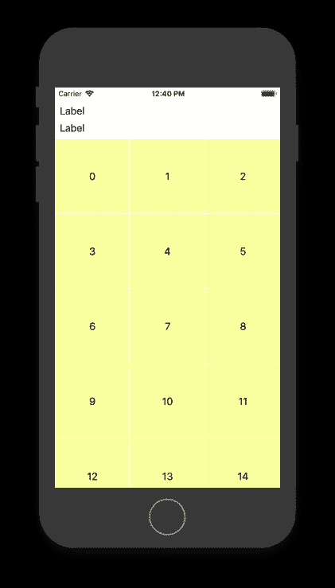

# is active = true vs . nslayoutconstraint . activate

> 原文：<https://dev.to/zeitschlag/isactive--true-vs-nslayoutconstraintactivate-2ec>

app 的整个 UI，我帮忙开发的，都是用代码写的。没有故事板，没有 xib，只有迅捷。很久以前有人做了这个决定。然而，我们正在使用 AutoLayout，就像现在每个酷孩子应该做的一样。

通常，我们的代码看起来像这样:

```
self.titleLabel.topAnchor.constraint(equalTo: self.titleView.opAnchor, constant: 16).isActive = true 
```

现在想象一下，有不止一个约束，以此为例:

```
contentWrapper.leftAnchor.constraint(equalTo: swipeContentView.leftAnchor, constant: 8).isActive = true
contentWrapper.rightAnchor.constraint(equalTo: swipeContentView.rightAnchor, constant: -8).isActive = true
contentWrapper.topAnchor.constraint(equalTo: swipeContentView.topAnchor, constant: 4).isActive = true
contentWrapper.bottomAnchor.constraint(equalTo: swipeContentView.bottomAnchor, constant: -4).isActive = true

imageView.topAnchor.constraint(equalTo: contentWrapper.topAnchor, constant: 12).isActive = true
imageView.leftAnchor.constraint(equalTo: contentWrapper.leftAnchor, constant: 12).isActive = true
imageView.widthAnchor.constraint(equalToConstant: 120).isActive = true
imageView.heightAnchor.constraint(equalToConstant: 90).isActive = true

titleContainerStackView.leftAnchor.constraint(equalTo: imageView.rightAnchor, constant: 12).isActive = true
titleContainerStackView.topAnchor.constraint(equalTo: contentWrapper.topAnchor, constant: 12).isActive = true
titleContainerStackView.rightAnchor.constraint(equalTo: contentWrapper.rightAnchor, constant: -12).isActive = true

stepper.translatesAutoresizingMaskIntoConstraints = false
stepper.leftAnchor.constraint(equalTo: contentWrapper.leftAnchor, constant: 12).isActive = true
stepper.topAnchor.constraint(equalTo: imageView.bottomAnchor, constant: 9).isActive = true
stepper.widthAnchor.constraint(equalToConstant: 120).isActive = true
stepper.heightAnchor.constraint(equalToConstant: 32).isActive = true

shortDescriptionLabel.topAnchor.constraint(equalTo: titleContainerStackView.bottomAnchor, constant: 4).isActive = true
shortDescriptionLabel.leftAnchor.constraint(equalTo: imageView.rightAnchor, constant: 12).isActive = true
shortDescriptionLabel.rightAnchor.constraint(equalTo:contentWrapper.rightAnchor, constant: -12).isActive = true

bottomStackView.bottomAnchor.constraint(equalTo: contentWrapper.bottomAnchor, constant: 0).isActive = true
bottomStackView.leftAnchor.constraint(equalTo: contentWrapper.leftAnchor, constant: 12).isActive = true
bottomStackView.rightAnchor.constraint(equalTo: contentWrapper.rightAnchor, constant: -12).isActive = true 
```

我认为这种方法有两个问题:

*   虽然在你写这段代码的时候，一次做两件事——创建一个约束和激活它们——对你来说可能很舒服，但这是你未来的自己会讨厌你的事情。
*   有忘记加一个`.isActive = true`的风险，至少几分钟前我就遇到过这种情况。

有一种比单独激活每个约束更好的方法:它叫做 [`NSLayoutConstraint.activate()`](https://developer.apple.com/documentation/uikit/nslayoutconstraint/1526955-activate) :

> 这种方便的方法提供了一种简单的方法，通过一次调用就可以激活一组约束。此方法的效果与将每个约束的 isActive 属性设置为 true 相同。通常，使用此方法比单独激活每个约束更有效。— [来源](https://developer.apple.com/documentation/uikit/nslayoutconstraint/1526955-activate)

过去几个小时，我一直在做一个屏幕，上面有两个`UILabel`和一个`UICollectionView`。最后，它应该看起来像这样:

[T2】](https://res.cloudinary.com/practicaldev/image/fetch/s--e3xYxkwn--/c_limit%2Cf_auto%2Cfl_progressive%2Cq_auto%2Cw_880/https://zeitschlag.net/conteimg/2018/07/Bildschirmfoto-2018-07-17-um-12.40.42.png)

所以我添加了所有的元素和约束，然后按下`CMD+R`。但是没有用。数字是不可见的，但同时，没有不可满足的约束。我仔细检查了约束条件，它们看起来很好。过了一段时间，我发现少了一个`isActive = true`。

在解决了这个问题并再次使用`CMD+R` -ing 之后，我马上使用 [`NSLayoutConstraint.activate()`](https://developer.apple.com/documentation/uikit/nslayoutconstraint/1526955-activate) 进行了一点重构。现在这段代码看起来像这样:

```
let constraints = [
    self.titleLabel.topAnchor.constraint(equalTo: self.view.topAnchor, constant: 16),
    self.titleLabel.leadingAnchor.constraint(equalTo: self.view.leadingAnchor, constant: 16),
    self.view.trailingAnchor.constraint(equalTo: self.titleLabel.trailingAnchor, constant: 16),
    // ...
]

NSLayoutConstraint.activate(constraints) 
```

好多了。如果你非常严格，你可能会说，我应该在将每个约束添加到`constraints`-数组之前将它放入一个常量中。

我很确定，一开始使用`NSLayoutConstraint.activate()`会节省我一些时间。当我将来添加更多约束时，我不必考虑激活它们。如果我忘记了`,`，编译器会抱怨。未来-内森会为此而感激的。

希望如此。

感谢您阅读本文。