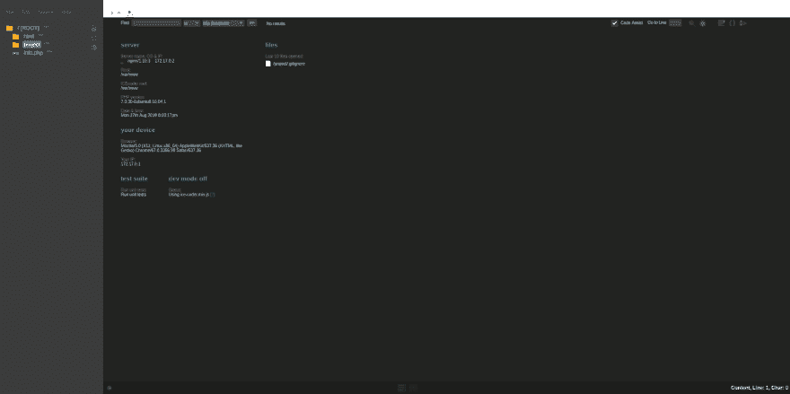

# docker 上的独立开发环境(远离云 9)

> 原文：<https://dev.to/darksmile92/isolated-dev-environments-on-docker-moving-away-from-cloud9-3id>

从 [cloud9](https://c9.io/) (带有隔离容器的云 IDE)迁移到本地解决方案，我发现 [ICEcoder](https://icecoder.net/) 是一个我可以自己托管的浏览器 IDE。

目录:

*   为什么从 c9 转移到本地码头集装箱？
*   为什么选择 ICEcoder？
*   要遵循的步骤

## 为什么 c9 - >本地码头工人集装箱？

我决定存点钱，把我的数据留在我的机器上。Cloud9 运行 [ACE 编辑器](https://github.com/ajaxorg/ace)连接到称为工作区的容器。用户可以根据需要创建任意多的工作区，通过 URL 访问它们，开始编辑代码，访问终端，并通过浏览器与之交互。
这确实非常好，尤其是那些工作空间是孤立的容器。
但正如我提到的，我想存些钱，暂时把我所有的东西都放在本地。
除了这些确凿的事实，这是一个晚上的好项目:)

## 我为什么选择 ICEcoder

在尝试设置 ACE 编辑器后，我意识到 c9 上漂亮的文件浏览器是他们做的一个扩展，而这并不包含在 ACE 编辑器本身中。这就是我寻找其他基于浏览器的 IDEs 代码编辑器的原因。ICEcoder 第一眼看上去不错，而且有一个文件浏览器，所以决定就这么做了。
另外:运行它只需要 PHP！非常少的依赖项，使用的空间很小(与 ace 的许多 npm 模块相比！).

## 步骤设置

我创建了一个 Github 库来方便克隆(对我来说也是如此):

##  [暗黑微笑 92](https://github.com/DarkSmile92)/[rdev-容器](https://github.com/DarkSmile92/rdev-container)

### 带有 ace 编辑器的 Docker 容器

<article class="markdown-body entry-content container-lg" itemprop="text">

# rdev 容器

这是一个 Docker 容器，带有作为独立 IDE 环境安装的 [ICECoder](https://icecoder.net/) ，只需构建基础映像，然后主映像并启动它，您就可以使用 [ICECoder 浏览器 IDE](https://icecoder.net/) 进行开发了。

我们的想法是从 cloud9 中迁移出来，并且仍然拥有独立的开发环境，因为 containers Docker 似乎是这个任务的正确选择，而 [ICECoder](https://icecoder.net/) 看起来不错，具有最小的依赖性。

## 快速启动

在一个命令中构建基础映像和映像，然后运行它

```
sudo ./build.sh && sudo docker run -p 80:80 -d rdev-container 
```

## 构建基础映像

```
cd base-image && sudo docker build -t rdev-base . && cd .. 
```

## 建立形象

```
sudo docker build -t rdev-container . 
```

## 构建映像(无缓存)

```
sudo docker build --no-cache -t rdev-container . 
```

## 运行映像

```
sudo docker run -p 80:80 -d rdev-container 
```

## 将代码/项目文件夹放在哪里？

将您的代码放在`/var/www/`下…

</article>

[View on GitHub](https://github.com/DarkSmile92/rdev-container)

### 急步——给不耐烦的人

1.  克隆我的 Github repo
2.  遵循自述文件-快速入门中的步骤
3.  打开网址: [http://localhost/ice](http://localhost/ice)

```
git clone https://github.com/DarkSmile92/rdev-container rdev-container
cd rdev-container && sudo sh ./build.sh
sudo docker run -p 80:80 --name devEnv1 -d rdev-container 
```

Enter fullscreen mode Exit fullscreen mode

### 对于那些想要细节的人

*   克隆我的 Github repo

`git clone https://github.com/DarkSmile92/rdev-container rdev-container`

*   构建 docker 基础映像和最终映像

我决定把它分开，以防必须改变依赖关系。

*   使用类似于 *devEnv1* 的名称运行它:

`sudo docker run sudo docker run -p 80:80 --name devEnv1 -d rdev-container`

### 结果

[T2】](https://res.cloudinary.com/practicaldev/image/fetch/s--u9Db4VV---/c_limit%2Cf_auto%2Cfl_progressive%2Cq_auto%2Cw_880/https://thepracticaldev.s3.amazonaws.com/i/mqfogk6d1wia1ekw9abd.png)