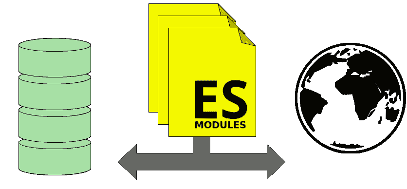

# 同构 ES 模

> 原文：<https://dev.to/adarosecannon/isomorphic-esmodules-ko>

## 又名，一个与浏览器端脚本共享 node_modules 的奇怪技巧。

前面我演示了如何构建一个与服务器端代码共享模板的单页面应用程序。(见下面视频。)

我们共享 web 应用程序的模板，以便在服务器上预先呈现第一个页面加载。这种做法让 Web 应用程序启动更快，对网络故障更有弹性。

[T2】](https://res.cloudinary.com/practicaldev/image/fetch/s--Tf3o15wp--/c_limit%2Cf_auto%2Cfl_progressive%2Cq_auto%2Cw_880/https://cdn-images-1.medium.com/max/2000/1%2A9utC7ugklGeMjQoU_MluQQ.png)

在实时编码会话中，我们使用新的 EcmaScript (ES)模块，因为它允许我们直接共享代码，而无需使用变通办法，例如使用 WebPack 或 Browserify 制作包。

尽管如此新，ES 模块还是有很高的浏览器支持水平。对 ES 模块的支持现在高达 70%！对三星互联网的支持将在不久的将来发布。

[https://www.youtube.com/embed/fe6-HQLBJh8](https://www.youtube.com/embed/fe6-HQLBJh8)

> 视频演示的最终源代码:[https://glitch.com/edit/#!/ada-同构？path=server.js:2:20](https://glitch.com/edit/#!/ada-isomorphic?path=server.js:2:20)

### 定义术语 ES 模块和同构

**[ES 模块](https://developer.mozilla.org/en-US/docs/Web/JavaScript/Reference/Statements/import)**——*名词。*

你可能已经在工作中使用模块系统了。如果您是在*节点*工作的 web 开发人员，那么您很有可能遇到过 CommonJS 模块。CommonJS 模块允许您从其他 JavaScript 文件中获取 JavaScript 片段。例如:

```
const formatDate = require('./time-utils/format-date.js'); 
```

还有从由 *npm* 打包系统提供的文件中提取 JavaScript 代码的能力。

```
const express = require('express'); 
```

通过使用捆绑工具，如 *rollup* 、 *browserify* 或 *webpack* ，这些例子也可以在浏览器中使用。这可能导致将大量代码发送到浏览器，而不是在需要时加载它们，除非您将开发环境设置为自动拆分代码。

ES 模块类似于 CommonJS 模块，因为它们允许我们从其他 JavaScript 文件中获取 JavaScript 代码片段，只是这次它被设计为通过网络在浏览器中工作。例如:

```
<script type="module"> 
  import formatDate from 'https://site.com/time-utils/format.js';
  formatDate(Date.now());
</script> 
```

或者从本地 URL:

```
<script type="module">
  import formatDate from './time-utils/format.js';
  formatDate(Date.now());
</script> 
```

在本文中，我们将探讨 CommonJS 模块和 es 模块之间的一些差异。

**同构**——*形容词。*

以同构方式编写的代码具有能够在节点服务器和 web 浏览器中执行其功能的特性。

这样做的好处是不必在客户机和服务器上重新实现逻辑。必须用两种不同的语言重写逻辑可能会导致不同的行为，或者随着时间的推移，当独立地对每个文件进行更改时，逻辑会慢慢地发生变化。

### 使用 ES 模块编写单页应用程序，服务器端渲染为第一次加载。

在整篇文章中，我将使用简写*SSR *来指代服务器端渲染，而*SPA* 来指代单页面应用程序。

理想的 web 应用程序体验是快速启动，然后变成无缝的本机式体验。一个对交互反应迅速，页面之间无缝转换，并且永远不需要重新加载页面的应用。

作为 SPA 构建的网站运行起来很漂亮，但是在第一次渲染之前通常需要下载大量的 JavaScript 包。服务器端呈现允许我们在 JavaScript 下载之前显示用户需要的内容。

> **NB！**这可能会有一个副作用，即网站看起来已加载，但没有响应，因为 JavaScript 仍在下载和解析中。因此，重要的是你的网站上所有的[链接](#)都可以工作，并转到另一个可以在服务器上呈现的页面。

这是我以这种方式构建应用程序的计划:

1.  设置客户端渲染。

2.  当我按链接时，获取客户端渲染来更新页面。

3.  在服务器上导入客户端模板。

4.  让服务器在相同的 URL 上呈现相同的页面。

如果你是自己做的，先做客户端还是服务器端都没关系。我个人的偏好是建立一个伟大的 SSR 体验，然后将其增强为单页应用程序。

在这个例子中，我开始制作一个 SPA，并通过 SSR 对其进行快速加载，作为一种增强，因为今天许多开发人员喜欢首先从客户端开始，我希望这能够代表他们的体验。(此外，它将 SSR 更复杂的部分放在了最后，从而给本文带来了一个令人满意的结论。)

### 1。设置客户端渲染

我们在这里的第一个任务是选择一个合适的框架(如果你愿意，也可以不选。)对于我们的目的，它必须具有以下属性:能够在客户端和服务器上运行，并且能够通过 es 模块加载。

因为 ES 模块仍然很新，所以还没有对它们的普遍支持；很多库只提供 CommonJS 或者 UMD 模块。幸运的是，许多大型的、得到良好支持的项目同时提供了 CommonJS 模块和 es 模块版本。

对于这个例子，我们将使用 [HyperHTML](https://github.com/WebReflection/hyperHTML) ，但是希望我们遇到和解决的问题适用于您选择的框架。当然，如果你根本没有框架，这就更简单了。

我喜欢 HyperHTML，因为它非常快，非常小(4.6kb 缩小和压缩)，并且有一个名为 ViperHTML 的服务器兼容库，我们可以在那里使用。

所以首先我们通过 npm 安装 HyperHTML:

```
npm install --save hyperhtml 
```

现在我们必须在网络浏览器中访问它。为此，我必须通过我的网络服务器公开这些文件。在这种情况下，我使用的是 *express* :

```
app.use('/node_modules/', express.static('./node_modules')); 
```

现在，我可以访问客户机上我的 node_modules 目录中的任何文件。我可以从服务器上的 esm 目录导入 HyperHTML:

```
<script type="module">

  // `wire` is used for making templates in HyperHTML
  // `bind` is for writing those templates to the DOM
  import {wire, bind} from '/node_modules/hyperhtml/esm/index.js';

  // HyperHTML describes its templates using template literals
  const myTemplate = wire()`<h1>My Template</h1>`;

  // We use `bind` to render it.
  const render = bind(document.body);
  render`This is my template: ${myTemplate}`;
</script> 
```

我们将在客户机和服务器之间共享的代码是模板。它们将包含获取信息并在列表中显示信息的逻辑。我会把它存放在一个单独的地方。客户机和服务器都要引用的 js 文件:

```
// in templates.js

import {wire} from '/node_modules/hyperhtml/esm/index.js';

const myTemplate = wire()`<h1>My Template</h1>`;

export {
  myTemplate
}; 
```

然后，我们可以像往常一样在脚本中导入该文件:

```
<!-- In main.html -->

<script type="module">
  import { bind } from '/node_modules/hyperhtml/esm/index.js';
  import { myTemplate } from './templates.js';

  const render = bind(document.body);
  render`This is my template: ${myTemplate}`;
</script> 
```

### 2。响应点击事件。

一旦我们从我们的应用程序编写了模板，我们可能会有链接，应该改变网址，呈现不同的东西。

这些链接应该包括适当的应用程序状态信息，以便我们稍后进行服务器端渲染。即使它是一个单页应用程序，类似页面的东西应该导致改变'/path '和状态应该通过查询参数传递。

> **NB！**此外，网址不应该只是一个散列网址。即[搜索](#search)，因为这样的 URL 不会触发服务器端渲染所需的页面加载，以防脚本没有加载或有错误。

一旦点击其中一个“a”标签，我们就可以拦截它并做出适当的响应:

```
window.addEventListener('click', e => {
  if (e.target.tagName === 'A' && e.target.href) {
    const url = new URL(e.target.href);
    const parameters = new URLSearchParams(url.search);

    // ... Some logic to check to see if this should be handled
    // within the Single Page App ...

    render`${someTemplate(someData)}`

    // Prevent the page from reloading
    e.preventDefault();
  }
}); 
```

如果您正在使用

tags for traversing the site, e.g. search functionalities, then you will need to intercept and handle those too.

它们可能稍微复杂一点，因为您需要验证表单并做出适当的响应，但是原理与处理链接点击是一样的。记住 e.preventDefault()，否则页面还是会重新加载。

但是现在我们应该有一个基本的单页应用程序使用我们的模板。

不幸的是，用户无法刷新页面或共享 URL，因为我们没有更新地址栏，所以我们应该添加一些逻辑来处理。

```
window.addEventListener('click', e => {

    // ... Our click handling logic ...

    // Update the URL Bar
    history.pushState({feed}, 'Some title', e.target.href);

    render`${someTemplate(someData)}`

    // Prevent the page from reloading
    e.preventDefault();
  }
});

window.addEventListener('popstate', function () {
  if (history.state) {
     renderToMain`${myTemplate(history.state.feed)}`;
  }
}); 
```

历史处理逻辑是最简单的可能情况。如果您依赖于某种可能失败的异步操作，比如网络事件，那么如果异步操作失败，处理返回到旧 URL 的逻辑可能会更复杂。

### 3。在节点服务器中使用 ES 模块

默认情况下，节点模块使用 CommonJS 来导入模块。如果您尝试在 node 中使用 import，您将会得到一个错误，因为 node 还不理解 ES 模块。

幸运的是，有解决办法。节点模块 *[esm](https://www.npmjs.com/package/esm)* 让我们只需改变启动应用的方式，就可以在浏览器中使用导入。

```
npm install --save esm 
```

然后，我们可以更改启动脚本，用-r esm 调用节点。例如，我是这样在我的包中启动 node 的。

```
"scripts": {
  "start": "node -r esm server.js"
}, 
```

Esm 允许我们与 CommonJS 一起使用 ES 模块。这两个命令是等效的:

```
const path = require('path');

import path from 'path'; 
```

让我们导入我们的模板:

```
import { myTemplate } from './static/templates.js' 
```

这通常对于同一目录中的 JavaScript 依赖关系非常有用，但是在依赖于/node_modules 目录中的文件的情况下，节点将尝试通过路径/node_modules 找到它，该路径不是脚本旁边的真实目录。它实际上在别的地方。

因此，导入我们的 template.js 文件将会出错，因为。/static/templates.js 依赖于/node _ modules/hyperhtml/ESM/index . js，它无法解析为 node 中的有效路径。

此外，在服务器上，我们希望使用*viper html*,*hyperhtml 的节点版本。*

在上面的视频中，我通过创建一个代理文件/static/scripts/hyper/index.js 来解决这个问题，该文件在节点:

```
import {wire, bind} from 'viperhtml';
export {
  wire, bind
} 
```

当我尝试在客户端加载/static/scripts/hyper/*时，express 会像以前一样拦截路由并返回/node _ modules/hyperhtml/ESM/index . js。

这可以工作，但是有点乱。幸运的是，自从录制视频后， [Andrea Giammarchi](https://twitter.com/webreflection) 提出了一个更简洁的解决方案，创建了一个额外的加载程序，它将重写导入模块的路径从“/m/module/index.js”更改为从“module/index.js”导入模块，后者在节点端工作。
[**ESM-iso***同构 ESM Loader*www.npmjs.com](https://www.npmjs.com/package/esm-iso)

如果您喜欢使用/node_modules/作为 URL 来访问节点模块，就像我在示例中所做的那样，我将它分支为从“/node_modules/module/index.js”映射导入模块，以从“module/index . js”
[**斜杠-node-modules-loader***与-r 斜杠-node-modules-loader 一起使用，以便能够要求 from require('/node _ modules/:somedir/some file . js ')拥有…*www.npmjs.com](https://www.npmjs.com/package/slash-node-modules-loader)

这里有一个展示如何使用它的示例演示:[https://glitch.com/edit/#!/isomorphic?path=server.js:19:0](https://glitch.com/edit/#!/isomorphic?path=server.js:19:0)

这些模块允许正确解析/m/something 或/node_modules/something 的任何导入。而不需要做任何巧妙的重写。

对于节点库和浏览器库不同的情况，我们仍然需要进行重定向。在这种情况下，我们的 JavaScript 模块应该需要服务器端版本，然后我们可以在网络中添加一个路由，以便在试图加载客户端版本时重定向到客户端版本。

```
// main.js

// This works fine when loaded on the server
import myLibrary from '/node_modules/node-my-library'; 
```

在服务器上，我们不是提供 node-my-library，而是提供 browser-my-library，这样浏览器版本就可以使用正确的文件。

```
// server.js
...
app.use(
  '/node_modules/node-my-library',
   express.static('/node_modules/browser-my-library')
)

app.use(
  '/node_modules',
  express.static('./node_modules')
) 
```

### 4。使用服务器上的模板

根据您使用的框架，此步骤会有所不同，但下面是我们如何在服务器上使用 viperHTML 进行渲染:

```
import {myTemplate} from './static/templates.js';
import viperHTML from 'viperhtml';
import fetch from 'node-fetch';

// Make the browser fetch work in node
global.fetch = fetch;

// Async version of bind() for writing to the network
const asyncRender = viperHTML.async();

const indexFile = fs.readFileSync('./static/index.html', 'utf8').split('<!-- render here -->');

app.get('/', (req,res) => {

  // Set the content type header
  res.set({ 'content-type': 'text/html; charset=utf-8' });

  // Use viperhtml's to render and pipe over the network
  (asyncRender(chunk => res.write(chunk))` ${{html: indexFile[0]}} ${myTemplate(req.query.foo)}  ${{html: indexFile[1]}}
  `)
  .then(() => res.end())
}); 
```

我们通过将 foo 查询参数传递给模板 req.query.foo，根据 url 的查询参数呈现模板

视频演示的最终源代码:[https://glitch.com/edit/#!/ada-同构？path=server.js:2:20](https://glitch.com/edit/#!/ada-isomorphic?path=server.js:2:20)

### 感谢阅读

这篇文章试图把许多复杂的想法压缩成简短的段落。我也掩饰了与使用 ES 模块无关的细节，通过观看视频，你可以看到更多的细节和逻辑的有机发展。

感谢 [Andrea Giammarchi](https://twitter.com/webreflection) 对 HyperHTML 的帮助以及提供的节点重写模块。我希望我们能很快在浏览器和服务器上看到更多 ES 模块的使用。