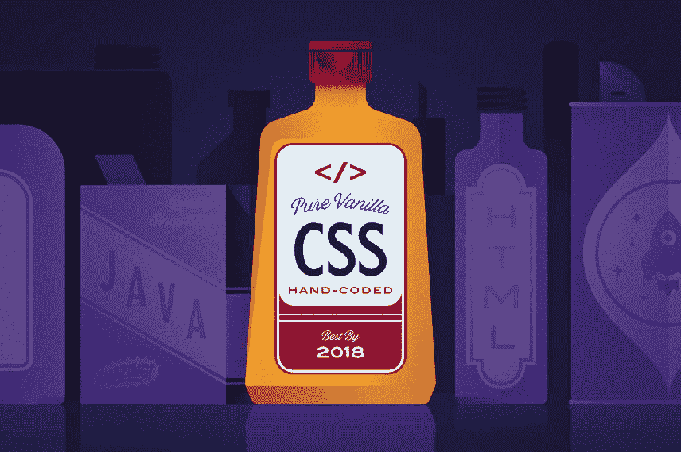

# 现在是 2018 年:你不应该写普通的 CSS

> 原文：<https://dev.to/bnevilleoneill/it-s-2018-you-shouldn-t-be-writing-vanilla-css-l7k>

[T2】](https://res.cloudinary.com/practicaldev/image/fetch/s--joz5KqND--/c_limit%2Cf_auto%2Cfl_progressive%2Cq_auto%2Cw_880/https://thepracticaldev.s3.amazonaws.com/i/rsmv588zte2l63e5fvkv.png)

开发人员的一个常见错误是，与他们代码库的其他部分相比，不太重视(通常根本不重视)样式。

从 CSS 的早期开始，有一种非常流行的做法，将所有内容都累积在一个样式表中，不小心，很快就造成了一个巨大的维护噩梦。

这是一个非常简单的哲学:

*   如果你需要设计一些样式，只需要把它放在 styles.css 的末尾
*   当你试图让一个属性工作有问题时，没有必要调试你的代码，这是愚蠢的，这只是 CSS…一个简单的*！重要的*将完成这项工作。作为一种预防措施，你可以用它做任何事情，所以它肯定会工作
*   如果它仍然不起作用，一个超特定的选择器是肯定的事情，类似于`body>header#main_header.main-header>img.logo+div.links>a.link`
*   你有很多重复的代码吗？这很正常，这只是旧的代码重用
*   模式、惯例、最佳实践、方法？为了什么？只是 CSS 而已，记得吗？

好在这几年，这种思维方式已经越来越过时了。

web 上的许多事情都发生了变化:浏览器、三种主要语言、可用库和框架数量的爆炸性增长、许多令人难以置信的工具的出现为我们的日常工作提供了便利，最后但同样重要的是，前端社区及其对自我完善的日益增长的渴望。

CSS 的发展是持续的。像 [CSS 网格布局](https://dev.to/bnevilleoneill/the-simpletons-guide-to-css-grid-151i)、 [Flexbox](https://dev.to/c0depanda/flexing-with-css-flexbox-1a2l) 、[自定义属性](https://medium.com/@alcidesqueiroz/vanilla-css-magic-with-custom-properties-5f2f145e3e07)、书写模式等功能很快出现并得到支持。即便如此，维护一个只有普通 CSS 的复杂 web 应用程序的外观是一件吃力不讨好的工作，不管你是否遵循了最佳实践。

事实是，除了少数例外，任何项目都可能受到前后处理工具或 CSS-in-JS 库的青睐。在本文中，我们将会看到它们是如何工作的以及它们的优点。

[T2】](https://logrocket.com/signup/)

### **前置处理器**

**CSS 预处理器**是一个将给定语言的代码转换成纯 CSS 的工具。最受欢迎的有[萨斯](https://sass-lang.com/)、[手写笔](http://stylus-lang.com/)和[少](http://lesscss.org/)。其中，功能集和语言语法存在差异。

本文的目的不是对可用的选项进行详细的比较(因为互联网上有许多关于这个目标的伟大帖子)，而是以一种通用的方式介绍预处理程序。对于示例，我选择了 Stylus，这是一个用 JavaScript 编写的工具，运行在 Node.js 上。

看看这段代码:

```
$base-color = #2DD;
$base-color--dark = darken($base-color, 30%);

.menu {
    background-color: $base-color--dark;

    &::before {
        color: $base-color;
    }
} 
```

在上面代码的开始，我声明了两个值为颜色的变量。第一个有一个文字值，第二个使用一个本地手写笔函数 darkening，使$base-color 变量中存储的颜色暗 30%。

然后，我声明一个名为 menu 的类。在这个规则的主体中，我使用了之前已经声明的两个变量。最后，出现了选择器嵌套，其中我为 menu 类设置了 before 伪元素的颜色。

> **注意:**使用美元符号作为变量名称的前缀是个人偏好的问题，而不是手写笔的需求。我在使用 Sass 的这些年里养成了这个习惯，现在我仍然把它作为手写笔的最佳实践。这样，变量变得更加明显，不会与 CSS 关键字混淆。

上面的例子有一些浏览器不支持的特性，例如选择器嵌套和变量(好了，现在 CSS 有了自定义属性，正如我在本文的[中解释的，但是它们的用法和语法是不同的，有些奇怪)。为了让浏览器正确地解释 Sass、Stylus 或 LESS 代码，编译过程是必要的。编译后，输出只是普通的 CSS:](https://medium.com/@alcidesqueiroz/vanilla-css-magic-with-custom-properties-5f2f145e3e07) 

```
.menu {
  background-color: #189b9b;
}
.menu::before {
  color: #2dd;
} 
```

如您所见，最终结果将嵌套的选择器扩展为单独的规则，并用各自的值替换每个变量引用。就这样。

### **前置处理器中的共同特征**

不同的预处理器支持不同的功能。主要的几个里面，Sass 和 Stylus 是最全能最全的。我将再次使用手写笔来解释每个概念。

#### **变量**

变量可以存储以下内容:

**颜色:**

*   `$base-color = blue;`
*   `$cta-color = #D32;`
*   `$link-color = rgb(15, 200, 25);`

**数值+单位:**

*   `$container-padding = 2rem;`
*   `$rotation-increment = 15deg;`
*   `$default-transition-duration = 20ms;`

**值列表，如…:**

*   数字:`$sequence = 1, 2, 3;`
*   颜色:`$colors = blue, #F00, hsla(120,100%,30%,0.5);`
*   还有更多……:`$font-stack: “Helvetica Neue”, Helvetica, Arial, sans-serif;`

#### **嵌套**

可以嵌套选择器，以避免代码重复，并以更清晰的方式对相关规则进行分组:

```
.main-navbar {
    ul {
        list-style-type: none;
    }

        a {
            color: #D22;

            &::after {
                margin-left: 1rem;
            }

            &:hover{
                opacity: 0.8;
            }
        }
} 
```

> 建议:需要指出的是，这个特性需要仔细考虑，因为如果过度使用，它很容易出现问题，例如:与 HTML 层次结构高度耦合的样式表、具有高特异性的选择器以及不必要的 CSS 输出。

#### **单一和多重继承**

像 OO 语言一样，预处理程序允许通过继承来重用代码。

一个类 X 可以扩展另一个类 Y，继承它的所有属性，并拥有自己的属性:

```
.btn {
    border-radius: 0.3rem;
    border: 0.1rem solid #222;

    &:hover {
        opacity: 0.9;
    }
}

.btn--blue {
    @extend .btn;
    background-color: #22D;
} 
```

除了上面举例说明的单一继承，还可以同时从多个类继承样式:

```
.btn {
    border-radius: 0.3rem;
    border: 0.1rem solid #222;

    &:hover {
        opacity: 0.9;
    }
}

.big-btn {
    font-size: 1.8rem;
    padding: 1rem 2rem;
}

.big-btn--blue {
    @extend .btn, .big-btn;
    background-color: #22D;
} 
```

#### **【占位符(抽象类)】**

为了继续我们与 OO 语言的比较，让我们引入占位符的概念，它最初是由 Sass 推广的，可以比作 OOP 中的一个抽象类。占位符是一种特殊类型的类，只能被扩展。这意味着你不能直接从你的 HTML 中引用它，一旦它不出现在你最终的 CSS 输出中。占位符中的代码只有在类扩展它的情况下才会被呈现。

我们扩展占位符的方式和我们使用普通 CSS 类的方式是一样的:

```
$btn {
    border-radius: 0.3rem;
    border: 0.1rem solid #222;

    &:hover {
        opacity: 0.9;
    }
}

.btn--blue {
    @extend $btn;
    background-color: #22D;
} 
```

在手写笔中，占位符以美元符号为前缀。在上面的代码中。btn - blue 类将继承$btn 占位符的整个主体，但是它不会出现在编译后的 CSS 中。

#### **条件句和循环句**

像任何结构化语言一样，也可以使用条件和循环:

```
$colors = 'blue', 'black', 'yellow', 'aqua';
$dark-colors = 'blue', 'black';

for $color in $colors {
    .btn--{$color} {
        background-color: unquote($color);

        if $color in $dark-colors {
            color: white;  
        } else {
            color: #222;
        }
    }
} 
```

下面是编译好的 CSS:

```
.btn--blue {
  background-color: blue;
  color: #fff;
}
.btn--black {
  background-color: black;
  color: #fff;
}
.btn--yellow {
  background-color: yellow;
  color: #222;
}
.btn--aqua {
  background-color: aqua;
  color: #222;
} 
```

#### **功能**

函数也是主预处理器中包含的一个特性。一个函数的行为和你在其他语言中习惯的完全一样，接收 0 到 n 个参数并返回一个值:

```
repeat($str, $qty) {
    if ($qty < 1) {
        return '';
    }

    $ret = '';

    for $i in 1..$qty {
        $ret += $str;
    }

    $ret;
}

h1:before{
    content: repeat(ha, 5);
} 
```

CSS 输出:

```
h1:before {
  content: 'hahahahaha';
} 
```

#### **Mixins**

混合与函数非常相似，但有以下区别:

*   它们没有返回值
*   由于没有返回值，它们不能用作变量或属性的值
*   mixin 的主体中可以有 CSS 属性，这些属性将在调用 mixin 的地方呈现。

```
square($side) {
    width: $side;
    height: $side;
}

.card{
    square(20rem);
    background-color: #3C3;
} 
```

CSS 输出:

```
.card {
  width: 20rem;
  height: 20rem;
  background-color: #3c3;
} 
```

#### **进口**

您可能已经知道 CSS @import [at-rule](https://developer.mozilla.org/en-US/docs/Web/CSS/At-rule) ，它允许样式表 X 包含一个外部样式表 y，这是由浏览器在解释样式表时触发一个额外的 HTTP 请求。

预处理程序使浏览器不必为每个包含的 CSS 做这些额外的请求。当您导入一个 Sass、Stylus 或更小的文件时，包含的样式表和包含它的样式表将成为一个单独的 CSS 包(编译后)加载到您的应用程序中。

为了更清楚，这里有一个简单的例子:

```
// color-scheme.styl
$base-color = #555;
$cta-color = #D22; 
```

```
// another-thing.styl
.whatever {
    padding: 2rem;
    background-color: $cta-color;
} 
```

```
// example.styl
@import 'color-scheme';
@import 'another-thing';

.footer {
    background-color: $base-color;
    color: white;
} 
```

主文件 example.styl 导入另外两个文件。在第一个例子中，我们可以看到两个被定义的变量，从这一刻起，这两个变量将可以被全局访问。第二个文件定义了一个 CSS 规则，它使用了我们之前定义的一个变量。编译后，CSS 输出如下:

```
.whatever {
  padding: 2rem;
  background-color: #d22;
}
.footer {
  background-color: #555;
  color: #fff;
} 
```

自然，在现实世界中，最终的包在提供给用户之前会被缩小和压缩。

#### **原生函数**

在许多可能的用途中，本机函数帮助我们处理:

*   颜色(例如:变暗、饱和度、alpha、亮度)
*   列表(例如:按压、弹出、索引、移位、按键)
*   不同类型的值和单位(例如:类型、单位)
*   数学运算(例如:圆、正弦、地板、腹肌)
*   字符串(例如:split、substr、slice)

本机函数既可以用来组成 mixins 自定义函数逻辑，也可以直接用在规则体中。

### **后处理器(或者只是“处理器”？)**

理论上，后处理器是一种工具，其输入是 CSS 文件，其输出是转换后的 CSS 文件。请注意，与前处理器不同，后处理器不涉及其他语言，它只是普通的 CSS。

那么，我们在谈论什么样的转变呢？嗯，很多种。以下是后处理插件的一些好例子:

*   [**Autoprefixer**](https://autoprefixer.github.io/) :根据您想要支持的浏览器自动包含厂商前缀。
*   [**PostCSS 资产**](https://github.com/borodean/postcss-assets) :处理资产路径、缓存破坏、图像尺寸和 base64 图像内联。
*   [**cssnano**](https://github.com/cssnano/cssnano) :缩小你的 CSS。
*   [**字体魔术师**](https://github.com/jonathantneal/postcss-font-magician) :自动生成@font-faces。
*   [**【postcss-color-palette】**](https://github.com/zaim/postcss-color-palette):允许您使用本地 css 颜色名称，如蓝色、紫色、浅绿色、黄色和其他颜色，作为您自己调色板中颜色的别名，用您指定的颜色替换每个引用。
*   [**stylint**](https://stylelint.io/) :分析你的代码，建议修正和改进，并且(如果你愿意的话)应用其中的一些。
*   [**postcss-sprites**](https://github.com/2createStudio/postcss-sprites) :从你的样式表中提取图像，生成一个包含所有图像的 sprite，并替换原来的引用以使用创建的 sprite。

以上例子都是 [PostCSS](https://postcss.org/) 插件。PostCSS 是一个工具，当涉及到后处理器时，它被许多人认为是一个顶级的名字。

然而，在开发社区中有一些关于术语“后处理器”的含义的讨论。一些人认为“post”前缀只有在处理发生在浏览器(例如像[——无前缀](https://leaverou.github.io/prefixfree/))中才有意义，而不是在开发时间之前。

[其他不同意“有效 CSS in，有效 CSS out”](https://alistapart.com/column/what-will-save-us-from-the-dark-side-of-pre-processors#section5)由于很多后处理插件使用不存在的属性或无效的 CSS 语法来使其神奇发生。一些插件甚至模仿典型的预处理器行为，支持混合、继承、循环、条件和其他 CSS 本身不支持的特性。

下面是一些使用 CSS 非标准语法和属性的后处理插件的例子:

*   **:允许使用类似 Sass 的标记，具有条件、循环、导入、扩展、混合、选择器嵌套等特性。**
***   [**Short**](https://github.com/jonathantneal/postcss-short) :扩展原生 CSS 速记，提供自己的速记，实现更简洁的规则。*   [**写 SVG**](https://github.com/jonathantneal/postcss-write-svg) :让你直接用 CSS 写 SVG。*   [**LostGrid**](https://github.com/peterramsing/lost) :基于 [calc](https://developer.mozilla.org/en-US/docs/Web/CSS/calc) CSS 函数的网格系统。取决于非标准属性的使用(例如:丢失列、丢失行、丢失效用和丢失中心)。**

 **在开发人员大量采用 PostCSS 和[数百个用于各种目的的插件](https://www.postcss.parts/)之后，项目维护人员自己意识到“后处理器”这个术语不再有意义，[正式停止使用它](https://twitter.com/PostCSS/status/626046993006239744)。

独立于关于概念名称的语义争论，像 PostCSS 这样的工具的潜力是毋庸置疑的，并且由于其巨大的灵活性，它既可以与预处理器(像 Sass、Stylus 或更少)一起使用，也可以作为它的替代品(例如，通过像 [PreCSS](https://github.com/jonathantneal/precss) 这样的插件)。

### 

 **React 爆炸在前端开发人员中普及了许多概念，如函数式编程、反应式编程、Flux architecture(及其最著名的化身 Redux)等。

React 世界中诞生的最新趋势之一是 **CSS-in-JS** ，这是用 JavaScript 编写样式代码，在运行时呈现最终 CSS 的想法。这一类别中最受欢迎的库当然是[风格组件](https://www.styled-components.com/)，但也有其他相关选项，如 [JSS](https://github.com/cssinjs/jss) 、[镭](https://github.com/FormidableLabs/radium)、[情感](https://github.com/emotion-js/emotion)和[阿芙罗狄蒂](https://github.com/Khan/aphrodite)，这里仅列举几个。

脸书的前端工程师 Christopher "vjeux" Chedeau 通常被认为是 CSS-in-JS 的先驱。2014 年，他在 React 团队工作时有了这个想法，正如你在这个演示中看到的。

当 Vjeux 创建 CSS-in-JS 时，其最初的目标是解决 7 个 CSS 问题:

*   **全局名称空间:**每个 CSS 类都是一个全局标识符，就像在 JavaScript 中一样，这很容易产生一些不希望的冲突。
*   **依赖关系:**如果组件 A 依赖于一个无法加载的样式表 B，您可能会看到一个外观损坏的组件。这通常足以提醒维护人员有问题。但是，如果这个样式表已经加载到应用程序的另一个地方，组件 A 就不会有任何样式问题，开发人员也不会怀疑有错误。
*   **死代码消除:**很难跟踪和删除不再使用的类。
*   **缩小:**标准的 CSS 缩小过程是有限的，因为如果不更新 HTML 中现有的引用，就不能重命名类。
*   **共享常量:**经常需要在 JavaScript 和 CSS 之间共享值。如今我们可能有 CSS 自定义属性，但在 2014 年没有解决这个问题的优雅方法。
*   **非确定性解析:**一个 HTML 元素可以在多个规则中将一个给定的 CSS 属性设置为不同的值。如果这些规则的选择器具有相同的特异性，最后一个被解释的将“赢得战斗”，如[级联行为](https://dev.to/bnevilleoneill/how-css-works-understanding-the-cascade-3bag)所述。如果这些规则中的一个是在异步加载的样式表中定义的，就不可能预测最后读取的是哪一个。
*   **隔离:**假设你正在使用一个由另一个团队创建和维护的组件，但是你想创建一个这个组件的变体，并做一些视觉上的改变，比如一个按钮的背景颜色。理想情况下，您应该与负责团队协商这个变更的创建。然而，更有可能的是，需要这种改变的工程师将自己做出改变，分析组件的内部结构，并通过选择器对其进行样式化。这是一个问题，因为 HTML 中的任何更改都可能破坏其他团队所做的定制(这些定制可能依赖于特定的结构才能正常工作)。

#### **一个实际例子**

我将使用样式化组件来举例说明这个概念:

```
import React, { Component } from 'react';
import styled from 'styled-components';

const Title = styled.h1`
    color: white;
    font-size: 2rem;
`;

const Content = styled.div`
    background: blue;
    padding: 2rem;
`;

class Example extends Component {
    render() {
        return (
            <Content>
                Hi everyone!
            </Content>
        );
    }
}

export default Example; 
```

对于那些对 React 有一些了解的人来说，上面的例子不言自明。常量 Title 和 Content 是普通的 React 组件，但是具有自定义样式。

styled.div 符号是 ES2015 的原生功能，它被称为[标记的模板文字](https://wesbos.com/tagged-template-literals/)。在这种情况下，它允许我们根据组件的属性动态处理组件的样式，如下例所示:

```
const SignInButton = styled.button`
  font-size: ${
    props => props.standout ? '2rem' : '1.4rem'
  };
`; 
```

#### **CSS-in-JS:一个创新而有争议的想法**

虽然像 styled-components 这样的库确实得到了社区的广泛认可和使用，但是大量开发人员对 CSS-in-JS 概念有相当大的不信任，或者说 T2 甚至拒绝，许多 T4 质疑其最初的目标。这有很多原因，但最明显的原因是在 JavaScript 文件中定义样式的想法带来的不适。

事实是，CSS-in-JS 旨在解决的一些问题[如今已经有了其他解决方案](https://gomakethings.com/alternatives-to-css-in-js/)。 [CSS 模块](https://github.com/css-modules/css-modules)就是一个很好的例子，它允许你以优雅的方式模块化样式表，防止全局标识符之间的冲突。

此外，它们还可以与预处理器结合使用。命名约定的一致使用，比如 [BEM](http://getbem.com/introduction/) ，也可以防止这些问题。CSS 自定义属性，已经有了一个[像样的浏览器支持](https://caniuse.com/#feat=css-variables)，让你在 CSS 和 JavaScript 之间共享值。诸如此类…

### **结论**

普通 CSS 有许多现代的替代方案。其中没有完美和通用的解决方案，每一个都有自己的优点和缺点。由开发人员为每个项目选择最适合的。

重要的是不要被相关规模或合理增长前景的项目中的普通 CSS 的限制所束缚，因为不知道更好的可用选项而忍受维护样式表的痛苦。

* * *

### Plug: [LogRocket](https://logrocket.com/signup/) ，一款适用于网络应用的 DVR

[](https://logrocket.com/signup/)

<figcaption>[https://logrocket.com/signup/](https://logrocket.com/signup/)</figcaption>

LogRocket 是一个前端日志工具，可以让你回放问题，就像它们发生在你自己的浏览器中一样。LogRocket 不需要猜测错误发生的原因，也不需要向用户询问截图和日志转储，而是让您重放会话以快速了解哪里出错了。它可以与任何应用程序完美配合，不管是什么框架，并且有插件可以记录来自 Redux、Vuex 和@ngrx/store 的额外上下文。

除了记录 Redux 操作和状态，LogRocket 还记录控制台日志、JavaScript 错误、堆栈跟踪、带有头+正文的网络请求/响应、浏览器元数据和自定义日志。它还使用 DOM 来记录页面上的 HTML 和 CSS，甚至为最复杂的单页面应用程序重新创建像素级完美视频。

免费试用。

* * *

帖子[是 2018 年:你不应该写香草 CSS](https://blog.logrocket.com/its-2018-you-shouldn-t-be-writing-vanilla-css-b3d09b9c2c41/) 首先出现在[日志博客](https://blog.logrocket.com)上。****