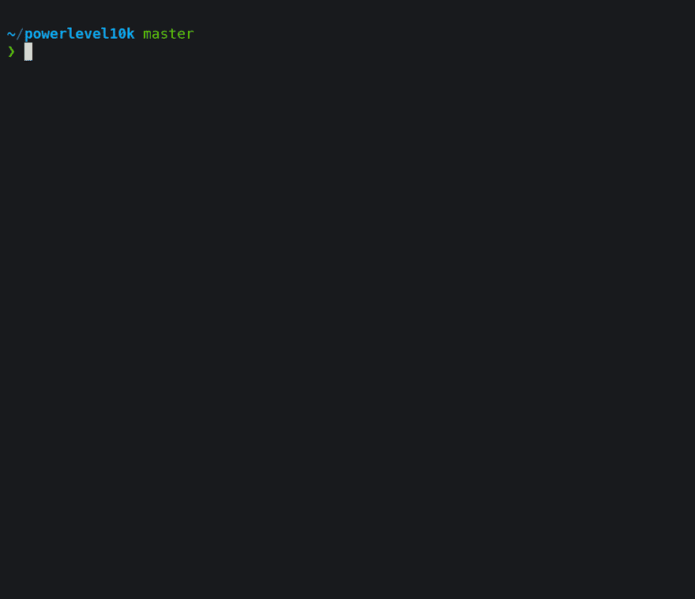

# 哦，我的 Zsh！+ Powerlevel10K 极客最佳终端组合！

> 原文：<https://dev.to/equiman/iterm2--oh-my-zsh--powerlevel9k-best-terminal-combination-for-geeks-58l5>

有一个前后听这些信的人在一起:ZSH。你可能会奇怪:为什么我以前没有听说过？哦！

[哦，我的 Zsh——一个令人愉快的 Z-Shell 开源框架&](https://ohmyz.sh/)

ZSH (Z Shell)这是一次真正的变革，用简单的解决方案实现终端设备的现代化。可以在 GNU Linux 和 macOS 上使用，但是我会教你如何在 MacOS 上安装和配置。

#### 那么，为什么会这么酷呢？

*   不再有 cd(更改目录)命令。只需使用:`..`(父目录)、`...`(来自父目录的父目录)、`/` (root)或`~` (home)。
*   用`take`命令创建一个目录并改变它的路径。而不是`mkdir`和`cd`命令。
*   使用`-`在上次和当前路径之间切换(类似电视遥控器)
*   别名命令。用`alias`列出全部或用`grep`过滤，例如`alias | grep git`
*   使用 [Z 插件](https://github.com/robbyrussell/oh-my-zsh/tree/master/plugins/z)快速切换到另一个路径，只是命名文件夹而不是完整路径
*   递归路径扩展。`/u/lo/b`展开为`/user/local/bin`
*   拼写纠正和近似完成，自动纠正时，有小错误键入一个目录名。
*   [插件](https://github.com/robbyrussell/oh-my-zsh/tree/master/plugins)和[主题](https://github.com/robbyrussell/oh-my-zsh/tree/master/themes/)支持。
*   语法突出显示。
*   历史子串搜索。
*   自动完成，用 tab 键在选项之间跳转，按 return 键选择。使用目录、文件和命令。
*   Git 集成
*   运行历史命令，`!`后跟历史中的数字，如`!137`。
*   输入`!!`将调出最后一条命令。如果一个命令失败，这是很方便的，因为它需要管理员权限。在这种情况下，您可以键入`sudo !!`。
*   多了很多…

> ***PSS TTT:**power level 10k 显示命令历史编号和可视化 Git 通知。*

### 先决条件

#### [自制](https://brew.sh/)

Brew 有他自己的分类。在 **brew** 里面可以找到 CLI app 和实用程序。在**桶**里面是所有带有图形界面的应用程序。

```
/bin/bash -c "$(curl -fsSL https://raw.githubusercontent.com/Homebrew/install/HEAD/install.sh)"
brew tap homebrew/cask-fonts

brew update
brew upgrade
brew cleanup 
```

Enter fullscreen mode Exit fullscreen mode

运行该命令，并遵循医生的建议:

```
brew doctor 
```

Enter fullscreen mode Exit fullscreen mode

#### 权限

将权限添加到该文件夹和所附项目下的用户(或组):

```
sudo chown -R $(whoami) /usr/local/opt
sudo chown -R $(whoami) /usr/local/share 
```

Enter fullscreen mode Exit fullscreen mode

**警告:**添加下一个权限，以防只有一个用户使用您的机器。

```
sudo chown -R $(whoami) /usr/local/lib 
```

Enter fullscreen mode Exit fullscreen mode

### 贝尔维尔的三胞胎

> **警告:**我不想冒昧，但是 [iTerm2](https://www.iterm2.com/) + [哦我的 Zsh！](https://ohmyz.sh/) + [Powerlevel10K](https://github.com/romkatv/powerlevel10k) 这是一个致命的组合。您以后不会想要使用另一个终端。

```
brew install --cask iterm2 

sh -c "$(curl -fsSL https://raw.githubusercontent.com/robbyrussell/oh-my-zsh/master/tools/install.sh)"

git clone https://github.com/romkatv/powerlevel10k.git ${ZSH_CUSTOM:-~/.oh-my-zsh/custom}/themes/powerlevel10k

git clone https://github.com/zsh-users/zsh-autosuggestions ${ZSH_CUSTOM:-~/.oh-my-zsh/custom}/plugins/zsh-autosuggestions
git clone https://github.com/nobeans/zsh-sdkman.git ${ZSH_CUSTOM:-~/.oh-my-zsh/custom}/plugins/sdkman

brew install zsh-history-substring-search
brew install zsh-syntax-highlighting
brew install z
brew install tree
chsh -s /bin/zsh 
```

Enter fullscreen mode Exit fullscreen mode

关闭默认终端，打开 iTerm2。

#### 配置

ZSH 配置文件位于`~/.zshrc`下。用你最喜欢的编辑器打开，设置:

```
DEFAULT_USER="$USER"

ZSH_THEME="powerlevel10k/powerlevel10k"
POWERLEVEL9K_RIGHT_PROMPT_ELEMENTS=(history)
POWERLEVEL9K_SHORTEN_DIR_LENGTH=1

ZSH_HIGHLIGHT_HIGHLIGHTERS=(main brackets pattern cursor root line)
ZSH_HIGHLIGHT_PATTERNS=('rm -rf *' 'fg=white,bold,bg=red')

plugins=(
  brew
  git
  gradle
  ng
  npm
  yarn
  zsh-autosuggestions
  osx
  sdkman
  history-substring-search
)

alias x="exit"
alias reload="source ~/.zshrc"
alias hc="history -c"
alias hg="history | grep "

#Include Z
if command -v brew >/dev/null 2>&1; then
  # Load rupa's z if installed
  [ -f $(brew --prefix)/etc/profile.d/z.sh ] && source $(brew --prefix)/etc/profile.d/z.sh
fi 
```

Enter fullscreen mode Exit fullscreen mode

将所有你想要或需要的[插件](https://github.com/robbyrussell/oh-my-zsh/tree/master/plugins)添加到`plugins=()`列表中，每一个都在新的一行。

打开 iTerm2，更改值后，确保用`sz`命令别名更新您的`~/.zshrc`文件，或者运行完整的命令:

```
source ~/.zshrc 
```

Enter fullscreen mode Exit fullscreen mode

#### Fonts

下载并安装 Meslo 和 Nerd 字体

```
brew install --cask font-meslo-lg-nerd-font
brew install --cask font-hack-nerd-font 
```

Enter fullscreen mode Exit fullscreen mode

在`iTerm > Preferences > Profiles > Text > Change Font`上改变并选择`MesloLGS NF`。

#### Visual Studio 代码

如果您想在 Visual Studio 代码中使用 ZSH 作为默认终端，请添加以下设置(`⌘ + ,` ):

```
"terminal.external.osxExec":  "iTerm.app",  "terminal.integrated.fontFamily":  "Meslo LG M for Powerline",  "terminal.integrated.shell.osx":  "zsh", 
```

Enter fullscreen mode Exit fullscreen mode

#### 向导

第一次运行时，Powerlevel10k 配置向导将询问您几个问题并配置您的提示。

如果没有自动触发，输入`p10k configure`。

[T2】](https://res.cloudinary.com/practicaldev/image/fetch/s--YG9Af61B--/c_limit%2Cf_auto%2Cfl_progressive%2Cq_66%2Cw_880/https://dev-to-uploads.s3.amazonaws.com/i/mtrv39dhe0f0b5pe2shs.gif)

配置向导根据您的偏好创建~/.p10k.zsh。通过编辑该文件，可以进行额外的提示定制。它有大量的注释来帮助您浏览配置选项。

### 终端(Bash)

macOS 默认终端自带版本 3，不打算更新，因为新版本改变了他的许可证。苹果公司不提供 GPLv3 下的任何软件。

打开默认终端并运行此命令以使用更新版本:

```
brew install bash bash-completion 
```

Enter fullscreen mode Exit fullscreen mode

将这一行添加到`~/.bash_profile`文件:

```
alias x="exit"
alias sb="source ~/.bash_profile"
alias hc="history -c"
alias hg="history | grep"

[ -f /usr/local/etc/bash_completion ] && . /usr/local/etc/bash_completion 
```

Enter fullscreen mode Exit fullscreen mode

打开端子，改变`Shell open with:`上的`Terminal > Preferences > General`，选择`Command (complete path)`，设置`/bin/bash`值。

有了这个配置，现在您可以在 iTerm2 上使用 ZSH，在默认终端上使用 Bash。

### 成为 ZSH 忍者！

强烈推荐参加由 [@WesBoss](https://twitter.com/wesbos) 制作的**免费**课程:

> 韦斯博斯[@韦斯博斯](https://dev.to/wesbos)发布命令行超级用户:一个免费的命令行工作流程视频系列→[CommandLinePowerUser.com](http://t.co/bukPp3Lkvq)2015 年 04 月 13:56 分[](https://twitter.com/intent/tweet?in_reply_to=583629194837372929)[](https://twitter.com/intent/retweet?tweet_id=583629194837372929)[](https://twitter.com/intent/like?tweet_id=583629194837372929)

### 备忘单(快捷键)

常见的 MacOS 修饰键有:

| 命令 | 控制 | [计]选项 | 变化 |
| --- | --- | --- | --- |
| `⌘` | `⌃` | `⌥` | `⇧` |

默认情况下，单词跳转和单词删除不起作用。要启用这些功能，请转到`iTerm > Preferences > Profiles > Keys > Load Presets…`并选择`Natural Text Editing`。

#### 基本动作

| 捷径 | 功能 |
| --- | --- |
| `⌥` + `→`或`⌥` + `←` | 单词跳跃 |
| `⌥` + `backspace` | 单词删除 |
| `⌃` + `d` | 删除当前字符 |
| `backspace` | 删除前一个字符 |
| `⌃` + `-` | 取消 |
| `⌘` + `backspace` | 整行删除 |
| `⌘` + `k` | 清除整个屏幕 |

#### 移动速度加快

| 功能 | 捷径 |
| --- | --- |
| `⌃` + `a` | 移动到行首 |
| `⌃` + `e` | 移动到行尾 |
| `⌥` + `f` | 向前移动一个单词 |
| `⌥` + `b` | 向后移动一个单词 |

#### 复制粘贴

| 功能 | 捷径 |
| --- | --- |
| `⌃` + `k` | 从光标处复制到行尾 |
| `⌥` + `d` | 从光标处复制到单词末尾 |
| `⌥` + `backspace` | 从光标处复制到单词的开头 |
| `⌃` + `w` | 从光标处复制到前面的空白区域 |
| `⌃` + `w` | 粘贴最后复制的文本 |
| `⌥` + `y` | 循环并粘贴先前复制的文本 |
| `⌥` + `.` | 循环并粘贴前面命令的最后一个参数 |

#### 标签页&窗口

| 功能 | 捷径 |
| --- | --- |
| `⌘` + `Enter` | 全屏 |
| `⌘` + `Left Arrow` | 上一个选项卡 |
| `⌘` + `Right Arrow` | 下一个选项卡 |
| `⌘` + `Number` | 转到选项卡 |
| `⌘` + `⌥` + `Number` | 转到窗口 |
| `⌘` + `⌥` + `Arrow` | 按方向转到拆分窗格 |
| `⌘` + `]`或`⌘` + `[` | 按使用顺序转到拆分窗格 |
| `⌘` + `⇧` + `d` | 水平分割窗口(相同轮廓) |
| `⌘` + `d` | 垂直分割窗口(相同轮廓) |
| `⌥` + `⌘` + `⇧` + `h` | 水平分割窗口(新轮廓) |
| `⌥` + `⌘` + `⇧` + `v` | 垂直拆分窗口(新轮廓) |
| `⌘` + `⇧` + `m` | 设置标记 |
| `⌘` + `⇧` + `j` | 跳到标记 |

### 删除“上次登录:”

对我来说，macOS 终端中默认的“上次登录:”消息是不必要的，也很烦人。令人高兴的是，这很容易:

```
touch ~/.hushlogin 
```

Enter fullscreen mode Exit fullscreen mode

### 奖金追踪

[](/equiman) [## 为开发设置 macOS

### 卡米洛马丁内斯 9 月 26 日 188 分钟阅读

#productivity #tutorial #beginners #devtips](/equiman/setup-macos-for-development-3kc2)

* * *

**都是乡亲们！**
**快乐编码** 🖖

[T2】](https://github.com/sponsors/deinsoftware)