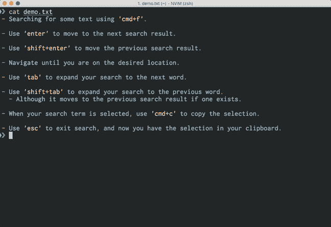
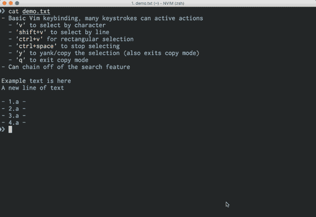

# iTerm2 无鼠标复制

> 原文：<https://dev.to/kevinjalbert/iterm2-mouseless-copy-1aeo>

*封面图片 [3D 打印鼠标](https://flickr.com/photos/creative_tools/8573767153)由[创意工具](https://flickr.com/people/creative_tools)授权 [CC 由](https://creativecommons.org/licenses/by/2.0/)T7】*

在可能的情况下，我尽量避免使用鼠标。我在编辑的时候经常使用 Vim，它允许键盘导航。我非常喜欢 Vim 的键盘绑定，甚至在浏览器中使用 [Vimium(谷歌 Chrome 的一个扩展)](https://chrome.google.com/webstore/detail/vimium/dbepggeogbaibhgnhhndojpepiihcmeb?hl=en)进行键盘驱动导航(尽我所能)。此外，我还使用了 MacOS 版的 [BetterSnapTool](https://itunes.apple.com/ca/app/bettersnaptool/id417375580) ，它允许我仅通过键盘就可以移动窗口或调整窗口大小。

在我的终端中，我一直在避免的一个优化是[tmux](https://github.com/tmux/tmux)——它对于我所需要的东西来说是不必要的复杂。在很大程度上，我能够使用 [iTerm2](https://www.iterm2.com/) 来打开标签、分割窗格和导航。老实说，我真的不需要 tmux 或[屏幕](http://www.gnu.org/software/screen/)提供的会话保持功能。我从 tmux 中错过的最大收获是著名的[复制模式](https://minimul.com/increased-developer-productivity-with-tmux-part-8.html)。

用于文本选择的突出显示的 [iTerm2 文档的快速摘录:](https://www.iterm2.com/documentation-highlights.html)

> *   You can use the mouse.
> *   You can use the "copy without mouse" function of the find function.
> *   You can use copy mode.

第一个我们不感兴趣，因为它是选择和复制文本的标准方式。我们将在接下来的章节中讨论其他两个。

## 查找并复制

因此，在 iTerm2 的会话中复制任何内容的一种方法是使用默认的*搜索*。至少可以说，这是一种有趣的方法:

[T2】](https://res.cloudinary.com/practicaldev/image/fetch/s--Ozw3JJas--/c_limit%2Cf_auto%2Cfl_progressive%2Cq_66%2Cw_880/https://kevinjalbert.cimg/2018-05-06-iterm2-mouseless-copy/search-copy.gif)

本质上，你用 *cmd+f* 开始搜索，你可以使用 *enter* 和 *tab* 来移动你的选择，并控制你想要在选择中包含多少文本。它在紧要关头也能工作，但是如果你弄乱了你选择的文本量，你基本上不得不重新开始这个过程。另外，我发现 *shift+tab* 命令循环选择搜索结果，导致了一些混乱。

老实说，我不经常使用这种搜索复制方法。我发现做对很难，因为你不能犯任何错误。以下是这种方法的总结:

*   使用 *cmd+f* 搜索一些文本。
*   使用*输入*移动到下一个搜索结果。
*   使用 *shift+enter* 移动到上一个搜索结果。
*   导航，直到你在想要的位置。
*   使用*选项卡*将您的搜索扩展到下一个单词。
*   使用 *shift+tab* 将搜索范围扩大到上一个单词。
    *   尽管它会移动到先前的搜索结果(如果存在的话)。
*   当您的搜索词被选中时，使用 *cmd+c* 来复制选择。
*   使用 *esc* 退出搜索，现在您已经在剪贴板中有了选择。

## 复制模式

iTerm2 模式试图模拟尽可能多的 tmux 复制模式，允许您使用键盘进行文本选择。这是一种*模式*，非常类似于 Vim 的*插入*和*正常*模式。请务必注意，当您进入拷贝模式时，窗格中的会话将停止更新。

[T2】](https://res.cloudinary.com/practicaldev/image/fetch/s--fdKQM-Cd--/c_limit%2Cf_auto%2Cfl_progressive%2Cq_66%2Cw_880/https://kevinjalbert.cimg/2018-05-06-iterm2-mouseless-copy/copy-mode.gif)

我强烈推荐阅读关于 iTerm2 复制模式的[文档，因为它完全涵盖了键盘快捷键和功能。在我看来，复制模式是无鼠标复制的两种方法中最好的。我强烈建议下次你拿鼠标的时候试一试。以下是复制模式的快速总结:](https://www.iterm2.com/documentation-copymode.html)

*   用 *cmd+shift+c* 进入复印模式。
*   基本的 Vim 按键绑定，许多按键可以激活不同的动作。
    *   *v* 按字符选择。
    *   *shift+v* 按行选择。
    *   *ctrl+v* 进行矩形选择。
    *   *ctrl+空格键*停止选择。
    *   *y* 拖动/复制选择(也退出复制模式)。
    *   *q* 退出复印模式。
*   可以关闭 iTerm2 的搜索功能。