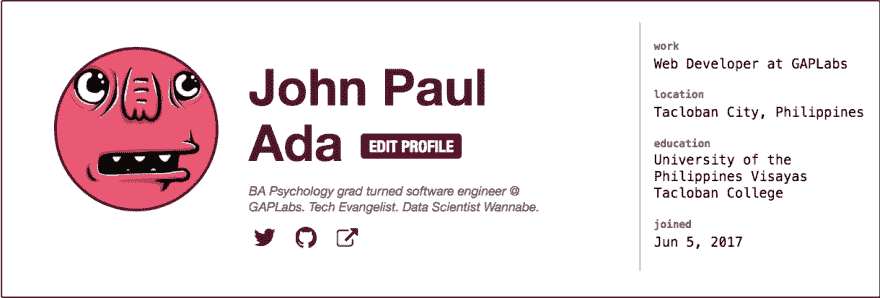
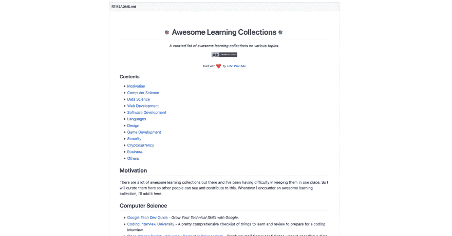
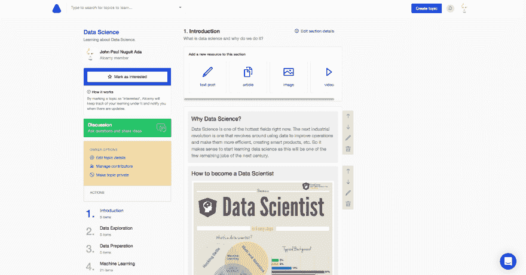
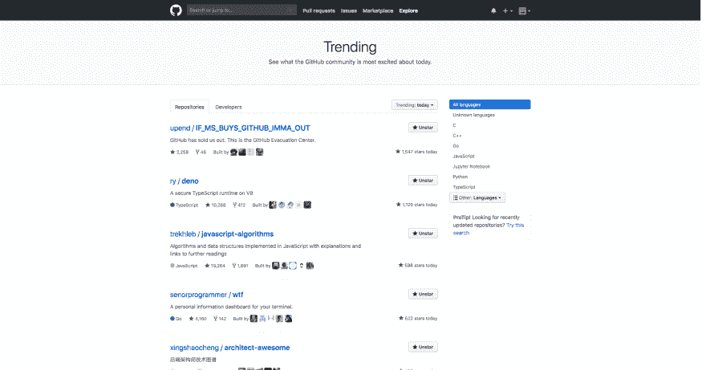
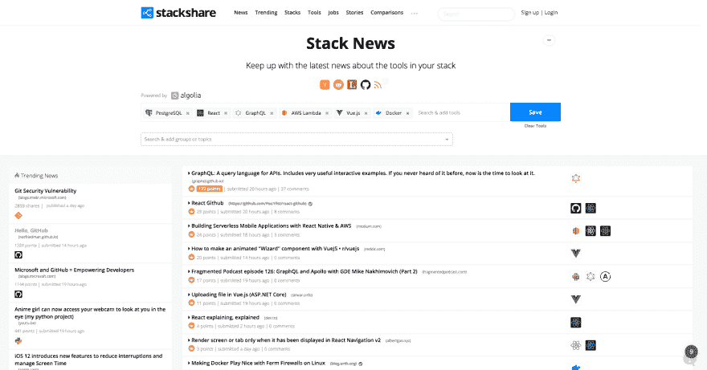
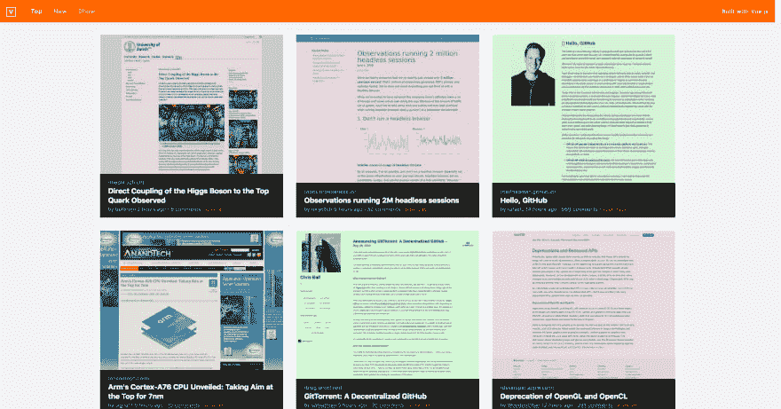

# 今天是我的开发周年纪念日！这里有些东西！

> 原文：<https://dev.to/johnpaulada/its-my-devto-anniversary-here-are-some-stuff-k4a>

[T2】](https://res.cloudinary.com/practicaldev/image/fetch/s--DATTKCLW--/c_limit%2Cf_auto%2Cfl_progressive%2Cq_auto%2Cw_880/https://thepracticaldev.s3.amazonaws.com/i/pf21soh1pqlbzi5mdpty.jpg)

今天是我在 [Dev 到](https://dev.to/)的一周年纪念日！🎉

我今天收到一封电子邮件，说我得到了心爱的评论徽章，所以我访问了我的 [Dev.to profile 页面](https://dev.to/johnpaulada)，看到我去年的今天加入了 Dev.to！

[T2】](https://res.cloudinary.com/practicaldev/image/fetch/s--FG7DMBu9--/c_limit%2Cf_auto%2Cfl_progressive%2Cq_auto%2Cw_880/https://thepracticaldev.s3.amazonaws.com/i/p0rvx6kzpe0c3byznk1o.png)

## 好东西

为了感谢社区，这里有一些我最喜欢的资源:

[T2】](https://res.cloudinary.com/practicaldev/image/fetch/s--wGuLYhkf--/c_limit%2Cf_auto%2Cfl_progressive%2Cq_auto%2Cw_880/https://thepracticaldev.s3.amazonaws.com/i/39vitrqvz9caikwwrhhs.png)

### [牛逼的学习资源](https://github.com/johnpaulada/awesome-learning-collections)

这是我自己收集的资源，灵感来自那些令人敬畏的收藏。我相信你对它们很熟悉。这一本是学习集锦。Meta af，我说的对吗？

[T2】](https://res.cloudinary.com/practicaldev/image/fetch/s--HhJ6X7FF--/c_limit%2Cf_auto%2Cfl_progressive%2Cq_auto%2Cw_880/https://thepracticaldev.s3.amazonaws.com/i/cenh9hj38cl1a8ol4bmr.png)

### [Alcamy 数据科学专题](https://alcamy.org/library/data-science)

这是 Alcamy 上的一个题目，也是我编的。这是我在数据科学方面的主要学习指南。每当我发现一个好的资源添加到列表中时，我都会更新它。

[T2】](https://res.cloudinary.com/practicaldev/image/fetch/s--ndLv5g2x--/c_limit%2Cf_auto%2Cfl_progressive%2Cq_auto%2Cw_880/https://thepracticaldev.s3.amazonaws.com/i/l5k2nt0mk5b0e6dqfn66.png)

### [Github 趋势页面](https://github.com/trending)

当天的趋势库列表。您还可以按日期范围(周、月)、使用的语言等进行过滤。

[T2】](https://res.cloudinary.com/practicaldev/image/fetch/s--yC7aOjF6--/c_limit%2Cf_auto%2Cfl_progressive%2Cq_auto%2Cw_880/https://thepracticaldev.s3.amazonaws.com/i/qi1afr2i65l3cns6fyj8.png)

### [StackShare 新闻](https://stackshare.io/news)

该网站从 Reddit、Medium、HackerNews 等来源收集技术新闻。您可以指定想要显示哪些技术的新闻。

[T2】](https://res.cloudinary.com/practicaldev/image/fetch/s--dDcDBbEk--/c_limit%2Cf_auto%2Cfl_progressive%2Cq_auto%2Cw_880/https://thepracticaldev.s3.amazonaws.com/i/23jyhyuzxjdgtgu7o8cf.png)

### [HN 2.0](https://hnews.xyz/top)视图

一个从黑客新闻中提取数据并显示页面预览的 web 应用程序。

 
额外收获:我的主播播客:[《随机程序员》](https://anchor.fm/john-paul-nuguit-ada)——我讲了一堆关于编程和软件开发的东西。