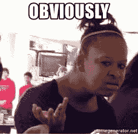

# 很明显很简单！

> 原文：<https://dev.to/david_ojeda/its-obviously-simple-2n8a>

几天前，我浏览了一些关于各种软件主题的教程和指南，因为找不到答案而感到沮丧。但是让我恼火的不仅仅是这个行为，而是说明的方式:**只需要**改变你的服务器配置。

你知道，你只需要做这个。你**只是**需要修改一下；服务器会**明显**崩溃。

[T2】](https://res.cloudinary.com/practicaldev/image/fetch/s--rI-oJS8---/c_limit%2Cf_auto%2Cfl_progressive%2Cq_auto%2Cw_880/https://thepracticaldev.s3.amazonaws.com/i/2p8j4ginx0mwl3k9ys53.jpeg)

不是因为你发现了某件显而易见或简单的事情，就意味着其他人也会发现。像仅仅、明显和简单这样的词通常是令人沮丧的——特别是对那些开始拼凑不同事物的初学者来说。

而且，我不认为那些话给你的写作增加了任何价值。如果你说你的观点应该是显而易见的，它会使你的观点更清楚吗？**否**。相反，你的读者可能会觉得自己像个傻瓜，因为他/她根本没有发现这一点。

在思考这个问题的时候，我决定做一个小页面，你可以在上面粘贴你的文字，它会突出显示像*明显的*、*简单的*、*简单的*等等。我决定用 React/Redux，一些深度学习算法和无服务器运行的一切。**开个玩笑**，这是一个静态网站，内置 CSS 和 JavaScript，使用正则表达式🙃点击此处查看！

在我看来，我们应该尽可能地避免这些词，以停止打击他人，并为我们的想法增加更多价值。而且，你用的词更少。

感谢你阅读我！❤️