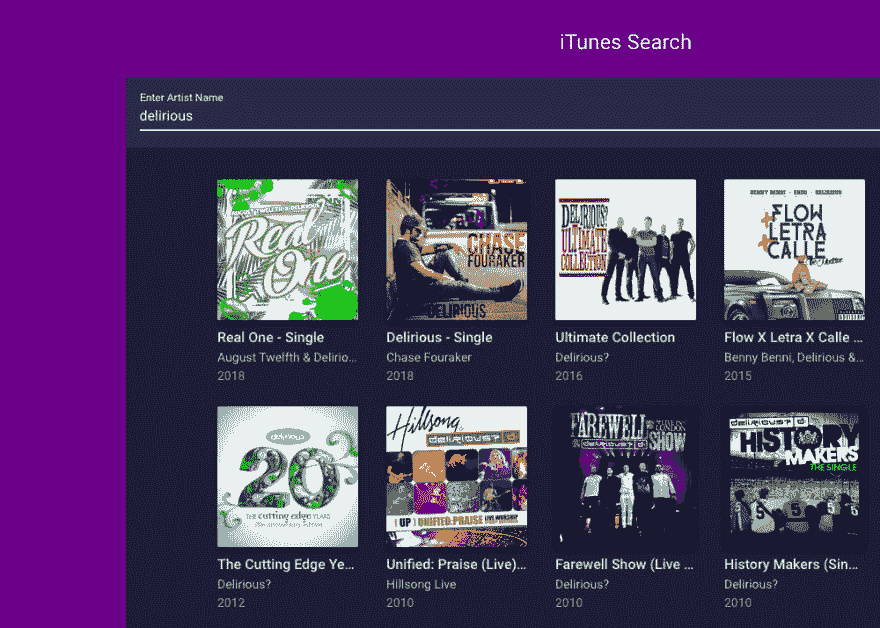

# 用 Vue.js 进行 iTunes 搜索

> 原文：<https://dev.to/romanpaprotsky/itunes-search-with-vuejs-1bjd>

上周末，我在玩一些 Vue.js 教程时，产生了创建一个简单的 iTunes 艺术家搜索应用程序的想法。

[T2】](https://res.cloudinary.com/practicaldev/image/fetch/s--nRBJFsn5--/c_limit%2Cf_auto%2Cfl_progressive%2Cq_auto%2Cw_880/https://thepracticaldev.s3.amazonaws.com/i/8edc4m5q1h3yvxukd1x7.png)

[试玩](http://itunes-search.romanpaprotsky.com)
[储存库](https://gitlab.com/paprotsky/itunes-search)
[截屏](https://www.youtube.com/watch?v=TWArLk34Gl0)