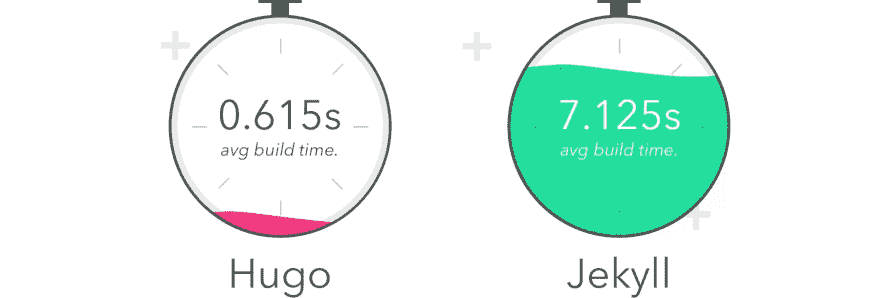
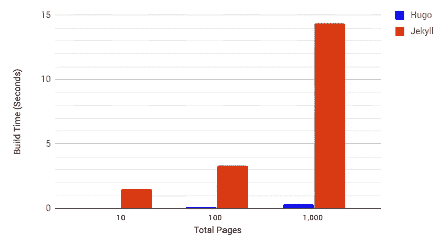

# 詹姆斯塔克。网站如何在膨胀的网络中变得更快。

> 原文：<https://dev.to/lewismenelaws/jamstack-how-sites-are-becoming-even-faster-in-a-bloated-web-fig>

如果你涉足网站领域，你可能听说过 JAMstack。JAMstack 代表:

*   Java Script 语言
*   API 的
*   利润

总的来说，这有助于通过删除所有不必要的组件来加快网页的速度，这些组件会降低你所寻找的内容的速度。随着 web 变得如此 JavaScript 密集，可以理解为什么人们选择性能而不是更好的视觉风格。

### 当网络刚刚出现的时候

在 90 年代，网页看起来没有那么壮观。HTML 被用来存储文档并通过万维网发送它们。它们看起来和 Word 文档一模一样。

[T2】](https://res.cloudinary.com/practicaldev/image/fetch/s--arPrtsgi--/c_limit%2Cf_auto%2Cfl_progressive%2Cq_auto%2Cw_880/https://lewismenelaws.com/conteimg/2018/09/oldestwebsites8.jpg)

考虑到时间，这是巨大的。你能以光速发送文件。这是革命性的，甚至像维基百科这样的网站也分享这种“最小化”的外观，就好像你是从一张纸上读出来的一样。

随着 web 的发展，开发人员希望对如何制作文档有更多的控制。CSS 于 1994 年 10 月 10 日提出，并于 1996 年发布。由于 Internet Explorer 3 对它的支持有限，它没有那么快被接受。不管怎样，网络在发展，网络背后的工具也在发展。一些宝石现在仍然可以在网上看到，它们是用如此古老的技术制造的，但仍然有很好的性能和很好的用户界面。

[T2】](https://res.cloudinary.com/practicaldev/image/fetch/s--YioTdaR8--/c_limit%2Cf_auto%2Cfl_progressive%2Cq_auto%2Cw_880/https://lewismenelaws.com/conteimg/2018/09/Screenshot-from-2018-09-09-18-22-37.png)

在 JavaScript 被引入万维网之后，JavaScript 被用来使网络变得更加动态。

随着万维网的发展，在互联网上运营的企业也在发展。随着网络的发展，有很多方法可以尝试和销售产品和信息。由于许多代码都是开源的，许多开发者会加入 JavaScript 库、未压缩的图像、视频和其他会降低网站速度的东西。即使像 WordPress 这样的技术在服务器端完成了大部分工作，过一段时间后，事情变得如此臃肿，以至于开始影响性能。有趣的是，万维网是为了快速获取信息而创建的，但现在已经成为一个充满“惊喜和廉价刺激”的市场。

### 静止站点发电机

静态站点生成器在 2018 年非常受欢迎。人们说他们是今年网络开发者应该关注的一个趋势，这是可以理解的。在大多数情况下，这是正确的解决方案，而且做得很好。这里有几个最流行的静态站点生成器构建比较。

[T2】](https://res.cloudinary.com/practicaldev/image/fetch/s--fSn_FQtE--/c_limit%2Cf_auto%2Cfl_progressive%2Cq_auto%2Cw_880/https://lewismenelaws.com/conteimg/2018/10/hugo-vs-jekyll-totals.jpeg)

林业部门的 Chris Macrae 比较了两种静态站点生成器，发现 Hugo 在几乎所有情况下都更快。这里有一个更好的图表。

[T2】](https://res.cloudinary.com/practicaldev/image/fetch/s--jZbw1sB1--/c_limit%2Cf_auto%2Cfl_progressive%2Cq_auto%2Cw_880/https://lewismenelaws.com/conteimg/2018/10/hugo-vs-jekyll-basic-test-1.jpeg)

现在，让我们不要把这个扭曲。看起来 Jekyll 完全被淘汰了，但是在 14.5 秒内创建 1000 页一点也不差。事实上，与大多数需要某种数据库的网站相比，它真的很快。Hugo 和 Jekyll 都是静态站点生成器入门的好方法。很多人将它们作为博客和页面管理的主要方法。现在的问题是，你必须决定你是否能为它切换你当前的系统(Wordpress，Joomla 等)。

### 现代网络

你有多少次听到“现代网络”这个词，并对它有负面的理解？别担心，我不是来说网络坏话的。如果有的话，我崇拜它。现代的 web 应用程序更加关注使用更健壮的 JavaScript 库和 RESTful API 来创建更好的体验，以使事情变得更加流畅和快速。这就是我喜欢 React/Vue/Angular 的原因，因为它让网络变得更快、更容易访问。

### 卡纸堆叠

也就是我们现在的位置。

[T2】](https://res.cloudinary.com/practicaldev/image/fetch/s--ApKlVws0--/c_limit%2Cf_auto%2Cfl_progressive%2Cq_auto%2Cw_880/https://lewismenelaws.com/conteimg/2018/10/download.png)

GatsbyJS 是 JavaScript 和静态站点生成器领域的新人。它使用 GraphQL 和 React 等现代技术来创建速度极快的网站。您可以将它用于任何具有 RESTful API 的 CMS(这是大多数。如果你的没有，那就该换了)。Gatsby 非常强大，在开源社区和风险投资领域都取得了成功。

### 网络的未来

很多人预测网络的未来是一个沉浸式的世界，我们可以进入一个类似矩阵的区域。对我来说，我把它想象成每个人都可以使用的，即使他们有一台蹩脚的电脑或者不能使用极快的互联网。由于万维网的现状，人们很难在没有不必要的 CSS 和 JavaScript 的情况下获取信息。

这一切背后的讽刺...为了消除不必要的内容，我们必须用 JavaScript 重写所有内容。

有意思。

[T2】](https://res.cloudinary.com/practicaldev/image/fetch/s--G_X1Q7QC--/c_limit%2Cf_auto%2Cfl_progressive%2Cq_66%2Cw_880/https://lewismenelaws.com/conteimg/2018/10/1_OF0xEMkWBv-69zvmNs6RDQ.gif)

感谢阅读开发社区！

在 Twitter 上关注我吧！我把与开发相关的东西贴在那里，希望能见到大家！