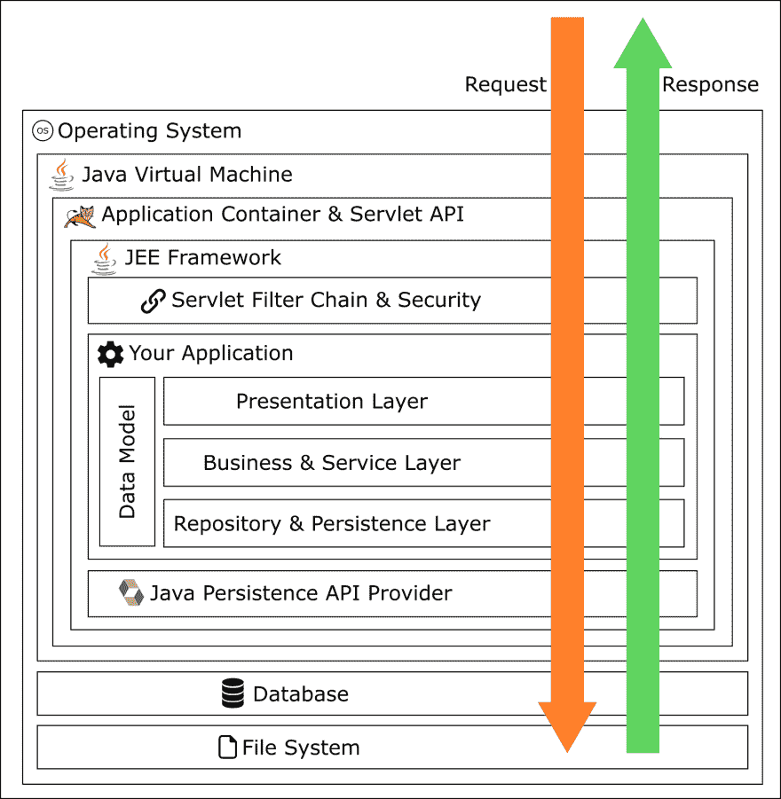
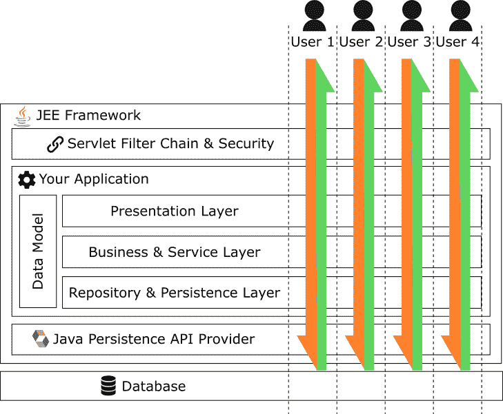

# Java 企业 101

> 原文：<https://dev.to/martinhaeusler/java-enterprise-101-3djl>

有很多方法可以创建软件。事实上，甚至有很多方法可以创造出*好的*软件。说到应用服务器开发，其中一个经受住了时间的考验，这是有充分理由的:Java 企业版。

Java EE 不仅仅是一个软件库。它也是一种建筑和哲学。JEE 不适合胆小的人；如果你正在构建一个一次性的原型，你就走错了路。但是如果你读到了一个可以承载大型企业并支持大规模应用的架构，那么你就对了。JEE 是软件开发的重炮。太棒了。

在这篇文章中，我们将探索 JEE 的建筑方面。关于实现的文章将会很快出现。

> 一点小提示。当我在本文中谈论 Java 企业时，我并不是专门谈论库，而是架构和哲学。官方的 Java EE 库只是实现这个堆栈的一种方式。

# JEE 栈

那么你准备好进行一些严肃的软件开发了吗？抛开任何非类型化的语言、花哨的脚本、炒作驱动的开发和时髦的技术，让我们认真地编写可以运行 20 多年的软件。简单来说，Java EE 架构如下:

[T2】](https://res.cloudinary.com/practicaldev/image/fetch/s--6O9NQqwv--/c_limit%2Cf_auto%2Cfl_progressive%2Cq_auto%2Cw_880/https://thepracticaldev.s3.amazonaws.com/i/vyzmzbjq121deygrr6pq.png)

好吧，当然，你需要一个大果壳。让我们从一些初步观察开始:

*   与外界的每一次通信都是严格基于**请求-响应**的。
*   传入的请求在到达您的应用程序代码之前要经过几个**层**。每一层都可以**拒绝**、**重定向**或**更改**请求。这些层背后的动机是**关注点分离**。
*   许多层**已经实现**，你只需要利用它们。
*   JEE 就是让开发人员**只关注业务功能**。其他 99%的事情都已经为你处理好了。

# 应用容器

当一个请求通过网络到达我们的服务器时，它首先被传递给操作系统。操作系统将根据请求被发送到的**端口**决定将请求转发给哪个应用程序。在这种情况下，应用程序是 **Java 虚拟机**。JVM 内部运行一个**应用容器**(比如 [Apache Tomcat](http://tomcat.apache.org/) 或者 [Glassfish](https://javaee.github.io/glassfish/) )。应用程序容器实现了 [Java Servlet API](https://tomcat.apache.org/tomcat-7.0-doc/servletapi/index.html) 。应用程序容器有几项职责:

*   它管理一个或多个作为**servlet**交付的应用程序。实际上，大多数容器只拥有一个 servlet，但是理论上一个 Tomcat 可以拥有任意多个 servlet。
*   它提供了 servlet API 的实现。这允许被包含的应用程序与容器对话。这个特性最突出的用途是建立一个**过滤器链**(稍后会详细介绍)。
*   它提供与操作系统的**服务** API 的集成。这样，在容器内运行的应用程序可以作为操作系统级服务启动、终止和重启。由于这个原因，即使 Java 是多平台的，许多应用程序容器包含特定于平台的代码(因此包含的应用程序保持平台无关)。
*   它根据**路径映射**将传入的请求重定向到正确的应用程序。经常会看到一个注册的 servlet 用于静态内容(绑定到**/静态**)，一个用于应用服务器的动态 API(绑定到 **/api** )。
*   它管理请求的线程池，并将每个请求绑定到一个线程。由于线程持有**请求上下文**，所以不鼓励在 JEE 环境中手动启动新线程(除非你确切地知道*你在做什么*)。

传统上，Java EE 应用程序是通过称为 **WAR** 文件(对于 **W** eb **AR** chive)或 **EAR** 文件(对于 **E** 企业**归档**)的归档文件来部署的。这些档案的内部文件结构是标准化的。应用程序容器在启动时提取包含的文件，并启动包含的 servlet。在这样做的同时，容器将 servlet 绑定到指定的端口(在代码或配置文件中指定)。

# JEE 框架

通常当在 JEE 架构中工作时，你不会从头开始实现所有的东西。从一个 JEE 应用程序到下一个应用程序，许多任务是完全相同的，因此使用合适的框架是非常有意义的。主要有实际的 JEE 参考实现和 Spring 框架。我不能说太多关于“香草”JEE，因为到目前为止我只使用了 Spring 框架。我们将在下一篇文章中更详细地讨论它。

# 过滤链

每个传入的请求在传递给应用程序之前，都必须通过一系列所谓的 **Servlet 过滤器**，它们形成了一个*过滤器链*。一旦请求通过了第一个过滤器，第二个过滤器就会开始工作，以此类推。每个过滤器都有阻止请求的选项。应用程序容器允许通过 Servlet API 定制过滤器链。JEE 框架实现将过滤器链用于许多任务，包括会话管理和安全性。过滤器也会有副作用；如果您希望为每个请求执行一个任务，您通常会看到 servlet 过滤器形式的实现。此外，如果您需要将一些信息绑定到请求本身，servlet 过滤器是这样做的常见地方。

# 表示层

表示层是您的实际应用程序代码第一次满足传入请求的地方。这个请求已经通过了 servlet 过滤链，因此用户会话已经建立并准备好了，所有的身份验证都已经处理好了。在 JEE 早期，表示层是服务器端生成 HTML 页面的地方。如今，表示层由一组 REST 控制器组成，这些控制器提供了组成 REST API 的各种端点。如果您面对的是旧的应用程序，您还会在表示层遇到 XML webservices。表示层中一个常见的事情是服务器端的用户输入验证和一般请求验证。就像你不应该在你的 GUI 代码中写 SQL 查询一样，表示层*不应该*试图直接访问数据库。表示层中的一个类只允许与另一个表示层类、服务层类或服务层返回的数据模型的元素对话。

# 服务层

服务层是您的实际应用程序代码所在的地方。这是将您的业务规则放入代码的地方。服务层是您在数据模型中移动数据、创建新元素、删除旧元素等的地方。根据您的用例，服务层可能小到“将这个调用转发到存储库层”，或者是一个极其复杂的过程。来自服务层的类可能只与其他服务对话，或者与来自存储库层的类对话。

# 存储库层

这是代码中的最后一层，在数据到达数据库之前修改数据。这一层中的主要元素是**存储库**(也称为*数据访问对象*，或*道)。这些类简单地提供了许多方法，允许您在数据库中*持久化*、*加载*、*删除*和*查询*您的数据。这里重要的是，您绝不能让您的数据存储的任何细节逃脱存储库层——它的真正目的是确保您可以与不同的数据存储交换数据存储(甚至可能是带有 NoSQL 存储的 SQL 数据库！).在内部，您的存储库方法将包含实际的查询语句。如果您正在使用标准的 JEE 堆栈，那么您将有一个 **Java 持久性 API** (JPA)提供者，比如 Hibernate。JPA 允许您相对容易地将您的域模型转换成 SQL 表，然后再转换回来。它仍然有很多陷阱，应该有自己的文章。正如您可能已经猜到的，除了 JPA 类之外，存储库层类不调用自己层之外的任何其他类。

# 数据模型

数据模型表示您的**域**中的数据。这是你的应用程序的所有三层将使用的唯一架构元素**。因此*至关重要的是*域模型类没有**对任何其他类的**引用，除了驻留在域模型本身中的类。与表示层、服务层和持久层类相比，域模型是有状态的。通常，你会**而不是**希望在领域模型中有很多逻辑；它主要用于保存您的数据并提供一个干净的 API，实际复杂的修改是在业务层完成的。虽然在 JEE 中没有明确要求，但是域模型几乎总是遵循 Java Bean 模式。如果您想利用标准框架来轻松处理您的域模型，比如 Bean 验证和 JPA(稍后将详细介绍)，那么这里就不能讨论合适的 getters 和 setters。域模型元素是典型的 POJO——私有字段、构造函数、getters 和 setters。通常，像 JPA、Jackson 和 JAXB 这样的框架还会强迫你给每个类一个默认的构造函数，因为这些类需要通过 Java 反射来实例化。与 JEE 架构中的几乎所有其他类相比，对于域模型 POJOs 来说，`equals()`和`hashCode()`的清晰实现是至关重要的。通常，每个域模型元素都有一个惟一的 ID，这个 ID 也与它在数据库表中的 ID 一致。**

# JEE 语丝

[T2】](https://res.cloudinary.com/practicaldev/image/fetch/s--CxspfcKe--/c_limit%2Cf_auto%2Cfl_progressive%2Cq_auto%2Cw_880/https://thepracticaldev.s3.amazonaws.com/i/ba3u7mddnb6yhw28n0jb.png)

一个**请求**总是被绑定到 JEE 的一个**线程**，该线程由应用程序容器实例化和管理(通常在一个线程池中)。这意味着 JEE 服务器应用程序本质上总是并发的，这是无法避免的。众所周知，正确处理并发是**的难点**。幸运的是，当谈到并发性时，JEE 架构已经涵盖了您。如果您看上面的图片，您会看到四个用户并行地使用应用程序，每个用户由绑定到一个线程的请求/响应来表示。有一个特别的细节值得注意:螺纹**从不相交**。应用程序不执行同步，而是将同步留给真正擅长同步的组件:数据库。

这怎么可能呢？我们如何在不考虑多线程的情况下将所有这些层置于数据库之上？回想一下并发成为问题的时候:几个线程访问相同的数据。您希望在 JEE 应用程序中不惜一切代价避免这种情况(也有例外，如应用程序级缓存)。为了做到这一点，所有属于**存储库层**和**服务层**的类在 JEE 都是**无状态的**。它们没有包含可变状态的字段，无论是私有的还是公共的。那么数据呢？数据按用户加载**，按请求**加载**。当一个请求到达服务层(这里的表示层有点例外)时，就会打开一个新的数据库事务供这个用户独占使用。然后，服务收集请求的数据和/或执行请求的修改，所有这些都在单个事务中完成。在结果被传递到表示层之前，事务被提交和关闭。**

这种架构有两大优势:

*   服务器**是无状态的**，这是一个很好的属性，例如用于测试。它有助于保持业务逻辑非常简单，并且与功能性更强的编程风格配合得很好。
*   并发修改相遇的唯一地方是数据库，但它们是专门为处理这种情况而设计的。

代价当然是每个线程构建自己的(部分)数据模型视图。因此，如果两个用户请求相同的数据，它将被保存在内存中两次。

# 结束语

关于 JEE 会有更多的话要说。我经常觉得，仅仅因为被误解，它就受到了很多不应有的批评。它非常适合现代编程风格和语言，有助于构建非常稳定的应用程序。在某种程度上，JEE 与其说是它为程序员提供了什么，不如说是它保护了你什么(并发问题，数据完整性问题，...).在这方面，JEE 架构是防御性编程的一个典型例子——它完全是安全第一。这种架构已经被证明非常适合大型项目和团队。

在下一篇文章中，我们将通过一个具体的例子来更仔细地研究这个架构的实际实现——对于我们来说，实现这一切所需要的代码比您想象的要少得多。