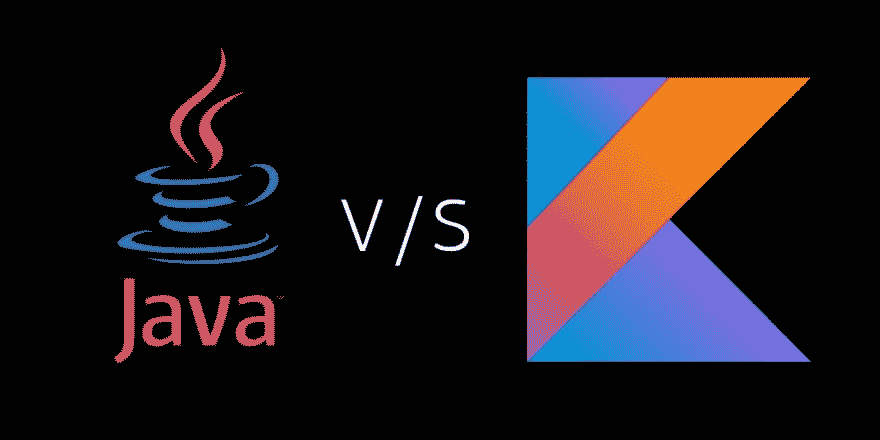

# Java V/S kot Lin——终极 Android 应用开发技术

> 原文：<https://dev.to/mobileappsindia/java-vs-kotlin--the-ultimate-android-app-development-technology-4fg5>

移动应用是一项革命性的技术，没有它，在今天这个时代许多事情都变得不可能。随着移动应用程序在多个平台上开发，应用程序的可访问性并不难。最流行的应用程序开发平台是 iOS 和 Android。即使随着 iOS 平台的流行，Android 也因为其广泛的用户基础而在世界各地获得了突出地位。

Android 应用程序正在兴起，并且有不同的技术用于开发。随着时间的推移，开发人员已经使用了 Lua、C#、JavaScript、C/C++、Scala 和 Clojure 等语言，但更常见的两个名称是 Kotlin 和 Java。这两种技术在争夺最好的 Android 应用程序开发工具上不分上下。

[T2】](https://res.cloudinary.com/practicaldev/image/fetch/s--o2Xh21IC--/c_limit%2Cf_auto%2Cfl_progressive%2Cq_auto%2Cw_880/https://cdn-images-1.medium.com/max/1024/1%2AQfvy2d532fu28lBNwAFohQ.jpeg)

谷歌 I/O 在一次会议上宣布，他们正在考虑将 Kotlin 作为他们开发 android 应用程序的官方支持开发语言，这场辩论由此开始。从那时起，人们就在争论 Java 和 Kotlin 哪个更适合 Android 应用程序开发。让我们一劳永逸地结束这场辩论。下面是一个有效的 Android 开发工具需要的一些特性，让我们看看是 Kotlin 还是 Java 更好。

**准确性和可靠性**

科特林 以简洁可靠的代码为开发者提供舒适的体验。因为 Kotlin 代码是可靠的，开发人员必须编写更少的代码，因此减少了产生 bug 的机会。而且即使在程序中发现了 bug，相对于长代码来说，bug 的排序和消除也会很容易。

*获胜者——科特林*

**最适合初学者**

一个初学 Android 的开发者应该总是从 Java 开始。Java 是 Android 平台开发的基础。由于科特林是新的，科特林的学习材料可能不够充分。 [**Java**](https://www.java.com/en/) 已经存在很久了，所以学习 Java 要比 Kotlin 容易得多。即使 Kotlin 很容易学习，如果你是应用程序开发的初学者，你应该只选择在你有足够的时间学习的情况下学习 Kotlin。

*获胜者— Java*

**易学性**

虽然 Java 是一种流行的语言，但与 Kotlin 相比，它是一种原始的编程语言。任何没有任何移动应用程序开发知识的人都可以轻松学习 Kotlin。它的大多数语法来自 C 和 C++。因此 C 和 C++的基础知识对学习 Kotlin 是有益的。Kotlin 的开发人员已经使它非常容易用于构建高效的 Android 应用程序。

*获胜者——科特林*

**Android studio 支持**

科特林的牌是这里最好的。Kotlin 获得 Android studio 的扩展支持。在 Kotlin 中开发时，开发人员可以同时选择 Java，但在 Java 中，您不能使用 Kotlin。这让 Java 程序员在用 Kotlin 开发时占了上风。Android Studio 还为 Kotlin 提供代码导航、自动完成、完全重构支持、调试和单元测试。

*获胜者——科特林*

**数据类别**

如果项目很复杂，程序中可能有多个保存数据的类。在 Java 中，这个过程很复杂，您必须编写许多样板代码，还需要构造器字段来存储数据获取器和设置器函数。在 Kotlin 中，您只需要包含“data”关键字，编译器就会执行其余的函数，包括数据设置器和获取器函数。

*获胜者——科特林*

在 Kotlin 和 Java 之间的战斗中，Kotlin 显然是赢家。然而，这两种语言都有自己的缺陷，开发人员正在寻找克服这些缺陷的方法。这两种编程语言都被美国、英国、印度和澳大利亚的几家 [**Android 应用程序开发**](https://www.mobile-app-development-india.com/android-mobile-application-development/) 公司使用，这些公司在 Android 应用程序开发领域非常突出。因此，这两种语言都用于高效的 Android 应用程序开发。最终，决定权在你。