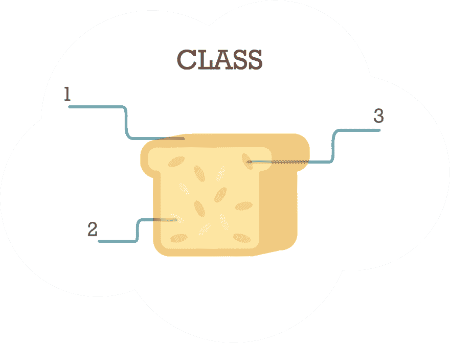
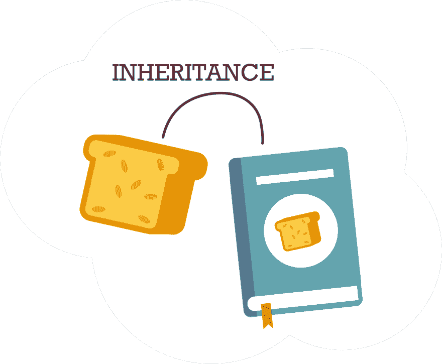

# JavaScript 和面向对象编程

> 原文：<https://dev.to/rainerhahnekamp/javascript-and-object-oriented-programming-55k6>

本文是为没有任何面向对象编程(OOP)知识的 JavaScript 学生编写的。我关注的是 OOP 中只与 JavaScript 相关的部分，而不是一般意义上的 OOP。因此，我跳过多态性，因为我认为它更适合静态类型的语言。

## 为什么需要知道这个？

你选择 JavaScript 作为你的第一编程语言了吗？您想成为一名出色的开发人员，在跨越十万行或更多代码的大型企业系统上工作吗？

除非你学会完全接受面向对象编程，否则你会彻底迷失。

## 不同的心态

在足球中，你可以从安全的防守开始，你可以从两侧玩高球，或者你可以像没有明天一样进攻。所有这些策略都有一个相同的目标:赢得比赛。

编程范式也是如此。处理问题和设计解决方案有不同的方法。

面向对象编程(OOP)是现代应用程序开发的范例，并得到 Java、C#或 JavaScript 等主流语言的支持。

## 面向对象的范例

从 OOP 的角度来看，一个应用程序是一个互相通信的“对象”的集合。我们将这些对象基于现实世界中的事物，如库存中的产品或员工记录。对象包含数据，并根据数据执行一些逻辑。因此，OOP 代码非常容易理解。不那么容易的是首先决定如何将一个应用程序分解成这些小对象。

如果你像我一样第一次听到它，你不知道这实际上意味着什么——这听起来非常抽象。那种感觉绝对没问题。更重要的是，你听说过这个想法，记住它，并尝试在你的代码中应用 OOP。随着时间的推移，您将获得经验，并使更多的代码符合这一理论概念。

第七课:基于现实世界对象的面向对象编程让任何人都能阅读你的代码并理解发生了什么。

## 以物体为中心

一个简单的例子将帮助你了解 JavaScript 如何实现 OOP 的基本原则。考虑一个购物用例，您将产品放入购物篮，然后计算您必须支付的总价。如果你用你的 JavaScript 知识编写没有 OOP 的用例，它会是这样的:

```
const bread = {name: 'Bread', price: 1};
const water = {name: 'Water', price: 0.25};

const basket = [];
basket.push(bread);
basket.push(bread);
basket.push(water);
basket.push(water);
basket.push(water);

const total = basket
  .map(product => product.price)
  .reduce((a, b) => a + b, 0);

console.log('one has to pay in total: ' + total); 
```

Enter fullscreen mode Exit fullscreen mode

OOP 视角使得编写更好的代码更加容易，因为我们认为对象就像我们在现实世界中遇到的一样。因为我们的用例包含一篮子产品，所以我们已经有了两种对象——篮子对象和产品对象。

购物用例的 OOP 版本可以写成这样:

```
const bread = new Product("bread", 1);
const water = new Product("water", .25)

const basket = new Basket();
basket.addProduct(2, bread);
basket.addProduct(3, water);
basket.printShoppingInfo(); 
```

Enter fullscreen mode Exit fullscreen mode

正如你在第一行看到的，我们使用关键字`new`创建了一个新对象，后跟一个类的名称(如下所述)。这将返回一个我们存储到变量 bread 中的对象。我们为可变的水重复这一过程，并采取类似的路径来创建一个可变的篮子。将这些产品添加到购物篮中后，您最终会打印出需要支付的总金额。

这两个代码片段之间的区别是显而易见的。OOP 版本读起来几乎像真正的英语句子，你可以很容易地知道发生了什么。

**第一课**:以现实世界事物为模型的对象由数据和函数组成。

## 类作为模板

[](https://res.cloudinary.com/practicaldev/image/fetch/s--0G_9bW75--/c_limit%2Cf_auto%2Cfl_progressive%2Cq_auto%2Cw_880/https://thepracticaldev.s3.amazonaws.com/i/lalivz6ql5wgwqwlzktq.png) 
我们在 OOP 中使用类作为创建对象的模板。对象是“类的实例”，“实例化”是基于类创建对象。代码是在类中定义的，但除非在活动对象中，否则无法执行。

你可以把类看成是汽车的蓝图。它们定义了汽车的属性，如扭矩和马力，内部功能，如空气燃料比，以及公众可以使用的方法，如点火。然而，只有当工厂实例化汽车时，您才能转动钥匙并驾驶汽车。

在我们的用例中，我们使用 Product 类实例化两个对象，面包和水。当然，这些对象需要你在类中提供的代码。事情是这样的:

```
function Product(_name, _price) {
  const name = _name;
  const price = _price;

  this.getName = function() {
    return name;
  };

  this.getPrice = function() {
    return price;
  };
}

function Basket() {
  const products = [];

  this.addProduct = function(amount, product) {
    products.push(...Array(amount).fill(product));
  };

  this.calcTotal = function() {
    return products
      .map(product => product.getPrice())
      .reduce((a, b) => a + b, 0);
  };

  this.printShoppingInfo = function() {
    console.log('one has to pay in total: ' + this.calcTotal());
  };
} 
```

Enter fullscreen mode Exit fullscreen mode

JavaScript 中的类看起来像一个函数，但是你使用它的方式不同。函数的名字是类的名字，大写。由于它不返回任何东西，所以我们不像`const basket = Product("bread", 1);`那样用通常的方式调用函数。相反，我们添加关键字 new like `const basket = new Product("bread", 1);`。

函数内部的代码是构造函数，每次实例化一个对象时执行。产品有参数`_name`和`_price`。每个新对象都在内部存储这些值。

此外，我们可以定义对象将提供的功能。我们通过在前面加上 this 关键字来定义这些函数，这样就可以从外部访问它们(参见封装)。请注意，这些函数可以完全访问这些属性。

Class Basket 不需要任何参数来创建一个新对象。实例化一个新的 Basket 对象只是生成一个空的产品列表，程序可以在以后填充它。

**第一课**:类是运行时生成对象的模板。

## 封装

[](https://res.cloudinary.com/practicaldev/image/fetch/s--p-Ug7Hm1--/c_limit%2Cf_auto%2Cfl_progressive%2Cq_auto%2Cw_880/https://thepracticaldev.s3.amazonaws.com/i/kv44aru8g9azu34zkjbu.png) 
你可能会遇到另一个版本的如何声明类:

```
function Product(name, price) {
  this.name = name;
  this.price = price;
} 
```

Enter fullscreen mode Exit fullscreen mode

注意将属性赋给变量`this`。乍一看，它似乎是一个更好的版本，因为它不再需要 getter (getName & getPrice)方法，因此更短。

不幸的是，您现在已经授予了从外部访问这些属性的完全权限。这样每个人都可以访问和修改它:

```
const bread = new Product('bread', 1)
bread.price = -10; 
```

Enter fullscreen mode Exit fullscreen mode

这是你不想要的，因为它会使应用程序更难维护。例如，如果添加验证代码来防止价格低于零，会发生什么情况？任何直接访问 price 属性的代码都将绕过验证。这可能会引入难以跟踪的错误。另一方面，使用对象的 getter 方法的代码肯定会通过对象的价格验证。

对象应该对其数据拥有独占控制权。换句话说，这些对象“封装”了它们的数据，并防止其他对象直接访问这些数据。访问数据的唯一方式是通过写入对象的函数间接访问。

数据和处理(又名。逻辑)属于一起。对于大型应用程序来说尤其如此，在这些应用程序中，将数据处理限制在特定的位置非常重要。

做对了，结果 OOP 通过设计产生了模块化，这是软件开发中的圣杯。它避免了令人恐惧的意大利面条式代码，在这种代码中，一切都是紧密耦合的，当您更改一小部分代码时，您不知道会发生什么。

在我们的例子中，Product 类的对象不允许你在初始化后改变价格或名称。产品的实例是只读的。

第七课:封装阻止了对数据的访问，除非通过对象的函数。

## 继承

[](https://res.cloudinary.com/practicaldev/image/fetch/s--cd-Bt39s--/c_limit%2Cf_auto%2Cfl_progressive%2Cq_auto%2Cw_880/https://thepracticaldev.s3.amazonaws.com/i/u32on9i6pbkgb9h09hyz.png) 
继承允许您通过用附加属性和功能扩展现有类来创建新类。新类“继承”了其父类的所有特性，避免了从头开始创建新代码。此外，对父类所做的任何更改都将自动对子类可用，这使得更新更加容易。

假设我们有一个名为 Book 的新类，它有名称、价格和作者。有了继承，你可以说一本书和一个产品是一样的，只是多了一个作者属性。我们说 Product 是 Book 的超类，Book 是 Product 的子类:

```
function Book(_name, _price, _author) {
  Product.call(this, _name, _price);
  const author = _author;

  this.getAuthor = function() {
    return author;
  };

} 
```

Enter fullscreen mode Exit fullscreen mode

注意沿着`this`的附加`Product.call`作为第一个参数。请注意:尽管 book 提供了 getter 方法，但它仍然不能直接访问属性名称和价格。Book 必须从 Product 类中调用数据。
你现在可以毫无问题地将一本书添加到购物篮中:

```
const faust = new Book('faust', 12.5, 'Goethe');
basket.addProduct(1, faust); 
```

Enter fullscreen mode Exit fullscreen mode

Basket 需要一个 Product 类型的对象，因为 book 从 Product 继承到 Book，所以它也是一个产品。

第七课:子类可以继承超类的属性和功能，同时增加自己的属性和功能。

## JavaScript 和 OOP

您会发现有三种不同的编程范例用于创建 JavaScript 应用程序。它们是基于原型的编程、面向对象的编程和面向函数的编程。

原因在于 JavaScript 的历史。最初，它是基于原型的。JavaScript 不是为大型应用程序设计的语言。

与创始人的计划相反，开发人员越来越多地将 JavaScript 用于更大的应用程序。OOP 被移植到最初的基于原型的技术之上。

基于原型的方法如下所示，被视为构造类的“经典和默认的方法”。不幸的是，它不支持封装。

即使 JavaScript 对 OOP 的支持与 Java 等其他语言不在一个级别，但它仍在不断发展。ES6 版本的发布增加了一个我们可以使用的专用关键字`class`。在内部，它的作用与 prototype 属性相同，但是它减少了代码的大小。但是 ES6 类还是缺少私有属性，这也是我坚持“老办法”的原因。

为了完整起见，这就是我们如何用 ES6 类和原型(经典和默认)方法编写产品、购物篮和图书。请注意，这些版本不提供封装:

```
// ES6 version

class Product {
  constructor(name, price) {
    this.name = name;
    this.price = price;
  }
}

class Book extends Product {
  constructor(name, price, author) {
    super(name, price);
    this.author = author;
  }
}

class Basket {
  constructor() {
    this.products = [];
  }

  addProduct(amount, product) {
    this.products.push(...Array(amount).fill(product));
  }

  calcTotal() {
    return this.products
      .map(product => product.price)
      .reduce((a, b) => a + b, 0);
  }

  printShoppingInfo() {
    console.log('one has to pay in total: ' + this.calcTotal());
  }
}

const bread = new Product('bread', 1);
const water = new Product('water', 0.25);
const faust = new Book('faust', 12.5, 'Goethe');

const basket = new Basket();
basket.addProduct(2, bread);
basket.addProduct(3, water);
basket.addProduct(1, faust);
basket.printShoppingInfo(); 
```

Enter fullscreen mode Exit fullscreen mode

```
//Prototype version

function Product(name, price) {
  this.name = name;
  this.price = price;
}

function Book(name, price, author) {
  Product.call(this, name, price);
  this.author = author;
}
Book.prototype = Object.create(Product.prototype);
Book.prototype.constructor = Book;

function Basket() {
  this.products = [];
}
Basket.prototype.addProduct = function(amount, product) {
  this.products.push(...Array(amount).fill(product));
};
Basket.prototype.calcTotal = function() {
  return this.products
    .map(product => product.price)
    .reduce((a, b) => a + b, 0);
};
Basket.prototype.printShoppingInfo = function() {
  console.log('one has to pay in total: ' + this.calcTotal());
}; 
```

Enter fullscreen mode Exit fullscreen mode

第七课:在 JavaScript 开发的后期，OOP 被添加到其中。

## 总结

作为一个学习 JavaScript 的新程序员，完全理解面向对象编程需要时间。在这个早期阶段需要理解的重要事情是 OOP 范例所基于的原则以及它们提供的好处:

*   基于现实世界事物建模的对象是任何基于 OOP 的应用程序的核心。
*   封装保护数据不受不受控制的访问。
*   对象具有对对象包含的数据进行操作的函数。
*   类是用来实例化对象的模板。
*   继承是避免冗余的强大工具。
*   OOP 比其他编码范例更冗长，但更容易阅读。
*   由于 OOP 出现在 JavaScript 开发的后期，您可能会遇到使用原型或函数式编程技术的旧代码。

## 进一步阅读

*   [https://developer . Mozilla . org/en-US/docs/Learn/JavaScript/Objects/Object-oriented _ JS](https://developer.mozilla.org/en-US/docs/Learn/JavaScript/Objects/Object-oriented_JS)
*   [http://voidcanvas.com/es6-private-variables/](http://voidcanvas.com/es6-private-variables/)
*   [https://medium . com/@ rajaraodv/is-class-in-es6-the-new-bad-part-6 C4 E6 Fe 1e 65](https://medium.com/@rajaraodv/is-class-in-es6-the-new-bad-part-6c4e6fe1ee65)
*   [https://developer . Mozilla . org/en-US/docs/Learn/JavaScript/Objects/Inheritance](https://developer.mozilla.org/en-US/docs/Learn/JavaScript/Objects/Inheritance)
*   [https://en.wikipedia.org/wiki/Object-oriented_programming](https://en.wikipedia.org/wiki/Object-oriented_programming)