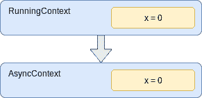
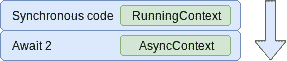
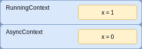
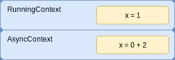
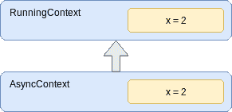

# JavaScript:异步数学很难

> 原文：<https://dev.to/antogarand/javascript-async-maths-is-hard-5b6i>

# 挑战

虽然我们很高兴 ES7 给我们带来了`async`和`await`，但异步代码仍然不像它应该的那样简单。
试着猜猜下面的片段应该返回什么，然后去写一篇文章！

```
function sleepOneSecondAndReturnTwo() {
    return new Promise(resolve =>  {
        setTimeout(() => { resolve(2); }, 1000);
    });
}

let x = 0;

async function incrementXInOneSecond() {
    x += await sleepOneSecondAndReturnTwo();
    console.log(x);
}

incrementXInOneSecond();
x++;
console.log(x); 
```

由于 JavaScript 如何处理异步代码，这可以简化很多。

新函数的`setTimeout`和创建不是必需的，因为执行的异步部分将被延迟，即使在承诺解析中没有延迟。

`await`也会将非承诺转换为已解决的承诺，如 [MDN 的 await 页面](https://developer.mozilla.org/en-US/docs/Web/JavaScript/Reference/Operators/await)所述

> 如果 await 操作符后面的表达式的值不是一个承诺，它将被转换为一个已解析的承诺。

`await 2`因此是`await Promise.resolve(2);`的速记语法。

这就引出了下面的代码:

```
let x = 0;

async function incrementX() {
    x += await 2;
    console.log(x);
}

incrementX();
x++;
console.log(x); 
```

# 写完

让我先给出这篇文章的灵感，这是杰克·阿奇博尔德的[这个](https://www.youtube.com/watch?v=bfxglBVSNDI)很棒的视频。
我发现内容非常有趣，所以我写在这里，但所有的功劳归于杰克！

## 答案

以下是之前挑战的简短版本:

```
let x = 0;

async function incrementX() {
    x += await 2;
    console.log(x);
}

incrementX();
x++;
console.log(x); 
```

您可能已经发现，这个脚本的输出是`1`和`2`，而不是我们预期的`1`和`3`。

让我们看看代码的同步部分将如何执行:

```
let x = 0; 
```

相当容易，`x = 0`！

现在，在异步函数内部，事情变得有趣了。
为了更容易形象化，我将*展开*[加法赋值](https://developer.mozilla.org/en-US/docs/Web/JavaScript/Reference/Operators/Assignment_Operators#Addition_assignment)的完整形式，因为它主要是语法糖:

```
x += await 2; 
```

变成了

```
x = x + await 2; 
```

因为我们在一个异步函数中，一旦到达`await`语句，我们将改变我们的执行上下文。
将创建一个`runningContext`的副本，命名为`asyncContext`。
当我们的异步函数恢复执行时，将使用这个上下文来代替当前运行的上下文。

这是在运行异步函数时在 [EcmaScript 规范中定义的行为。](https://tc39.github.io/ecma262/#sec-async-functions-abstract-operations-async-function-start)

[T2】](https://res.cloudinary.com/practicaldev/image/fetch/s--pw4eh2Yz--/c_limit%2Cf_auto%2Cfl_progressive%2Cq_auto%2Cw_880/https://thepracticaldev.s3.amazonaws.com/i/dflig534m7phna8qz37j.png)

由于我们现在*在等待*一个变量，函数的剩余内容将不会被执行，直到承诺被解决，并且执行堆栈是空的。

[T2】](https://res.cloudinary.com/practicaldev/image/fetch/s--AZ5U8P6G--/c_limit%2Cf_auto%2Cfl_progressive%2Cq_auto%2Cw_880/https://thepracticaldev.s3.amazonaws.com/i/ztazp0ppdjdhzqai2s2z.png)

因此，我们将继续同步执行代码。

```
x++; 
```

`x`现在是 1！

在运行的执行堆栈中，X 的前一个值是 0，因此它增加到 1。

[](https://res.cloudinary.com/practicaldev/image/fetch/s--YLQY8X3P--/c_limit%2Cf_auto%2Cfl_progressive%2Cq_auto%2Cw_880/https://thepracticaldev.s3.amazonaws.com/i/l2j4xwgw40lsnx52f4ed.png)T3】

```
console.log(x) 
```

将`1`打印到控制台中

我们当前的执行已经完成，因此我们现在可以回到异步执行。

`await 2`是`await Promise.resolve(2)`的速记语法，立即得到解析。

异步执行上下文仍然有先前值为`0`的`x`，所以下面的代码被执行:

```
x = x + 2; 
```

在我们当前的执行上下文中，它与下面的相同:

```
x = 0 + 2; 
```

[T2】](https://res.cloudinary.com/practicaldev/image/fetch/s--XPnCtgWN--/c_limit%2Cf_auto%2Cfl_progressive%2Cq_auto%2Cw_880/https://thepracticaldev.s3.amazonaws.com/i/q3zlfmydvl9grr2950yl.png)

异步执行上下文现在具有值为 2 的 X。

[T4】](https://res.cloudinary.com/practicaldev/image/fetch/s--acaokrk8--/c_limit%2Cf_auto%2Cfl_progressive%2Cq_auto%2Cw_880/https://thepracticaldev.s3.amazonaws.com/i/phzk73lgam8hwayxgof6.png)

最后，当我们现在进入一个新的同步代码块时，两个执行上下文将合并，正在运行的执行上下文将获得`x`的新值`2`。
T3T5

```
console.log(x) 
```

`2`终于被打印进了控制台。

## 真实世界

这对我们开发者来说意味着什么？

这个帖子的内容看似深奥的知识，但实际上最初是用一个真实的场景发现的。
[这篇](https://www.reddit.com/r/javascript/comments/8lih82/javascript_operator_causing_race_conditions_when/) reddit 帖子有一个片段，可以用下面的话来概括:

```
let sum = 0;

function addSum() {
    [1,2,3,4,5].forEach(async value => {
        sum += await value;
        console.log(sum);
    });
}

addSum();

setTimeout(() => { console.log(sum); }, 1000); 
```

你大概知道，下面这段代码的输出会是`1`、`2`、`3`、`4`、`5`，最后一秒后是`5`。
删除`await`关键字会返回`15`，如果我们不熟悉这篇文章的内容，这是一种奇怪的行为。

用`await getSomeAsynchronousValueFromAnApi()`替换`await value`，你会得到一个真实世界的场景，其中很可能需要几个小时的调试和挠头！

## 方案

有许多变通办法可以防止这种情况发生，这里是其中的一些。

下面是我要替换的原代码:

```
x += await 2; 
```

### 方案一:在变量中等待

```
const result = await 2;
x += result; 
```

使用这种解决方案，执行上下文将不会共享`x`变量，因此它不会被合并。

### 方案二:等待后添加到 X

```
x = await 2 + x; 
```

如果操作中有多个 await 语句，这个解决方案仍然容易出错，但是它确实可以防止在多个执行上下文中覆盖 X！

# 结论

Await 很棒，但是你不能期望它像同步代码一样工作！单元测试和良好的编码实践将有助于防止那些奇怪的场景进入生产环境。

请写下您对此行为的不同解决方法和最佳实践的评论，我很想听听您对此问题的看法！

# 参考文献

EcmaScript:

*   [承诺执行人](http://www.ecma-international.org/ecma-262/6.0/#sec-promise-executor)
*   [异步功能](https://tc39.github.io/ecma262/#sec-async-functions-abstract-operations-async-function-start)

Youtube: [JS 竞猜:异步函数执行顺序](https://www.youtube.com/watch?v=bfxglBVSNDI)
Reddit: [本帖原创灵感](https://www.reddit.com/r/javascript/comments/8lih82/javascript_operator_causing_race_conditions_when/)

<small>原创上[Gitlab](https://gitlab.com/AntonyGarand/javascript-quirks/blob/master/writeups/3-async_maths.md)T3】</small>