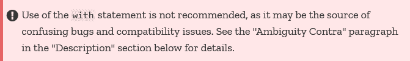

# JavaScript:等式精神错乱，还是其中 x === 1 && x === 2

> 原文：<https://dev.to/antogarand/javascript-equality-insanity-or-where-x--1--x------------------------------2-2hig>

JavaScript 可以用来让最优秀的我们怀疑当前正在发生的事情。

在这篇文章中，我将向你展示不同的方法来使下面的语句返回 true:

```
x === 1 && x === 2 
```

Enter fullscreen mode Exit fullscreen mode

让我以一个挑战开始，对于你们当中那些想自己先尝试的人。如果你只想知道答案，跳到*文章*部分！

# 挑战

这项挑战有三个难度级别，以及许多可用的解决方案！

你的目标是给 X 一个需要打印的`Flag!`值。

将以下代码片段放在某处，以便打印`Flag!`

## 一级

```
// Your code here

if(x == 1 && x == 2 && x == 3) {
    console.log('Flag!');
} else {
    console.log('Wrong flag!');
}

// Your code here 
```

Enter fullscreen mode Exit fullscreen mode

## 二级

让我们通过使用严格的等号运算符让事情变得更难一点！

```
// Your code here

if(x === 1 && x === 2 && x === 3) {
    console.log('Flag!');
} else {
    console.log('Wrong flag!');
}

// Your code here 
```

Enter fullscreen mode Exit fullscreen mode

## 三级

最后，让我们打印当前范围内的标志！

这意味着这个语句不应该在一个类或函数内，而是由它自己在脚本内。

```
// Your code here

if(x === 1 && x === 2 && x === 3) {
    console.log('Flag!');
} else {
    console.log('Wrong flag!');
} 
```

Enter fullscreen mode Exit fullscreen mode

# 写完

你设法打印出`Flag!`了吗？

## 第一部分

这是之前挑战的第一部分:

```
if(x == 1 && x == 2 && x == 3) { 
```

Enter fullscreen mode Exit fullscreen mode

解决这部分挑战的关键是了解 JavaScript 如何比较两个对象。

使用*相等操作符* `==`而不是*严格相等操作符* `===`意味着引擎会在比较之前尝试将两个对象都转换成原语。

您可以在 MDN 的[比较运算符](https://developer.mozilla.org/en-US/docs/Web/JavaScript/Reference/Operators/Comparison_Operators)页面上找到更多关于比较的信息。

这意味着如果我们比较一个对象和一个字符串，`myObject.toString()`的结果将被用于比较而不是失败。

例如:

```
const myObject = {
    toString() {
        return 'My Object!';
    }
}
console.log(myObject == 'My Object!'); 
```

Enter fullscreen mode Exit fullscreen mode

返回`true`

在我们的场景中，当我们将 x 与原始类型`Number`进行比较时，以下步骤将在后台发生:

> 如果 Type(x)是 Object，Type(y)是 String 或 Number，
> 
> 返回与 Primitive(x) == y 的比较结果。

EcmaScript: [抽象相等比较算法](https://www.ecma-international.org/ecma-262/5.1/#sec-11.9.3)中记录了这种行为

将对象转换为原语是通过调用对象的`toString`或`valueOf`方法来实现的，如下所述:[Object[[default value]]](https://www.ecma-international.org/ecma-262/5.1/#sec-8.12.8)

在 ES6 中，我们也可以直接覆盖 [Symbol.toPrimitive](https://developer.mozilla.org/en-US/docs/Web/JavaScript/Reference/Global_Objects/Symbol/toPrimitive) 来返回我们自己的自定义值。
因此我们可以创建一个对象，用`toString`或`valueOf`函数返回一个递增的数字！

### 解

```
let i = 1,
  x = {
    valueOf() { // Default conversion for numbers
      return i++;
    },
    toString() { // Default conversion for strings
      return i++;
    },
    [Symbol.toPrimitive]() { // toPrimitive override
        return i++;
    }
  }

if(x == 1 && x == 2 && x == 3) {
    console.log('Flag!');
} else {
    console.log('Wrong flag!');
} 
```

Enter fullscreen mode Exit fullscreen mode

请注意，Symbol.toPrimitive 是第一个尝试调用，然后是`valueOf`，最后是`toString`，如果这个顺序对您未来的挑战很重要的话。

## 第二部分

这个挑战的第一部分可以使用一个对象和一个非严格的比较来解决，但是在这里不行。
T5 由于我们使用的是严格的等号运算符，`x`需要是`1`，然后是`2`，最后是`3`。

解决这个问题需要两个技巧:
[吸气器](https://developer.mozilla.org/en-US/docs/Web/JavaScript/Reference/Functions/get)和一个晦涩难懂的`with`语句。

这个解决方案的第一部分需要创建一个对象`myObject`，它的`x`属性被设置为一个 getter 函数:

```
 let i = 1,
  myObject = {
    get x() {
        return i++;
    }
 } 
```

Enter fullscreen mode Exit fullscreen mode

我们现在可以访问`myObject.x`，它将返回一个递增的值！

这仍然不足以解决挑战，因为 if 语句在比较中没有我们的`myObject`前缀。

不管谢天谢地与否，JavaScript 中有一个晦涩的语句让我们将范围设置为对象的属性:`with`

当操作员的 MDN 页面以这个大警告开始时，您不喜欢吗？

[T2】](https://res.cloudinary.com/practicaldev/image/fetch/s--7uL5Bfog--/c_limit%2Cf_auto%2Cfl_progressive%2Cq_auto%2Cw_880/https://thepracticaldev.s3.amazonaws.com/i/l3xlxgygbortedtxvoow.png)

MDN [文档](https://developer.mozilla.org/en-US/docs/Web/JavaScript/Reference/Statements/with)描述如下:

> “with”语句在评估其语句体期间将给定对象添加到此范围链的头部。如果主体中使用的非限定名称与作用域链中的属性匹配，则该名称将绑定到该属性和包含该属性的对象。

因此，这个解决方案的第二部分是将比较包装在一个`with`语句中，这将让`x`像本地属性一样被访问。

### 解

```
let i = 1,
  myObject = {
    get x() {
        return i++;
    }
 }

with(myObject) {

  if(x === 1 && x === 2 && x === 3) {
    console.log('Flag!');
  } else {
    console.log('Wrong flag!');
  }

} 
```

Enter fullscreen mode Exit fullscreen mode

## 第三部分

只有当你能控制 if 语句的上下文时，前面的解决方案才起作用，当你在寻找 XSS 的时候，这种情况很少发生。

因此，我们可以修改我们的解决方案，要求在 if 语句之前有一个入口点来打印出`Flag!`。

注:如果你只有一个比较下面的切入点，你可能想看看我以前的帖子:[小心不必要的提升](https://dev.to/antogarand/javascript-watch-out-for-unwanted-hoisting-49ii)！

由于我们仍然使用严格的等式检查，我们仍然需要使用一个 getter 来生成 X.

这个解决方案的不同之处在于直接在当前作用域上添加访问器，即`this`对象。

在浏览器中，`this`指的是由 DOM 模型定义的`window`对象。

在 NodeJS 中，`this`指的是`global`对象。

要修改当前对象的属性，我们将使用 [Object.defineProperty](https://developer.mozilla.org/en-US/docs/Web/JavaScript/Reference/Global_Objects/Object/defineProperty)

### 解

```
let a = 1;
Object.defineProperty(
  window, // Object to assign the new property to: this, window, or global depending on the context 
  'x', // Name of the property to assign
  {  // Properties of the object, the getter function in our case
    get: function() { 
      return a++; 
    } 
  }
);

if(x === 1 && x === 2 && x === 3) {
  console.log('Flag!');
} else {
  console.log('Wrong flag!');
} 
```

Enter fullscreen mode Exit fullscreen mode

# 结论

感谢它的动态本质，JavaScript 可以让一个理智的开发人员理解为什么`x === 1 && x === 2 && x !== x`能够工作！

希望在实际代码中没有人会依赖这样的特性，但是我希望看到这样的特性的真实用例。

另一方面，这让我想到了在 JavaScript 中比较可能是错误的。

你可能知道，`NaN`在比较中总是返回 false，包括与自身的比较。我所知道的唯一一个可能为真的值是 T1，因为每个符号都是唯一的。

现在，我们可以为`x`创建一个动态值，其中`x !== x`确实为真。

知道 JS 的其他有趣的特性，你认为这些特性值得发表吗？

留下评论或在[推特上联系我](https://twitter.com/antogarand)！

# 参考文献

MDN: [比较运算符](https://developer.mozilla.org/en-US/docs/Web/JavaScript/Reference/Operators/Comparison_Operators)

EcmaScript: [抽象等式比较算法](https://www.ecma-international.org/ecma-262/5.1/#sec-11.9.3)

EcmaScript: [对象[[DefaultValue]]](https://www.ecma-international.org/ecma-262/5.1/#sec-8.12.8)

MDN:[Getters](https://developer.mozilla.org/en-US/docs/Web/JavaScript/Reference/Functions/get)

MDN:[With](https://developer.mozilla.org/en-US/docs/Web/JavaScript/Reference/Statements/with)

MDN:[object . define property](https://developer.mozilla.org/en-US/docs/Web/JavaScript/Reference/Global_Objects/Object/defineProperty)