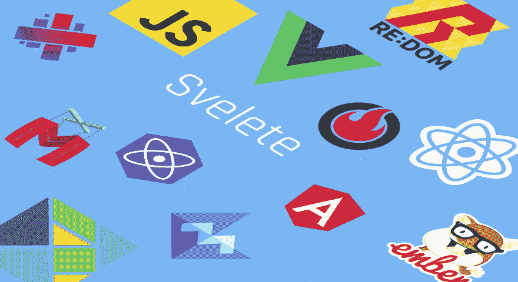

# JavaScript 框架，性能比较

> 原文：<https://dev.to/ajmeyghani/javascript-frameworks-performance-comparison-a54>

[T2】](https://res.cloudinary.com/practicaldev/image/fetch/s--oPS2FJ0T--/c_limit%2Cf_auto%2Cfl_progressive%2Cq_auto%2Cw_880/https://thepracticaldev.s3.amazonaws.com/i/8ucgt2k3m6id1jtj4vzz.png)

> 阅读全文，所有结果表格都在[介质](https://medium.com/@ajmeyghani/javascript-frameworks-performance-comparison-c566d19ab65b)上。

我认为使用 Stefan Krause 的基准测试工具并在最知名的前端框架和 UI 库之间进行一些性能比较会很有趣。

> 请注意，这篇文章只是我在笔记本电脑上使用上述工具运行基准测试时的观察记录。您可以使用这篇文章作为参考，但是您必须始终运行您自己的基准，并根据您的项目需求做出决策。您还应该看看其他基准，如[真实应用基准。](https://medium.freecodecamp.org/a-real-world-comparison-of-front-end-frameworks-with-benchmarks-2018-update-e5760fb4a962)

现在，抛开这些不谈，喝杯咖啡，享受这场表演吧。

## 竞技场

所有基准测试都是在我的 MacBook Pro 上进行的，规格如下:

*   MacBook Pro(视网膜，15 英寸，2015 年年中)
*   处理器:2.2 GHz 英特尔酷睿 i7 处理器
*   内存:16 GB 1600 MHz DDR3
*   显卡:英特尔 Iris Pro 1536 MB
*   浏览器:谷歌浏览器，版本 69.0.3497.100

## 团队*

在我们的基准测试中，我们有两个团队，框架团队和库团队。在框架团队(团队 1)中，我们有:

*   角度* v6.1.0
*   Elm v0.19.0
*   Choo v6.13.0
*   安圭拉 v1.7.4
*   奥雷利亚 1.3.0 版
*   木偶版本 4.0.0(没有 jQuery)
*   mithril 1 . 1 . 1 版
*   ember 3 . 0 . 0 版

在 UI 库团队(团队 2)中，我们有:

*   反应 v16.5.2
*   视图 v2.5.17
*   预测版本 8.3.1
*   Inferno v5.6.1
*   小册子* v2.13.5
*   Bobril v8.11.2 版
*   Redom v3.13.1
*   3.3.0 版模板

## 战斗打响

在这场终极锦标赛中，每支队伍最初都将在自己的队伍中竞争。接下来，为了让事情变得更有趣，每个队的获胜者将互相竞争。最后，最优秀的选手将与空前的冠军，普莱恩斯，也就是瓦妮亚斯，一决高下。

此外，值得一提的是，每个团队都将参加以下类别的比赛:

*   DOM 操作
*   启动时间
*   存储器分配

为了获得更好的结果，每个基准测试进行三次，并记录每个结果的标准偏差。此外，在每个团队的战斗结束时，我将展示一个表格，总结所有框架和库对团队获胜者的结果。

最后，为了好玩，我还将提供最流行的框架和库的相对结果:Angular、Inferno、Preact、react 和 Vue。

## 1 队比赛

第一小组的第一轮比赛如下:

*   棱角 vs 榆树
*   安圭拉 vs Choo
*   牵线木偶大战秘银
*   奥雷利亚对烬

### 第 1 组，第 1 轮获胜者:

*   榆树
*   初
*   牵线木偶
*   蛹

### 第 1 组，第 2 轮获胜者:

*   榆树
*   牵线木偶

### 第一小组，最后一轮

牵线木偶战胜榆树。

## 第二队比赛

第二队的第一轮比赛如下:

*   反应与视图
*   预知犯罪系统 vs 地狱
*   Svelete vs Redom
*   波波里 vs 马基特

### 第二组，第一轮获胜者

*   某视频剪辑软件
*   地狱
*   Redom
*   初步设计的模型

### 第 2 队，第 2 轮获胜者

*   地狱
*   Redom

### 第二队，胜者

Redom 战胜 Inferno

## 胜利者的战斗，雷东姆 vs 提线木偶

雷东姆总体上赢了提线木偶

## 结论

性能基准是一个热门话题，谈论它很有挑战性。然而在这篇文章中，我试图为那些对这个话题感兴趣的人提供一个起点。如前所述，您应该始终运行您自己的基准，创建原型并根据您的项目需求评估选项。

让我知道你的想法。您认为这些基准值在现实世界中是不相关的，还是提供了一些见解？我很想听听你的想法。

> 阅读全文，所有结果表格都在[介质](https://medium.com/@ajmeyghani/javascript-frameworks-performance-comparison-c566d19ab65b)上。