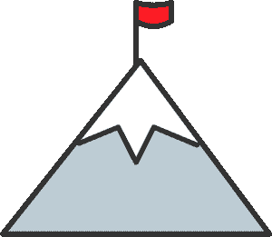
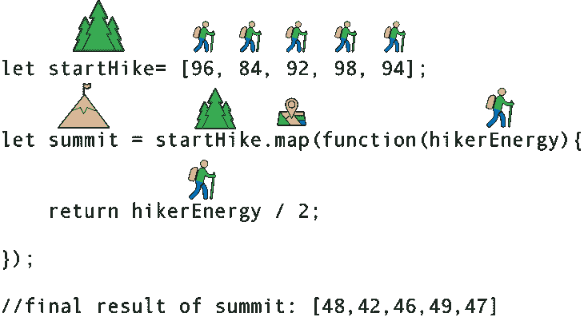
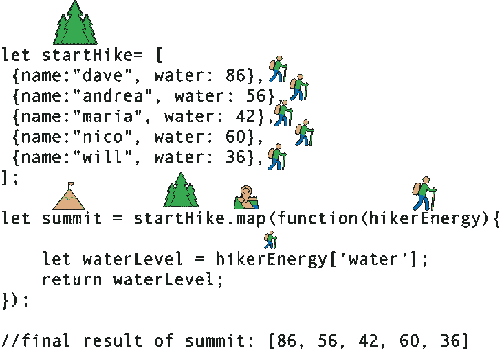

# 用徒步旅行来解释 JavaScript Map()方法

> 原文：<https://dev.to/kbk0125/javascript-map-method-explained-by-going-on-a-hike--537i>

*如果你曾经爬过山，那么你就能理解 JavaScript 的 map 方法，这是 JavaScript 的高阶函数之一。

我承认:我已经养成了一个可怕的习惯，那就是每当我需要遍历一个数组时，就严格地使用 for 循环。偶尔，我可能会在其中加入一个 forEach()，但大多数情况下，我会为了另一个 for()循环而牺牲简洁的代码。

所以，我想重温一下 JavaScript 的一些高阶函数。我开始研究 map()，并意识到我没有使用它是因为我不理解它的不同部分。

经过一点调查，我意识到可以通过将 map 方法()与爬山进行比较来可视化它的功能。我一会儿再解释。

下面是 map()方法的一个快速总结。

map()从原始数组中取出每个元素，用您指定的函数对其进行转换，并以相同的顺序将结果添加到新数组中。

当然，你可以用一个*来代替*循环来做这件事。但是使用 map()将允许您编写更少的代码，并使您的代码更具可读性。

在你阅读教程的其余部分之前，你只需要理解循环的*。如果你需要复习，你可以查看我的[循环指南。](https://blog.codeanalogies.com/2017/11/07/javascript-for-loops-explained/)*

### 这和徒步旅行有什么关系？

假设有一座大家都喜欢爬的热门山，白山。(这基本上是我能想到的最老套的可徒步旅行的山的名字了)。

[T2】](https://res.cloudinary.com/practicaldev/image/fetch/s--vYC-FFfw--/c_limit%2Cf_auto%2Cfl_progressive%2Cq_auto%2Cw_880/https://cdn-images-1.medium.com/max/800/0%2Ak1NzQQlDE_Y-KJxY.)

当每个人爬山的时候，他们都会经历一个不同的转变。在底部，他们营养充足，水分充足，精力充沛。但是当徒步旅行者到达山顶时，他们已经饿了，脱水了，也累了。

map 方法的工作方式相同。

[T2】](https://res.cloudinary.com/practicaldev/image/fetch/s--mpj0jKfq--/c_limit%2Cf_auto%2Cfl_progressive%2Cq_auto%2Cw_880/https://cdn-images-1.medium.com/max/800/0%2AurXViUWL8hGsQBHZ.)

它接受每个元素，按照您指定的方式修改它，并将结果添加到第二个数组中。

### 地图的基本知识()方法

我们来举个例子。假设我们有 5 个徒步旅行者要去白山山顶。为了象征这 5 名徒步旅行者，我们将使用一个包含 5 个数字的数组来表示他们的能量水平(满分为 100)。

```
 let startHike= [95, 83, 92, 98, 94]; 
```

Enter fullscreen mode Exit fullscreen mode

当这些徒步旅行者到达山顶时，他们 50%的能量将被耗尽。用代码来说，这意味着我们需要创建另一个数组来存储他们的新能量水平。

如果我们用一个*来表示*循环，它看起来会像这样:

```
 let startHike= [96, 84, 92, 98, 94]; 
    let summit = []; 

    for(let i=0;  i<startHike.length; i++){ 

        let hikerEnergy=starthike[i]; 

        let halfEnergy= hikerEnergy/2 

        summit.push(halfEnergy); 
    } 

    //final result of summit: [48,42,46,49,47] 
```

Enter fullscreen mode Exit fullscreen mode

相反，我们可以使用 **map()方法**在三行代码和一半数量的变量中完成所有这些。

[T2】](https://res.cloudinary.com/practicaldev/image/fetch/s--WWQRkVK2--/c_limit%2Cf_auto%2Cfl_progressive%2Cq_auto%2Cw_880/https://cdn-images-1.medium.com/max/800/0%2AasyHfye69uDCyp4I.)

下面是代码的样子:

```
 let startHike= [96, 84, 92, 98, 94]; 

    let summit = startHike.map(function(hikerEnergy){ 
         return hikerEnergy / 2; 
    }); 

    //final result of summit: [48,42,46,49,47] 
```

Enter fullscreen mode Exit fullscreen mode

哇哦。一下子就很多了。下图显示了该代码块如何连接到上图。

[T2】](https://res.cloudinary.com/practicaldev/image/fetch/s--PXsSvg0k--/c_limit%2Cf_auto%2Cfl_progressive%2Cq_auto%2Cw_880/https://cdn-images-1.medium.com/max/800/0%2Axh5zyZRjtmKiM-1Y.)

我猜还是一次很多？这里是对每一部分的解释，因为与 for 循环的逻辑相比，它有点混乱。

**startHike** =我们的数组存储了 5 个徒步者在徒步开始时的能量水平。

**summit** =当能量等级到达山顶时存储能量等级的数组，这是本例中的最终产品。

**。map()** =数组的 map 方法，它将遍历 startHike 数组中的每一项。

**function(hikerEnergy)** =对 startHike 数组中的每个元素使用参数 hikerEnergy 的回调

**return** =添加到对应于 startHike 数组中每个元素的 summit 数组中的项目

在本例中，我们将第 2 行开头填充的数组命名为:summit。这似乎有些令人困惑。在上面使用的 *for* 循环中，我们没有向顶点数组添加任何元素，直到最后一行。

现在，我们将调用 summit 变量的行为从添加新元素中分离出来。我们在第 2 行中称*为 summit* ，但是在第 3 行中添加了新元素。

同样，就像 for 循环一样，原始数组保持不变。您只需将修改后的条目添加到一个新数组中， *summit* 。

### 例 2:使用一个充满对象的数组

当然，你通常不会使用充满数字的一维数组。您可能还会遇到一个充满对象的数组。这就是 map()函数变得更加有用的地方。

让我们假设你还有 5 个徒步旅行者。每一个都用一个有名字和水合程度(满分 100)的物体来象征。

```
 let startHike= [ 
     {name:"dave", water: 86},
     {name:"andrea", water: 56},
     {name:"maria", water: 42},
     {name:"nico", water: 60},
     {name:"will", water: 36}, 
    ]; 
```

Enter fullscreen mode Exit fullscreen mode

你想删除这些徒步旅行者的所有名字，这样你就可以对他们的水合程度进行科学研究。所以，你的最终数组只需要有初始水量，没有名字。

在这种情况下，map()方法将帮助我们存储每个项目的水值。

[T2】](https://res.cloudinary.com/practicaldev/image/fetch/s--AMUDDdSV--/c_limit%2Cf_auto%2Cfl_progressive%2Cq_auto%2Cw_880/https://cdn-images-1.medium.com/max/800/0%2AoXW3CnTyzlPb_jYS.)

我们只需要查看一个键/值对，并将值移动到一个新的数组中。

```
 let startHike= [
     {name:"dave", water: 86},
     {name:"andrea", water: 56},
     {name:"maria", water: 42},
     {name:"nico", water: 60},
     {name:"will", water: 36} 
    ]; 

    let summit = startHike.map(function(hikerEnergy){ 
      let waterLevel = hikerEnergy['water']; 
      return waterLevel; 
    });  

    //final result of summit: [86, 56, 42, 60, 36] 
```

Enter fullscreen mode Exit fullscreen mode

这是可视化的版本。

[T2】](https://res.cloudinary.com/practicaldev/image/fetch/s--3Ptv43Ob--/c_limit%2Cf_auto%2Cfl_progressive%2Cq_auto%2Cw_880/https://cdn-images-1.medium.com/max/800/0%2AUJN01bOxjir9Aq3J.)

虽然这现在看起来很容易，但是当你有复杂的多维数组，并且你不想开始引入 for 循环时，它很快变得很重要。

此外，React 开发人员倾向于使用 map()而不是 for 循环。因此，如果你打算学习 React，你已经有了一个良好的开端。

### 获取更多可视化教程

如果你喜欢这篇教程，你可能也会喜欢我的其他关于基本 web 开发概念的教程。查看 [CodeAnalogies 博客](https://codeanalogies.com)了解最新消息。