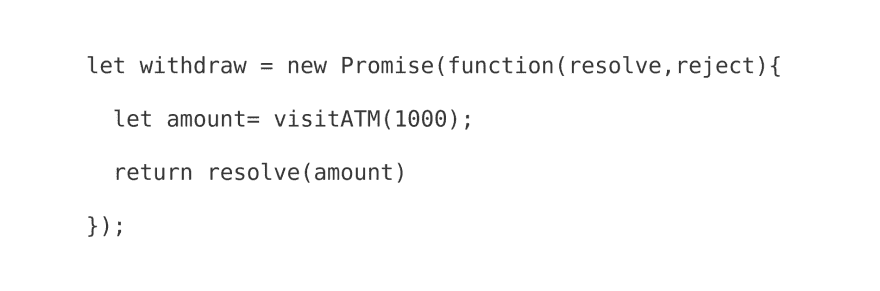

# 赌场赌博解释的 JavaScript 承诺

> 原文：<https://dev.to/kbk0125/javascript-promises-explained-by-gambling-at-a-casino-4jdo>

如果你曾经赌博或者看过一部关于赌博的电影，那么你就能理解 JavaScript 中的承诺。

我们都喜欢 JavaScript 的异步功能。事实上，我们太爱他们了，以至于有时我们会过度放纵。然后我们得到的代码看起来像这个“[末日金字塔](https://en.wikipedia.org/wiki/Pyramid_of_doom_%28programming%29)”。

[T2】](https://res.cloudinary.com/practicaldev/image/fetch/s--5omJNNjs--/c_limit%2Cf_auto%2Cfl_progressive%2Cq_auto%2Cw_880/https://i0.wp.com/blog.codeanalogies.com/wp-content/uploads/2018/08/callbackpic.png)

[图像信用](https://www.quora.com/Whats-the-difference-between-a-promise-and-a-callback-in-Javascript)

这通常被称为“回调地狱”,因为您可能不想重新阅读该代码并试图理解所有事情是如何工作的，以及它以什么顺序工作。事实上，你的团队中也没有人知道。

上面的例子有些困难:

*   错误处理不明确。如果出了问题会怎么样？
*   每个函数都依赖于前一个函数。您不需要异步风格。你想让其他阅读代码的人明白这个顺序。当您将这么多的函数链接在一起时，同步风格的代码将更具可读性。
*   您需要不断地跟踪变量，以便输入到函数中，然后输出。并跟踪每个输出的逻辑。这变得令人疲惫不堪。

你可以使用**承诺**让整个过程更容易理解。如果你像我一样，你可能听说过一两次承诺，但后来因为它们看起来令人困惑而忽略了它们。如果你了解回电，承诺的基本用法其实很简单。

承诺鼓励直截了当的、单一用途的功能，这将允许你编写清晰的代码并理解每一个步骤而不感到头痛。想了一会儿，我意识到承诺就像去赌场一样。当赌场“修改”你银行账户中的钱数时(咳咳，删除)，一连串的承诺以特定的顺序修改数据。

[T2】](https://res.cloudinary.com/practicaldev/image/fetch/s--5sACbRlc--/c_limit%2Cf_auto%2Cfl_progressive%2Cq_auto%2Cw_880/https://i0.wp.com/blog.codeanalogies.com/wp-content/uploads/2018/08/PromiseCasinoDiagram.jpg)

所以，让我们开始吧。如果你没有回访的经验，看看我对回访原则的解释。如果你在寻找更多关于承诺的技术性解释，可以看看[这个指南](http://www.telerik.com/blogs/what-is-the-point-of-promises)或[这个指南](https://www.promisejs.org/)或[这个视频](https://www.youtube.com/watch?v=obaSQBBWZLk)。

### 什么是承诺？

假设你周末去赌场度假。你口袋里有两个星期的薪水，你将享受你赌掉的每一刻，直到最后一毛钱。或者也许你会很幸运，最终赢得金钱？

你回到酒店房间，然后去赌场。每种类型的游戏都接受现金，所以你需要去自动柜员机提取 1000 美元，然后开始。

让我们退一步想想这个场景。虽然现金可以用于赌场之外的任何事情，但它在赌场内意味着一件事——在你用完钱之前你剩下的游戏次数。在周末期间，现金数额可能会越来越少。它也可能增长，但你已经向自己承诺，这个周末你的损失不会超过 1000 美元。

[T2】](https://res.cloudinary.com/practicaldev/image/fetch/s--MJGMDUA5--/c_limit%2Cf_auto%2Cfl_progressive%2Cq_auto%2Cw_880/https://i2.wp.com/blog.codeanalogies.com/wp-content/uploads/2018/08/PromiseInitDiagram.jpg)

注意上图中你剩余的钱是如何从一个游戏转移到另一个游戏的？

承诺具有一种价值，这种价值现在还不存在，但将来肯定会存在。这可以让你清楚地跟随一个函数，了解它的开始和结束。如上所示，承诺是阐明连续异步功能和阐明输入和输出的好方法。

承诺将一个异步函数的乘积直接传递给下一个函数。只要前一个函数返回一个值，该函数就会启动。或者，如果它返回一个错误，您将运行一个不同的函数。我们可以以后再考虑这种可能性。

### 创造你的第一个承诺

承诺其实有两种:**生产者**和**消费者**。

生产者是链中的第一个承诺，而消费者等待链中前一个承诺的结果。在这种情况下，去自动取款机是生产者，因为你需要钱来玩游戏(显然)。

此外，承诺可以有三种状态之一:

1.  待定-尚未完成
2.  已履行-承诺已完成并返回一个值
3.  拒绝-承诺已完成，但出现错误或失败。

所以，如果你去了一个自动取款机，但是你没有完成你想要的操作…那么，你的银行账户里可能没有 1000 美元，你应该马上离开赌场。如果你成功提取了 1000 美元，那么你已经返回了一个值。

[T2】](https://res.cloudinary.com/practicaldev/image/fetch/s--dJpzlBY3--/c_limit%2Cf_auto%2Cfl_progressive%2Cq_auto%2Cw_880/https://i2.wp.com/blog.codeanalogies.com/wp-content/uploads/2018/08/ProducerDiagram.jpg)

所以让我们把它变成代码。下面是 promise 语法。

```
let withdraw = new Promise(function(resolve,reject){

  let amount = visitATM(1000);
  return resolve(amount)
}); 
```

Enter fullscreen mode Exit fullscreen mode

这是对代码的逐行解释。

[T2】](https://res.cloudinary.com/practicaldev/image/fetch/s--ACfBroHU--/c_limit%2Cf_auto%2Cfl_progressive%2Cq_auto%2Cw_880/https://cdn.filestackcontent.com/jqQFGj6IS3uCvAvVbeB9)

第一行——宣布承诺，有两种可能的结果:履行或拒绝

第 2 行-从 ATM 机取款的功能

第 3 行——用 visitATM 函数的值返回一个稳定的状态

就像任何其他异步代码一样，这种方法允许您的代码等待 visitATM 函数的状态。如果没有完成，继续下去就没有意义了！

### 连锁多个承诺

让我们假设你在赌场的时候想玩吃角子老虎机、扑克和轮盘赌。每场比赛都要求你用现金买入。当然，如果你在扑克上押了太多的钱，然后用完了，那么你将不能玩下面的任何游戏。

假设你想先玩老虎机。

```
let withdraw = new Promise(function(resolve,reject){ 

  let amount = visitATM(1000); 

  return resolve(amount) 
}); 

withdraw.then(function(amount){
  let slotResults = playSlots(amount, 100);

  if(slotResults <= 0)
    throw err;

  return slotResults;
}); 
```

Enter fullscreen mode Exit fullscreen mode

承诺使用**。然后用**语法来说明在先前的承诺被**解决**或完成后应该发生什么。在这种情况下，撤回承诺的最终结果包含在*金额*内。

所以当我们用。然后()，我们还将参数**命名为 amount** 以对应之前的结果。

另一个重要的注意事项——play slots 是一个虚构的函数。我们假设这需要两个参数——你拥有的钱的总数，以及你愿意赌的金额。

[T2】](https://res.cloudinary.com/practicaldev/image/fetch/s--vdNF65Zy--/c_limit%2Cf_auto%2Cfl_progressive%2Cq_auto%2Cw_880/https://i0.wp.com/blog.codeanalogies.com/wp-content/uploads/2018/08/promisev2.jpg)

让我们在这个承诺链上再增加一步——一场扑克游戏。它将类似于老虎机的承诺。在这场比赛中，我们想赌多少就赌多少。

```
withdraw.then(function(amount){
  let slotResults = playSlots(amount, 100);

  if(slotResults <= 0)
    throw err;

  return slotResults;
})
.then(function(slotResults){
  let pokerResults = playPoker(slotResults);

  if(pokerResults <= 0) 
    throw err; 

  return pokerResults;
}) 
```

Enter fullscreen mode Exit fullscreen mode

因此，我们将玩老虎机后剩余的现金投入到扑克游戏中。如果你问我的话，我觉得很有侵略性。

[T2】](https://res.cloudinary.com/practicaldev/image/fetch/s--LERWKPXp--/c_limit%2Cf_auto%2Cfl_progressive%2Cq_auto%2Cw_880/https://i1.wp.com/blog.codeanalogies.com/wp-content/uploads/2018/08/pokerresults.jpg)

这是这部分的代码图。

[T2】](https://res.cloudinary.com/practicaldev/image/fetch/s--ukYn-4UA--/c_limit%2Cf_auto%2Cfl_progressive%2Cq_auto%2Cw_880/https://i2.wp.com/blog.codeanalogies.com/wp-content/uploads/2018/08/promiseexplainedwithmarketing2.jpg)

让我们想象一下，我们现在已经赌光了所有的钱。虽然我们原本打算玩更多的游戏，但我们没有钱了。这个链条上可能还会有更多的承诺，但我们将无法解决它们。

相反，由于我们在扑克之后还剩$0，这个承诺将抛出一个错误。现在还是**定居**，但是处于**拒绝**状态。

这就是**所在。catch()方法**派上了用场。Catch 允许我们处理承诺链中可能出现的任何错误。我们不需要为每个回调编写错误处理程序。

让我们想象一下，当你赌完所有的钱时，你径直走向酒吧。这是它的代码。

```
withdraw.then(function(amount){
  let slotResults = playSlots(amount, 100);

  if(slotResults <= 0)
    throw err;

  return slotResults;
})
.then(function(slotResults){
  let pokerResults = playPoker(slotResults);

  if(pokerResults <= 0) 
    throw err; 

  return pokerResults;
})
.catch(function(e){
  goToBar();
}); 
```

Enter fullscreen mode Exit fullscreen mode

不管哪个承诺被拒绝，这个 catch 语句都会起作用。

[T2】](https://res.cloudinary.com/practicaldev/image/fetch/s--EP2mVsyZ--/c_limit%2Cf_auto%2Cfl_progressive%2Cq_auto%2Cw_880/https://i1.wp.com/blog.codeanalogies.com/wp-content/uploads/2018/08/catchstatementdiagram.jpg)

### 利用承诺内的对象

到目前为止，我们的承诺只得到一个数字。但是，它们也可以沿着链传递任何其他类型的数据。

让我们想象你玩了一个老虎机，赢了一些钱。吃角子老虎机不会直接给你现金，它会给你一张票，你可以以后兑现。这就是所谓的[检票系统](https://en.wikipedia.org/wiki/Ticket-in,_ticket-out)。

现在，您需要跟踪整个链中的两个值——手头现金的数量和您的门票的价值。一个对象在这种情况下工作得最好。

让我们修改链中的第二个承诺，您在那里玩老虎机。

```
withdraw.then(function(amount){
  let ticketValue = playSlots(amount, 100);

  if(ticketValue <= 0)
    throw err;

  return {tickets: ticketValue, cash: amount};
}); 
```

Enter fullscreen mode Exit fullscreen mode

您现在返回一个具有两个属性的对象。看起来是这样的:

[T2】](https://res.cloudinary.com/practicaldev/image/fetch/s--YKY6_DRv--/c_limit%2Cf_auto%2Cfl_progressive%2Cq_auto%2Cw_880/https://i2.wp.com/blog.codeanalogies.com/wp-content/uploads/2018/08/Objectinpromise.jpg)

扑克桌只接受现金换筹码，所以你需要在下一个承诺中使用那个属性。

```
withdraw.then(function(amount){
  let ticketValue = playSlots(amount, 100);

  if(ticketValue <= 0)
    throw err;

  return {tickets: ticketValue, cash: amount};
})
.then(function(slotResults){
  let pokerResults = playPoker(slotResults.cash);

  if(pokerResults <= 0) 
    throw err; 

  return {tickets: slotResults.tickets, cash: pokerResults};
})
.catch(function(e){
  goToBar();
}); 
```

Enter fullscreen mode Exit fullscreen mode

注意一些事情:

1.  我只在扑克游戏中使用了现金值。但是，在最后，我仍然需要将票值添加到最终对象中，以便沿着链传递它。否则，我会失去我的奖金。
2.  slotResults 包含来自先前承诺的对象，即使该对象没有名称。

### 获取最新教程

你喜欢这个解释吗？查看 [CodeAnalogies 博客](https://codeanalogies.com)获取 HTML、CSS 和 JavaScript 的最新可视化教程。