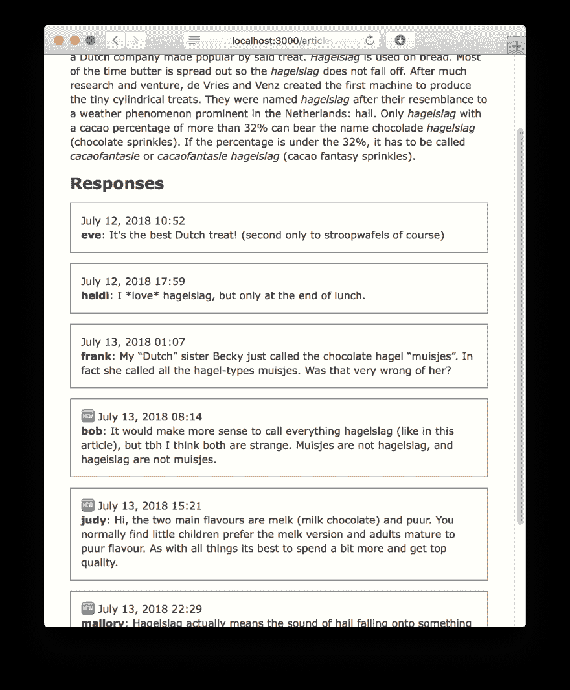

# JavaScript 点缀的 Rails 应用程序

> 原文：<https://dev.to/appsignal/javascript-sprinkled-rails-applications-1o6o>

当页面的大部分被缓存时，Rails 的片段缓存会产生更大的加速。对于包含大量动态内容或用户特定内容的页面来说，这更加困难。一个解决方案是使用“JavaScript sprinkles”，它类似于 [*【哈格岛】*](https://en.wikipedia.org/wiki/Sprinkles) ，但是没有巧克力，并且在页面的其余部分直接从缓存中提供后，有额外的请求来加载用户特定的内容。

## 片段缓存

片段缓存之类的技术通过缓存呈现页面的片段来加快 Rails 应用程序的响应速度。通过使用智能缓存键，当片段的内容发生变化时，片段会自动失效，因为视图中显示的数据会更新。

当缓存的片段被更频繁地使用时，缓存视图片段可以从较小的缓存中获得更大的速度提升。例如，当页面的内容依赖于当前登录的用户时，缓存页面的片段就变得更加困难。

## 未读回复

举个例子，让我们以一个基于 Rails 的博客为例。在这个博客上，每篇文章都可以有很多回复。添加了一个身份验证系统，允许用户使用他们的帐户登录和发布回复。在每篇文章的页面上，我们都会列出回复。为了方便用户，我们用图标和不同的背景色来标记新的回复。

[T2】](https://res.cloudinary.com/practicaldev/image/fetch/s--ar1qzwpu--/c_limit%2Cf_auto%2Cfl_progressive%2Cq_auto%2Cw_880/https://blog.appsignal.cimg/blog/2018-07/unread.png)

如果我们将每篇文章都放在一个`cache`块中，我们就有可能将错误的回复标记为未读。当用户请求索引页时，响应被缓存。当另一个用户稍后请求同一个页面时，他们将收到缓存的片段，以及第一个用户的未读响应。

```
# app/views/articles/show.html.erb
<%= cache(@article) do %>
  <h1><%= @article.title %></h1>

  <%= simple_format(@article.content) %>

  <section id="responses">
    <h2>Responses</h2>

    <% @article.responses.each do |response| %>
      <div class="<%= response.read_by?(@current_user) ? 'read' : 'unread' %>">
        <%= time_tag(response.created_at) %>
        <strong><%= response.name %></strong>: <%= response.content %>
      </div>
    <% end %>
  </section>
<% end %> 
```

Enter fullscreen mode Exit fullscreen mode

解决这个问题的一个方法是通过使用`[@article, @current_user]`而不仅仅是`@article`作为传递给`cache`助手方法的参数，将当前登录的用户添加到缓存键中。

```
# app/views/articles/show.html.erb
<%= cache([@article, @current_user]) do %>
  <h1><%= @article.title %></h1>

  # ...
<% end %> 
```

Enter fullscreen mode Exit fullscreen mode

这确保了每个用户都能看到他们自己的未读回复，但却抵消了缓存片段带来的大部分加速，因为文章片段现在是为每个用户单独缓存的。

## JavaScript 洒落

因为页面的大部分内容对所有用户都是一样的，所以我们希望为每个访问者重用缓存的文章片段。为此，我们可以从缓存中加载文章，并在通过 JavaScript 请求加载页面后添加一个额外的请求来获取特定于用户的内容。为此使用少量的 JavaScript 功能有几个好处:

1.  页面可以缓存一次，供未经身份验证的访客和其他用户重用，而不必为每个用户单独缓存片段。
2.  最重要的内容首先加载，以获得最快的响应时间，而次要功能，如未读计数，稍后加载。
3.  由于额外的请求是通过 JavaScript 完成的，因此整个页面可以在 CDN 上进行边缘缓存，以进一步提高性能。

### 清理

我们将首先从页面中删除动态内容，使它们更容易缓存。我们将再次从`cache`块中的缓存键中删除`@current_user`，因此不再为每个用户缓存它们。然后，我们将从控制器中删除查找未读计数的查询，并从视图中删除 CSS 类名。

```
# app/views/articles/show.html.erb
<%= cache(@article) do %>
  <h1><%= @article.title %></h1>

  <%= simple_format(@article.content) %>

  <section id="responses">
    <h2>Responses</h2>

    <% @article.responses.each do |response| %>
      <div data-response-id="<%= response.id %>">
        <%= time_tag(response.updated_at) %>
        <strong><%= response.name %></strong>: <%= response.content %>
      </div>
    <% end %>
  </section>
<% end %> 
```

Enter fullscreen mode Exit fullscreen mode

我们只剩下一个普通页面，它更容易缓存，但是缺少未读响应功能。我们再补充一下。

### 终点

我们将首先创建一个端点来查找用户的未读响应。我们希望在页面呈现后改变它的当前状态，所以我们将向它请求 JSON。

```
# app/controllers/unread_responses_controller.rb
class UnreadResponsesController < ApplicationController
  def index
    @article = Article.find(params[:article_id])
    @responses = @article.unread_responses_for(@current_user)
  end
end 
```

Enter fullscreen mode Exit fullscreen mode

```
# app/views/unread_responses/index.json.jbuilder
json.array! @responses do |response|
  json.extract! response, :id
end 
```

Enter fullscreen mode Exit fullscreen mode

```
# config/routes.rb
Rails.application.routes.draw do
  resources :articles do
    resources :responses
    resources :unread_responses
  end
end 
```

Enter fullscreen mode Exit fullscreen mode

我们的端点将生成一个未读响应 id 的列表。

```
#  GET  /articles/1/unread_responses.json  [{"id":1},{"id":2},{"id":3}] 
```

Enter fullscreen mode Exit fullscreen mode

*提示*:当加载一个可以在服务器端预渲染的动态组件时，通常在服务器端进行 HTML 渲染会更快，然后直接通过 JavaScript 将 HTML 注入到页面中。

### 显示未读回复

我们没有在 JavaScript 代码中硬编码未读响应端点的 URL，而是将它添加到视图中的一个数据属性中，以便以后可以引用它。

```
# app/views/articles/show.html.erb
<section id="responses" data-url="<%= article_unread_responses_path(@article, json: true) %>">
  # ...
</section> 
```

Enter fullscreen mode Exit fullscreen mode

页面加载完成后，我们将从新的端点请求未读的响应 id。然后，我们将使用该列表中的数据，通过添加一个 CSS 类来将每篇文章标记为未读。

```
// app/assets/javascripts/application.js
document.addEventListener("turbolinks:load", function(){
  responses = document.getElementById("responses")

  if(!responses.dataset.loaded) {
    Rails.ajax({
      url: responses.dataset.url,
      type: "GET",
      success: function(data) {
        responses.dataset.loaded = true;

        data.forEach(function(response) {
          element = document.querySelector("[data-response-id='" + response.id + "']");
          element.classList.add("unread");
        })
      }
    });
  }
}) 
```

Enter fullscreen mode Exit fullscreen mode

因为我们的 Rails 应用程序使用了 [Turbolinks](https://blog.appsignal.com/2018/05/23/speeding-up-your-apps-navigation-with-turbolinks.html) ，我们将通过监听`turbolinks:load`事件来等待页面被加载。当事件触发时，我们将使用它的 ID 找到响应框。

然后我们将检查 responses 元素是否有一个`loaded`数据属性。我们将在稍后更新未读响应后设置该属性，这样我们就不会在使用浏览器的后退按钮重新加载页面时发出任何额外的请求。

在第一次加载时，`loaded`属性还没有设置，所以我们将继续向端点发出请求。成功后，我们将遍历返回结果中的每篇文章，通过 ID 找到响应的元素，并向其中添加我们的“未读”CSS 类。

## 洒落！

片段缓存可重用的内容，并在页面上添加 JavaScript 以在以后添加特定于用户的动态位，可以通过直接从缓存中提供大多数重要内容来加快应用程序的初始响应时间。虽然在加载主要内容后执行额外的请求和更新页面需要时间，但推迟动态内容会让您的应用程序感觉更快，即使完整的请求比从缓存中提供所有内容(包括用户特定的部分)需要更长的时间。

对于更复杂的设置，一定要查看一下 [Stimulus](https://stimulusjs.org) ，这是一个 JavaScript 库，它将 sprinkles 模式封装到一个框架中，将您的 HTML 视图与您的 JavaScript 绑定在一起。

我们希望您喜欢这篇关于 Rails 应用程序中 JavaScript sprinkles 的介绍。我们很想知道您对这篇文章的看法，或者您是否有任何问题。我们总是在寻找可以研究和解释的话题，所以如果你想了解 Ruby 的神奇之处，请不要犹豫，留下你的评论。