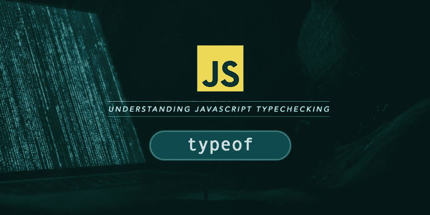

# JavaScript 类型 of

> 原文：<https://dev.to/bnevilleoneill/javascript-typeof-4a9l>

#### 理解 JavaScript 中的类型检查

[T2】](https://res.cloudinary.com/practicaldev/image/fetch/s--OGf4j1LE--/c_limit%2Cf_auto%2Cfl_progressive%2Cq_auto%2Cw_880/https://cdn-images-1.medium.com/max/1024/1%2Aj6B7Q6KRIhgNZQuSkVkP_w.jpeg)

每种编程语言的一个非常重要的方面是它的类型系统和数据类型。对于像 Java 这样的严格类型编程语言，变量被定义为特定的类型，将变量限制为只包含该类型的值。

> 然而，JavaScript 是一种动态类型语言，尽管存在一些支持严格类型的扩展，如 [TypeScript](https://www.typescriptlang.org/) 。

使用 JavaScript，有可能让一个变量开始时包含一个字符串，后来在其生命周期中变成对一个对象的引用。甚至在脚本执行过程中，JavaScript 引擎会隐式强制值的类型。类型检查对于编写可预测的 JavaScript 程序非常重要。

> JavaScript 有一个非常基本的 [**typeof**](https://developer.mozilla.org/en-US/docs/Web/JavaScript/Reference/Operators/typeof) 操作符，用于类型检查。

但是，您会注意到使用这个操作符可能会产生误导，这一点我们将在本文中讨论。

[T2】](https://logrocket.com/signup/)

### JavaScript 数据类型

在研究使用 typeof 进行类型检查之前，了解一下 JavaScript 数据类型是很重要的。虽然本文没有深入讨论 JavaScript 数据类型的细节，但是随着研究的深入，您可以收集到一些信息。

在 ES6 之前，JavaScript 有 6 种数据类型。在 ES6 规范中，增加了符号类型。以下是所有类型的列表:

1.  线

2.  数字

3.  布尔型—(值 true 和 false)

4.  null —(值为 null)

5.  未定义-(值未定义)

6.  标志

7.  目标

前六种数据类型被称为**原始类型**。除了前六种数据类型之外，其他数据类型都是一个*对象*，并且可以被称为**引用类型**。一个*对象*类型只是名称和值对形式的属性集合。

请注意，列表中的 null 和 undefined 是原始的 JavaScript 数据类型，每个数据类型只包含一个值。

你可能会开始好奇——那么*数组*、*函数*、*正则表达式*等呢？它们都是特殊种类的物体。

*   一个**数组**是一种特殊的对象，它是一个有序的编号值集合，具有特殊的语法和特征，这使得对它的处理不同于对常规对象的处理。
*   **函数**是一种特殊的对象，它有一个与之相关联的可执行脚本块。脚本块通过调用函数来执行。它还有一个特殊的语法和特征，使它不同于其他常规对象。

JavaScript 有几个对象类构造函数，用于创建其他类型的*对象*，例如:

*   日期—用于创建日期对象
*   RegExp —用于创建正则表达式
*   错误-用于创建 JavaScript 错误

### 使用 typeof 进行类型检查

#### 语法

JavaScript 中的 typeof 运算符是一元运算符(只接受一个操作数)，其计算结果是指示其操作数类型的字符串。就像其他一元运算符一样，它被放在操作数之前，用空格分隔:

```
typeof 53; // "number" 
```

但是，有一种替代语法允许您像函数调用一样使用 typeof，方法是将它的操作数放在括号中。这对于对从 JavaScript 表达式:
返回的值进行类型检查非常有用

```
typeof(typeof 53); // "string" 
```

#### 错误安全

在 ES6 之前，typeof 运算符总是返回一个字符串，而不管它所用于的操作数是什么。

> 对于未声明的标识符，typeof 将返回“undefined”而不是抛出 ReferenceError。

```
console.log(undeclaredVariable === undefined); // ReferenceError
console.log(typeof undeclaredVariable === 'undefined'); // true 
```

但是，在 ES6 中，使用 let 或 const 关键字声明的块范围变量如果在初始化之前与 typeof 运算符一起使用，仍然会抛出 ReferenceError。这是因为:

> 块范围的变量保持在 [*时间死区*](https://developer.mozilla.org/en-US/docs/Web/JavaScript/Reference/Statements/let#Temporal_Dead_Zone) 中，直到它们被初始化:

```
// Before block-scoped identifier: typeof => ReferenceError

console.log(typeof tdzVariable === 'undefined'); // ReferenceError

const tdzVariable = 'I am initialized.'; 
```

#### 类型检查

下面的代码片段显示了使用 typeof 运算符对公共值进行的类型检查:

```
console.log(typeof ""); // "string"
console.log(typeof "hello"); // "string"
console.log(typeof String("hello")); // "string"
console.log(typeof new String("hello")); // "object"

console.log(typeof 0); // "number"
console.log(typeof -0); // "number"
console.log(typeof 0xff); // "number"
console.log(typeof -3.142); // "number"
console.log(typeof Infinity); // "number"
console.log(typeof -Infinity); // "number"
console.log(typeof NaN); // "number"
console.log(typeof Number(53)); // "number"
console.log(typeof new Number(53)); // "object"

console.log(typeof true); // "boolean"
console.log(typeof false); // "boolean"
console.log(typeof new Boolean(true)); // "object"

console.log(typeof undefined); // "undefined"

console.log(typeof null); // "object"

console.log(typeof Symbol()); // "symbol"

console.log(typeof []); // "object"
console.log(typeof Array(5)); // "object"

console.log(typeof function() {}); // "function"
console.log(typeof new Function); // "function"

console.log(typeof new Date); // "object"

console.log(typeof /^(.+)$/); // "object"
console.log(typeof new RegExp("^(.+)$")); // "object"

console.log(typeof {}); // "object"
console.log(typeof new Object); // "object" 
```

请注意，所有对象类型构造函数在用 new 关键字实例化时，都将始终具有“object”类型。唯一的例外是函数构造函数。

**下面是类型检查结果的简单总结:**