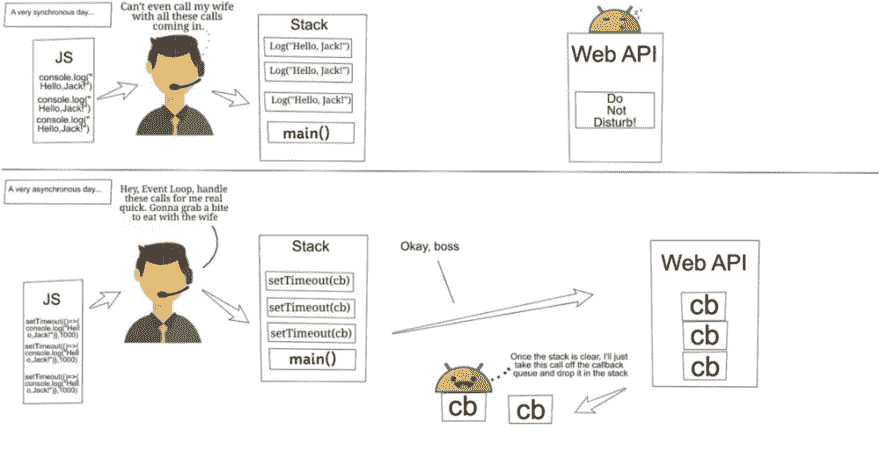

# JavaScript，你是什么？

> 原文：<https://dev.to/howtocodejs/javascript-what-areyou-58lh>

[T2】](https://res.cloudinary.com/practicaldev/image/fetch/s--j7Vzv9vj--/c_limit%2Cf_auto%2Cfl_progressive%2Cq_auto%2Cw_880/https://thepracticaldev.s3.amazonaws.com/i/7g6r3a7a5wis6dkvykad.png)

Raji Ayinla 最初发表在 codeburst.io 上，他为 howtocodejs.com 开发内容。想以有趣的方式学习 JavaScript 吗？那就来 howtocodejs.com 吧。

你正在参加一个工作面试，坐在 WECode.js.
的人力资源办公室里。招聘经理看了一眼你精致详细的简历后清了清嗓子，问道:“JavaScript 是什么，JavaScript 开发人员先生？”

“单线程非阻塞异步并发语言，”你回答。

“是的，但这意味着什么？你如何向 UX 团队的其他人解释这一点？”

"…"

## 切！

为了避免尴尬的茫然凝视以及随之而来的更多计算机科学术语，我们将详细分析 JavaScript 到底是什么。如果您是 JavaScript 开发人员或被 JavaScript 回调吓到的新手，我们的网络漫画将会揭开一切的神秘面纱。但在此之前，我们先来解解先生/s. JavaScript Developer 的第一个回答。

## 什么是单线程语言？

简单地说，单线程语言使用单个调用堆栈，这意味着它一次只能触发一个事件。如果你不确定如何概念化一个调用栈，就想象一个 Jenga 栈。

[T2】](https://res.cloudinary.com/practicaldev/image/fetch/s--uD7CAFQb--/c_limit%2Cf_auto%2Cfl_progressive%2Cq_auto%2Cw_880/https://thepracticaldev.s3.amazonaws.com/i/1o63duk9jal7etg1zbvv.png)

假设你写了一个函数列表。JavaScript 的运行时会编译你写的脚本，然后像调用栈中的块一样依次堆叠函数。之后，执行的每个函数都从栈顶取出，直到到达栈底。只有一叠。女士们先生们，这是单线程。

## 什么是非阻塞、异步、并发？

好吧，让我们先试着理解什么是阻塞。简单来说，阻塞就是同步调用太多导致的流量。想象一下，一个狭窄的出口将司机引入一条单车道。那条路由一名交通警察把守，他一次只允许一辆车越过他的停车标志。

现在想象一下，如果你是第十五辆车，你必须去急诊室，你会有多头疼。类似地，用屏蔽代码编码的网站会导致笨拙的用户界面。

[T2】](https://res.cloudinary.com/practicaldev/image/fetch/s--drV6LSmv--/c_limit%2Cf_auto%2Cfl_progressive%2Cq_auto%2Cw_880/https://thepracticaldev.s3.amazonaws.com/i/xoqd3zqe7eitlx7aaozo.jpg)

所以我们明白什么是阻塞。非阻塞与阻塞完全相反。JavaScript 之类的非阻塞语言使用异步调用，而不是进行同步调用，或者换句话说，一条允许打破顺序的紧急通道，以便您可以按时到达医院。

## 这里是事情变得真正有趣的地方。

通过将 JavaScript 函数封装在类似于`setTimeout()`的 Web API 函数中，我们可以让浏览器的“秘密地下世界”来处理这个函数，而不需要将它强加到堆栈上。这是因为 Web APIs 独立于 JavaScript 的运行时。让第三方处理代码的概念就是并发性的全部。我们使用回调来使我们的程序动态，并防止事件循环堵塞。

我们已经提到了 Web APIs 和事件循环。还有一个回调队列。如果你有点困惑，不要惊慌。漫画会解释一切。

## 角色

1. **JavaScript 运行时:**单个客服呼叫话务员。他从一个脚本中读取数据，进行调用，并将其归档到堆栈中。

2.Web API:一个第三方数据存储，它可以保存消息，不管它被指示保存多长时间。

3.**回调队列:**调用的装载平台
事件循环:一个绿色的小机器人，它有一个简单的任务——检查堆栈是否为空。如果它是空的，从队列中取出一个事件并放入堆栈。当条件为真时，继续这样做。

## 漫画

[T2】](https://res.cloudinary.com/practicaldev/image/fetch/s--Kf_W1g_G--/c_limit%2Cf_auto%2Cfl_progressive%2Cq_auto%2Cw_880/https://thepracticaldev.s3.amazonaws.com/i/ptda3lrxnwlwdqljxjyy.png)

在非常同步的一天，数据流受到限制。“呼叫操作员”或 JavaScript 运行时必须手动记录所有的呼叫。呼叫接线员没有时间去处理更重要的功能，比如给他妻子打电话或呈现网页。

在一个非常不同步的日子里，所有的呼叫操作员必须做的就是加载所有的 Web API 函数，然后他可以把这个任务留给 Web API 和迷你 droid，也就是事件循环。Web APIs 存储回调，直到它们准备好被放到回调队列中。事件循环(mini droid)所要做的就是检查堆栈是否为空，并将回调放到堆栈上。与此同时，呼叫接线员可以专注于更重要的功能，如与妻子共进晚餐。

## 结论

你可以看到为什么 JavaScript 开发者对回调大惊小怪。没有人希望他们的运行时环境被太多的任务占据。你可以把试镜想象成格温·史蒂芬妮的“惊喜女郎”JavaScript 的运行时向 Web APIs 发出一个呼喊，并执行其他任务，同时等待 hollaback，或者在我们的例子中，等待回调。

## 资源

Philip Robert 在 JSConf EU 2014 上的精彩演讲:[https://www.youtube.com/watch?v=8aGhZQkoFbQ](https://www.youtube.com/watch?v=8aGhZQkoFbQ)
矢量图像由 Freepik 设计