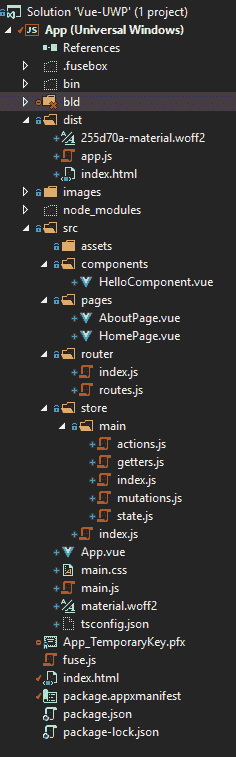

# JavaScript Windows 通用应用程序第 2 部分

> 原文：<https://dev.to/tunaxor/javascript-windows-universal-applications-part-2-15nl>

你可能以前见过这个:

 [## JavaScript 通用 Windows 应用程序

### 安吉尔丹尼尔穆尼奥斯冈萨雷斯 6 月 16 日 187 分钟阅读

#javascript #vue #aurelia #angular](/tunaxor/javascript-universal-windows-applications-58n5)

虽然这个标题有点误导，但它更多的是抱怨为什么我对 UWP JavaScript 生态系统的现状感到难过，而不是表明****你*** *可以瞄准 UWP**

 *这一次我会试着更集中在主题上，并向你展示，所有的代码样本图片都在这个报告中

## [【angelmunoz】](https://github.com/AngelMunoz)/[视图-UWP](https://github.com/AngelMunoz/Vue-UWP)

### 所以你认为没有 Javascript 桌面原生解决方案？我对此不太确定

<article class="markdown-body entry-content container-lg" itemprop="text">

# [视图](https://vuejs.org)uwp

事实证明，这是迄今为止我做过的所有其他模板中最简单的，但是我几乎可以肯定这是因为[保险丝盒](https://fuse-box.org)的酷，你应该检查一下。

## 结构

[T2】](https://camo.githubusercontent.com/15fe7079c38bb60dcec57a24ff28eb90f7fd32f8c103c872f9992b599471ad93/68747470733a2f2f692e696d6775722e636f6d2f32574a55576b392e706e67)

这个结构模板有点类似于 vue-cli 模板，所以你应该熟悉它。默认情况下，它包括 vuex 和 vue-router，以及 [Vuetify](https://vuetifyjs.com) ，如果我对某人表示失望，我很抱歉，但这些甜蜜的黑暗主题太适合 windows 的黑暗模式了！抱歉，我一点也不抱歉，

## 关于这个演示

作为 javascript 开发人员，我们希望使用我们所知道的方法来创建桌面应用程序，这并不是说 C#不好，也不是说 C++或其他解决方案不好，但是我们觉得我们应该能够在 Javascript 中实现它，对吗？电子产品问世了，虽然很多人称赞它…

</article>

[View on GitHub](https://github.com/AngelMunoz/Vue-UWP)

所以这个帖子更多的是针对那些对电子有点反感的人，因为安全原因，性能原因等等。

请注意，我并不反对 electron，我也是它的粉丝，但是有人说没有 JavaScript ->本地桌面可供选择(这是其中之一)，我知道没有跨平台(在 apple stuff 和 Linux 之间)，但是没有完美的解决方案，如果你想/需要，你可以回到 electron:P

# 为什么观

你可能会想，为什么我们没有反应呢？这种设置适用于任何 JavaScript HTML 和 CSS。出于安全原因，有一些限制，CSP 是默认启用的，并且环境如您所想的那样严格，因此任何不符合 CSP 的东西都将失败，这就是为什么我建议您不管选择什么框架都要捆绑您的东西，许多运行时都符合 CSP(如 Vue 运行时)。我的存储库中也有其他示例，包括 angularjs、Aurelia(如果 Aurelia 可以工作，请确保 Angular +2 也可以工作)，甚至还有一个 WinJS 示例，如果您最近想疯狂地操作 DOM 的话！

# 代码示例！

让我们直接从从文件系统本地加载 mp3 的组件开始，并将其作为您的 windows media 播放器、您的新 Groove(总有一天会消亡)或您常用的 Spotify(我知道它不是本地的)来播放*