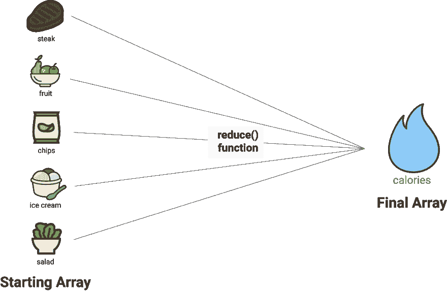
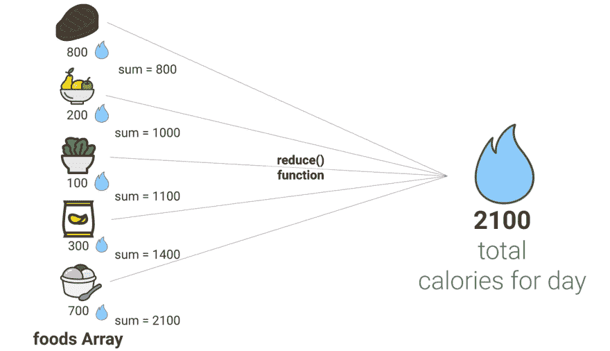
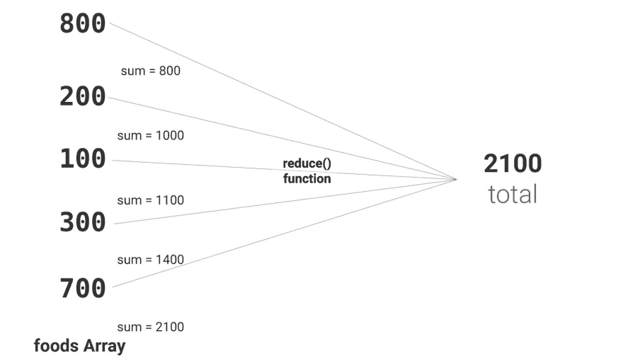
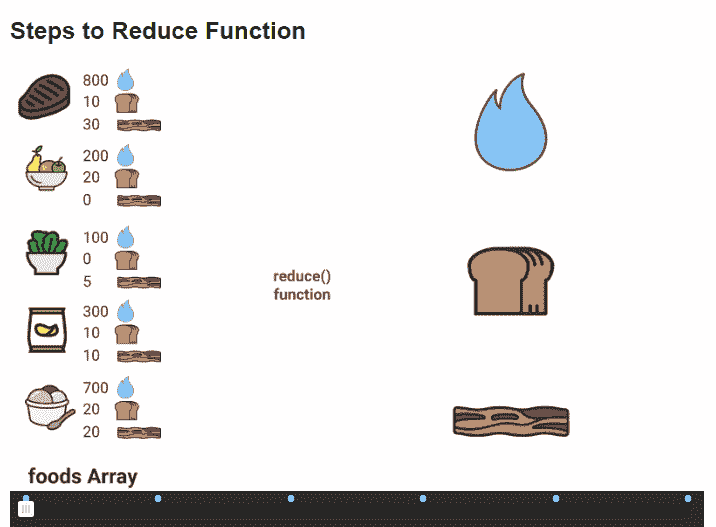

# 用节食来解释 JavaScript 的 Reduce 方法

> 原文：<https://dev.to/kbk0125/javascripts-reduce-method-explained-by-going-on-adiet-3078>

如果你读过营养标签，那么你就能理解 JavaScript 中的 reduce()方法。

JavaScript 中的 reduce 方法为您提供了一种简单的方法来获取一个值数组并将它们组合成一个值，或者基于多个类别对数组求和。

哇，一句话就说了这么多，所以让我们回到这里。

当然，您总是可以使用一个 *for* 循环来遍历一个数组，并对每个值采取特定的操作。但是，如果您不使用 filter()、map()和 reduce()等方法，那么您的代码将变得难以阅读。其他开发人员需要彻底阅读每个循环才能理解其目的。而且，这将为 bug 创造更多的机会，因为您将需要创建更多的变量来跟踪单个值。

[过滤方法](https://blog.codeanalogies.com/2018/05/14/javascripts-filter-function-explained-by-applying-to-college/)取一个初始数组中的所有元素，只允许某些元素进入最终数组。

[Map 方法](https://blog.codeanalogies.com/2018/02/20/javascript-map-method-explained-by-going-on-a-hike/)在将元素存储到最终数组之前，对初始数组中的每个元素运行一个函数。

和 reduce 方法将初始数组中的元素组合成最终值或值数组。

我意识到这有点像节食。从卡路里计数这样非常简单的方法，到阿特金斯或 WeightWatchers 这样更复杂的饮食，目标是将你一天中可能吃的所有食物提取到一个值(或多个值)中，看看你是否正在减肥。

[T2】](https://res.cloudinary.com/practicaldev/image/fetch/s--rKzhOWmk--/c_limit%2Cf_auto%2Cfl_progressive%2Cq_auto%2Cw_880/https://cdn-images-1.medium.com/max/1600/0%2A6uTOdFevTD49equ3)

所以让我们开始吧！为了理解这个教程，你只需要对循环的*有经验。*

### 用 For 循环模拟 Reduce

这里有一个使用 for 循环展示 reduce()功能的快速方法。假设你有一个数组，里面有你一天中吃的 5 种不同食物的卡路里计数。你想算出你总共摄入了多少卡路里。这是代码。

```
let calories = [800, 200, 100, 300, 700];
let total = 0;

for (let i = 0; i< foods.length; i++){
  total += calories[i];
}

//value of total will be 2100 
```

Enter fullscreen mode Exit fullscreen mode

这很简单。您创建一个变量来保存最终金额，然后在遍历数组时向其中添加金额。但是，您仍然需要引入一个新的变量，并且该循环没有给出关于该循环的目的的任何线索。

### 减少的简单例子

让我们学习如何用 reduce()方法实现同样的目标。

1.  Reduce 是一个数组方法，所以我们将从卡路里计数数组开始。
2.  它使用在数组中的每个元素上运行的回调函数。
3.  它使用一个 return 语句来显示在数组的每次迭代之后值应该如何累加。

```
 let foods = [800, 200, 100, 300, 700];

let total = foods.reduce(function(sum, item){
  return sum + item;
}); 
```

Enter fullscreen mode Exit fullscreen mode

所以，*减少*有一些记忆的概念。当您遍历数组中的每一项时，在 *sum* 参数中会跟踪这些值。在前面的例子中，我们必须在循环范围之外声明一个新变量来“记住”这些值。

[T2】](https://res.cloudinary.com/practicaldev/image/fetch/s--UdRUBuKU--/c_limit%2Cf_auto%2Cfl_progressive%2Cq_auto%2Cw_880/https://cdn-images-1.medium.com/max/1600/1%2A9p2n2qurUUU8fbPVcj6l7A.jpeg)

[T2】](https://res.cloudinary.com/practicaldev/image/fetch/s--ql_JV69a--/c_limit%2Cf_auto%2Cfl_progressive%2Cq_auto%2Cw_880/https://cdn-images-1.medium.com/max/1600/1%2A-_qAZrNzGc3mHwcmZKbBCg.jpeg)

这个和 for()之间的可读性似乎没有太大的区别。但是，当你(或另一个开发者)需要扫描数百行代码时，reduce 会给你一个关于代码块用途的快速提示。

### 例 2-使用对象

到目前为止，我们只是在看一维数组。但是，如果你可以遍历一个充满数字的数组，你也可以遍历一个充满对象的数组。让我们给每种元素加上一个名字，这样我们就可以知道一天中我们实际上吃了什么。

```
let foods = [
  {name: 'steak', calories: 800},
  {name: 'fruit', calories: 200},
  {name: 'salad', calories: 100},
  {name: 'chips', calories: 300},
  {name: 'ice cream', calories: 700},
];

let total = foods.reduce(function(sum, item){
  return sum + item['calories'];
}, 0)

//value of total will be 2100 
```

Enter fullscreen mode Exit fullscreen mode

你早餐吃了牛排…吃了一些水果…然后午餐吃了一些沙拉和薯条…最后晚餐吃了冰淇淋。真是糟糕的一天。

希望你能看到我们通过数组时的流动。当我们浏览每一个元素时，总和增加代表一天中消耗的总卡路里。整个要点是把这些值放进一个大桶里——一天的卡路里数。

### 示例 3-使用多个类别

所以，如果这都是关于卡路里，为什么会有这么多不同的饮食？我不打算深究营养科学，但这里有一个总的总结——关于减肥的“最佳”方法有很多不同意见。一些人鼓励你只计算卡路里，而另一些人会考虑蛋白质、碳水化合物、脂肪和任何其他因素。

让我们想象一下，你想改变代码，这样你就可以根据任何常见的节食系统来评估你的饮食。你需要追踪每种食物的碳水化合物和脂肪。然后你需要在最后总结一下，这样你就可以算出你在每个类别中摄入了多少克。这是我们伪造营养价值的食物。

```
let foods = [
  {name: 'steak', calories: 800, carbs: 10, fat: 30},
  {name: 'fruit', calories: 200, carbs: 20, fat: 0},
  {name: 'salad', calories: 100, carbs: 0, fat: 5},
  {name: 'chips', calories: 300, carbs: 10, fat: 10},
  {name: 'ice cream', calories: 700, carbs: 20, fat: 20},
]; 
```

Enter fullscreen mode Exit fullscreen mode

现在，我们需要运行 reduce()方法。但是，它不能都用一个值来跟踪。我们希望保留我们的类别。因此，我们的累加器需要是一个与数组具有相同类别的对象。

下面是这个过程的快速 GIF。

[T2】](https://res.cloudinary.com/practicaldev/image/fetch/s--L16XQisV--/c_limit%2Cf_auto%2Cfl_progressive%2Cq_66%2Cw_880/https://cdn-images-1.medium.com/max/1600/1%2AE2u29KZCOjKUHTxACzKFew.gif)

在浏览每个项目时，您将更改对象中特定属性的值。如果该对象还没有正确名称的属性，您将创建它。这是代码。

```
let total = foods.reduce(function (buckets, item) {
  let calories = item.calories;
  let carbs = item.carbs;
  let fat = item.fat;

  buckets['calories'] += calories;
  buckets['carbs'] += carbs;
  buckets['fat'] += fat;

  return buckets;
});

/*total object is
{name: 'steak', calories: 2100, carbs: 60, fat:65}
*/ 
```

Enter fullscreen mode Exit fullscreen mode

我们使用*桶*作为对象，根据属性值的名称对值进行分类。我们使用 [+=操作符](https://www.w3schools.com/js/js_operators.asp)将最初来自*食物*数组的对象中的每个值添加到适当的桶中。注意到我们没有存储每种食物的名称吗？这是因为它无关紧要——我们只是想要这些数字，这样我们就可以分析你一天的饮食成功与否。

如您所见，我们的输出中有一个问题。我们有一个设置为“steak”的名称字段。我们不想存储名称！所以，我们需要指定另一个参数——初始值。

这个参数出现在回调之后，我们希望将卡路里、碳水化合物和脂肪字段初始化为 0，这样我们的 reduce 方法就知道这是我们将用于 buckets 参数的仅有的三个键/值对。你可以在这里看到一个例子。

```
let total = foods.reduce(function (buckets, item) {
  let calories = item.calories;
  let carbs = item.carbs;
  let fat = item.fat;

  buckets['calories'] += calories;
  buckets['carbs'] += carbs;
  buckets['fat'] += fat;

  return buckets;
},
{calories: 0, carbs: 0, fat:0}
);

/*total object is
{calories: 2100, carbs: 60, fat:65}
*/ 
```

Enter fullscreen mode Exit fullscreen mode

### 获取最新教程

你喜欢这个教程吗？查看 [CodeAnalogies 博客](https://codeanalogies.com)获取 HTML、CSS 和 JavaScript 主题的最新视觉指南。