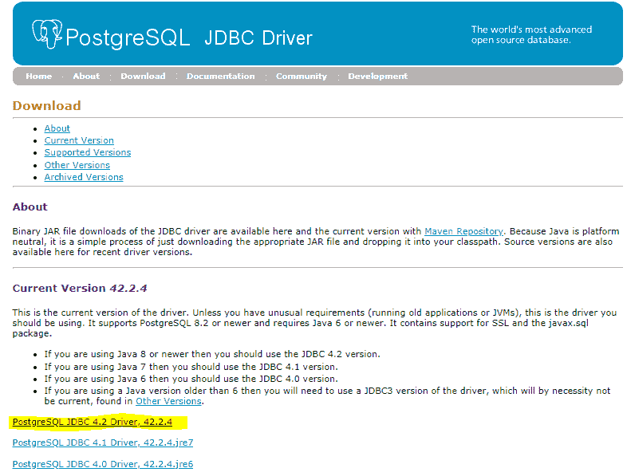
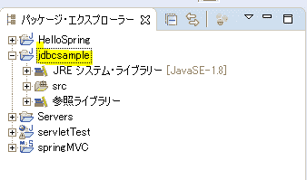
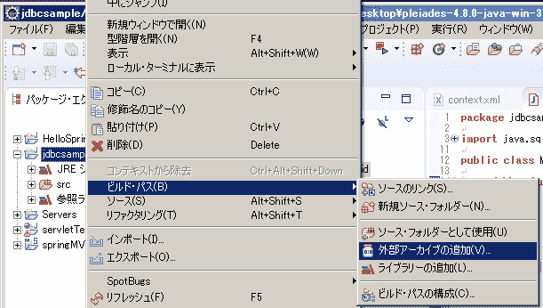
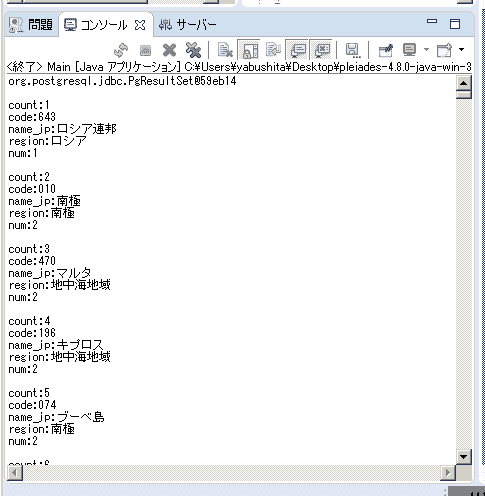

# 如何利用 JDBC 从 Java 访问数据库

> 原文：<https://dev.to/programmingmonky/jdbcjava-53id>

本文通过使用 JDBC 从 Java 的程序中执行 SQL、显示执行结果，来说明 JDBC 的使用方法

作为前提，首先要考虑这里的

[https://dev.to/programmingmonky/postgresqlsql-3dja](https://dev.to/programmingmonky/postgresqlsql-3dja)

假设如文章所示创建了数据库、表，可以投入
数据并确认 SQL 的执行。

# JDBC 的下载

[https://jdbc.postgresql.org/download.html](https://jdbc.postgresql.org/download.html)

从这个网站下载 JDBC

[T2】](https://res.cloudinary.com/practicaldev/image/fetch/s--ROqxZ82n--/c_limit%2Cf_auto%2Cfl_progressive%2Cq_auto%2Cw_880/https://thepracticaldev.s3.amazonaws.com/i/ztp0uyyfsf1uebamjzib.PNG)

# JDBC 的添加目的地 APP 应用的制作

创建要添加 JDBC 的 APP 应用程序。

打开 Eclipse，然后选择“文件”>“新建”>“Java 项目”

[T2】](https://res.cloudinary.com/practicaldev/image/fetch/s--qYEUnhvA--/c_limit%2Cf_auto%2Cfl_progressive%2Cq_auto%2Cw_880/https://thepracticaldev.s3.amazonaws.com/i/80a0oijptand3696o3rb.PNG)

请使用适当的名称创建项目

这次我用了 jdbcsample

[T2】](https://res.cloudinary.com/practicaldev/image/fetch/s--bcFXQLqk--/c_limit%2Cf_auto%2Cfl_progressive%2Cq_auto%2Cw_880/https://thepracticaldev.s3.amazonaws.com/i/clvtdqcbgin356mkue5x.PNG)

# 添加 JDBC 的构建路径

请解压缩安装的 JDBC 并在 Eclipse 中添加构建路径

选择项目右键单击>构建路径>添加外部归档文件中提取的 JDBC

[T2】](https://res.cloudinary.com/practicaldev/image/fetch/s--IIPRk1gY--/c_limit%2Cf_auto%2Cfl_progressive%2Cq_auto%2Cw_880/https://thepracticaldev.s3.amazonaws.com/i/dgncb05uh4oirp8orinb.PNG)

JDBC 现在已添加到项目中

[T2】](https://res.cloudinary.com/practicaldev/image/fetch/s--RbCN9pvM--/c_limit%2Cf_auto%2Cfl_progressive%2Cq_auto%2Cw_880/https://thepracticaldev.s3.amazonaws.com/i/m7pjon5f0lu4g75foig3.PNG)

# Java 的程序编制

从文件>新建>类中添加新的 Java 文件。

将名称命名为 Main，然后按“完成”。

将以下 Java 程序粘贴到创建的 Main 的文件中

```
package jdbcsample;

import java.sql.Connection;
import java.sql.DriverManager;
import java.sql.ResultSet;
import java.sql.ResultSetMetaData;
import java.sql.SQLException;
import java.sql.Statement;
import java.util.ArrayList;
import java.util.List;

public class Main {

    public static void main(String[] args) throws Exception {

        try (
                Connection connection = DriverManager.getConnection("jdbc:postgresql://localhost:5432/sample", // "jdbc:postgresql://<場所>:<ポート>/<データベース名>"
                        "postgres", //user
                        "postgres"); //password;
                Statement statement =    connection.createStatement();
                ResultSet resultSet = statement.executeQuery(

                        "select code,name_jp,region,\r\n" +
                        "count('1') over(partition by region) as num\r\n" +
                        "\r\n" +
                        "from m_country\r\n" +
                        "order by num"

                        );
                ){

            List<String> columns = new ArrayList<String>();

            ResultSetMetaData rsmd = resultSet.getMetaData();
            for (int i = 1; i <= rsmd.getColumnCount(); i++) {
                columns.add(rsmd.getColumnName(i));
            }

            System.out.println(resultSet);

            while (resultSet.next()) {
                System.out.println("\ncount:" + resultSet.getRow());

                columns.stream().forEach((i)->{try {
                    System.out.println(i + ":" + resultSet.getString(i));
                } catch (SQLException e) {
                    e.printStackTrace();
                }});
            }

        }
    }

} 
```

Enter fullscreen mode Exit fullscreen mode

如果解说一部分程序的意思的话

在以下部分连接到数据库

```
Connection connection = DriverManager.getConnection("jdbc:postgresql://localhost:5432/sample", // "jdbc:postgresql://<場所>:<ポート>/<データベース名>"
    "postgres", //user
    "postgres"); //password; 
```

Enter fullscreen mode Exit fullscreen mode

※如果用户名、端口、密码等与我的环境不同，请选择别的。

在以下部分执行 SQL 并接收结果

```
ResultSet resultSet = statement.executeQuery(
        "select code,name_jp,region,\r\n" +
        "count('1') over(partition by region) as num\r\n" +
        "\r\n" +
        "from m_country\r\n" +
        "order by num"

        ); 
```

Enter fullscreen mode Exit fullscreen mode

在以下部分执行了显示取得结果的处理。

```
while (resultSet.next()) {
    System.out.println("\ncount:" + resultSet.getRow());

    columns.stream().forEach((i)->{try {
        System.out.println(i + ":" + resultSet.getString(i));
    } catch (SQLException e) {
        e.printStackTrace();
    }});
} 
```

Enter fullscreen mode Exit fullscreen mode

保存该程序，在
包资源管理器中右键单击项目名称

运行> Java APP 应用程序

来修改选定线条的属性。

# Results of the transfer

IDE 的控制台栏显示了执行 SQL 的结果。

[T2】](https://res.cloudinary.com/practicaldev/image/fetch/s--EZxgwwM7--/c_limit%2Cf_auto%2Cfl_progressive%2Cq_auto%2Cw_880/https://thepracticaldev.s3.amazonaws.com/i/04y57eyplz4945b36v1d.PNG)

因为运行的是相同的 SQL，所以应该与[这篇帖子](https://dev.to/programmingmonky/postgresqlsql-3dja)的执行结果一致。

| 密码 | 姓名 _jp | 地区 | 数字 |
| --- | --- | --- | --- |
| Six hundred and forty-three | 俄罗斯联邦 | 俄罗斯 | one |
| 010 | South Pole | South Pole | Two |
| Four hundred and seventy | 马耳他 | Mediterranean region | Two |
| One hundred and ninety-six | 塞浦路斯 | Mediterranean region | Two |
| 074 | 布贝岛 | South Pole | Two |
| Six hundred and sixty-six | 圣皮埃尔和密克隆岛 | 北美洲 | three |
| Eight hundred and forty | 美利坚合众国 | 北美洲 | three |
| One hundred and twenty-four | 加拿大 | 北美洲 | three |

以上就是 JDBC 的使用方法。