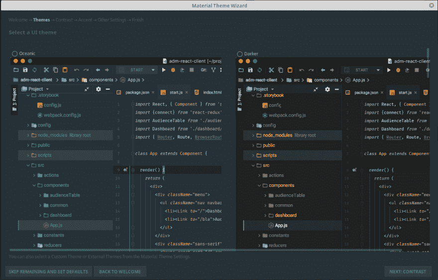
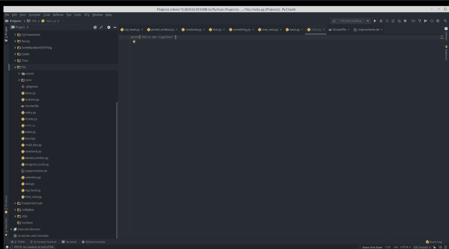
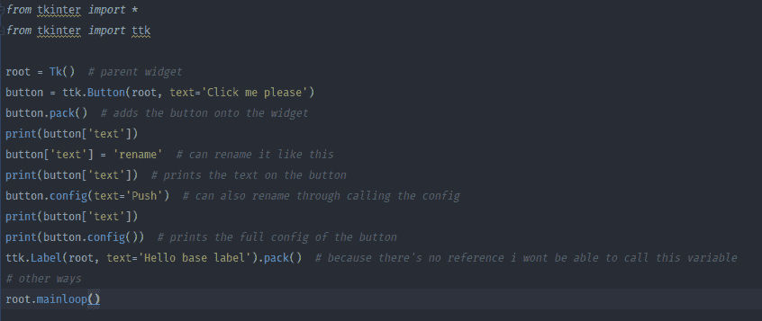

# Jetbrains IDEs 材料插件

> 原文：<https://dev.to/rapidnerd/jetbrains-ides-material-plugin-3j43>

毫无疑问，Jetbrains 开发了一些最流行的 ide。IntelliJ、PyCharm、PHPStorm、Webstorm 是开发中最常用的环境。有了这个插件，我们可以从 visual studio 或 sublime 导入素材主题。

它兼容所有(据我所知)Jetbrains IDEs。

要安装，我们首先需要:

下载它(在这个例子中，我将使用 PyCharm)

[https://plugins.jetbrains.com/plugin/8006-material-theme-ui](https://dev.toDownload%20link)

一旦你下载了插件，你需要到右上角，点击文件，设置，到插件，选择“从磁盘安装插件”，导航到你的下载并选择。现在我们重新开始。

现在我们对安装向导很满意。

[T2】](https://res.cloudinary.com/practicaldev/image/fetch/s--NEQvBx3f--/c_limit%2Cf_auto%2Cfl_progressive%2Cq_auto%2Cw_880/https://i.imgur.com/ZniLgYA.png)

通过这里，你会得到几个选项来定制你喜欢的主题

上面我们可以看到一些预制的，或者你也可以自己制作。

还有最后的展望
(无视我凌乱的急电)

[T2】](https://res.cloudinary.com/practicaldev/image/fetch/s--YEIn_5ub--/c_limit%2Cf_auto%2Cfl_progressive%2Cq_auto%2Cw_880/https://i.imgur.com/ilfGR3V.png)