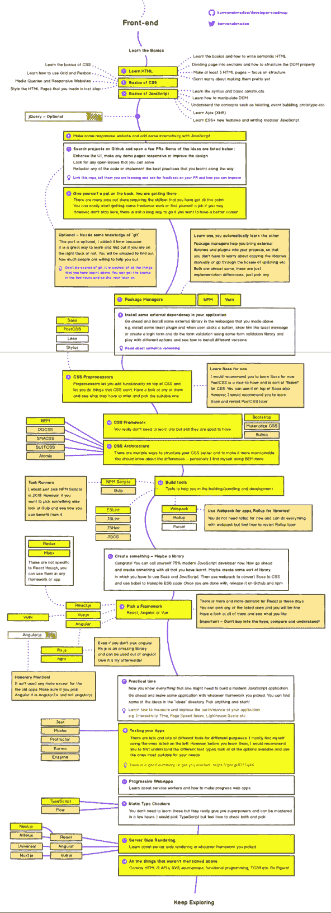

# 全栈工程之旅。

> 原文：<https://dev.to/legobox/journey-to-fullstack-engineering-5b4k>

> 这篇文章最初发布在 [legobox 博客](http://medium.com/legobox)上

# Hmm 全堆栈

在 2011 年，我开始半专业地编写代码，虽然很难解释这意味着什么，但本质上，我正在创建一些个人觉得有趣的小项目。我在发展中没有具体的学习途径，我的学习策略，几乎就像尼日利亚超级鹰队的策略，当你的问题来了就解决。

这迫使我涉猎了很多东西，从使用 HTML、CSS 和 Javascript 的前端开发(当时还处于起步阶段)到使用 PHP 和 MySQL 处理数据库，或者在朋友推荐时使用 python 代替 PHP。

这不是我的故事，但我只想说，我从来不知道我什么时候成为了一名全栈开发人员，没有参加过编码训练营，没有去过 Andela，更重要的是，我在 2015 年才认识了编码社区，从那以后，我了解了其他一些工具和技术，使我能够做得更好。我学会了编码，因为我喜欢它，我着迷了，现在也是。但是我想到了一个问题，

> 我真的满仓了吗？

对于一些人来说，看到全栈有点复杂，因为他们认为有人实际上可以实现全栈开发的所有属性，但是为了让我真正看到这一点，我们必须从整体上看它包含什么。

*   作为设计师的 UX / UI 经验。
*   前端开发和接口实现。
*   API 开发和后端开发
*   部署、测试和开发周期管理(DevOps)

在这个列表中的每一项中，都有几个要满足的检查清单，那么如果一个标题的每一部分都需要在每个领域有几个(如果不是一些)真正广泛的理解或知识，该如何回应呢？

# 全栈神话真实吗？

全栈开发者是真实的，是的，我说过他们是真实的，因为事实上你没有见过一个真实的并不意味着他们不存在，如果你见过一个，那么你肯定知道他们是真实的，甚至更多，我认为全栈开发者勇往直前地建立业务和产品，因为他们获得了将整个管道视为一个整体而不仅仅是独立组件的整体能力。因此，我认为全栈工程师主要有两种类型。

> 请注意，以下术语是我自己创造的，其他人不应该对此负责(也就是说，它们不是本文之外的真实事物)

*   单点全栈开发人员(Single point full-stack developers)-这些开发人员通常比其他人更了解一个部分，因此他们通常能够与在其他部分工作的团队交流。在团队之外，他们只会在绝对必要的情况下承担其他部门的工作，通常甚至不愿意在这些部门寻求进步。

*   **专注于产品的全栈开发人员-** 这些工程师更倾向于产品，因此很难区分不同部分之间的关注点，他们通常将产品作为一个整体来看待，通常会努力为核心产品提供最佳功能，这些人通常是优秀的自由职业者，可能在大型团队中表现不佳。

是的，还有第三种(说谎者)——这些人在每个领域都是新手，甚至是他们曾经最突出的领域，最后，他们在所有领域都是业余爱好者。

因此，为了成为全栈式开发，我们必须了解我们所处的位置，现代软件开发已经向大量工具开放了资源，这些工具带来的困惑多于帮助，全栈式开发已经成为一种真正的野兽。

# 现代全栈。

今天，一个希望成为开发人员的新手将面临一场真正的战斗。但是随着时间的推移，事情会变得越来越简单。下面的回购链接让你深入了解什么是现代全栈开发者。

[https://github.com/kamranahmedse/developer-roadmap](https://github.com/kamranahmedse/developer-roadmap)

这里有一个概述。

[T2】](https://res.cloudinary.com/practicaldev/image/fetch/s--4i8DmuH6--/c_limit%2Cf_auto%2Cfl_progressive%2Cq_auto%2Cw_880/https://d2mxuefqeaa7sj.cloudfront.net/s_E6A5B68F2AE20F0779AFCC85CE4F089BBA16AA968C9C6FB4A6B43EF7A600961D_1529762946371_screenshot-github.com-2018.06.23-15-03-36.png)

最终归结为三大重头戏，

*   前端
*   后端
*   DevOps

[T2】](https://res.cloudinary.com/practicaldev/image/fetch/s--r-8K1eAW--/c_limit%2Cf_auto%2Cfl_progressive%2Cq_auto%2Cw_880/https://d2mxuefqeaa7sj.cloudfront.net/s_E6A5B68F2AE20F0779AFCC85CE4F089BBA16AA968C9C6FB4A6B43EF7A600961D_1529763044885_screenshot-github.com-2018.06.23-15-10-21.png)

前端开发归结于框架，但是一旦你了解了基础，这些就更容易理解了。

*   超文本标记语言
*   钢性铸铁
    *   在先进方面
    *   预处理器
        *   Scss
        *   较少的
        *   PostCss
    *   Css 框架
        *   引导程序
        *   物化
*   Javascript。
    *   框架之战
    *   反应
    *   某视频剪辑软件
    *   有角的
*   测试
    *   鲜为人知的前端开发工具
    *   玩笑
    *   摩卡
    *   因果报应

这很深奥。但我很确定你已经领会了要点。另一方面，后端开发是另一个深沟。

[T2】](https://res.cloudinary.com/practicaldev/image/fetch/s--uJiV9L3C--/c_limit%2Cf_auto%2Cfl_progressive%2Cq_auto%2Cw_880/https://d2mxuefqeaa7sj.cloudfront.net/s_E6A5B68F2AE20F0779AFCC85CE4F089BBA16AA968C9C6FB4A6B43EF7A600961D_1529763317692_screenshot-github.com-2018.06.23-15-12-17.png)

后端开发非常深入，需要另一篇文章来真正了解 2018 年将会发生什么，但简单的概述会显示以下内容。

后端开发围绕多套语言进行

*   脚本语言
*   函数式语言

一个全栈并不期望知道所有，但应该真正理解一个。关于脚本语言，我们来看看下面的技术，你肯定听说过。

*   服务器端编程语言（Professional Hypertext Preprocessor 的缩写）
*   结节
*   计算机编程语言
*   红宝石

在功能方面，我们有

*   Elixr
*   占线小时
*   Clojure
*   哈斯克尔

还有更多与 API 和请求-响应系统相关的开发模式和技术。

*   GraphQL
*   Oauth
*   雷迪斯
*   websocket

我们还有作业和任务管理以及 cron 作业管理，使用的工具有

*   消息代理
    *   兔子 q
    *   钢铁工人
*   搜索系统
    *   弹性搜索
    *   狮身人面像

还有更多。不仅如此，还有 DevOps 要担心。

[T2】](https://res.cloudinary.com/practicaldev/image/fetch/s--4sL3hZfg--/c_limit%2Cf_auto%2Cfl_progressive%2Cq_auto%2Cw_880/https://d2mxuefqeaa7sj.cloudfront.net/s_E6A5B68F2AE20F0779AFCC85CE4F089BBA16AA968C9C6FB4A6B43EF7A600961D_1529763425976_screenshot-github.com-2018.06.23-15-16-44.png)

本节讨论了从开发到部署管理应用程序所涉及的所有因素，包括管理其资源系统、容器和运行时环境，以及服务器配置和负载平衡。

因此，如何最好地描述一个全栈开发人员，如果不是热爱从概念到推出产品的所有过程的人。

# 我的实验——成为产品开发者。

为了回答我自己的问题，我已经决定从发布产品的想法和概念开始着手构建一些产品。在这个过程中，我会分享我构建每一个产品的经验，并可能证明自己认识到，全栈开发人员是他们的核心产品爱好者，他们希望看到产品成为一个想法的样子。

我的过程将涉及几个星期的产品构建——从我个人的想法开始，从概念到设计，到前端和接口实现，再到功能(后端)和部署/测试(开发运维)。

我的第一个想法是命名为 Spectre(Spectre 项目)的代码，这是一个部署管理系统，供开发人员和团队管理从存储库到服务器的代码部署。目前我正在开发这个平台，我希望能在九月前发布。每周，我都会记录和回顾这个过程，以及它对构建一个产品在各个方面的意义。

我希望这是一个美好的体验，以前从未建立过开放的项目，但我愿意有这样的想法，并愿意分享我的过程中和进展中的统计数据，并审查我对谁去实现功能。

# 结论。

《全栈工程之旅》旨在帮助其他人学习和理解全栈开发并不像一些人认为的那样困难。

我的想法可能还不成熟，但我的意图是证明全栈神话。正如我经常说的，一个懂得前端开发和使用 node(后端的 javascript)并知道如何使用 Nginx 和 docker 的 javascript 开发人员可以被授予全栈头衔(这些事情没有文凭)，但这完全取决于工作质量和知识。

关键是转换到产品开发的思维模式，认为你自己拥有这个想法，并理解你正在寻找解决问题的最佳方法。一步一步来。