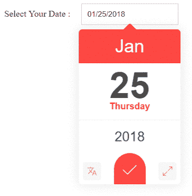

# 带有示例的 JQuery 日期选择器

> 原文：<https://dev.to/skptricks/jquery-date-picker-with-example-3im7>

帖子链接: [JQuery 日期选择器示例](https://www.skptricks.com/2018/01/jquery-date-picker-with-example.html)

在本教程中，我们将讨论 Jquery UI 日期选择器。这是一个最小和强大的 jQuery UI 日期选择器，它提供了许多功能，非常容易使用和集成在基于 web 的应用程序中。

让我们开始并遵循以下步骤:
确保插入 JQuery 库文件。
确保插入 datedropper JS 文件和 datedropper CSS 样式表文件。
确保插入输入标签并将“文本”设置为“类型”属性。
初始化 datedropper 脚本的最后一步。

[T2】](https://res.cloudinary.com/practicaldev/image/fetch/s--sPJGhxnH--/c_limit%2Cf_auto%2Cfl_progressive%2Cq_66%2Cw_880/https://4.bp.blogspot.com/-1Q5mUfzuYFU/WmnGkK55ICI/AAAAAAAABNw/NvioD8Gq2Zg9RlD9vwo-82pRvgZ-gd_KQCLcBGAs/s400/date.gif)

[https://www.youtube.com/embed/5UCiUiLw05Y](https://www.youtube.com/embed/5UCiUiLw05Y)

下载链接:
[https://github . com/skp tricks/PHP-Tutorials/tree/master/Jquery % 20 date % 20 picker](https://github.com/skptricks/php-Tutorials/tree/master/Jquery%20date%20picker)