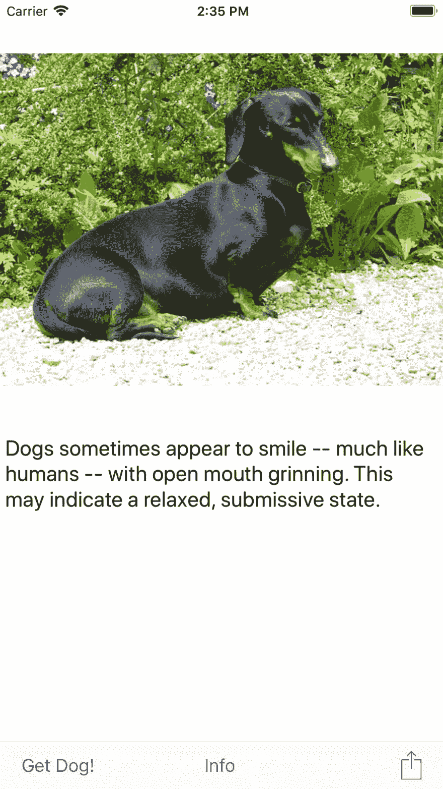

# 公正的代码挑战:狗了

> 原文：<https://dev.to/lefebvre/just-code-challenge-dogs-up-2i0>

你在做[正义代码挑战](https://dev.to/lefebvre/just-code-challenge-28la)吗？这是我为挑战做的一个 iOS 应用程序。它使用[狗狗 API](https://dog.ceo/dog-api/) 显示狗狗图片。

[T2】](https://res.cloudinary.com/practicaldev/image/fetch/s--fO--0QmX--/c_limit%2Cf_auto%2Cfl_progressive%2Cq_auto%2Cw_880/https://blog.xojo.com/wp-content/uploads/2018/06/iOS55Screenshot.png)

为了制作这个应用程序，我使用了两个 HTTPSockets:一个请求狗图片的 URL，另一个下载图片本身。JSON 文件包含与图片一起显示的狗的事实。

[下载搜狗 Up 项目](http://cdn.xojo.com/JustCode/DogsUp.zip)